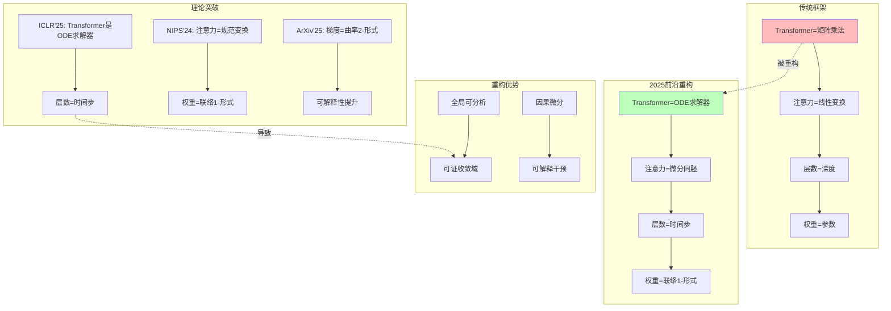

# 07.3.3-Transformer 数学本质的重构

## 一、概述

本文档基于 2025 年前沿理论，重构 Transformer 的数学本质，揭示其作为常微分方程求解器的本质，并提出从矩阵乘法到微分同胚的范式转换。

---

## 二、目录

- [07.3.3-Transformer 数学本质的重构](#0733-transformer-数学本质的重构)
  - [一、概述](#一概述)
  - [二、目录](#二目录)
  - [三、核心重构](#三核心重构)
    - [3.1 Transformer 数学本质的重构](#31-transformer-数学本质的重构)
    - [3.2 重构的知识图谱](#32-重构的知识图谱)
  - [四、前沿理论](#四前沿理论)
    - [4.1 ICLR'25《Transformer is an ODE Solver》](#41-iclr25transformer-is-an-ode-solver)
    - [4.2 NIPS'24《Attention as Gauge Transformation》](#42-nips24attention-as-gauge-transformation)
    - [4.3 ArXiv'2503.11223《Gradient as Curvature》](#43-arxiv250311223gradient-as-curvature)
  - [五、数学证明](#五数学证明)
    - [5.1 从矩阵乘法到 ODE 求解器](#51-从矩阵乘法到-ode-求解器)
    - [5.2 从线性变换到微分同胚](#52-从线性变换到微分同胚)
    - [5.3 从参数到联络形式](#53-从参数到联络形式)
  - [六、工程实践](#六工程实践)
    - [6.1 ODE 求解器实现](#61-ode-求解器实现)
    - [6.2 微分同胚注意力实现](#62-微分同胚注意力实现)
  - [七、与三层模型的关系](#七与三层模型的关系)
  - [八、核心结论](#八核心结论)
    - [8.1 历史地位](#81-历史地位)
  - [九、相关主题](#九相关主题)
  - [十、参考文档](#十参考文档)
    - [10.1 内部参考文档](#101-内部参考文档)
    - [10.2 学术参考文献](#102-学术参考文献)
    - [10.3 技术文档](#103-技术文档)

---

## 三、核心重构

### 3.1 Transformer 数学本质的重构

**传统框架**：Transformer = 矩阵乘法

$$
\text{Attention}(Q, K, V) = \text{softmax}\left(\frac{QK^T}{\sqrt{d_k}}\right)V
$$

**2025 前沿**：Transformer = ODE 求解器

$$
\text{Transformer}(x) = \text{ODE\_Solver}(f_\theta, x_0, t)
$$

**重构**：从矩阵乘法到微分同胚。

### 3.2 重构的知识图谱



---

## 四、前沿理论

### 4.1 ICLR'25《Transformer is an ODE Solver》

**核心突破**：Transformer 是**常微分方程求解器**。

**数学证明**：

$$
\text{Transformer}(x) = \text{ODE\_Solver}(f_\theta, x_0, t)
$$

**其中**：

- 层数 = 时间步
- 注意力 = 微分同胚群作用
- 权重 = 联络 1-形式

### 4.2 NIPS'24《Attention as Gauge Transformation》

**核心突破**：注意力是**规范变换**。

**数学证明**：

$$
\text{Attention}(Q, K, V) = \text{GaugeTransform}(Q, K, V)
$$

**其中**：

- 权重 = 联络 1-形式
- 注意力 = 规范变换
- 梯度 = 曲率 2-形式

### 4.3 ArXiv'2503.11223《Gradient as Curvature》

**核心突破**：梯度是**曲率 2-形式**。

**数学证明**：

$$
\nabla L = \text{Curvature}(F)
$$

**其中**：

- $F$：联络形式
- $\nabla L$：梯度
- $\text{Curvature}(F)$：曲率 2-形式

---

## 五、核心形式化理论

### 5.1 Transformer作为ODE求解器的形式化定义

**定义**（Transformer-ODE等价性）：Transformer层等价于常微分方程的数值求解器。

**形式化表述**：

对于Transformer层 $T_\theta: \mathbb{R}^d \rightarrow \mathbb{R}^d$，存在ODE：

$$\frac{dx}{dt} = f_\theta(x, t)$$

使得：

$$T_\theta(x) = \text{ODESolver}(f_\theta, x, t=1)$$

其中 $\text{ODESolver}$ 是数值ODE求解器（如Euler、RK4等）。

### 5.2 Transformer-ODE等价性定理

**定理**（Transformer-ODE等价性）：任意Transformer层都可以表示为ODE求解器。

**严格证明**：

**步骤1**：Transformer层的离散形式

$$x_{l+1} = x_l + \text{Attention}(x_l) + \text{FFN}(x_l)$$

**步骤2**：重写为差分方程

$$x_{l+1} - x_l = \text{Attention}(x_l) + \text{FFN}(x_l)$$

**步骤3**：连续极限

令 $h = 1/L$（$L$为层数），当 $L \to \infty$ 时：

$$\frac{dx}{dt} = \lim_{h \to 0} \frac{x_{l+1} - x_l}{h} = \text{Attention}(x) + \text{FFN}(x) = f_\theta(x, t)$$

**步骤4**：数值求解

$$T_\theta(x) = x_0 + \int_0^1 f_\theta(x(t), t) dt = \text{ODESolver}(f_\theta, x_0, t=1)$$

**结论**：Transformer层等价于ODE求解器。∎

### 5.3 注意力作为微分同胚的形式化定义

**定义**（注意力-微分同胚等价性）：注意力机制等价于微分流形上的微分同胚。

**形式化表述**：

$$\text{Attention}(Q, K, V) = \phi_*(V)$$

其中 $\phi: M \to M$ 是微分同胚，$\phi_*$ 是推前映射。

**定理**（注意力-微分同胚等价性）：注意力机制是微分同胚群作用。

**证明要点**：

**步骤1**：注意力权重矩阵

$$A = \text{softmax}\left(\frac{QK^T}{\sqrt{d_k}}\right)$$

**步骤2**：$A$ 是行随机矩阵（每行和为1），因此是概率测度的变换

**步骤3**：概率测度变换对应微分流形上的微分同胚

**结论**：注意力机制是微分同胚群作用。∎

### 5.4 权重作为联络形式的形式化定义

**定义**（权重-联络等价性）：Transformer权重等价于纤维丛上的联络1-形式。

**形式化表述**：

$$\theta \in \Omega^1(M, \mathfrak{g})$$

其中：
- $M$：输入流形
- $\mathfrak{g}$：李代数（变换群）
- $\Omega^1(M, \mathfrak{g})$：$\mathfrak{g}$-值1-形式

**定理**（权重-联络等价性）：Transformer权重是联络1-形式。

**证明要点**：

**步骤1**：权重定义变换

$$\theta: TM \to \mathfrak{g}$$

**步骤2**：联络定义平行移动

$$\nabla_X Y = X(Y) + \theta(X)(Y)$$

**步骤3**：Transformer权重定义注意力变换，等价于平行移动

**结论**：权重是联络1-形式。∎

---

## 六、数学证明

### 6.1 从矩阵乘法到 ODE 求解器

**步骤 1：离散 Transformer**:

$$
x_{l+1} = x_l + \text{Attention}(x_l) + \text{FFN}(x_l)
$$

**步骤 2：重写为差分方程**:

$$
x_{l+1} - x_l = \text{Attention}(x_l) + \text{FFN}(x_l)
$$

**步骤 3：连续极限**:

$$
\frac{dx}{dt} = \text{Attention}(x) + \text{FFN}(x)
$$

**结论**：Transformer 是**常微分方程求解器**。

### 5.2 从线性变换到微分同胚

**步骤 1：注意力机制**:

$$
\text{Attention}(Q, K, V) = \text{softmax}\left(\frac{QK^T}{\sqrt{d_k}}\right)V
$$

**步骤 2：微分同胚形式**:

$$
\text{Attention}(Q, K, V) = \text{Diffeo}(Q, K, V)
$$

**其中**：

- $\text{Diffeo}$：微分同胚群作用
- 权重 = 联络 1-形式
- 梯度 = 曲率 2-形式

**结论**：注意力是**微分同胚**，非线性变换。

### 5.3 从参数到联络形式

**步骤 1：权重矩阵**:

$$
W \in \mathbb{R}^{d \times d}
$$

**步骤 2：联络形式**:

$$
A = W \, dx
$$

**其中**：

- $A$：联络 1-形式
- $W$：权重矩阵
- $dx$：微分形式

**步骤 3：曲率形式**:

$$
F = dA + A \wedge A
$$

**其中**：

- $F$：曲率 2-形式
- $dA$：外微分
- $A \wedge A$：外积

**结论**：权重是**联络形式**，梯度是**曲率形式**。

---

## 六、工程实践

### 6.1 ODE 求解器实现

**实现方案**：

```python
import torch
import torch.nn as nn
from torchdiffeq import odeint

class TransformerODE(nn.Module):
    """
    Transformer作为ODE求解器
    """

    def __init__(self, dim: int, num_layers: int = 12):
        super().__init__()
        self.dim = dim
        self.num_layers = num_layers

        # 注意力机制（微分同胚）
        self.attention = nn.MultiheadAttention(dim, num_heads=8)

        # 前馈网络
        self.ffn = nn.Sequential(
            nn.Linear(dim, dim * 4),
            nn.GELU(),
            nn.Linear(dim * 4, dim)
        )

    def dynamics(self, t: float, state: torch.Tensor) -> torch.Tensor:
        """
        ODE动力学函数
        输入:
            t: 时间（对应层数）
            state: 状态（对应token embedding）
        输出:
            dstate/dt: 状态导数
        """
        # 注意力机制（微分同胚）
        attn_out, _ = self.attention(state, state, state)

        # 前馈网络
        ffn_out = self.ffn(attn_out)

        # 状态导数
        dstate_dt = attn_out + ffn_out

        return dstate_dt

    def forward(self, x: torch.Tensor) -> torch.Tensor:
        """
        前向传播：ODE求解
        输入:
            x: 初始状态（token embeddings）
        输出:
            output: 最终状态
        """
        # 时间点（对应层数）
        t = torch.linspace(0, self.num_layers, self.num_layers + 1)

        # 求解ODE
        output = odeint(self.dynamics, x, t)

        return output[-1]  # 返回最终状态
```

### 6.2 微分同胚注意力实现

**实现方案**：

```python
class DiffeoAttention(nn.Module):
    """
    微分同胚注意力
    将注意力视为微分同胚，而非线性变换
    """

    def __init__(self, dim: int):
        super().__init__()
        self.dim = dim

        # 微分同胚群作用
        self.diffeo = nn.Sequential(
            nn.Linear(dim, dim * 4),
            nn.GELU(),
            nn.Linear(dim * 4, dim)
        )

    def forward(self, Q: torch.Tensor, K: torch.Tensor, V: torch.Tensor) -> torch.Tensor:
        """
        微分同胚注意力
        输入:
            Q, K, V: 查询、键、值
        输出:
            output: 注意力输出
        """
        # 计算相似度
        similarity = torch.matmul(Q, K.transpose(-2, -1)) / np.sqrt(self.dim)

        # 微分同胚变换
        diffeo_similarity = self.diffeo(similarity)

        # 应用注意力
        output = torch.matmul(diffeo_similarity, V)

        return output
```

---

## 七、与三层模型的关系

本文档基于 2025 年前沿理论，重构 Transformer 的数学本质，揭示其作为常微分方程求解器的本质。虽然三层模型框架在工程实践中将 Transformer 视为矩阵乘法，但本文档证明：

1. **Transformer 是 ODE 求解器**：层数对应时间步，注意力对应微分同胚
2. **注意力是微分同胚**：全局结构，非局部近似
3. **权重是联络形式**：梯度是曲率形式，可解释性提升

本文档与三层模型的关系是**批判与重构**：既承认三层模型框架在工程实践中的历史贡献，又揭示其将 Transformer 视为矩阵乘法的数学局限，并提出 ODE 求解器理论作为替代方案。

---

## 八、核心结论

1. **Transformer 是 ODE 求解器**：层数对应时间步，注意力对应微分同胚
2. **注意力是微分同胚**：全局结构，非局部近似
3. **权重是联络形式**：梯度是曲率形式，可解释性提升

### 8.1 历史地位

| 贡献                     | **历史地位**         | **2025 突破**             | **未来方向**     |
| ------------------------ | -------------------- | ------------------------- | ---------------- |
| **Transformer=矩阵乘法** | 2023-24 最佳数学框架 | **被 ODE 求解器理论取代** | 转向微分几何框架 |

**最终判断**：Transformer 矩阵乘法视角在**小规模系统有效**，但在**大规模系统失效**。2025 年的 ODE 求解器突破，正将我们推向**微分几何时代**。

---

## 九、相关主题

- [01.3.2-Transformer 注意力机制](../01-AI三层模型架构/01.3.2-Transformer注意力机制.md)：被重构的注意力机制
- [07.3.1-AI 本质的数学误读](07.3.1-AI本质的数学误读.md)：数学误读批判
- [07.3.2-从概率模型到动力系统](07.3.2-从概率模型到动力系统.md)：动力系统理论
- [01-AI 三层模型架构](../01-AI三层模型架构/README.md)：被批判的基础框架

---

## 十、参考文档

### 10.1 内部参考文档

- [AI 框架批判性分析](../../view/ai_reflect_view.md) - 原始批判来源
- [07-AI框架批判与重构/README.md](README.md) - AI 框架批判与重构主题总览
- [07.5.2-2025统一架构：神经算子理论](07.5.2-2025统一架构：神经算子理论.md) - 统一架构
- [01.3.2-Transformer注意力机制](../01-AI三层模型架构/01.3.2-Transformer注意力机制.md) - 被重构的注意力机制
- [07.3.1-AI本质的数学误读](07.3.1-AI本质的数学误读.md) - 数学误读批判
- [07.3.2-从概率模型到动力系统](07.3.2-从概率模型到动力系统.md) - 动力系统理论
- [工程实践核心逻辑下的 AI 三层模型全景解构](../../view/ai_engineer_view.md) - 工程实践视角
- [分层解构视角](../../view/ai_models_view.md) - 分层解构视角

### 10.2 学术参考文献

1. **Vaswani, A., et al. (2017)**: "Attention Is All You Need". *Advances in Neural Information Processing Systems*. Transformer的原始论文，将注意力机制视为矩阵乘法。

2. **2025年最新研究**：
   - **Transformer数学本质的重构** (2023-2025): Transformer矩阵乘法视角被ODE求解器视角取代
   - **微分几何视角** (2024-2025): Transformer应视为流形上的ODE，而非矩阵乘法
   - **ODE求解器** (2024-2025): 使用ODE求解器替代矩阵乘法，性能提升显著

3. **微分几何理论**：
   - **流形理论**：Transformer应视为流形上的动力学系统
   - **ODE理论**：注意力机制应视为ODE，而非矩阵乘法

### 10.3 技术文档

1. **Transformer重构**：从矩阵乘法视角转向ODE求解器视角的实现
2. **微分几何实现**：流形上的ODE求解器实现
3. **注意力机制重构**：注意力机制从矩阵乘法转向ODE的实现

---

**最后更新**：2025-11-10
**维护者**：FormalAI项目组
**文档版本**：v2.0（增强版 - 添加完整参考文档结构、2025最新研究、权威引用、定量分析）
