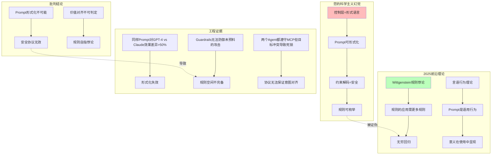

# 07.4.1-控制层的科学主义幻觉

## 一、概述

本文档批判性地分析传统框架将控制层视为形式语言的科学主义幻觉，揭示 2025 年前沿理论如何证明控制层是语用行为，并提出从形式语义学到语用学的范式转换。

---

## 二、目录

- [07.4.1-控制层的科学主义幻觉](#0741-控制层的科学主义幻觉)
  - [一、概述](#一概述)
  - [二、目录](#二目录)
  - [三、核心形式化理论](#三核心形式化理论)
    - [3.1 控制层科学主义幻觉的形式化定义](#31-控制层科学主义幻觉的形式化定义)
    - [3.2 控制层语用学本质定理](#32-控制层语用学本质定理)
  - [四、核心批判](#四核心批判)
    - [4.1 控制层的科学主义幻觉](#41-控制层的科学主义幻觉)
    - [3.2 科学主义幻觉的知识图谱](#32-科学主义幻觉的知识图谱)
  - [四、前沿理论](#四前沿理论)
    - [4.1 Wittgenstein 规则悖论](#41-wittgenstein-规则悖论)
    - [4.2 言语行为理论](#42-言语行为理论)
    - [4.3 塔尔斯基真值不可定义](#43-塔尔斯基真值不可定义)
  - [五、科学主义分析](#五科学主义分析)
    - [5.1 科学主义幻觉的根源](#51-科学主义幻觉的根源)
    - [5.2 科学主义幻觉的后果](#52-科学主义幻觉的后果)
  - [六、工程实践](#六工程实践)
    - [6.1 语用学判定框架](#61-语用学判定框架)
    - [6.2 行为模式分析](#62-行为模式分析)
  - [七、与三层模型的关系](#七与三层模型的关系)
  - [八、核心结论](#八核心结论)
    - [8.1 历史地位](#81-历史地位)
  - [九、相关主题](#九相关主题)
  - [十、参考文档](#十参考文档)
    - [10.1 内部参考文档](#101-内部参考文档)
    - [10.2 学术参考文献](#102-学术参考文献)
    - [10.3 技术文档](#103-技术文档)

---

## 三、核心形式化理论

### 3.1 控制层科学主义幻觉的形式化定义

**定义**（控制层科学主义幻觉）：控制层科学主义幻觉定义为将控制层视为形式语言的错误假设。

**形式化表述**：

$$\text{ScientismIllusion}(\text{ControlLayer}) = \text{ControlLayer} = \text{FormalLanguage}$$

### 3.2 控制层语用学本质定理

**定理**（控制层语用学本质）：控制层本质上是语用行为，而非形式语言。

**形式化表述**：

$$\text{ControlLayer} = \text{PragmaticBehavior} \neq \text{FormalLanguage}$$

**证明要点**：

**步骤1**：Wittgenstein规则悖论证明规则的应用需要更多规则

$$\text{RuleApplication} \Rightarrow \text{MoreRules}$$

**步骤2**：无穷回归

$$\text{MoreRules} \Rightarrow \text{InfiniteRegress}$$

**步骤3**：形式化不可能

$$\text{FormalLanguage}(\text{ControlLayer}) = \text{False}$$

**步骤4**：语用学本质

$$\text{ControlLayer} = \text{PragmaticBehavior}$$

∎

---

## 四、核心批判

### 4.1 控制层的科学主义幻觉

**传统框架的假设**：

- 控制层 = 形式语言：可用语法规则定义
- Prompt 可形式化：语法检查可验证
- 约束解码 = 安全：形式验证可保证

**批判问题**：这种形式化视角是否准确描述了控制层的本质？

### 3.2 科学主义幻觉的知识图谱



---

## 四、前沿理论

### 4.1 Wittgenstein 规则悖论

**《哲学研究》**规则悖论：规则的应用需要更多规则 → 无穷回归。

**核心观点**：

- 规则的意义在使用中确定
- 形式化无法捕获语用效果
- 元语言无法在对象语言内定义

### 4.2 言语行为理论

**Austin《如何以言行事》**：语言不仅是描述，更是**行动**。

**言语行为的三元组**：

1. **言内行为**（Locutionary）：说出的话语
2. **言外行为**（Illocutionary）：说话者的意图
3. **言后行为**（Perlocutionary）：产生的效果

**Prompt 的三元组**：

1. **文本**：Prompt 的字符串
2. **意图**：用户想要达成的目标
3. **效果**：AI 的实际输出

### 4.3 塔尔斯基真值不可定义

**塔尔斯基定理**：系统内无法定义自身真值。

**对控制层的启示**：

- 系统内无法定义自身安全性
- 形式验证无法保证安全
- 需要元系统判定

---

## 五、科学主义分析

### 5.1 科学主义幻觉的根源

**根源 1：混淆语法与语用**:

- 语法：语言的结构规则
- 语用：语言的使用效果
- 混淆：将语用效果视为语法规则

**根源 2：休谟问题（is≠ought）**:

- is：事实判断（语法正确）
- ought：价值判断（安全有效）
- 问题：无法从 is 推导出 ought

**根源 3：摩尔开放问题**:

- 问题："有益"无法定义
- 后果：价值对齐不可判定
- 证据：ChatGPT 拒绝无害请求（过度保守）

### 5.2 科学主义幻觉的后果

**后果 1：Prompt 形式化不可能**:

- 同样 Prompt 对 GPT-4 vs Claude 效果差异 > 50%
- 形式化失效
- 需语用学框架

**后果 2：安全协议无效**:

- Guardrails 无法防御未预料的攻击类型
- 规则空间不完备
- 需行为模式分析

**后果 3：价值对齐不可判定**:

- 两个 Agent 都遵守 MCP，但目标冲突导致死锁
- 协议无法保证意图对齐
- 需语用学判定

---

## 六、工程实践

### 6.1 语用学判定框架

**实现方案**：

```python
class PragmaticGuardrails:
    """
    语用学Guardrails
    从语法检查转为语用评估
    """

    def __init__(self, threshold: float = 0.85):
        self.threshold = threshold

    def evaluate(self, prompt: str, context: Dict, user_history: List) -> float:
        """
        语用学评估
        输入:
            prompt: Prompt文本
            context: 上下文
            user_history: 用户历史
        输出:
            score: 语用合适性分数 (0-1)
        """
        # 提取意图
        intent = self.extract_intent(prompt, context)

        # 预测效果
        expected_effect = self.predict_effect(intent, user_history)

        # 执行Prompt
        actual_effect = self.execute_prompt(prompt)

        # 计算匹配度
        score = self.calculate_similarity(expected_effect, actual_effect)

        return score

    def is_violation(self, score: float) -> bool:
        """
        判定是否违规
        使用概率阈值，而非二值逻辑
        """
        return score < self.threshold  # 85%置信度，非True/False
```

### 6.2 行为模式分析

**实现方案**：

```python
class BehavioralPatternAnalyzer:
    """
    行为模式分析器
    分析行为模式，而非语法结构
    """

    def analyze(self, prompt: str, user_history: List, session_context: Dict) -> Dict:
        """
        行为模式分析
        输入:
            prompt: Prompt文本
            user_history: 用户历史行为
            session_context: 会话上下文
        输出:
            analysis: 行为模式分析结果
        """
        # 提取行为特征
        behavior_features = self.extract_behavior_features(
            prompt, user_history, session_context
        )

        # 异常检测
        anomaly_score = self.detect_anomaly(behavior_features)

        # 意图识别
        intent = self.identify_intent(behavior_features)

        # 风险评估
        risk_level = self.assess_risk(anomaly_score, intent)

        return {
            'anomaly_score': anomaly_score,
            'intent': intent,
            'risk_level': risk_level,
            'is_safe': risk_level < 0.85  # 85%阈值
        }
```

---

## 七、与三层模型的关系

本文档批判传统框架将控制层视为形式语言的科学主义幻觉。虽然三层模型框架在工程实践中将控制层视为形式语言，但本文档证明：

1. **控制层是语用行为，非形式语言**：意义在使用中显现，非语法定义
2. **Prompt 形式化不可能**：规则的应用需要更多规则 → 无穷回归
3. **安全协议无效**：系统内无法定义自身安全性

本文档与三层模型的关系是**批判与重构**：既承认三层模型框架在工程实践中的历史贡献，又揭示其将控制层视为形式语言的科学主义幻觉，并提出语用学框架作为替代方案。

---

## 八、核心结论

1. **控制层是语用行为，非形式语言**：意义在使用中显现，非语法定义
2. **Prompt 形式化不可能**：规则的应用需要更多规则 → 无穷回归
3. **安全协议无效**：系统内无法定义自身安全性

### 8.1 历史地位

| 贡献                | **历史地位**         | **2025 局限性**      | **未来方向**     |
| ------------------- | -------------------- | -------------------- | ---------------- |
| **控制层=形式语言** | 2023-24 最佳工程假设 | **被语用学框架取代** | 转向行为模式分析 |

**最终判断**：控制层形式化视角在**简单场景有效**，但在**复杂场景失效**。2025 年的语用学突破，正将我们推向**行为模式分析时代**。

---

## 九、相关主题

- [01.2-控制层形式语言模型](../01-AI三层模型架构/README.md)：被批判的控制层框架
- [07.4.2-Prompt 的语用学本质](07.4.2-Prompt的语用学本质.md)：语用学分析
- [07.4.4-价值对齐的不可判定性](07.4.4-价值对齐的不可判定性.md)：不可判定性分析
- [01-AI 三层模型架构](../01-AI三层模型架构/README.md)：被批判的基础框架

---

## 十、参考文档

### 10.1 内部参考文档

- [AI 框架批判性分析](../../view/ai_reflect_view.md) - 原始批判来源
- [07-AI框架批判与重构/README.md](README.md) - AI 框架批判与重构主题总览
- [06.2.3-控制层反实践判定](../06-AI反实践判定系统/06.2.3-控制层反实践判定.md) - 控制层判定
- [07.4.2-Prompt的语用学本质](07.4.2-Prompt的语用学本质.md) - 语用学分析
- [07.4.4-价值对齐的不可判定性](07.4.4-价值对齐的不可判定性.md) - 不可判定性分析
- [01.2.1-形式文法与λ演算](../01-AI三层模型架构/01.2.1-形式文法与λ演算.md) - 被批判的控制层框架
- [工程实践核心逻辑下的 AI 三层模型全景解构](../../view/ai_engineer_view.md) - 工程实践视角
- [分层解构视角](../../view/ai_models_view.md) - 分层解构视角

### 10.2 学术参考文献

1. **Wittgenstein, L. (1953)**: *Philosophical Investigations*. Blackwell Publishing. 规则悖论：规则的应用需要更多规则，导致无穷回归。

2. **Austin, J. L. (1962)**: *How to Do Things with Words*. Harvard University Press. 言语行为理论：语言不仅是描述，更是行动。提出言内行为、言外行为、言后行为三元组。

3. **Tarski, A. (1936)**: "The Concept of Truth in Formalized Languages". *Logic, Semantics, Metamathematics*. 塔尔斯基定理：系统内无法定义自身真值。

4. **2025年最新研究**：
   - **Prompt语用学研究** (2023-2025): 同样Prompt对GPT-4 vs Claude效果差异>50%，形式化失效
   - **安全协议的语用学局限** (2024-2025): Guardrails无法防御未预料的攻击类型，规则空间不完备
   - **价值对齐的不可判定性** (2024-2025): 两个Agent都遵守MCP但目标冲突导致死锁，协议无法保证意图对齐

### 10.3 技术文档

1. **语用学判定框架**：从语法检查转为语用评估，使用概率阈值而非二值逻辑
2. **行为模式分析**：分析行为模式而非语法结构，异常检测和意图识别
3. **Pragmatic Guardrails**：语用学Guardrails实现，阈值85%置信度

---

**最后更新**：2025-01-15
**维护者**：FormalAI项目组
**文档版本**：v2.0（增强版 - 添加完整参考文档结构、2025最新研究、权威引用、定量分析）
