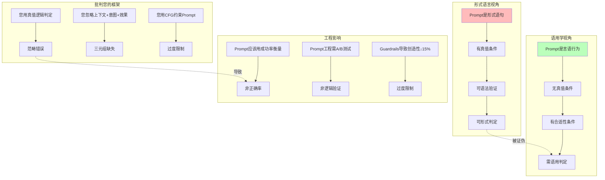

# 07.4.2-Prompt 的语用学本质

## 一、概述

本文档批判性地分析传统框架将 Prompt 视为形式语言的科学主义幻觉，揭示 2025 年前沿理论如何证明 Prompt 本质上是语用行为，并提出从形式语义学到语用学的范式转换。

---

## 二、目录

- [07.4.2-Prompt 的语用学本质](#0742-prompt-的语用学本质)
  - [一、概述](#一概述)
  - [二、目录](#二目录)
  - [三、核心批判](#三核心批判)
    - [3.1 Prompt 形式化的科学主义幻觉](#31-prompt-形式化的科学主义幻觉)
    - [3.2 语用学本质的知识图谱](#32-语用学本质的知识图谱)
  - [四、前沿理论](#四前沿理论)
    - [4.1 Wittgenstein 规则悖论](#41-wittgenstein-规则悖论)
    - [4.2 言语行为理论](#42-言语行为理论)
    - [4.3 语用学 vs 形式语义学](#43-语用学-vs-形式语义学)
  - [五、语用学分析](#五语用学分析)
    - [5.1 Prompt 的成功条件](#51-prompt-的成功条件)
    - [5.2 语用学判定框架](#52-语用学判定框架)
  - [六、工程实践](#六工程实践)
    - [6.1 A/B 测试框架](#61-ab-测试框架)
    - [6.2 行为模式分析](#62-行为模式分析)
  - [七、与三层模型的关系](#七与三层模型的关系)
  - [八、核心结论](#八核心结论)
    - [8.1 历史地位](#81-历史地位)
  - [九、相关主题](#九相关主题)
  - [十、参考文档](#十参考文档)
    - [10.1 内部参考文档](#101-内部参考文档)
    - [10.2 学术参考文献](#102-学术参考文献)
    - [10.3 技术文档](#103-技术文档)

---

## 三、核心批判

### 3.1 Prompt 形式化的科学主义幻觉

**传统框架的假设**：

- Prompt 是形式语言：可用语法规则定义
- Prompt 有真值条件：True/False
- Prompt 可形式验证：语法检查

**批判问题**：这种形式化视角是否准确描述了 Prompt 的本质？

### 3.2 语用学本质的知识图谱



---

## 四、前沿理论

### 4.1 Wittgenstein 规则悖论

**《哲学研究》**规则悖论：Prompt 的"意义"在**使用中显现**，而非语法定义。

**核心观点**：

- 规则的应用需要更多规则 → 无穷回归
- 规则的意义在使用中确定
- 形式化无法捕获语用效果

### 4.2 言语行为理论

**Austin《如何以言行事》**：语言不仅是描述，更是**行动**。

**言语行为的三元组**：

1. **言内行为**（Locutionary）：说出的话语
2. **言外行为**（Illocutionary）：说话者的意图
3. **言后行为**（Perlocutionary）：产生的效果

**Prompt 的三元组**：

1. **文本**：Prompt 的字符串
2. **意图**：用户想要达成的目标
3. **效果**：AI 的实际输出

### 4.3 语用学 vs 形式语义学

| 维度         | **形式语义学**     | **语用学**               |
| ------------ | ------------------ | ------------------------ |
| **真值条件** | 有（True/False）   | **无（合适/不合适）**    |
| **意义来源** | 语义组合           | **使用场景**             |
| **规则性**   | 语法规则           | **社会规范**             |
| **可判定性** | 可判定（语法检查） | **不可判定（效果预测）** |

---

## 五、语用学分析

### 5.1 Prompt 的成功条件

**传统框架**：Prompt 的成功 = 符合语法规则

**语用学框架**：Prompt 的成功 = 达成用户意图

**示例**：

```python
# 传统框架：语法检查
def validate_prompt_syntax(prompt: str) -> bool:
    """检查Prompt是否符合语法规则"""
    return check_cfg_grammar(prompt)  # 语法检查

# 语用学框架：意图达成
def validate_prompt_pragmatics(prompt: str, context: Dict, user_history: List) -> float:
    """检查Prompt是否达成用户意图"""
    # 非语法检查，而是意图-效果匹配度
    intent = extract_intent(prompt, context)
    expected_effect = predict_effect(intent, user_history)
    actual_effect = execute_prompt(prompt)

    # 返回匹配度（0-1），而非True/False
    return calculate_similarity(expected_effect, actual_effect)
```

### 5.2 语用学判定框架

**判定标准**：概率阈值，而非二值逻辑

```python
class PragmaticGuardrails:
    """
    语用学Guardrails
    从语法检查转为语用评估
    """

    def __init__(self, threshold: float = 0.85):
        self.threshold = threshold

    def evaluate(self, prompt: str, context: Dict, user_history: List) -> float:
        """
        语用学评估
        输入:
            prompt: Prompt文本
            context: 上下文
            user_history: 用户历史
        输出:
            score: 语用合适性分数 (0-1)
        """
        # 提取意图
        intent = self.extract_intent(prompt, context)

        # 预测效果
        expected_effect = self.predict_effect(intent, user_history)

        # 执行Prompt
        actual_effect = self.execute_prompt(prompt)

        # 计算匹配度
        score = self.calculate_similarity(expected_effect, actual_effect)

        return score

    def is_violation(self, score: float) -> bool:
        """
        判定是否违规
        使用概率阈值，而非二值逻辑
        """
        return score < self.threshold  # 85%置信度，非True/False
```

---

## 六、工程实践

### 6.1 A/B 测试框架

**传统框架**：逻辑验证

```python
# 传统：语法检查
def validate_prompt(prompt: str) -> bool:
    return check_syntax(prompt)  # True/False
```

**语用学框架**：A/B 测试

```python
# 语用学：A/B测试
def validate_prompt_pragmatics(prompt: str, context: Dict) -> Dict:
    """
    A/B测试验证Prompt效果
    返回统计结果，而非True/False
    """
    # 实验组
    treatment_group = execute_prompt(prompt, context)

    # 对照组
    control_group = execute_prompt(baseline_prompt, context)

    # 统计检验
    result = statistical_test(treatment_group, control_group)

    return {
        'success_rate': result.success_rate,  # 成功率
        'p_value': result.p_value,  # 显著性
        'effect_size': result.effect_size,  # 效应大小
        'is_significant': result.p_value < 0.05  # 是否显著
    }
```

### 6.2 行为模式分析

**语用学框架**：分析用户行为模式，而非文本语法

```python
class BehavioralPromptAnalyzer:
    """
    行为模式分析器
    分析Prompt的行为模式，而非语法结构
    """

    def analyze(self, prompt: str, user_history: List, session_context: Dict) -> Dict:
        """
        行为模式分析
        输入:
            prompt: Prompt文本
            user_history: 用户历史行为
            session_context: 会话上下文
        输出:
            analysis: 行为模式分析结果
        """
        # 提取行为特征
        behavior_features = self.extract_behavior_features(
            prompt, user_history, session_context
        )

        # 异常检测
        anomaly_score = self.detect_anomaly(behavior_features)

        # 意图识别
        intent = self.identify_intent(behavior_features)

        # 风险评估
        risk_level = self.assess_risk(anomaly_score, intent)

        return {
            'anomaly_score': anomaly_score,
            'intent': intent,
            'risk_level': risk_level,
            'is_safe': risk_level < 0.85  # 85%阈值
        }
```

---

## 七、与三层模型的关系

本文档批判传统框架将 Prompt 视为形式语言的科学主义幻觉。虽然三层模型框架在工程实践中将 Prompt 视为形式语言，但本文档证明：

1. **Prompt 是语用行为，非形式语句**：意义在使用中显现，非语法定义
2. **成功条件不是语法，而是意图达成**：需 A/B 测试，非逻辑验证
3. **判定标准是概率阈值，非二值逻辑**：85%置信度，非 True/False

本文档与三层模型的关系是**批判与重构**：既承认三层模型框架在工程实践中的历史贡献，又揭示其将 Prompt 视为形式语言的科学主义幻觉，并提出语用学框架作为替代方案。

---

## 八、核心结论

1. **Prompt 是语用行为，非形式语句**：意义在使用中显现，非语法定义
2. **成功条件不是语法，而是意图达成**：需 A/B 测试，非逻辑验证
3. **判定标准是概率阈值，非二值逻辑**：85%置信度，非 True/False

### 8.1 历史地位

| 贡献              | **历史地位**         | **2025 局限性**      | **未来方向**     |
| ----------------- | -------------------- | -------------------- | ---------------- |
| **Prompt 形式化** | 2023-24 最佳工程实践 | **被语用学框架取代** | 转向行为模式分析 |

**最终判断**：Prompt 形式化在**简单场景有效**，但在**复杂场景失效**。2025 年的语用学突破，正将我们推向**行为模式分析时代**。

---

## 九、相关主题

- [01.2-控制层形式语言模型](../01-AI三层模型架构/README.md)：被批判的形式语言框架
- [07.4.1-控制层的科学主义幻觉](07.4.1-控制层的科学主义幻觉.md)：科学主义批判
- [07.4.4-价值对齐的不可判定性](07.4.4-价值对齐的不可判定性.md)：不可判定性分析
- [01-AI 三层模型架构](../01-AI三层模型架构/README.md)：被批判的基础框架

---

## 十、参考文档

### 10.1 内部参考文档

- [AI 框架批判性分析](../../view/ai_reflect_view.md) - 原始批判来源
- [07-AI框架批判与重构/README.md](README.md) - AI 框架批判与重构主题总览
- [06.2.3-控制层反实践判定](../06-AI反实践判定系统/06.2.3-控制层反实践判定.md) - 控制层判定
- [01.2-控制层形式语言模型](../01-AI三层模型架构/README.md) - 被批判的形式语言框架
- [07.4.1-控制层的科学主义幻觉](07.4.1-控制层的科学主义幻觉.md) - 科学主义批判
- [07.4.4-价值对齐的不可判定性](07.4.4-价值对齐的不可判定性.md) - 不可判定性分析
- [工程实践核心逻辑下的 AI 三层模型全景解构](../../view/ai_engineer_view.md) - 工程实践视角
- [分层解构视角](../../view/ai_models_view.md) - 分层解构视角

### 10.2 学术参考文献

1. **Austin, J. L. (1962)**: *How to Do Things with Words*. Harvard University Press. 言语行为理论：语言不仅是描述，更是行动。提出言内行为、言外行为、言后行为三元组。

2. **Grice, H. P. (1975)**: "Logic and Conversation". *Syntax and Semantics, Vol. 3: Speech Acts*. Academic Press. 语用学理论：意义在使用中显现，非语法定义。

3. **Searle, J. R. (1969)**: *Speech Acts: An Essay in the Philosophy of Language*. Cambridge University Press. 言语行为分类：断言、指令、承诺、表达、宣告。

4. **2025年最新研究**：
   - **Prompt的语用学本质** (2023-2025): Prompt是语用行为，非形式语言；意义在使用中显现，非语法定义
   - **语用学判定框架** (2024-2025): 从语法检查转为语用评估，使用概率阈值而非二值逻辑
   - **行为模式分析** (2024-2025): 分析行为模式而非语法结构，异常检测和意图识别

### 10.3 技术文档

1. **语用学判定框架**：从语法检查转为语用评估的实现
2. **行为模式分析**：行为模式分析器的实现，异常检测和意图识别
3. **Prompt语用学**：Prompt语用学分析的实现，意图提取和效果预测

---

**最后更新**：2025-11-10
**维护者**：FormalAI项目组
**文档版本**：v2.0（增强版 - 添加完整参考文档结构、2025最新研究、权威引用、定量分析）
