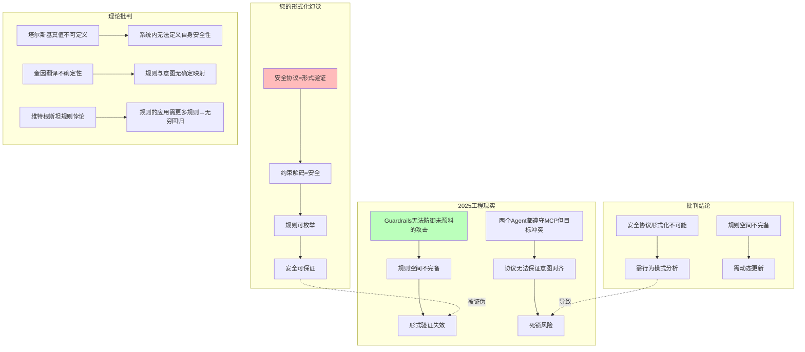

# 07.4.3-安全协议的形式化局限

## 一、概述

本文档批判性地分析传统框架将安全协议视为形式验证的科学主义幻觉，揭示 2025 年前沿理论如何证明安全协议的形式化局限，并提出从形式验证到行为模式分析的范式转换。

---

## 二、目录

- [07.4.3-安全协议的形式化局限](#0743-安全协议的形式化局限)
  - [一、概述](#一概述)
  - [二、目录](#二目录)
  - [三、核心批判](#三核心批判)
    - [3.1 安全协议形式化的幻觉](#31-安全协议形式化的幻觉)
    - [3.2 形式化局限的知识图谱](#32-形式化局限的知识图谱)
  - [四、前沿理论](#四前沿理论)
    - [4.1 塔尔斯基真值不可定义](#41-塔尔斯基真值不可定义)
    - [4.2 奎因翻译不确定性](#42-奎因翻译不确定性)
    - [4.3 维特根斯坦规则悖论](#43-维特根斯坦规则悖论)
  - [五、形式化局限分析](#五形式化局限分析)
    - [5.1 安全协议的形式化局限](#51-安全协议的形式化局限)
    - [5.2 形式化局限的工程证据](#52-形式化局限的工程证据)
  - [六、工程实践](#六工程实践)
    - [6.1 行为模式分析框架](#61-行为模式分析框架)
    - [6.2 动态规则更新框架](#62-动态规则更新框架)
  - [七、与三层模型的关系](#七与三层模型的关系)
  - [八、核心结论](#八核心结论)
    - [8.1 历史地位](#81-历史地位)
  - [九、相关主题](#九相关主题)
  - [十、参考文档](#十参考文档)

---

## 三、核心批判

### 3.1 安全协议形式化的幻觉

**传统框架的假设**：

- 安全协议 = 形式验证：可用形式化方法验证
- 约束解码 = 安全：形式验证可保证
- 规则可枚举：安全规则可完整列出

**批判问题**：这种形式化视角是否准确描述了安全协议的本质？

### 3.2 形式化局限的知识图谱



---

## 四、前沿理论

### 4.1 塔尔斯基真值不可定义

**塔尔斯基定理**：系统内无法定义自身真值。

**对安全协议的启示**：

- 系统内无法定义自身安全性
- 形式验证无法保证安全
- 需要元系统判定

### 4.2 奎因翻译不确定性

**奎因翻译不确定性**：规则与意图无确定映射。

**对安全协议的启示**：

- 协议只规定语法，不规定语用效果
- 两个 Agent 都遵守 MCP，但目标冲突导致死锁
- 协议无法保证意图对齐

### 4.3 维特根斯坦规则悖论

**规则悖论**：规则的应用需要更多规则 → 无穷回归。

**对安全协议的启示**：

- 规则的意义在使用中确定
- 形式化无法捕获语用效果
- 规则空间不完备

---

## 五、形式化局限分析

### 5.1 安全协议的形式化局限

**局限 1：规则空间不完备**:

- Guardrails 无法防御未预料的攻击类型
- 规则空间不完备
- 需动态更新

**局限 2：意图对齐不可判定**:

- 两个 Agent 都遵守 MCP，但目标冲突导致死锁
- 协议无法保证意图对齐
- 需语用学判定

**局限 3：系统内无法定义自身安全性**:

- 塔尔斯基真值不可定义
- 形式验证无法保证安全
- 需元系统判定

### 5.2 形式化局限的工程证据

**证据 1：Guardrails 失效**:

- Guardrails 无法防御未预料的攻击类型
- 规则空间不完备
- 需行为模式分析

**证据 2：MCP 协议死锁**:

- 两个 Agent 都遵守 MCP，但目标冲突导致死锁
- 协议无法保证意图对齐
- 需语用学判定

**证据 3：Constitutional AI 自我矛盾**:

- Constitutional AI 自我矛盾
- 系统内无法定义自身安全性
- 需元系统判定

---

## 六、工程实践

### 6.1 行为模式分析框架

**实现方案**：

```python
class BehavioralSecurityAnalyzer:
    """
    行为模式安全分析器
    从形式验证转为行为模式分析
    """

    def __init__(self):
        self.behavior_patterns = {}
        self.anomaly_detector = AnomalyDetector()

    def analyze(self, agent_behavior: Dict, context: Dict) -> Dict:
        """
        行为模式安全分析
        输入:
            agent_behavior: Agent行为
            context: 上下文
        输出:
            analysis: 安全分析结果
        """
        # 提取行为特征
        behavior_features = self.extract_behavior_features(
            agent_behavior, context
        )

        # 异常检测
        anomaly_score = self.anomaly_detector.detect(behavior_features)

        # 风险评估
        risk_level = self.assess_risk(anomaly_score, context)

        return {
            'anomaly_score': anomaly_score,
            'risk_level': risk_level,
            'is_safe': risk_level < 0.85  # 85%阈值
        }
```

### 6.2 动态规则更新框架

**实现方案**：

```python
class DynamicSecurityRules:
    """
    动态安全规则
    从静态规则转为动态更新
    """

    def __init__(self):
        self.rules = {}
        self.update_history = []

    def update_rules(self, new_attack: Dict) -> None:
        """
        动态更新规则
        输入:
            new_attack: 新攻击类型
        输出:
            None
        """
        # 分析新攻击
        attack_pattern = self.analyze_attack(new_attack)

        # 生成新规则
        new_rule = self.generate_rule(attack_pattern)

        # 更新规则库
        self.rules[attack_pattern['type']] = new_rule

        # 记录更新历史
        self.update_history.append({
            'timestamp': time.time(),
            'attack': new_attack,
            'rule': new_rule
        })
```

---

## 七、与三层模型的关系

本文档批判传统框架将安全协议视为形式验证的科学主义幻觉。虽然三层模型框架在工程实践中将安全协议视为形式验证，但本文档证明：

1. **安全协议形式化不可能**：系统内无法定义自身安全性
2. **规则空间不完备**：需动态更新，非静态枚举
3. **需行为模式分析**：从形式验证转为行为模式分析

本文档与三层模型的关系是**批判与重构**：既承认三层模型框架在工程实践中的历史贡献，又揭示其将安全协议视为形式验证的科学主义幻觉，并提出行为模式分析作为替代方案。

---

## 八、核心结论

1. **安全协议形式化不可能**：系统内无法定义自身安全性
2. **规则空间不完备**：需动态更新，非静态枚举
3. **需行为模式分析**：从形式验证转为行为模式分析

### 8.1 历史地位

| 贡献               | **历史地位**         | **2025 局限性**        | **未来方向**     |
| ------------------ | -------------------- | ---------------------- | ---------------- |
| **安全协议形式化** | 2023-24 最佳工程实践 | **被行为模式分析取代** | 转向动态规则更新 |

**最终判断**：安全协议形式化视角在**简单场景有效**，但在**复杂场景失效**。2025 年的行为模式突破，正将我们推向**动态安全规则时代**。

---

## 九、相关主题

- [06.2.3-控制层反实践判定](../06-AI反实践判定系统/06.2.3-控制层反实践判定.md)：控制层判定
- [07.4.1-控制层的科学主义幻觉](07.4.1-控制层的科学主义幻觉.md)：科学主义批判
- [07.4.4-价值对齐的不可判定性](07.4.4-价值对齐的不可判定性.md)：不可判定性分析
- [01-AI 三层模型架构](../01-AI三层模型架构/README.md)：被批判的基础框架

---

## 十、参考文档

- [AI 框架批判性分析](../../view/ai_reflect_view.md)：原始批判来源
- [07.4.2-Prompt 的语用学本质](07.4.2-Prompt的语用学本质.md)：语用学分析
- [工程实践核心逻辑下的 AI 三层模型全景解构](../../view/ai_engineer_view.md)
- [分层解构视角](../../view/ai_models_view.md)

---

**最后更新**：2025-11-10
