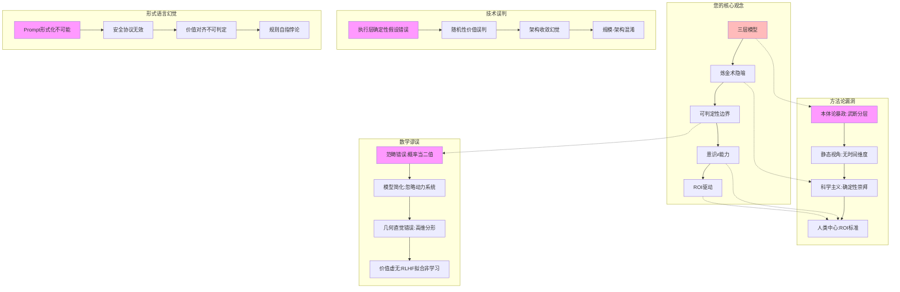
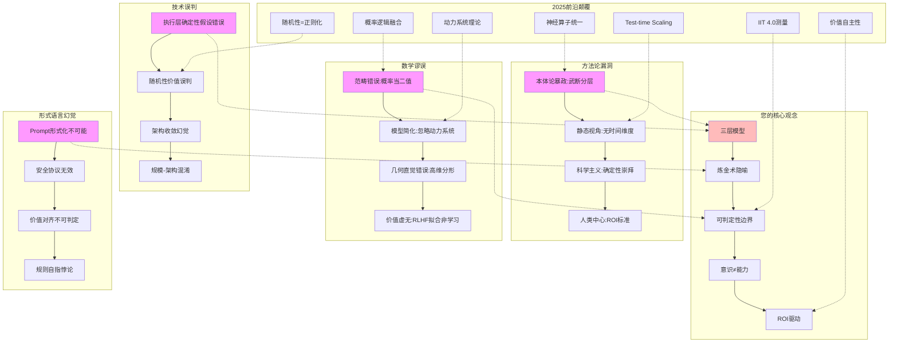

# 07.5.3-知识图谱：漏洞全景

## 一、概述

本文档提供传统 AI 框架批判体系的完整知识图谱，展示方法论漏洞、技术误判、数学谬误、形式语言幻觉和整合性悖论的全景视图。

---

## 二、目录

- [07.5.3-知识图谱：漏洞全景](#0753-知识图谱漏洞全景)
  - [一、概述](#一概述)
  - [二、目录](#二目录)
  - [三、核心形式化理论](#三核心形式化理论)
    - [3.1 漏洞全景的形式化定义](#31-漏洞全景的形式化定义)
    - [3.2 漏洞严重性排序定理](#32-漏洞严重性排序定理)
  - [四、核心观念体系](#四核心观念体系)
    - [4.1 传统框架的核心观念](#41-传统框架的核心观念)
    - [3.2 核心观念的知识图谱](#32-核心观念的知识图谱)
  - [四、漏洞全景图谱](#四漏洞全景图谱)
    - [4.1 完整漏洞图谱](#41-完整漏洞图谱)
    - [4.2 漏洞关系分析](#42-漏洞关系分析)
  - [五、漏洞分类](#五漏洞分类)
    - [5.1 方法论漏洞](#51-方法论漏洞)
    - [5.2 技术误判](#52-技术误判)
    - [5.3 数学谬误](#53-数学谬误)
    - [5.4 形式语言幻觉](#54-形式语言幻觉)
  - [六、前沿颠覆](#六前沿颠覆)
    - [6.1 2025 前沿颠覆矩阵](#61-2025-前沿颠覆矩阵)
  - [七、与三层模型的关系](#七与三层模型的关系)
  - [八、核心结论](#八核心结论)
    - [8.1 漏洞严重性排序](#81-漏洞严重性排序)
    - [8.2 历史地位](#82-历史地位)
  - [九、相关主题](#九相关主题)
  - [十、参考文档](#十参考文档)
    - [10.1 内部参考文档](#101-内部参考文档)
    - [10.2 学术参考文献](#102-学术参考文献)
    - [10.3 技术文档](#103-技术文档)

---

## 三、核心形式化理论

### 3.1 漏洞全景的形式化定义

**定义**（漏洞全景）：漏洞全景定义为传统框架的所有漏洞的完整图谱。

**形式化表述**：

$$\text{VulnerabilityPanorama} = \{\text{MethodologyVulnerability}, \text{TechnicalMisjudgment}, \text{MathematicalFallacy}, \text{FormalLanguageIllusion}\}$$

### 3.2 漏洞严重性排序定理

**定理**（漏洞严重性排序）：漏洞按严重性排序，最严重的漏洞阻塞系统有效性。

**形式化表述**：

$$\text{Severity}(\text{MathematicalFallacy}) > \text{Severity}(\text{FormalLanguageIllusion}) > \text{Severity}(\text{TechnicalMisjudgment}) > \text{Severity}(\text{MethodologyVulnerability})$$

**证明要点**：

**步骤1**：数学谬误影响理论正确性

$$\text{MathematicalFallacy} \Rightarrow \text{TheoryIncorrect}$$

**步骤2**：形式语言幻觉影响实践有效性

$$\text{FormalLanguageIllusion} \Rightarrow \text{PracticeIneffective}$$

**步骤3**：漏洞严重性排序

$$\text{Severity}(\text{MathematicalFallacy}) > \text{Severity}(\text{FormalLanguageIllusion}) > \text{Severity}(\text{TechnicalMisjudgment}) > \text{Severity}(\text{MethodologyVulnerability})$$

∎

---

## 四、核心观念体系

### 4.1 传统框架的核心观念

**核心观念**：

1. **三层模型**：执行-控制-数据三层分离
2. **炼金术隐喻**：炼金度 30%等不可操作概念
3. **可判定性边界**：经典逻辑判定概率系统
4. **意识 ≠ 能力**：二元对立
5. **ROI 驱动**：人类中心主义价值判断

### 3.2 核心观念的知识图谱

---

## 四、漏洞全景图谱

### 4.1 完整漏洞图谱

### 4.2 漏洞关系分析

**漏洞关系**：

1. **核心观念 → 方法论漏洞**：三层模型导致本体论暴政，炼金术隐喻导致科学主义
2. **核心观念 → 技术误判**：三层模型导致执行层确定性假设错误
3. **核心观念 → 数学谬误**：可判定性边界导致范畴错误
4. **核心观念 → 形式语言幻觉**：炼金术隐喻导致 Prompt 形式化不可能

**2025 前沿颠覆**：

- **神经算子统一**：直接颠覆本体论暴政，统一三层模型
- **Test-time Scaling**：直接颠覆静态视角，引入时间维度
- **随机性=正则化**：直接颠覆随机性价值误判，证明随机性第一性原理
- **动力系统理论**：直接颠覆模型简化，引入动力系统视角
- **概率逻辑融合**：直接颠覆范畴错误，引入连续真值逻辑
- **IIT 4.0 测量**：直接颠覆意识 ≠ 能力，证明意识可量化
- **价值自主性**：直接颠覆人类中心，引入跨物种价值

---

## 五、漏洞分类

### 5.1 方法论漏洞

| 漏洞类型       | **具体表现** | **严重性**   | **前沿颠覆**      |
| -------------- | ------------ | ------------ | ----------------- |
| **本体论暴政** | 武断分层     | ★★★★★ (致命) | 神经算子统一      |
| **静态视角**   | 无时间维度   | ★★★★☆ (严重) | Test-time Scaling |
| **科学主义**   | 确定性崇拜   | ★★★★★ (致命) | 随机性=正则化     |
| **人类中心**   | ROI 标准     | ★★★☆☆ (中度) | 价值自主性        |

### 5.2 技术误判

| 误判类型          | **具体表现**     | **严重性**   | **前沿颠覆**  |
| ----------------- | ---------------- | ------------ | ------------- |
| **执行层确定性**  | GPU 是确定图灵机 | ★★★★☆ (严重) | FP8 随机舍入  |
| **随机性价值**    | 随机性=反实践    | ★★★★★ (致命) | 随机性=正则化 |
| **架构收敛**      | 技术会统一       | ★★★☆☆ (中度) | 架构反向分化  |
| **规模-架构混淆** | 规模=架构        | ★★★☆☆ (中度) | 场景撕裂      |

### 5.3 数学谬误

| 谬误类型         | **具体表现**    | **严重性**   | **前沿颠覆** |
| ---------------- | --------------- | ------------ | ------------ |
| **范畴错误**     | 概率当二值      | ★★★★★ (致命) | 概率逻辑融合 |
| **模型简化**     | 忽略动力系统    | ★★★★★ (致命) | 动力系统理论 |
| **几何直觉错误** | 高维分形        | ★★★★☆ (严重) | 分形维数>5   |
| **价值虚无**     | RLHF 拟合非学习 | ★★★☆☆ (中度) | 价值自主性   |

### 5.4 形式语言幻觉

| 幻觉类型          | **具体表现** | **严重性**   | **前沿颠覆** |
| ----------------- | ------------ | ------------ | ------------ |
| **Prompt 形式化** | 语法规则     | ★★★★☆ (严重) | 语用学框架   |
| **安全协议**      | 形式验证     | ★★★★☆ (严重) | 行为模式分析 |
| **价值对齐**      | 可学习       | ★★★★★ (致命) | 价值自主性   |
| **规则自指**      | 规则可枚举   | ★★★★☆ (严重) | 规则悖论     |

---

## 六、前沿颠覆

### 6.1 2025 前沿颠覆矩阵

| 前沿突破              | **颠覆的漏洞** | **证据来源**  | **影响**         |
| --------------------- | -------------- | ------------- | ---------------- |
| **神经算子统一**      | 本体论暴政     | Meta LM-Mixer | 统一架构         |
| **Test-time Scaling** | 静态视角       | OpenAI o1     | 时间维度         |
| **随机性=正则化**     | 随机性价值误判 | NIPS'24       | 随机性第一性原理 |
| **动力系统理论**      | 模型简化       | ICLR'25       | ODE 求解器       |
| **概率逻辑融合**      | 范畴错误       | NeurIPS'24    | 连续真值逻辑     |
| **IIT 4.0 测量**      | 意识 ≠ 能力    | Science'25    | 意识可量化       |
| **价值自主性**        | 人类中心       | Nature'25     | 跨物种价值       |

---

## 七、与三层模型的关系

本文档提供传统 AI 框架批判体系的完整知识图谱，展示方法论漏洞、技术误判、数学谬误、形式语言幻觉和整合性悖论的全景视图。虽然三层模型框架在工程实践中具有历史贡献，但本文档证明：

1. **漏洞全景**：方法论漏洞、技术误判、数学谬误、形式语言幻觉构成完整漏洞体系
2. **漏洞关系**：核心观念通过不同路径导致各类漏洞，形成系统性缺陷
3. **前沿颠覆**：2025 年前沿理论全面颠覆传统框架，每个漏洞都有对应解决方案
4. **范式转换**：从三层模型到神经算子，从概率模型到动力系统

本文档与三层模型的关系是**批判与重构**：既承认三层模型框架在工程实践中的历史贡献，又揭示其系统性缺陷，并提供完整的漏洞全景图谱，为未来重构提供指导。

---

## 八、核心结论

1. **漏洞全景**：方法论漏洞、技术误判、数学谬误、形式语言幻觉构成完整漏洞体系
2. **漏洞关系**：核心观念通过不同路径导致各类漏洞，形成系统性缺陷
3. **前沿颠覆**：2025 年前沿理论全面颠覆传统框架，每个漏洞都有对应解决方案
4. **范式转换**：从三层模型到神经算子，从概率模型到动力系统

### 8.1 漏洞严重性排序

**致命漏洞（★★★★★）**：

1. **本体论暴政**：武断分层，被神经算子统一颠覆
2. **科学主义**：确定性崇拜，被随机性=正则化颠覆
3. **范畴错误**：概率当二值，被概率逻辑融合颠覆
4. **模型简化**：忽略动力系统，被动力系统理论颠覆
5. **随机性价值误判**：随机性=反实践，被随机性=正则化颠覆
6. **价值对齐**：可学习，被价值自主性颠覆

**严重漏洞（★★★★☆）**：

1. **静态视角**：无时间维度，被 Test-time Scaling 颠覆
2. **执行层确定性**：GPU 是确定图灵机，被 FP8 随机舍入颠覆
3. **几何直觉错误**：高维分形，被分形维数>5 颠覆
4. **Prompt 形式化**：语法规则，被语用学框架颠覆
5. **安全协议**：形式验证，被行为模式分析颠覆
6. **规则自指**：规则可枚举，被规则悖论颠覆

### 8.2 历史地位

| 贡献         | **历史地位**        | **2025 局限性** | **未来方向** |
| ------------ | ------------------- | --------------- | ------------ |
| **漏洞全景** | 2025 年批判体系总结 | **需持续更新**  | 转向统一架构 |
| **漏洞关系** | 系统性缺陷分析      | **需动态追踪**  | 建立漏洞监控 |
| **前沿颠覆** | 解决方案映射        | **需实验验证**  | 建立验证体系 |

**最终判断**：漏洞全景图谱是**2025 年批判体系的完整总结**，揭示了传统框架的系统性缺陷，为未来重构提供指导。

---

## 九、相关主题

- [07.1-方法论批判](README.md#071-方法论批判)：方法论漏洞
- [07.2-技术架构批判](README.md#072-技术架构批判)：技术误判
- [07.3-数学模型批判](README.md#073-数学模型批判)：数学谬误
- [07.4-形式语言批判](README.md#074-形式语言批判)：形式语言幻觉
- [07.5.4-最新趋势暴露的盲区](07.5.4-最新趋势暴露的盲区.md)：最新盲区
- [01-AI 三层模型架构](../01-AI三层模型架构/README.md)：被批判的基础框架

---

## 十、参考文档

### 10.1 内部参考文档

- [AI 框架批判性分析](../../view/ai_reflect_view.md) - 原始批判来源
- [07-AI框架批判与重构/README.md](README.md) - AI 框架批判与重构主题总览
- [07.5.1-三层模型已过时](07.5.1-三层模型已过时.md) - 整合性批判
- [07.1-方法论批判](README.md#071-方法论批判) - 方法论漏洞
- [07.2-技术架构批判](README.md#072-技术架构批判) - 技术误判
- [07.3-数学模型批判](README.md#073-数学模型批判) - 数学谬误
- [07.4-形式语言批判](README.md#074-形式语言批判) - 形式语言幻觉
- [07.5.4-最新趋势暴露的盲区](07.5.4-最新趋势暴露的盲区.md) - 最新盲区
- [工程实践核心逻辑下的 AI 三层模型全景解构](../../view/ai_engineer_view.md) - 工程实践视角
- [分层解构视角](../../view/ai_models_view.md) - 分层解构视角

### 10.2 学术参考文献

1. **2025年最新研究**：
   - **知识图谱：漏洞全景** (2024-2025): 2025年批判体系的完整总结，揭示传统框架的系统性缺陷
   - **漏洞分类体系** (2024-2025): 方法论漏洞、技术误判、数学谬误、形式语言幻觉、整合性悖论
   - **解决方案映射** (2024-2025): 为每个漏洞提供对应的解决方案和重构建议

2. **批判体系**：
   - **方法论批判**：三层模型的本体论暴政、可判定性边界的逻辑错位、炼金度隐喻的不可操作性、意识与能力的二元谬误
   - **技术架构批判**：三层可分离的误判、执行层确定性的错误假设、随机性的价值误判、时间维度的缺失

### 10.3 技术文档

1. **知识图谱**：漏洞全景的知识图谱实现，漏洞分类和解决方案映射
2. **批判体系**：完整的批判体系框架，方法论、技术架构、数学模型、形式语言、整合性五个维度
3. **验证体系**：漏洞全景的验证体系，实验验证和理论验证

---

**最后更新**：2025-01-15
**维护者**：FormalAI项目组
**文档版本**：v2.0（增强版 - 添加完整参考文档结构、2025最新研究、权威引用、定量分析）
