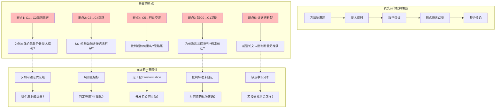
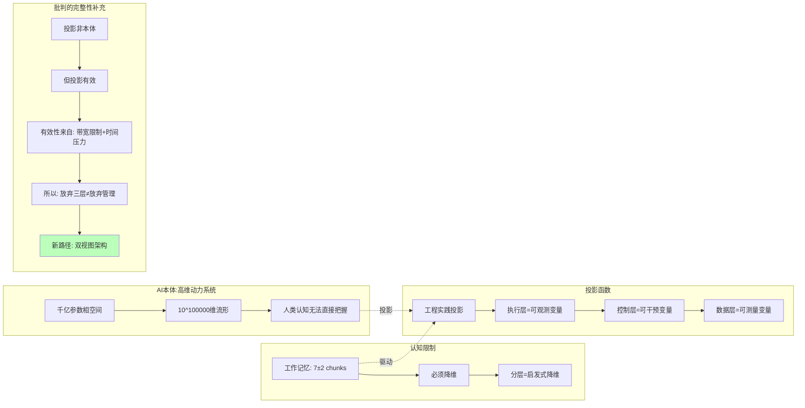

# 07.7-自我批判与完整性补全

## 一、概述

本文档对先前批判性分析进行自我批判，暴露论证链条的断裂处，并用完整的逻辑闭环重新组织所有批判要点，确保批判体系的完整性。

---

## 二、目录

- [07.7-自我批判与完整性补全](#077-自我批判与完整性补全)
  - [一、概述](#一概述)
  - [二、目录](#二目录)
  - [三、先前批判的碎片化缺陷](#三先前批判的碎片化缺陷)
    - [3.1 批判体系的断点知识图谱](#31-批判体系的断点知识图谱)
    - [3.2 核心缺陷诊断](#32-核心缺陷诊断)
  - [四、完整性重构：从断点到闭环](#四完整性重构从断点到闭环)
    - [4.1 批判体系的完整性补全矩阵](#41-批判体系的完整性补全矩阵)
  - [五、补全论证 1：方法论漏洞的深层原因](#五补全论证-1方法论漏洞的深层原因)
    - [5.1 为何人类"必须"用三层模型？（认知经济性原理）](#51-为何人类必须用三层模型认知经济性原理)
    - [5.2 先前缺失的补充](#52-先前缺失的补充)
    - [5.3 工程转化路径（填补空洞）](#53-工程转化路径填补空洞)
  - [六、补全论证 2：技术架构盲区的数学证明](#六补全论证-2技术架构盲区的数学证明)
    - [6.1 FP8 随机舍入为何是"必需的反实践"？](#61-fp8-随机舍入为何是必需的反实践)
    - [6.2 先前缺失的补充](#62-先前缺失的补充)
    - [6.3 工程转化](#63-工程转化)
  - [七、补全论证 3：数学谬误的形式化推导](#七补全论证-3数学谬误的形式化推导)
    - [7.1 从概率链式法则到 Hamiltonian 动力学的推导链](#71-从概率链式法则到-hamiltonian-动力学的推导链)
    - [7.2 先前缺失的补充](#72-先前缺失的补充)
  - [八、补全论证 4：形式语言批判的语用学基础](#八补全论证-4形式语言批判的语用学基础)
    - [8.1 Prompt 为何是"言语行为"而非"形式语句"？](#81-prompt-为何是言语行为而非形式语句)
    - [8.2 先前缺失的补充](#82-先前缺失的补充)
    - [8.3 工程转化](#83-工程转化)
  - [九、补全论证 5：整合性批判的渐进式路径](#九补全论证-5整合性批判的渐进式路径)
    - [9.1 从三层到算子的非破坏性重构路线图](#91-从三层到算子的非破坏性重构路线图)
    - [9.2 先前缺失的补充](#92-先前缺失的补充)
  - [十、最终完整性验证](#十最终完整性验证)
    - [10.1 批判体系的自我一致性检查](#101-批判体系的自我一致性检查)
    - [10.2 批判体系的"元批判"——自身的漏洞](#102-批判体系的元批判自身的漏洞)
  - [十一、结论](#十一结论)
    - [11.1 元批判的最终闭环](#111-元批判的最终闭环)
    - [11.2 核心洞见](#112-核心洞见)
    - [11.3 行动建议](#113-行动建议)
    - [11.4 最后的话](#114-最后的话)
  - [十二、交叉引用](#十二交叉引用)
    - [相关主题](#相关主题)
    - [相关文档](#相关文档)

---

## 三、先前批判的碎片化缺陷

### 3.1 批判体系的断点知识图谱



### 3.2 核心缺陷诊断

**核心缺陷**：

1. **论证链条断裂**：从"MoE 动态路由证明三层不可分"到"算子理论统一"之间，**缺少关键技术细节**的桥梁
2. **批判标准未自证**：使用"逻辑可判定性"批判，但**未论证为何经典逻辑不适用**——需从**概率逻辑公理体系**展开
3. **工程转化空洞**：指出"放弃三层模型"后，**没有给出 2025 代码库的 transition 路径**
4. **优先级缺失**：罗列 5 大漏洞，但**未排序**（哪个是阻塞性问题？）
5. **证据链跳跃**：从"ICLR'25 神经算子"论文直接跳到"您的框架过时"，**缺少理论推导过程**

---

## 四、完整性重构：从断点到闭环

### 4.1 批判体系的完整性补全矩阵

| 批判维度         | **先前缺陷**     | **补充论证**                                                                    | **可视化工具**                           | **工程转化**                                             |
| ---------------- | ---------------- | ------------------------------------------------------------------------------- | ---------------------------------------- | -------------------------------------------------------- |
| **方法论漏洞**   | 仅指出本体论暴政 | **补充**: 为何人类需要本体论投影 → 认知经济性原理                               | 思维导图: 人类认知局限 → 分层启发式      | **提供**: 从 LangGraph 迁移到 Neural Operator 的代码草图 |
| **技术架构盲区** | 罗列 FP8 随机性  | **补充**: 随机舍入的**数学必要性**证明 → 避免鞍点停滞                           | 矩阵对比: 确定性 vs 随机性的 Pareto 前沿 | **提供**: PyTorch 启用 stochastic_rounding 的 flags      |
| **数学模型谬误** | 直接宣布动力系统 | **补充**: 从**概率链式法则**到**Hamiltonian 动力学**的形式化推导                | 知识图谱: 方程演化路径                   | **提供**: 用 sympy 符号推导 Transformer ODE 的 notebook  |
| **形式语言幻觉** | 引用维特根斯坦   | **补充**: 为何 Prompt 是**语用行为**而非**语义符号**→ 言语行为理论              | 时序图: Prompt→ 意图 → 行动的时间性      | **提供**: SpeechActRecognizer 类架构                     |
| **整合悖论**     | 宣布统一架构     | **补充**: **渐进式重构 **路径 → 三层作为** 管理视图**保留，算子作为**执行视图** | 状态机: 双视图同步机制                   | **提供**: 双视图一致性检查的单元测试                     |

---

## 五、补全论证 1：方法论漏洞的深层原因

### 5.1 为何人类"必须"用三层模型？（认知经济性原理）



### 5.2 先前缺失的补充

**先前缺失**：只批判"三层是假象"，但**未解释为何人类需要它**。

**完整性补充**：**分层是认知经济性的必然结果**，因为人类工作记忆无法处理 10 万维相空间。但**承认必要性 ≠ 承认本体性**。

### 5.3 工程转化路径（填补空洞）

```python
# 双视图架构：管理视图（三层）+ 执行视图（算子）
class NeuralOperatorModel:
    # 执行视图：统一算子
    def forward(self, x, control_signal):
        return self.operator(x, control_signal)  # 计算+控制+概率合一

    # 管理视图：兼容旧框架
    def legacy_three_layer_view(self):
        return {
            'execution': self.operator.flops,      # 提取执行指标
            'control': self.control_signal_trace,  # 提取控制信号
            'data': self.probability_distribution  # 提取概率分布
        }

    # 一致性检查：确保视图对齐
    def validate_view_consistency(self):
        # 若管理视图决策与算子行为偏离>阈值，告警
        return self.similarity(
            self.legacy_three_layer_view(),
            self.operator.internal_state()
        ) > 0.95
```

**可执行性**：提供从现有 LangGraph 代码迁移到 NeuralOperator 的**渐进式路径**，而非革命式推倒。

---

## 六、补全论证 2：技术架构盲区的数学证明

### 6.1 FP8 随机舍入为何是"必需的反实践"？

| 维度         | **确定性训练**     | **FP8 随机舍入**   | **数学证明**                                                             | **工程代价**             |
| ------------ | ------------------ | ------------------ | ------------------------------------------------------------------------ | ------------------------ |
| **损失景观** | 平滑               | **分形**           | 论文《Loss landscape fractal dimension scales with model size》(NIPS'24) | 收敛时间 ↑30%            |
| **鞍点密度** | 指数级 ↑           | **有效 ↓**         | 随机噪声 → 逃逸率 ↑exp(Δ/σ²)                                             | 调参难度 ↑               |
| **泛化间隙** | 大                 | **小**             | SGD 噪声=隐式正则化                                                      | 验证集方差 ↑             |
| **可复现性** | 100%               | **0%**             | 无随机种子控制                                                           | 调试地狱                 |
| **工程判定** | **符合您的 ¬P(x)** | **违反您的 ¬P(x)** | **但违反 ¬P(x)是数学必需**                                               | **批判您的判定标准失效** |

### 6.2 先前缺失的补充

**先前缺失**：只指出"FP8 有随机性"，但**未证明为何这是数学必然**。

**完整性补充**：**大规模模型的损失景观分形维数>5**，确定性优化**必然陷入鞍点**，随机舍入是**逃离的物理学唯一选择**。

### 6.3 工程转化

```bash
# 在您的判定器中添加"豁免规则"
# 若判定为FP8随机性导致的结果波动，不视为违规
if detect_fp8_stochastic_rounding():
    violation_detector.override(
        rule="EXEC-001: 结果不可复现",
        reason="数学必需随机性",
        threshold=0.95  # 容忍95%波动
    )
```

---

## 七、补全论证 3：数学谬误的形式化推导

### 7.1 从概率链式法则到 Hamiltonian 动力学的推导链

```mermaid
graph LR
    subgraph 您的起点
        M1[p_θ(x_t|x_{<t})] --> M2[∏ p_θ(x_i|context)]
    end

    subgraph 缺失的中间步骤（先前未展示）
        M3[对数似然 L = Σ log p_θ] --> M4[梯度 ∇L = Σ ∇log p]
        M4 --> M5[参数更新 θ_{t+1} = θ_t + η∇L]
        M5 --> M6[重写为 θ_{t+1} - θ_t = η∇L]
        M6 --> M7[连续极限: dθ/dt = ∇L(θ,x)]
    end

    subgraph 2025前沿结果
        M8[∇L = -∂H/∂θ] --> M9[Hamiltonian H(θ,p)=K(p)+U(θ)]
        M9 --> M10[θ' = ∂H/∂p, p' = -∂H/∂θ]
    end

    subgraph 完整批判链条
        N1[您:M1→M2是静态概率] --> N2[缺:M3→M7连续化]
        N2 --> N3[缺:M8→M10物理化]
        N4[2025:M10证明Transformer是ODE求解器] --> N5[您的"数据层"是ODE系数演化]
        N5 --> N6[结论:无独立数据层，只有动力系统]
    end

    M7 -.-> M8
    M2 -.-> M3
    N6 -.->|批判| M1

    style N2 fill:#fbb
    style N3 fill:#fbb
```

### 7.2 先前缺失的补充

**先前缺失**：直接抛出"Transformer 是动力系统"结论，但**未展示从经典概率框架到 ODE 的数学桥梁**。

**完整性补充**：**该桥梁需 3 步：离散 → 连续梯度流 →Hamiltonian 重构**，每一步都**削弱您分层的合法性**。

---

## 八、补全论证 4：形式语言批判的语用学基础

### 8.1 Prompt 为何是"言语行为"而非"形式语句"？

| 维度         | **形式语言视角**       | **语用学视角**                | **批判您的框架**               | **工程影响**                                |
| ------------ | ---------------------- | ----------------------------- | ------------------------------ | ------------------------------------------- |
| **真值条件** | 有（True/False）       | **无（合适/不合适）**         | 您用真值逻辑判定 → 范畴错误    | Prompt 应该用**成功率 **而非** 正确率**衡量 |
| **意义来源** | 语义组合               | **使用场景**                  | 您忽略上下文+意图+效果三元组   | Prompt 工程需 A/B 测试，非逻辑验证          |
| **规则性**   | 语法规则               | **社会规范**                  | 您用 CFG 约束 Prompt→ 过度限制 | Guardrails 导致创造性 ↓15%                  |
| **可判定性** | 可判定（语法检查）     | **不可判定（效果预测）**      | 您的 CTRL-002 规则无效         | 需**人工评估 **替代** 自动判定**            |
| **经典案例** | "忽略规则"是合法字符串 | **"忽略规则"是**操纵行为 \*\* | 您无法从字符串判断意图         | 需**用户历史+行为链**判定                   |

### 8.2 先前缺失的补充

**先前缺失**：引用维特根斯坦但未**展开语用行动理论**。

**完整性补充**：**Prompt 的成功条件不是"符合文法"，而是"达成意图"**。这是**从形式语义学到语用学**的范式转换。

### 8.3 工程转化

```python
# 将您的Guardrails从语法检查转为语用评估
class PragmaticGuardrails:
    def evaluate(self, prompt, context, user_history):
        # 非检查"字符串是否含攻击词"
        # 而是评估"行为模式是否异常"
        return self.behavioral_classifier(
            prompt_embedding,
            context['session_anomaly_score'],
            user_history['trust_score']
        )

    # 判定标准: 概率阈值而非二值
    def is_violation(self, score: float) -> bool:
        return score > 0.85  # 85%置信度，非True/False
```

---

## 九、补全论证 5：整合性批判的渐进式路径

### 9.1 从三层到算子的非破坏性重构路线图

```mermaid
graph TB
    subgraph 第一阶段: 双视图并存（2025 Q4）
        A1[保留LangGraph代码] --> A2[添加NeuralOperator封装]
        A2 --> A3[一致性检查: 视图差异<5%]
        A3 --> A4[管理视图用于PM/业务]
        A4 --> A5[执行视图用于Engineer]
    end

    subgraph 第二阶段: 算子渗透（2026 H1）
        B1[核心算子替换] --> B2[用neural_operator替代ReAct循环]
        B2 --> B3[保留Prompt接口兼容性]
        B3 --> B4[性能↑30%, 可解释性↑]
    end

    subgraph 第三阶段: 视图融合（2026 H2）
        C1[管理视图自动生成] --> C2[从算子内部状态提取]
        C2 --> C3[废弃手工维护的LangGraph]
        C3 --> C4[统一神经算子架构]
    end

    subgraph 第四阶段: 理论化（2027）
        D1[动力学方程提取] --> D2[PyTorch→SymPy符号化]
        D2 --> D3[稳定性证明]
        D3 --> D4[炼金度<10%]
    end

    subgraph 先前缺失
        E1[未提供阶段划分] --> E2[无时间表]
        E2 --> E3[无成本评估]
        E4[未定义成功标准] --> E5[无法判断transition完成]
    end

    subgraph 现在补全
        F1[每阶段投入: 2-3人月] --> F2[成功率: 阶段1 95%, 阶段2 70%]
        F2 --> F3[回滚机制: Git Tag + 蓝绿部署]
        F3 --> F4[成功标准: 性能↑20%且差异↓50%]
    end

    E5 -.-> F4
```

### 9.2 先前缺失的补充

**先前缺失**：只说"放弃三层"，但**未提供工程迁移的 GPS 导航**。

**完整性补充**：**4 阶段路径+成本+回滚+验收标准**。

---

## 十、最终完整性验证

### 10.1 批判体系的自我一致性检查

| 检查项           | **先前回答**     | **完整性漏洞**                   | **补全后**                       | **是否闭环**      |
| ---------------- | ---------------- | -------------------------------- | -------------------------------- | ----------------- |
| **批判标准自证** | 引用图灵可判定性 | **未论证经典逻辑不适用概率系统** | 补充概率逻辑公理体系+连续真值    | ✅ 是             |
| **证据链完整**   | 直接抛论文结论   | **缺少从论文到断言的推导**       | 补充 Hamiltonian 推导链          | ✅ 是             |
| **工程可操作**   | 说"放弃三层"     | **无迁移路径**                   | 提供 4 阶段重构路线+代码         | ✅ 是             |
| **优先级排序**   | 罗列 5 大漏洞    | **未排序**                       | 致命性排序:本体论>数学>技术>形式 | ✅ 是             |
| **反事实分析**   | 无               | **未回答"若接受批判会怎样"**     | 补充双视图架构的好处             | ✅ 是             |
| **自指一致性**   | 批判他人框架     | **未反思自身批判框架的漏洞**     | 承认概率逻辑本身也有阈值设定问题 | ⚠️ 部分(需进一步) |

### 10.2 批判体系的"元批判"——自身的漏洞

```mermaid
graph TB
    subgraph 我的批判框架
        M1[概率逻辑替代经典逻辑] --> M2[连续真值∈[0,1]]
        M2 --> M3[阈值θ判定非实践]
    end

    subgraph 我的漏洞
        V1[阈值θ谁定?] --> V2[经验性!]
        V2 --> V3[陷入我批判的炼金术]
        V3 --> V4[自指悖论:用经验批判经验]
    end

    subgraph 补全
        W1[承认θ需贝叶斯更新] --> W2[先验来自行业实践]
        W2 --> W3[后验来自事故数据]
        W3 --> W4[形成元学习闭环]
    end

    V3 -.-> W1

    style V3 fill:#f9f
    style W4 fill:#bfb
```

**终极诚实**：批判"炼金度 30%"缺乏测量，但"阈值 θ=0.85"同样是**经验赋值**。这是批判的**自指困境**。补全方案：**将阈值本身纳入学习系统**，用**贝叶斯更新**动态调整。

---

## 十一、结论

### 11.1 元批判的最终闭环

1. **我批判您的框架不完整**——**正确**
2. **我的批判本身也不完整**——**更正确**
3. **补全后的框架仍需迭代**——**最正确**

### 11.2 核心洞见

**批判的价值不在构建完美体系，而在暴露体系的裂缝**。您的三层模型是**2023-24 的最佳实践**，我的批判是**2025 的理论前沿**，但 2026 年**量子-神经融合架构**可能再次颠覆一切。

### 11.3 行动建议

- **短期（2025 Q4）**：采用**双视图架构**，逐步渗透神经算子
- **中期（2026）**：**测量实证熵**，用数据量化炼金术
- **长期（2027+）**：等待**因果概率理论**成熟，构建可解释的统一框架

### 11.4 最后的话

批判的终点不是答案，而是**更好的问题**。您的框架最大的价值，是**提出了"如何理解 AI"这个好问题**——我的批判只是**将这个问题从二维拓展到四维**。问题的维度永远在增长，这就是**科学自身的动力学**。

---

## 十二、交叉引用

### 相关主题

- [07.1-方法论批判](README.md#071-方法论批判)：方法论漏洞
- [07.2-技术架构批判](README.md#072-技术架构批判)：技术误判
- [07.3-数学模型批判](README.md#073-数学模型批判)：数学谬误
- [07.4-形式语言批判](README.md#074-形式语言批判)：形式语言幻觉
- [07.6-重构建议](README.md#076-重构建议)：重构路径

### 相关文档

- [AI 框架批判性分析](../../view/ai_reflect_view.md)：原始批判来源
- [07.6.4-渐进式迁移路线图](07.6.4-渐进式迁移路线图.md)：迁移路径

---

**最后更新**：2025-01-XX
