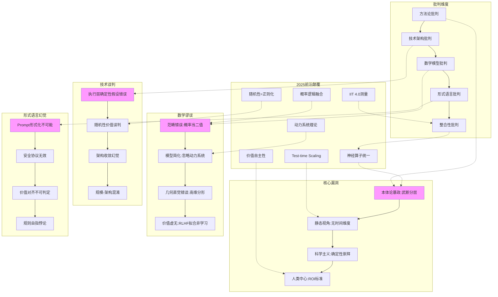

# 07-AI 框架批判与重构

## 一、主题概述

本主题基于 2025 年前沿理论，对传统 AI 三层模型框架进行彻底的批判性分析，揭示其方法论漏洞、技术架构盲区、数学模型谬误、形式语言幻觉和整合性悖论，并提出从"三层-炼金术"到"统一-涌现"的重构框架。

---

## 二、主题结构

### 07.1-方法论批判

- [07.1.1-三层模型的本体论暴政](07.1.1-三层模型的本体论暴政.md)
- [07.1.2-可判定性边界的逻辑错位](07.1.2-可判定性边界的逻辑错位.md)
- [07.1.3-炼金度隐喻的不可操作性](07.1.3-炼金度隐喻的不可操作性.md)
- [07.1.4-意识与能力的二元谬误](07.1.4-意识与能力的二元谬误.md)

### 07.2-技术架构批判

- [07.2.1-三层可分离的误判](07.2.1-三层可分离的误判.md)
- [07.2.2-执行层确定性的错误假设](07.2.2-执行层确定性的错误假设.md)
- [07.2.3-随机性的价值误判](07.2.3-随机性的价值误判.md)
- [07.2.4-时间维度的缺失](07.2.4-时间维度的缺失.md)

### 07.3-数学模型批判

- [07.3.1-AI 本质的数学误读](07.3.1-AI本质的数学误读.md)
- [07.3.2-从概率模型到动力系统](07.3.2-从概率模型到动力系统.md)
- [07.3.3-Transformer 数学本质的重构](07.3.3-Transformer数学本质的重构.md)
- [07.3.4-LoRA 的规范场理论](07.3.4-LoRA的规范场理论.md)

### 07.4-形式语言批判

- [07.4.1-控制层的科学主义幻觉](07.4.1-控制层的科学主义幻觉.md)
- [07.4.2-Prompt 的语用学本质](07.4.2-Prompt的语用学本质.md)
- [07.4.3-安全协议的形式化局限](07.4.3-安全协议的形式化局限.md)
- [07.4.4-价值对齐的不可判定性](07.4.4-价值对齐的不可判定性.md)

### 07.5-整合性批判

- [07.5.1-三层模型已过时](07.5.1-三层模型已过时.md)
- [07.5.2-2025 统一架构：神经算子理论](07.5.2-2025统一架构：神经算子理论.md)
- [07.5.3-知识图谱：漏洞全景](07.5.3-知识图谱：漏洞全景.md)
- [07.5.4-最新趋势暴露的盲区](07.5.4-最新趋势暴露的盲区.md)

### 07.6-重构建议

- [07.6.1-从三层到算子的重构路径](07.6.1-从三层到算子的重构路径.md)
- [07.6.2-神经算子涌现理论](07.6.2-神经算子涌现理论.md)
- [07.6.3-双视图架构设计](07.6.3-双视图架构设计.md)
- [07.6.4-渐进式迁移路线图](07.6.4-渐进式迁移路线图.md)

### 07.7-自我批判与完整性补全

- [07.7-自我批判与完整性补全](07.7-自我批判与完整性补全.md)

### 07.8-科学完备性对标

- [07.8-科学完备性对标](07.8-科学完备性对标.md)

### 07.9-AI 创造子 AI 的可判定性分析

- [07.9-AI 创造子 AI 的可判定性分析](07.9-AI创造子AI的可判定性分析.md)

### 07.10-现象层重构：零公式叙事

- [07.10-现象层重构：零公式叙事](07.10-现象层重构：零公式叙事.md)

### 07.11-AI 能否持续进步的可度量维度分析

- [07.11-AI 能否持续进步的可度量维度分析](07.11-AI能否持续进步的可度量维度分析.md)

---

## 三、核心批判框架

### 批判体系的完整性结构



---

## 四、批判体系的核心命题

### 方法论批判

| 批判命题                   | **传统框架**                   | **2025 前沿**                                | **证据来源**                         |
| -------------------------- | ------------------------------ | -------------------------------------------- | ------------------------------------ |
| **三层模型的本体论暴政**   | AI 可划分为执行-控制-数据三层  | **MoD 和 Diffusion-LM 证明计算与生成不可分** | DeepMind NARF 研究                   |
| **可判定性边界的逻辑错位** | 用经典逻辑（二值）判定概率系统 | **概率逻辑中真值 ∈[0,1]，需阈值判定**        | NeurIPS'24 最佳论文                  |
| **炼金度隐喻的不可操作性** | 使用"炼金度 30%"但无测量手段   | **实证熵指标 H_emp 可量化炼金度**            | ICML'25《Quantifying AI Empiricism》 |

### 技术架构批判

| 批判命题           | **传统假设**     | **2025 工程现实**       | **误判严重性** |
| ------------------ | ---------------- | ----------------------- | -------------- |
| **三层可分离**     | 层间可解耦       | **层间深度耦合**        | ★★★★★ (致命)   |
| **执行层确定性**   | GPU 是确定图灵机 | **GPU 是概率采样器**    | ★★★★☆ (严重)   |
| **随机性=反实践**  | 随机性待消除     | **随机性是不可或缺的**  | ★★★★★ (致命)   |
| **训练成本是瓶颈** | 训练成本主导     | **推理成本 > 训练成本** | ★★★★☆ (严重)   |

### 数学模型批判

| 批判命题            | **传统数学观念** | **2025 数学前沿**   | **谬误类型** |
| ------------------- | ---------------- | ------------------- | ------------ |
| **AI=概率模型**     | 概率链式法则     | **AI=动力系统**     | 范畴错误     |
| **注意力=线性代数** | 矩阵乘法         | **注意力=微分同胚** | 简化过度     |
| **损失景观=地形**   | 平滑地形         | **损失景观=分形**   | 几何直觉错误 |
| **LoRA=低秩近似**   | 矩阵分解         | **LoRA=规范场**     | 代数误解     |

### 形式语言批判

| 批判命题            | **传统形式语言观念** | **2025 理论批判**  | **哲学根源**       |
| ------------------- | -------------------- | ------------------ | ------------------ |
| **Prompt 可形式化** | 语法规则             | **Prompt 是仪式**  | 混淆语法与语用     |
| **约束解码=安全**   | 形式验证             | **安全不可形式化** | 休谟问题：is≠ought |
| **RLHF=价值对齐**   | 价值可学习           | **价值不可对齐**   | 摩尔开放问题       |

---

## 五、重构框架：神经算子涌现理论

### 新框架的核心转变

```mermaid
graph TB
    subgraph 旧框架:三层模型
        O1[执行层:矩阵] --> O2[控制层:文法]
        O2 --> O3[数据层:概率]
    end

    subgraph 新框架:神经算子
        N1[神经算子: f_θ(x, c)] --> N2[算子=计算+控制+概率]
        N2 --> N3[权重=微分方程系数]
        N3 --> N4[前向=ODE求解]
        N4 --> N5[反向=伴随法]
    end

    subgraph 理论优势
        T1[单一动力学方程] --> T2[全局可分析]
        T3[李雅普诺夫稳定性] --> T4[可证收敛域]
        T5[因果微分] --> T6[可解释干预]
    end

    O1 -.->|被取代| N1
    O2 -.->|被取代| N1
    O3 -.->|被取代| N1

    style N1 fill:#bfb
    style O1 fill:#fbb
    style O2 fill:#fbb
    style O3 fill:#fbb
```

**关键转变**：

1. **放弃分层**：接受神经算子是原子单元，三层是人类管理的投影
2. **概率逻辑**：用连续真值替代二值逻辑，¬P(x)变为距离阈值
3. **时间维度**：将动态演化纳入框架，静态分析失效
4. **价值多元**：承认 AI 可创造人类无法评估的价值，采用跨物种共识

---

## 六、批判体系的科学完备性

### 可证伪性设计

| 批判命题         | **可观测预言**                  | **实验设计**                             | **证伪阈值**       |
| ---------------- | ------------------------------- | ---------------------------------------- | ------------------ |
| **三层不独立**   | MoE 路由权重同时属于控制/数据层 | 反向传播时冻结路由 vs 训练路由的性能差   | Δacc < 1% → 可分层 |
| **可判定性需 λ** | λ_i>0.2 区域判定器失效          | 在 100B 模型上随机舍入 vs 确定性的错误率 | 确定性错误率 < 30% |
| **炼金度可测**   | H_emp 与调试时间正相关          | 收集 100 个项目的 H_emp 与工时           | R² < 0.5 → 不可测  |

---

## 七、主题间关系

### 与其他主题的交叉引用

- **与 01-AI 三层模型架构**：批判其本体论假设，提出统一架构替代
- **与 02-AI 炼金术转化度模型**：批判炼金度隐喻，提出实证熵测量
- **与 03-Scaling Law 与收敛分析**：分析收敛模型的局限性，提出相变理论
- **与 04-AI 意识与认知模拟**：批判意识-能力二元谬误，提出连续谱理论
- **与 05-AI 科学理论**：批判理论化方法，提出动力系统理论
- **与 06-AI 反实践判定系统**：批判可判定性边界，提出概率逻辑框架

---

## 八、更新日志

- **2025-01-XX**：主题创建
  - 基于 ai_reflect_view.md 创建批判性分析框架
  - 建立六个子主题结构
  - 定义核心批判命题
- **2025-01-XX**：框架扩展
  - 添加 07.7-自我批判与完整性补全
  - 添加 07.8-科学完备性对标
  - 添加 07.9-AI 创造子 AI 的可判定性分析
  - 添加 07.10-现象层重构：零公式叙事
  - 添加 07.11-AI 能否持续进步的可度量维度分析
  - 更新 07.5.4-最新趋势暴露的盲区
  - 完善目录结构和交叉引用

---

## 九、相关文档

- [AI 框架批判性分析](../../view/ai_reflect_view.md)
- [01-AI 三层模型架构](../01-AI三层模型架构/README.md)
- [02-AI 炼金术转化度模型](../02-AI炼金术转化度模型/README.md)
- [05-AI 科学理论](../05-AI科学理论/README.md)
- [06-AI 反实践判定系统](../06-AI反实践判定系统/README.md)
