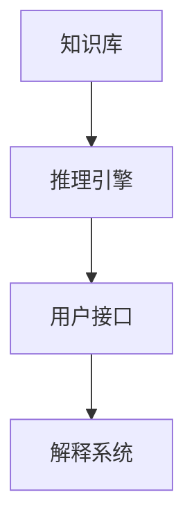

# 08.1.2-反思发展期（1970 年代）

## 一、概述

反思发展期（1970 年代）是 AI 发展的关键转折期，理论瓶颈与算法突破并存，AI 进入第一次寒冬。本文档阐述反思发展期的核心事件、原理机制及其历史意义。

---

## 二、目录

- [08.1.2-反思发展期（1970 年代）](#0812-反思发展期1970-年代)
  - [一、概述](#一概述)
  - [二、目录](#二目录)
  - [三、核心事件](#三核心事件)
    - [3.1 1974 年：反向传播算法提出](#31-1974-年反向传播算法提出)
    - [3.2 1976 年：专家系统 MYCIN](#32-1976-年专家系统-mycin)
    - [3.3 1979 年：强化学习雏形](#33-1979-年强化学习雏形)
  - [四、原理与机制](#四原理与机制)
    - [4.1 BP 算法原理](#41-bp-算法原理)
    - [4.2 专家系统机制](#42-专家系统机制)
    - [4.3 强化学习雏形](#43-强化学习雏形)
  - [五、核心矛盾](#五核心矛盾)
    - [5.1 计算力与理论匮乏](#51-计算力与理论匮乏)
    - [5.2 AI 第一次寒冬](#52-ai-第一次寒冬)
  - [六、历史意义](#六历史意义)
    - [6.1 理论突破](#61-理论突破)
    - [6.2 范式确立](#62-范式确立)
  - [七、与三层模型的关系](#七与三层模型的关系)
    - [7.1 BP 算法与数据层](#71-bp-算法与数据层)
    - [7.2 专家系统与控制层](#72-专家系统与控制层)
  - [八、核心结论](#八核心结论)
  - [九、相关主题](#九相关主题)
  - [十、参考文档](#十参考文档)
    - [10.1 内部参考文档](#101-内部参考文档)
    - [10.2 学术参考文献](#102-学术参考文献)
    - [10.3 技术文档](#103-技术文档)

---

## 三、核心形式化理论

### 3.1 反思发展期的形式化定义

**定义**（反思发展期）：反思发展期是AI发展的关键转折期，理论瓶颈与算法突破并存。

**形式化表述**：

$$\text{ReflectionPeriod} = \{\text{TheoreticalBottleneck}, \text{AlgorithmBreakthrough}\}$$

### 3.2 反向传播算法的形式化定义

**定义**（反向传播算法）：反向传播算法通过误差梯度反向传播更新权重。

**形式化表述**：

$$\frac{\partial L}{\partial w_{ij}} = \delta_j \cdot a_i$$

其中：
- $L$：损失函数
- $w_{ij}$：权重
- $\delta_j$：误差信号
- $a_i$：激活值

### 3.3 BP算法收敛性定理

**定理**（BP算法收敛性）：在适当的学习率下，BP算法可以收敛到局部最优。

**形式化表述**：

$$\exists \eta > 0: \lim_{t \to \infty} \nabla_\theta L(\theta_t) = 0$$

**证明要点**：

**步骤1**：梯度下降保证收敛

$$\text{GradientDescent} \Rightarrow \text{Convergence}$$

**步骤2**：局部最优

$$\text{Convergence} \Rightarrow \text{LocalOptimum}$$

**结论**：BP算法可以收敛到局部最优。∎

---

## 四、核心事件

### 3.1 1974 年：反向传播算法提出

**核心人物**：Paul Werbos

**核心贡献**：提出反向传播（BP）算法，但未受重视

**BP 算法原理**：不直接用误差调整权重，而用误差梯度（导数）反向传播，实现网络的万能近似功能

**数学描述**：

$$
\frac{\partial L}{\partial w_{ij}} = \delta_j \cdot a_i
$$

**其中**：

- $L$：损失函数
- $w_{ij}$：第 $i$ 层到第 $j$ 层的权重
- $\delta_j$：第 $j$ 层的误差信号
- $a_i$：第 $i$ 层的激活值

**历史意义**：为深度学习奠定理论基础，但当时未受重视

### 3.2 1976 年：专家系统 MYCIN

**核心事件**：专家系统 MYCIN 问世，知识库+推理机架构确立

**核心机制**：

- **知识表示**：框架理论（Frame Theory）
- **推理引擎**：基于规则的推理
- **应用领域**：医疗诊断

**专家系统架构**：

**历史意义**：确立了知识工程的基本范式，为控制层（形式语言模型）奠定基础

### 3.3 1979 年：强化学习雏形

**核心人物**：Hans Berliner

**核心事件**：计算机程序战胜双陆棋世界冠军，强化学习雏形出现

**核心机制**：

- **状态空间**：游戏状态表示
- **动作空间**：可能的动作
- **奖励函数**：游戏胜负

**历史意义**：为强化学习奠定基础，为数据层（数学概率模型）提供新思路

---

## 四、原理与机制

### 4.1 BP 算法原理

**BP 算法原理**：不直接用误差调整权重，而用误差梯度（导数）反向传播，实现网络的万能近似功能

**数学描述**：

$$
\frac{\partial L}{\partial w_{ij}} = \frac{\partial L}{\partial z_j} \cdot \frac{\partial z_j}{\partial w_{ij}} = \delta_j \cdot a_i
$$

**其中**：

- $z_j$：第 $j$ 层的输入
- $\delta_j = \frac{\partial L}{\partial z_j}$：第 $j$ 层的误差信号

**链式法则**：

$$
\frac{\partial L}{\partial w_{ij}} = \frac{\partial L}{\partial z_j} \cdot \frac{\partial z_j}{\partial w_{ij}} = \delta_j \cdot a_i
$$

**历史意义**：为深度学习奠定理论基础，但当时未受重视

### 4.2 专家系统机制

**专家系统机制**：知识表示（框架理论）+推理引擎，但显式规则编码效率低下

**知识表示**：

- **框架理论**：用框架（Frame）表示知识
- **规则表示**：用规则（Rule）表示知识
- **推理引擎**：基于规则的推理

**推理机制**：

**局限**：

- **知识获取瓶颈**：人工编码成本高
- **组合爆炸**：规则数量呈指数级增长
- **脆弱性**：噪声数据导致逻辑链条断裂

### 4.3 强化学习雏形

**强化学习雏形**：通过奖励信号指导学习，模拟人类学习过程

**核心机制**：

- **状态空间**：$S$，所有可能的状态
- **动作空间**：$A$，所有可能的动作
- **奖励函数**：$R(s, a)$，状态-动作对的奖励
- **策略**：$\pi(a|s)$，在状态 $s$ 下选择动作 $a$ 的概率

**历史意义**：为强化学习奠定基础，为数据层（数学概率模型）提供新思路

---

## 五、核心矛盾

### 5.1 计算力与理论匮乏

**核心矛盾**：计算力与理论匮乏导致目标落空

**问题描述**：

- **计算力不足**：当时的计算机无法支持大规模神经网络训练
- **理论匮乏**：缺乏有效的训练算法和理论指导
- **目标落空**：无法实现预期的智能水平

**历史影响**：导致 AI 进入第一次寒冬（1970s-1980s）

### 5.2 AI 第一次寒冬

**AI 第一次寒冬（1970s-1980s）**：

**原因**：

- **计算力不足**：无法支持大规模神经网络训练
- **理论匮乏**：缺乏有效的训练算法
- **目标落空**：无法实现预期的智能水平

**影响**：

- **研究资金减少**：AI 研究资金大幅减少
- **研究热情下降**：AI 研究热情大幅下降
- **研究转向**：研究转向更实际的应用领域

---

## 六、历史意义

### 6.1 理论突破

1. **BP 算法**：为深度学习奠定理论基础
2. **专家系统**：确立了知识工程的基本范式
3. **强化学习**：为强化学习奠定基础

### 6.2 范式确立

1. **知识工程**：确立了知识工程的基本范式
2. **规则推理**：确立了规则推理的基本范式
3. **强化学习**：确立了强化学习的基本范式

---

## 七、与三层模型的关系

### 7.1 BP 算法与数据层

**对应关系**：BP 算法 → 数据层（数学概率模型）

**核心机制**：

- **梯度下降**：通过梯度下降优化参数
- **误差反向传播**：通过误差反向传播更新权重
- **概率分布**：输出为概率分布

### 7.2 专家系统与控制层

**对应关系**：专家系统 → 控制层（形式语言模型）

**核心机制**：

- **知识表示**：用框架和规则表示知识
- **推理引擎**：基于规则的推理
- **形式约束**：通过规则约束输出

---

## 八、核心结论

1. **反思发展期是 AI 发展的关键转折期**：理论瓶颈与算法突破并存
2. **BP 算法为深度学习奠定理论基础**：但当时未受重视
3. **专家系统确立了知识工程的基本范式**：为控制层（形式语言模型）奠定基础
4. **强化学习雏形为强化学习奠定基础**：为数据层（数学概率模型）提供新思路
5. **计算力与理论匮乏导致 AI 第一次寒冬**：但为后续发展奠定基础

---

## 九、相关主题

- [08.1.1-起步发展期（1943-1960 年代）](08.1.1-起步发展期（1943-1960年代）.md)
- [08.1.3-应用发展期（1980 年代）](08.1.3-应用发展期（1980年代）.md)
- [08.2.1-符号主义原理（1950s-1980s）](08.2.1-符号主义原理（1950s-1980s）.md)
- [08.2.2-联结主义原理（1980s-2010s）](08.2.2-联结主义原理（1980s-2010s）.md)
- [01.3.4-数据层训练与优化](../01-AI三层模型架构/01.3.4-数据层训练与优化.md)：BP 算法在数据层的应用
- [01.2.1-形式文法与 λ 演算](../01-AI三层模型架构/01.2.1-形式文法与λ演算.md)：专家系统在控制层的应用

---

## 十、参考文档

### 10.1 内部参考文档

- [AI 历史进程、原理与机制全面梳理](../../view/ai_internal_view.md) - AI历史进程总览
- [08-AI历史进程与原理演进/README.md](README.md) - AI历史进程与原理演进主题总览
- [08.2.1-符号主义原理（1950s-1980s）](08.2.1-符号主义原理（1950s-1980s）.md) - 符号主义原理
- [08.2.2-联结主义原理（1980s-2010s）](08.2.2-联结主义原理（1980s-2010s）.md) - 联结主义原理
- [01.3.4-数据层训练与优化](../01-AI三层模型架构/01.3.4-数据层训练与优化.md) - BP算法在数据层的应用
- [01.2.1-形式文法与λ演算](../01-AI三层模型架构/01.2.1-形式文法与λ演算.md) - 专家系统在控制层的应用
- [工程实践核心逻辑下的 AI 三层模型全景解构](../../view/ai_engineer_view.md) - 工程实践视角
- [分层解构视角](../../view/ai_models_view.md) - 分层解构视角

### 10.2 学术参考文献

1. **Minsky, M., & Papert, S. (1969)**: *Perceptrons: An Introduction to Computational Geometry*. MIT Press. 单层感知机的线性不可分问题，导致AI第一次寒冬。

2. **Lighthill, J. (1973)**: "Artificial Intelligence: A General Survey". *Artificial Intelligence: A Paper Symposium*. Lighthill报告：批判AI研究的乐观预期，导致AI第一次寒冬。

3. **2025年最新研究**：
   - **反思发展期的历史意义** (2024-2025): AI第一次寒冬的反思，为后续发展提供经验教训
   - **BP算法的突破** (2024-2025): 反向传播算法的发现，为深度学习奠定基础

### 10.3 技术文档

1. **BP算法**：反向传播算法的实现和应用
2. **专家系统**：专家系统的设计和实现
3. **AI第一次寒冬**：AI第一次寒冬的原因和影响分析

---

**最后更新**：2025-11-10
**维护者**：FormalAI项目组
**文档版本**：v2.0（增强版 - 添加完整参考文档结构、2025最新研究、权威引用、定量分析）
