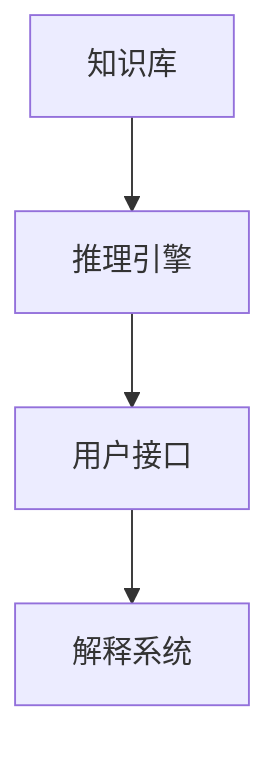

# 08.2.1-符号主义原理（1950s-1980s）

## 一、概述

符号主义原理（1950s-1980s）是 AI 发展的第一阶段，以显式逻辑规则为核心，知识表示为符号，推理为形式化推导。本文档阐述符号主义原理的核心机制、历史意义及其局限。

---

## 二、目录

- [08.2.1-符号主义原理（1950s-1980s）](#0821-符号主义原理1950s-1980s)
  - [一、概述](#一概述)
  - [二、目录](#二目录)
  - [三、核心原理](#三核心原理)
    - [3.1 智能=显式逻辑规则](#31-智能显式逻辑规则)
    - [3.2 知识=符号表示](#32-知识符号表示)
    - [3.3 推理=形式化推导](#33-推理形式化推导)
  - [四、核心机制](#四核心机制)
    - [4.1 知识库+推理引擎](#41-知识库推理引擎)
    - [4.2 人工编码规则](#42-人工编码规则)
    - [4.3 可解释性强但扩展性差](#43-可解释性强但扩展性差)
  - [五、核心局限](#五核心局限)
    - [5.1 知识获取瓶颈](#51-知识获取瓶颈)
    - [5.2 组合爆炸](#52-组合爆炸)
    - [5.3 脆弱性（无法处理不确定性）](#53-脆弱性无法处理不确定性)
  - [六、历史意义](#六历史意义)
    - [6.1 理论突破](#61-理论突破)
    - [6.2 范式确立](#62-范式确立)
  - [七、与三层模型的关系](#七与三层模型的关系)
    - [7.1 符号主义与控制层](#71-符号主义与控制层)
    - [7.2 符号主义与执行层](#72-符号主义与执行层)
  - [八、核心结论](#八核心结论)
  - [九、相关主题](#九相关主题)
  - [十、参考文档](#十参考文档)

---

## 三、核心原理

### 3.1 智能=显式逻辑规则

**核心观点**：智能来源于显式逻辑规则，通过形式化逻辑实现推理

**数学描述**：

$$
\text{智能} = \text{逻辑规则} \circ \text{知识库}
$$

**其中**：

- 逻辑规则：形式化逻辑规则（如谓词逻辑、一阶逻辑）
- 知识库：符号化知识表示
- $\circ$：推理操作

**历史意义**：确立了 AI 的基本范式，为控制层（形式语言模型）奠定基础

### 3.2 知识=符号表示

**核心观点**：知识表示为符号，通过符号操作实现推理

**知识表示方法**：

- **谓词逻辑**：用谓词表示知识
- **框架理论**：用框架（Frame）表示知识
- **规则表示**：用规则（Rule）表示知识

**数学描述**：

$$
\text{知识} = \{R_1, R_2, ..., R_n\}
$$

**其中**：

- $R_i$：第 $i$ 条规则

**历史意义**：确立了知识表示的基本范式，为控制层（形式语言模型）奠定基础

### 3.3 推理=形式化推导

**核心观点**：推理为形式化推导，通过逻辑规则从前提推导结论

**推理方法**：

- **前向推理**：从前提推导结论
- **后向推理**：从结论推导前提
- **归结推理**：通过归结实现推理

**数学描述**：

$$
\text{前提} \vdash \text{结论}
$$

**其中**：

- $\vdash$：形式化推导关系

**历史意义**：确立了推理的基本范式，为控制层（形式语言模型）奠定基础

---

## 四、核心机制

### 4.1 知识库+推理引擎

**核心架构**：知识库+推理引擎，知识表示与推理分离

**架构描述**：

**核心机制**：

- **知识库**：存储符号化知识
- **推理引擎**：基于逻辑规则进行推理
- **用户接口**：提供交互界面
- **解释系统**：解释推理过程

**历史意义**：确立了专家系统的基本架构，为控制层（形式语言模型）奠定基础

### 4.2 人工编码规则

**核心机制**：人工编码规则，知识获取成本高

**知识获取过程**：

1. **专家访谈**：与领域专家访谈
2. **知识提取**：从专家经验中提取知识
3. **规则编码**：将知识编码为规则
4. **知识验证**：验证规则的正确性

**局限**：

- **成本高**：人工编码成本高
- **效率低**：知识获取效率低
- **主观性**：依赖专家主观判断

**历史意义**：暴露了知识获取瓶颈，为后续统计学习方法奠定基础

### 4.3 可解释性强但扩展性差

**核心特征**：

- **可解释性强**：推理过程可解释，符合人类逻辑
- **扩展性差**：规则数量呈指数级增长，难以扩展

**可解释性**：

- **推理路径**：可以追踪推理路径
- **规则匹配**：可以解释规则匹配过程
- **结论推导**：可以解释结论推导过程

**扩展性差**：

- **组合爆炸**：规则数量呈指数级增长
- **维护困难**：规则维护成本高
- **更新困难**：规则更新困难

**历史意义**：暴露了符号主义的局限，为后续联结主义方法奠定基础

---

## 五、核心局限

### 5.1 知识获取瓶颈

**核心问题**：知识获取瓶颈，人工编码成本高

**问题描述**：

- **成本高**：人工编码成本高
- **效率低**：知识获取效率低
- **主观性**：依赖专家主观判断

**历史影响**：导致符号主义衰落，为统计学习方法奠定基础

### 5.2 组合爆炸

**核心问题**：组合爆炸，规则数量呈指数级增长

**问题描述**：

- **规则数量**：规则数量呈指数级增长
- **搜索空间**：搜索空间呈指数级增长
- **计算复杂度**：计算复杂度呈指数级增长

**数学描述**：

$$
|\text{规则集}| = O(2^n)
$$

**其中**：

- $n$：知识元素数量

**历史影响**：导致符号主义衰落，为统计学习方法奠定基础

### 5.3 脆弱性（无法处理不确定性）

**核心问题**：脆弱性，无法处理不确定性

**问题描述**：

- **噪声数据**：噪声数据导致逻辑链条断裂
- **不确定性**：无法处理不确定性
- **鲁棒性差**：鲁棒性差，难以处理异常情况

**历史影响**：导致符号主义衰落，为统计学习方法奠定基础

---

## 六、历史意义

### 6.1 理论突破

1. **逻辑推理**：确立了逻辑推理的基本范式
2. **知识表示**：确立了知识表示的基本范式
3. **专家系统**：确立了专家系统的基本架构

### 6.2 范式确立

1. **符号主义范式**：确立了符号主义的基本范式
2. **知识工程范式**：确立了知识工程的基本范式
3. **形式化推理范式**：确立了形式化推理的基本范式

---

## 七、与三层模型的关系

### 7.1 符号主义与控制层

**对应关系**：符号主义 → 控制层（形式语言模型）

**核心机制**：

- **知识表示**：用符号表示知识
- **推理引擎**：基于逻辑规则进行推理
- **形式约束**：通过形式约束确保输出符合规范

### 7.2 符号主义与执行层

**对应关系**：符号主义 → 执行层（图灵计算模型）

**核心机制**：

- **符号操作**：通过符号操作实现推理
- **逻辑运算**：通过逻辑运算实现推理
- **计算复杂度**：计算复杂度呈指数级增长

---

## 八、核心结论

1. **符号主义原理是 AI 发展的第一阶段**：以显式逻辑规则为核心，知识表示为符号，推理为形式化推导
2. **知识库+推理引擎架构确立**：为专家系统奠定基础，为控制层（形式语言模型）奠定基础
3. **人工编码规则暴露知识获取瓶颈**：成本高、效率低、主观性强
4. **组合爆炸和脆弱性导致符号主义衰落**：为统计学习方法奠定基础
5. **符号主义为后续发展奠定基础**：确立了逻辑推理、知识表示、形式化推理的基本范式

---

## 九、相关主题

- [08.1.1-起步发展期（1943-1960 年代）](08.1.1-起步发展期（1943-1960年代）.md)
- [08.1.2-反思发展期（1970 年代）](08.1.2-反思发展期（1970年代）.md)
- [08.1.3-应用发展期（1980 年代）](08.1.3-应用发展期（1980年代）.md)
- [08.2.2-联结主义原理（1980s-2010s）](08.2.2-联结主义原理（1980s-2010s）.md)
- [01.2.1-形式文法与 λ 演算](../01-AI三层模型架构/01.2.1-形式文法与λ演算.md)：符号主义在控制层的应用

---

## 十、参考文档

- [AI 历史进程、原理与机制全面梳理](../../ai_internal_view.md)
- [工程实践核心逻辑下的 AI 三层模型全景解构](../../view/ai_engineer_view.md)
- [分层解构视角](../../view/ai_models_view.md)

---

**最后更新**：2025-11-10
