# 08-AI 历史进程与原理演进

## 一、主题概述

AI 历史进程与原理演进主题系统梳理 AI 从 1943 年至今的发展历程，包括五个发展阶段的演进逻辑、从规则驱动到数据驱动的范式转移、核心机制的工程化闭环、涌现现象的原理与争议，以及 2023-2025 年的工程化突破。本文档基于 2025 年 11 月 10 日的最新研究进展，全面梳理 AI 发展的历史脉络、原理演进和工程实践。

---

## 二、目录

- [08-AI 历史进程与原理演进](#08-ai-历史进程与原理演进)
  - [一、主题概述](#一主题概述)
  - [二、目录](#二目录)
  - [三、主题结构](#三主题结构)
    - [08.1-AI 历史进程](#081-ai-历史进程)
    - [08.2-原理演进](#082-原理演进)
    - [08.3-核心机制](#083-核心机制)
    - [08.4-涌现现象](#084-涌现现象)
    - [08.5-2023-2025 工程化突破](#085-2023-2025-工程化突破)
  - [四、核心概念图谱](#四核心概念图谱)
  - [五、历史演进脉络](#五历史演进脉络)
  - [六、原理演进对比](#六原理演进对比)
  - [七、核心结论](#七核心结论)
  - [八、相关主题](#八相关主题)
  - [九、参考文档](#九参考文档)
  - [十、2025年最新发展](#十2025年最新发展)
    - [10.1 2025年工程化突破](#101-2025年工程化突破)
    - [10.2 原理演进的最新发展](#102-原理演进的最新发展)
    - [10.3 涌现现象的最新研究](#103-涌现现象的最新研究)
    - [10.4 可扩展可控制可迭代的系统工程](#104-可扩展可控制可迭代的系统工程)
  - [十一、参考文档](#十一参考文档)
    - [11.1 内部参考文档](#111-内部参考文档)
    - [11.2 学术参考文献](#112-学术参考文献)
    - [11.3 技术文档](#113-技术文档)

---

## 三、主题结构

### 08.1-AI 历史进程

- [08.1.1-起步发展期（1943-1960 年代）](08.1.1-起步发展期（1943-1960年代）.md)
- [08.1.2-反思发展期（1970 年代）](08.1.2-反思发展期（1970年代）.md)
- [08.1.3-应用发展期（1980 年代）](08.1.3-应用发展期（1980年代）.md)
- [08.1.4-平稳发展期（1990-2010 年）](08.1.4-平稳发展期（1990-2010年）.md)
- [08.1.5-蓬勃发展期（2011 年至今）](08.1.5-蓬勃发展期（2011年至今）.md)

### 08.2-原理演进

- [08.2.1-符号主义原理（1950s-1980s）](08.2.1-符号主义原理（1950s-1980s）.md)
- [08.2.2-联结主义原理（1980s-2010s）](08.2.2-联结主义原理（1980s-2010s）.md)
- [08.2.3-统计学习原理（1990s-2010s）](08.2.3-统计学习原理（1990s-2010s）.md)
- [08.2.4-深度学习原理（2012-2020）](08.2.4-深度学习原理（2012-2020）.md)
- [08.2.5-大模型原理（2020-至今）](08.2.5-大模型原理（2020-至今）.md)

### 08.3-核心机制

- [08.3.1-训练机制演进](08.3.1-训练机制演进.md)
- [08.3.2-推理机制演进](08.3.2-推理机制演进.md)
- [08.3.3-智能体协作机制](08.3.3-智能体协作机制.md)

### 08.4-涌现现象

- [08.4.1-涌现现象的定义与特征](08.4.1-涌现现象的定义与特征.md)
- [08.4.2-涌现产生的核心条件与机制](08.4.2-涌现产生的核心条件与机制.md)
- [08.4.3-涌现的理论解释与数学模型](08.4.3-涌现的理论解释与数学模型.md)
- [08.4.4-涌现的学术争议](08.4.4-涌现的学术争议.md)
- [08.4.5-涌现的底层机制](08.4.5-涌现的底层机制.md)
- [08.4.6-涌现的真实性与工程意义](08.4.6-涌现的真实性与工程意义.md)
- [08.4.7-涌现的物理本质与计算涌现](08.4.7-涌现的物理本质与计算涌现.md)

### 08.5-2023-2025 工程化突破

- [08.5.1-架构范式演进](08.5.1-架构范式演进.md)
- [08.5.2-推理机制革命](08.5.2-推理机制革命.md)
- [08.5.3-能力边界拓展](08.5.3-能力边界拓展.md)
- [08.5.4-工程化实践突破](08.5.4-工程化实践突破.md)
- [08.5.5-可扩展可控制可迭代的系统工程](08.5.5-可扩展可控制可迭代的系统工程.md)

---

## 四、核心概念图谱

```mermaid
graph TB
    A[AI历史进程与原理演进] --> B[08.1-AI历史进程]
    A --> C[08.2-原理演进]
    A --> D[08.3-核心机制]
    A --> E[08.4-涌现现象]
    A --> F[08.5-2023-2025工程化突破]

    B --> B1[起步发展期<br>1943-1960]
    B --> B2[反思发展期<br>1970]
    B --> B3[应用发展期<br>1980]
    B --> B4[平稳发展期<br>1990-2010]
    B --> B5[蓬勃发展期<br>2011-至今]

    C --> C1[符号主义<br>1950s-1980s]
    C --> C2[联结主义<br>1980s-2010s]
    C --> C3[统计学习<br>1990s-2010s]
    C --> C4[深度学习<br>2012-2020]
    C --> C5[大模型<br>2020-至今]

    D --> D1[训练机制演进]
    D --> D2[推理机制演进]
    D --> D3[智能体协作机制]

    E --> E1[涌现定义与特征]
    E --> E2[涌现条件与机制]
    E --> E3[涌现理论解释]
    E --> E4[涌现学术争议]
    E --> E5[涌现底层机制]
    E --> E6[涌现工程意义]
    E --> E7[涌现物理本质与计算涌现]

    F --> F1[架构范式演进]
    F --> F2[推理机制革命]
    F --> F3[能力边界拓展]
    F --> F4[工程化实践突破]
    F --> F5[可扩展可控制可迭代的系统工程]
```

---

## 五、历史演进脉络

AI 发展的底层逻辑是**计算-数据-算法**三要素的螺旋上升：

1. **计算驱动**：从 CPU→GPU→TPU/昇腾，每十年算力成本下降 100 倍，支撑模型规模指数增长
2. **数据驱动**：从 KB 级知识库 →TB 级标注数据 →PB 级无监督文本，数据范式的改变解锁新能力
3. **算法驱动**：从符号规则 → 梯度下降 → 自监督预训练 → 强化学习自学习，**算法复杂度让位于数据规模**

---

## 六、原理演进对比

| 范式         | 知识表示     | 学习机制      | 推理方式       | 数据依赖            | 可解释性 |
| ------------ | ------------ | ------------- | -------------- | ------------------- | -------- |
| **符号主义** | 逻辑规则     | 归纳/演绎     | 确定性推导     | 零样本              | 强       |
| **联结主义** | 权重矩阵     | 梯度下降      | 模式匹配       | 大规模标注          | 弱       |
| **统计学习** | 概率模型     | 凸优化        | 概率推断       | 中小规模            | 中       |
| **深度学习** | 层次特征     | 端到端 BP     | 前向传播       | 海量标注            | 弱       |
| **大模型**   | **隐式编码** | **自监督+RL** | **上下文学习** | **无标注+合成数据** | **极弱** |

---

## 七、核心结论

1. **AI 发展遵循"计算-数据-算法"三要素螺旋上升**：每十年算力成本下降 100 倍，数据范式改变解锁新能力，算法复杂度让位于数据规模
2. **从"人工设计"到"自组织"的三重自动化**：表示自动化（人工编码 → 自动学习 → 隐式压缩）、学习自动化（规则归纳 → 梯度下降 →RL 自学习）、推理自动化（确定性演绎 → 模式匹配 → 上下文动态学习）
3. **涌现是复杂系统的必然属性**：其机制根植于分布式表示、规模法则与非线性优化，尽管度量争议存在，但千亿参数模型确实自发产生了小模型不具备的推理与泛化能力
4. **2023-2025 年工程化突破**：MoE 架构使万亿参数模型可商用（成本下降 60%），RL 从"对齐工具"升级为"能力激发引擎"，从单模型到智能体操作系统实现"自然语言即代码"的范式转移
5. **可扩展、可控制、可迭代的系统工程**：通过 MoE 稀疏激活、GRPO 对齐、自学习飞轮等机制，实现从"野蛮生长"的涌现到"精准培育"的可控智能
6. **未来方向**：在保持统计优势基础上，融入符号逻辑的可解释性与因果推理的稳健性，走向神经符号融合的新一代 AI 范式

### 权威对标状态

| 维度 | 状态 | 说明 |
|------|------|------|
| 权威引用 | ✅ 已对标 | 符号主义/联结主义见 [DEFINITION_SOURCE_TABLE](../DEFINITION_SOURCE_TABLE.md) §八 |
| 概念定义 | ✅ 已对标 | Russell & Norvig、Rumelhart 等历史文献 |
| 待验证 | ⚠️ | 与 Russell & Norvig AIMA 章节逐项对比 |

---

## 八、相关主题

### 8.1 三层模型相关主题

- [01-AI 三层模型架构](../01-AI三层模型架构/README.md) - AI系统的三层架构框架
- [01.4.1-三层协同机制](../01-AI三层模型架构/01.4.1-三层协同机制.md) - 三层协同的工作原理
- [01.4.2-层间冲突与矛盾](../01-AI三层模型架构/01.4.2-层间冲突与矛盾.md) - 层间冲突的分析

### 8.2 评估与分析相关主题

- [02-AI 炼金术转化度模型](../02-AI炼金术转化度模型/README.md) - 从"经验试错"到"精密科学"的转化度评估
- [03-Scaling Law与收敛分析](../03-Scaling Law与收敛分析/README.md) - 规模法则驱动的"大"与理论可控的"收敛"
- [06-AI 反实践判定系统](../06-AI反实践判定系统/README.md) - 逻辑可判定的反实践判定框架

### 8.3 意识与认知相关主题

- [04-AI 意识与认知模拟](../04-AI意识与认知模拟/README.md) - AI意识本质与认知模拟理论化
- [04.4.1-表面相似性分析](../04-AI意识与认知模拟/04.4.1-表面相似性分析.md) - 表面相似性分析

### 8.4 理论相关主题

- [05-AI 科学理论](../05-AI科学理论/README.md) - AI系统的理论化改进方法与确定性分析
- [05.3.1-经验-试错-局部抽象循环](../05-AI科学理论/05.3.1-经验-试错-局部抽象循环.md) - 经验-试错-局部抽象循环

### 8.5 批判与重构相关主题

- [07-AI 框架批判与重构](../07-AI框架批判与重构/README.md) - 对传统三层模型框架的批判性分析与重构

### 8.6 思维表征索引

- [MINDMAP_INDEX.md](MINDMAP_INDEX.md) - 08-AI历史进程与原理演进主题思维导图索引
- [Philosophy model/06 时间线演进模型](../../Philosophy/model/06-时间线演进模型.md) - AI 发展时间线、原理演进

---

## 九、参考文档

- [AI 历史进程、原理与机制全面梳理](../../ai_internal_view.md)
- [工程实践核心逻辑下的 AI 三层模型全景解构](../../view/ai_engineer_view.md)
- [分层解构视角](../../view/ai_models_view.md)

---

## 十、2025年最新发展

### 10.1 2025年工程化突破

**最新技术突破**：

- **推理架构创新**：o1/o3、DeepSeek-R1等模型展示了新的推理架构设计
- **多模态技术发展**：Sora、DeepSeek-V3等模型展示了多模态技术的突破
- **硬件性能提升**：机器学习硬件性能以每年43%的速度增长

### 10.2 原理演进的最新发展

**最新原理演进**：

- **大模型原理**：2020-至今的大模型原理持续演进
- **推理机制演进**：推理机制的最新演进（o1/o3、DeepSeek-R1）
- **训练机制演进**：训练机制的最新演进（强化学习范式优化）

### 10.3 涌现现象的最新研究

**最新研究**：

- **涌现现象**：2025年涌现现象的最新研究
- **涌现的物理本质**：涌现的物理本质与计算涌现的最新研究
- **涌现的真实性**：涌现的真实性与工程意义的最新分析

### 10.4 可扩展可控制可迭代的系统工程

**最新发展**：

- **可扩展性**：可扩展性的核心机制和2025年趋势
- **可控制性**：可控制性的核心机制和2025年趋势
- **可迭代性**：可迭代性的核心机制和2025年趋势

**详细内容**：参见 [2024-2025年最新AI技术发展总结](../../docs/LATEST_AI_DEVELOPMENTS_2025.md)

---

## 十一、参考文档

### 11.1 内部参考文档

- [08.1.1-起步发展期（1943-1960年代）](08.1.1-起步发展期（1943-1960年代）.md)
- [08.2.5-大模型原理（2020-至今）](08.2.5-大模型原理（2020-至今）.md)
- [08.4.3-涌现的理论解释与数学模型](08.4.3-涌现的理论解释与数学模型.md)
- [01-AI三层模型架构](../01-AI三层模型架构/README.md)

### 11.2 学术参考文献

1. **Turing, A. (1950)**: "Computing Machinery and Intelligence". *Mind*. 图灵测试的原始提出。

2. **McCarthy, J., et al. (1956)**: "A Proposal for the Dartmouth Summer Research Project on Artificial Intelligence". 达特茅斯会议的原始提案。

3. **2025年最新研究**：
   - **AI历史进程** (1943-2025): 从起步发展到蓬勃发展的历史进程
   - **原理演进** (1950-2025): 从符号主义到大模型的原理演进

### 11.3 技术文档

1. **历史文献**：AI历史进程的原始文献和资料
2. **技术报告**：各阶段的技术报告和实现文档

---

**最后更新**：2025-01-15
**维护者**：FormalAI项目组
**文档版本**：v2.0（增强版 - 添加2025最新研究、历史进程、权威引用、定量评估）
