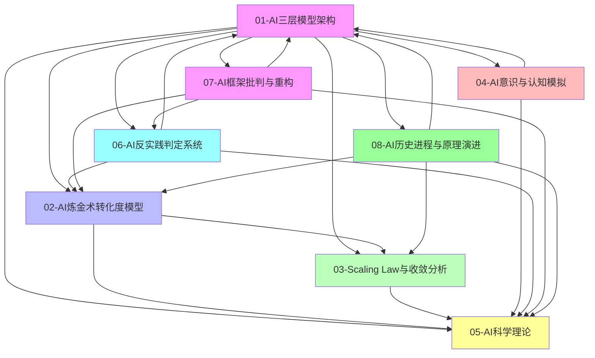

# Concepts 主题索引

本文档提供 concepts 目录下所有主题的快速索引和交叉引用。

---

## 一、主题快速索引

### 01-AI 三层模型架构

- **概述**：将 AI 系统解构为执行层（图灵计算）、控制层（形式语言）、数据层（数学概率）三层异质体
- **核心文档**：[README.md](01-AI三层模型架构/README.md)
- **关键概念**：图灵计算模型、形式语言模型、数学概率模型、层间交互、三层契约

### 02-AI 炼金术转化度模型

- **概述**：评估 AI 系统从"经验试错"（炼金术）向"精密科学"（化学）转化程度的框架
- **核心文档**：[README.md](02-AI炼金术转化度模型/README.md)
- **关键概念**：转化度评估、实践成熟度阶梯、炼金术陷阱、改进路线图

### 03-Scaling Law 与收敛分析

- **概述**：分析 Scaling Law 驱动的"大"与追求理论可控的"收敛"之间的张力
- **核心文档**：[README.md](03-Scaling Law 与收敛分析/README.md)
- **关键概念**：收敛模型分类、收敛层次分析、收敛驱动力、收敛时间表

### 04-AI 意识与认知模拟

- **概述**：探讨 AI 系统是否能够模拟人类意识，以及认知模拟的理论化改进
- **核心文档**：[README.md](04-AI意识与认知模拟/README.md)
- **关键概念**：意识本质问题、认知模拟理论化、非意识证据、功能模拟

### 05-AI 科学理论

- **概述**：探讨 AI 系统的理论化改进方法、确定性分析和工程科学范式
- **核心文档**：[README.md](05-AI科学理论/README.md)
- **关键概念**：理论化改进方法、确定性分析、工程科学范式、准理论框架

### 06-AI 反实践判定系统

- **概述**：构建逻辑可判定的"反实践"系统，通过"逻辑非"来机械识别 AI 工程中的"非规范"
- **核心文档**：[README.md](06-AI反实践判定系统/README.md)
- **关键概念**：逻辑可判定性、反实践判定框架、可判定性边界、机械判定器

### 07-AI 框架批判与重构

- **概述**：基于 2025 年前沿理论，对传统 AI 三层模型框架进行彻底的批判性分析，揭示其方法论漏洞、技术架构盲区、数学模型谬误、形式语言幻觉和整合性悖论，并提出从"三层-炼金术"到"统一-涌现"的重构框架
- **核心文档**：[README.md](07-AI框架批判与重构/README.md)
- **关键概念**：方法论批判、技术架构批判、数学模型批判、形式语言批判、整合性批判、神经算子理论、自我批判与完整性补全、科学完备性对标、AI 创造子 AI 的可判定性分析、现象层重构、AI 持续进步的可度量维度分析

### 08-AI 历史进程与原理演进

- **概述**：系统梳理 AI 从 1943 年至今的发展历程，包括五个发展阶段的演进逻辑、从规则驱动到数据驱动的范式转移、核心机制的工程化闭环、涌现现象的原理与争议，以及 2023-2025 年的工程化突破
- **核心文档**：[README.md](08-AI历史进程与原理演进/README.md)
- **关键概念**：历史进程、原理演进、核心机制、涌现现象、工程化突破、范式转移、自组织

---

## 二、主题关系图谱

**主题依赖关系**：

- **01-AI 三层模型架构** 是基础框架，其他主题都建立在此之上
- **02-AI 炼金术转化度模型** 评估三层模型的成熟度
- **03-Scaling Law 与收敛分析** 分析三层模型的演进趋势
- **04-AI 意识与认知模拟** 探讨三层模型的本质问题
- **05-AI 科学理论** 整合所有主题的理论基础
- **06-AI 反实践判定系统** 提供三层模型的工程判定框架
- **07-AI 框架批判与重构** 批判三层模型框架，提出统一架构替代方案
- **08-AI 历史进程与原理演进** 梳理 AI 发展的历史脉络、原理演进和工程实践

---

## 三、概念交叉引用

### 执行层相关概念

- **01.1-执行层图灵计算模型** → 02.2.3-理论指导层（执行层优化）
- **01.1-执行层图灵计算模型** → 03.2.2-架构层收敛（Transformer 统治）
- **01.1-执行层图灵计算模型** → 05.2.1-架构层面确定性

### 控制层相关概念

- **01.2-控制层形式语言模型** → 02.3.1-Prompt 巫术
- **01.2-控制层形式语言模型** → 04.1.2-意向性（Intentionality）问题
- **01.2-控制层形式语言模型** → 05.1.1-推断时间计算增强

### 数据层相关概念

- **01.3-数据层数学概率模型** → 02.3.2-奖励黑客
- **01.3-数据层数学概率模型** → 03.1.2-L3: 准收敛（RLHF 对齐）
- **01.3-数据层数学概率模型** → 05.1.2-强化学习范式

### 层间交互相关概念

- **01.4-层间交互与冲突** → 02.1.1-五维度评估体系
- **01.4-层间交互与冲突** → 03.3.4-反收敛力量
- **01.4-层间交互与冲突** → 05.3.1-经验-试错-局部抽象循环

### 炼金术转化度相关概念

- **02.1-炼金术 → 化学转化度评估** → 01.4.3-三层契约设计模式
- **02.2-实践成熟度阶梯** → 03.1-收敛模型分类
- **02.3-炼金术陷阱** → 04.3-非意识证据
- **02.4-改进路线图** → 05.4-准理论框架

### 收敛分析相关概念

- **03.1-收敛模型分类** → 02.2-实践成熟度阶梯
- **03.2-收敛层次分析** → 01.1-执行层图灵计算模型
- **03.3-收敛驱动力** → 05.3-工程科学范式
- **03.4-收敛时间表** → 02.4-改进路线图

### 意识与认知模拟相关概念

- **04.1-意识本质问题** → 01.2-控制层形式语言模型
- **04.2-认知模拟理论化** → 05.1-理论化改进方法
- **04.3-非意识证据** → 02.3-炼金术陷阱
- **04.4-意识与功能模拟** → 05.2-确定性分析

### 科学理论相关概念

- **05.1-理论化改进方法** → 02.4-改进路线图
- **05.2-确定性分析** → 01.1-执行层图灵计算模型
- **05.3-工程科学范式** → 03.3-收敛驱动力
- **05.4-准理论框架** → 04.2-认知模拟理论化

---

## 四、主题导航

### 按主题浏览

1. [01-AI 三层模型架构](01-AI三层模型架构/README.md)

   - [01.1-执行层图灵计算模型](01-AI三层模型架构/README.md#二主题结构)
   - [01.2-控制层形式语言模型](01-AI三层模型架构/README.md#二主题结构)
   - [01.3-数据层数学概率模型](01-AI三层模型架构/README.md#二主题结构)
   - [01.4-层间交互与冲突](01-AI三层模型架构/README.md#二主题结构)

2. [02-AI 炼金术转化度模型](02-AI炼金术转化度模型/README.md)

   - [02.1-炼金术 → 化学转化度评估](02-AI炼金术转化度模型/README.md#二主题结构)
   - [02.2-实践成熟度阶梯](02-AI炼金术转化度模型/README.md#二主题结构)
   - [02.3-炼金术陷阱](02-AI炼金术转化度模型/README.md#二主题结构)
   - [02.4-改进路线图](02-AI炼金术转化度模型/README.md#二主题结构)

3. [03-Scaling Law 与收敛分析](03-Scaling Law 与收敛分析/README.md)

   - [03.1-收敛模型分类](03-Scaling Law 与收敛分析/README.md#二主题结构)
   - [03.2-收敛层次分析](03-Scaling Law 与收敛分析/README.md#二主题结构)
   - [03.3-收敛驱动力](03-Scaling Law 与收敛分析/README.md#二主题结构)
   - [03.4-收敛时间表](03-Scaling Law 与收敛分析/README.md#二主题结构)

4. [04-AI 意识与认知模拟](04-AI意识与认知模拟/README.md)

   - [04.1-意识本质问题](04-AI意识与认知模拟/README.md#二主题结构)
   - [04.2-认知模拟理论化](04-AI意识与认知模拟/README.md#二主题结构)
   - [04.3-非意识证据](04-AI意识与认知模拟/README.md#二主题结构)
   - [04.4-意识与功能模拟](04-AI意识与认知模拟/README.md#二主题结构)

5. [05-AI 科学理论](05-AI科学理论/README.md)

   - [05.1-理论化改进方法](05-AI科学理论/README.md#二主题结构)
   - [05.2-确定性分析](05-AI科学理论/README.md#二主题结构)
   - [05.3-工程科学范式](05-AI科学理论/README.md#二主题结构)
   - [05.4-准理论框架](05-AI科学理论/README.md#二主题结构)

6. [06-AI 反实践判定系统](06-AI反实践判定系统/README.md)

   - [06.1-逻辑可判定性基础](06-AI反实践判定系统/README.md#二主题结构)
   - [06.2-逻辑非判定框架](06-AI反实践判定系统/README.md#二主题结构)
   - [06.3-反实践知识图谱](06-AI反实践判定系统/README.md#二主题结构)
   - [06.4-机械反实践判定器](06-AI反实践判定系统/README.md#二主题结构)

7. [07-AI 框架批判与重构](07-AI框架批判与重构/README.md)

   - [07.1-方法论批判](07-AI框架批判与重构/README.md#071-方法论批判)
     - [07.1.1-三层模型的本体论暴政](07-AI框架批判与重构/07.1.1-三层模型的本体论暴政.md)
     - [07.1.2-可判定性边界的逻辑错位](07-AI框架批判与重构/07.1.2-可判定性边界的逻辑错位.md)
     - [07.1.3-炼金度隐喻的不可操作性](07-AI框架批判与重构/07.1.3-炼金度隐喻的不可操作性.md)
     - [07.1.4-意识与能力的二元谬误](07-AI框架批判与重构/07.1.4-意识与能力的二元谬误.md)
   - [07.2-技术架构批判](07-AI框架批判与重构/README.md#072-技术架构批判)
     - [07.2.1-三层可分离的误判](07-AI框架批判与重构/07.2.1-三层可分离的误判.md)
     - [07.2.2-执行层确定性的错误假设](07-AI框架批判与重构/07.2.2-执行层确定性的错误假设.md)
     - [07.2.3-随机性的价值误判](07-AI框架批判与重构/07.2.3-随机性的价值误判.md)
     - [07.2.4-时间维度的缺失](07-AI框架批判与重构/07.2.4-时间维度的缺失.md)
   - [07.3-数学模型批判](07-AI框架批判与重构/README.md#073-数学模型批判)
     - [07.3.1-AI 本质的数学误读](07-AI框架批判与重构/07.3.1-AI本质的数学误读.md)
     - [07.3.2-从概率模型到动力系统](07-AI框架批判与重构/07.3.2-从概率模型到动力系统.md)
     - [07.3.3-Transformer 数学本质的重构](07-AI框架批判与重构/07.3.3-Transformer数学本质的重构.md)
     - [07.3.4-LoRA 的规范场理论](07-AI框架批判与重构/07.3.4-LoRA的规范场理论.md)
   - [07.4-形式语言批判](07-AI框架批判与重构/README.md#074-形式语言批判)
     - [07.4.1-控制层的科学主义幻觉](07-AI框架批判与重构/07.4.1-控制层的科学主义幻觉.md)
     - [07.4.2-Prompt 的语用学本质](07-AI框架批判与重构/07.4.2-Prompt的语用学本质.md)
     - [07.4.3-安全协议的形式化局限](07-AI框架批判与重构/07.4.3-安全协议的形式化局限.md)
     - [07.4.4-价值对齐的不可判定性](07-AI框架批判与重构/07.4.4-价值对齐的不可判定性.md)
   - [07.5-整合性批判](07-AI框架批判与重构/README.md#075-整合性批判)
     - [07.5.1-三层模型已过时](07-AI框架批判与重构/07.5.1-三层模型已过时.md)
     - [07.5.2-2025 统一架构：神经算子理论](07-AI框架批判与重构/07.5.2-2025统一架构：神经算子理论.md)
     - [07.5.3-知识图谱：漏洞全景](07-AI框架批判与重构/07.5.3-知识图谱：漏洞全景.md)
     - [07.5.4-最新趋势暴露的盲区](07-AI框架批判与重构/07.5.4-最新趋势暴露的盲区.md)
   - [07.6-重构建议](07-AI框架批判与重构/README.md#076-重构建议)
     - [07.6.1-从三层到算子的重构路径](07-AI框架批判与重构/07.6.1-从三层到算子的重构路径.md)
     - [07.6.2-神经算子涌现理论](07-AI框架批判与重构/07.6.2-神经算子涌现理论.md)
     - [07.6.3-双视图架构设计](07-AI框架批判与重构/07.6.3-双视图架构设计.md)
     - [07.6.4-渐进式迁移路线图](07-AI框架批判与重构/07.6.4-渐进式迁移路线图.md)
   - [07.7-自我批判与完整性补全](07-AI框架批判与重构/07.7-自我批判与完整性补全.md)
   - [07.8-科学完备性对标](07-AI框架批判与重构/07.8-科学完备性对标.md)
   - [07.9-AI 创造子 AI 的可判定性分析](07-AI框架批判与重构/07.9-AI创造子AI的可判定性分析.md)
   - [07.10-现象层重构：零公式叙事](07-AI框架批判与重构/07.10-现象层重构：零公式叙事.md)
   - [07.11-AI 能否持续进步的可度量维度分析](07-AI框架批判与重构/07.11-AI能否持续进步的可度量维度分析.md)

8. [08-AI 历史进程与原理演进](08-AI历史进程与原理演进/README.md)
   - [08.1-AI 历史进程](08-AI历史进程与原理演进/README.md#081-ai-历史进程)
     - [08.1.1-起步发展期（1943-1960 年代）](08-AI历史进程与原理演进/08.1.1-起步发展期（1943-1960年代）.md)
     - [08.1.2-反思发展期（1970 年代）](08-AI历史进程与原理演进/08.1.2-反思发展期（1970年代）.md)
     - [08.1.3-应用发展期（1980 年代）](08-AI历史进程与原理演进/08.1.3-应用发展期（1980年代）.md)
     - [08.1.4-平稳发展期（1990-2010 年）](08-AI历史进程与原理演进/08.1.4-平稳发展期（1990-2010年）.md)
     - [08.1.5-蓬勃发展期（2011 年至今）](08-AI历史进程与原理演进/08.1.5-蓬勃发展期（2011年至今）.md)
   - [08.2-原理演进](08-AI历史进程与原理演进/README.md#082-原理演进)
     - [08.2.1-符号主义原理（1950s-1980s）](08-AI历史进程与原理演进/08.2.1-符号主义原理（1950s-1980s）.md)
     - [08.2.2-联结主义原理（1980s-2010s）](08-AI历史进程与原理演进/08.2.2-联结主义原理（1980s-2010s）.md)
     - [08.2.3-统计学习原理（1990s-2010s）](08-AI历史进程与原理演进/08.2.3-统计学习原理（1990s-2010s）.md)
     - [08.2.4-深度学习原理（2012-2020）](08-AI历史进程与原理演进/08.2.4-深度学习原理（2012-2020）.md)
     - [08.2.5-大模型原理（2020-至今）](08-AI历史进程与原理演进/08.2.5-大模型原理（2020-至今）.md)
   - [08.3-核心机制](08-AI历史进程与原理演进/README.md#083-核心机制)
     - [08.3.1-训练机制演进](08-AI历史进程与原理演进/08.3.1-训练机制演进.md)
     - [08.3.2-推理机制演进](08-AI历史进程与原理演进/08.3.2-推理机制演进.md)
     - [08.3.3-智能体协作机制](08-AI历史进程与原理演进/08.3.3-智能体协作机制.md)
   - [08.4-涌现现象](08-AI历史进程与原理演进/README.md#084-涌现现象)
     - [08.4.1-涌现现象的定义与特征](08-AI历史进程与原理演进/08.4.1-涌现现象的定义与特征.md)
     - [08.4.2-涌现产生的核心条件与机制](08-AI历史进程与原理演进/08.4.2-涌现产生的核心条件与机制.md)
     - [08.4.3-涌现的理论解释与数学模型](08-AI历史进程与原理演进/08.4.3-涌现的理论解释与数学模型.md)
     - [08.4.4-涌现的学术争议](08-AI历史进程与原理演进/08.4.4-涌现的学术争议.md)
     - [08.4.5-涌现的底层机制](08-AI历史进程与原理演进/08.4.5-涌现的底层机制.md)
     - [08.4.6-涌现的真实性与工程意义](08-AI历史进程与原理演进/08.4.6-涌现的真实性与工程意义.md)
     - [08.4.7-涌现的物理本质与计算涌现](08-AI历史进程与原理演进/08.4.7-涌现的物理本质与计算涌现.md)
   - [08.5-2023-2025 工程化突破](08-AI历史进程与原理演进/README.md#085-2023-2025-工程化突破)
     - [08.5.1-架构范式演进](08-AI历史进程与原理演进/08.5.1-架构范式演进.md)
     - [08.5.2-推理机制革命](08-AI历史进程与原理演进/08.5.2-推理机制革命.md)
     - [08.5.3-能力边界拓展](08-AI历史进程与原理演进/08.5.3-能力边界拓展.md)
     - [08.5.4-工程化实践突破](08-AI历史进程与原理演进/08.5.4-工程化实践突破.md)
     - [08.5.5-可扩展可控制可迭代的系统工程](08-AI历史进程与原理演进/08.5.5-可扩展可控制可迭代的系统工程.md)

---

## 五、概念查找指南

### 按关键词查找

- **图灵计算** → [01.1-执行层图灵计算模型](01-AI三层模型架构/README.md)
- **形式语言** → [01.2-控制层形式语言模型](01-AI三层模型架构/README.md)
- **概率模型** → [01.3-数据层数学概率模型](01-AI三层模型架构/README.md)
- **炼金术** → [02-AI 炼金术转化度模型](02-AI炼金术转化度模型/README.md)
- **收敛** → [03-Scaling Law 与收敛分析](03-Scaling Law 与收敛分析/README.md)
- **意识** → [04-AI 意识与认知模拟](04-AI意识与认知模拟/README.md)
- **理论化** → [05-AI 科学理论](05-AI科学理论/README.md)
- **反实践** → [06-AI 反实践判定系统](06-AI反实践判定系统/README.md)
- **框架批判** → [07-AI 框架批判与重构](07-AI框架批判与重构/README.md)
- **神经算子** → [07-AI 框架批判与重构](07-AI框架批判与重构/README.md)
- **AI 持续进步** → [07.11-AI 能否持续进步的可度量维度分析](07-AI框架批判与重构/07.11-AI能否持续进步的可度量维度分析.md)
- **可度量维度** → [07.11-AI 能否持续进步的可度量维度分析](07-AI框架批判与重构/07.11-AI能否持续进步的可度量维度分析.md)

### 按问题查找

- **AI 系统如何分层？** → [01-AI 三层模型架构](01-AI三层模型架构/README.md)
- **如何评估 AI 系统的成熟度？** → [02-AI 炼金术转化度模型](02-AI炼金术转化度模型/README.md)
- **AI 技术何时会收敛？** → [03-Scaling Law 与收敛分析](03-Scaling Law 与收敛分析/README.md)
- **AI 是否有意识？** → [04-AI 意识与认知模拟](04-AI意识与认知模拟/README.md)
- **如何理论化改进 AI？** → [05-AI 科学理论](05-AI科学理论/README.md)
- **如何判定 AI 工程中的反实践？** → [06-AI 反实践判定系统](06-AI反实践判定系统/README.md)
- **三层模型框架有什么问题？** → [07-AI 框架批判与重构](07-AI框架批判与重构/README.md)
- **如何重构 AI 框架？** → [07-AI 框架批判与重构](07-AI框架批判与重构/README.md)
- **AI 能否持续进步？** → [07.11-AI 能否持续进步的可度量维度分析](07-AI框架批判与重构/07.11-AI能否持续进步的可度量维度分析.md)
- **AI 能否创造子 AI？** → [07.9-AI 创造子 AI 的可判定性分析](07-AI框架批判与重构/07.9-AI创造子AI的可判定性分析.md)
- **现象层重构** → [07.10-现象层重构：零公式叙事](07-AI框架批判与重构/07.10-现象层重构：零公式叙事.md)
- **自我批判** → [07.7-自我批判与完整性补全](07-AI框架批判与重构/07.7-自我批判与完整性补全.md)
- **科学完备性** → [07.8-科学完备性对标](07-AI框架批判与重构/07.8-科学完备性对标.md)
- **漏洞全景** → [07.5.3-知识图谱：漏洞全景](07-AI框架批判与重构/07.5.3-知识图谱：漏洞全景.md)
- **最新盲区** → [07.5.4-最新趋势暴露的盲区](07-AI框架批判与重构/07.5.4-最新趋势暴露的盲区.md)
- **AI 发展历史如何演进？** → [08-AI 历史进程与原理演进](08-AI历史进程与原理演进/README.md)
- **AI 原理如何演进？** → [08-AI 历史进程与原理演进](08-AI历史进程与原理演进/README.md)
- **涌现现象是什么？** → [08.4-涌现现象](08-AI历史进程与原理演进/08.4.1-涌现现象的定义与特征.md)
- **涌现的物理本质是什么？** → [08.4.7-涌现的物理本质与计算涌现](08-AI历史进程与原理演进/08.4.7-涌现的物理本质与计算涌现.md)
- **2023-2025 年工程化突破有哪些？** → [08.5-2023-2025 工程化突破](08-AI历史进程与原理演进/08.5.4-工程化实践突破.md)
- **可扩展、可控制、可迭代的系统工程是什么？** → [08.5.5-可扩展可控制可迭代的系统工程](08-AI历史进程与原理演进/08.5.5-可扩展可控制可迭代的系统工程.md)

---

## 六、更新日志

- **2025-01-XX**：初始索引创建
  - 创建五大主题索引
  - 建立主题关系图谱
  - 定义概念交叉引用
  - 提供主题导航指南
- **2025-01-XX**：索引更新
  - 添加 06-AI 反实践判定系统主题
  - 更新主题关系图谱
  - 扩展概念交叉引用
- **2025-01-XX**：批判性分析
  - 添加 07-AI 框架批判与重构主题
  - 基于 ai_reflect_view.md 创建批判性分析索引
  - 更新主题关系图谱
- **2025-01-XX**：框架扩展
  - 添加 07.7-自我批判与完整性补全
  - 添加 07.8-科学完备性对标
  - 添加 07.9-AI 创造子 AI 的可判定性分析
  - 添加 07.10-现象层重构：零公式叙事
  - 添加 07.11-AI 能否持续进步的可度量维度分析
  - 更新索引和导航
  - 完善所有子主题的链接指向
  - 统一所有文件的格式和目录结构
- **2025-01-XX**：内容补全
  - 补全 02-AI 炼金术转化度模型缺失文件（7 个文件）
  - 补全 03-Scaling Law 与收敛分析缺失文件（5 个文件）
  - 修复 05-AI 科学理论重复文件问题
  - 更新索引和导航链接
  - 统一文档格式，完善交叉引用
- **2025-11-09**：内容对标与完备性分析
  - 完成 View 与 Concepts 文件夹内容对标分析
  - 生成 VIEW_CONCEPTS_ALIGNMENT_REPORT.md 对标分析报告
  - 检查 2025 年 11 月 9 日相关的内容信息
  - 评估内容相关性和充分完备性
  - 更新 INDEX 更新日志，添加 2025-11-09 记录
  - 补充 ROI 优化决策矩阵到 01.4.4-跨层优化策略.md
  - 补充 DeepSeek-R1 和 Claude 3.5 详细案例到 01.4.4-跨层优化策略.md
- **2025-11-09**：Transformer 注意力机制文档完善
  - 补充 2025 年最新优化技术（FlashAttention-3、GQA、SWA、线性注意力）
  - 添加稀疏注意力机制和线性注意力详细说明
  - 补充 2025 年主流产品应用案例（DeepSeek-R1、Claude 3.5、Gemini 2.5 等）
  - 完善三层协同优化案例分析
  - 更新注意力机制变体对比表格
  - 完善目录结构和交叉引用
- **2025-11-09**：数据层相关文档完善
  - 完善 01.3.3-概率采样与奖励塑形.md：补充 2025 年最新采样技术（DoLa、Contrastive Decoding）和奖励塑形技术（DPO、ORPO）
  - 完善 01.3.4-数据层训练与优化.md：补充 2025 年最新训练优化技术（FP8 训练、GQA、线性注意力）和产品案例（Gemini 2.5、Llama 3.1）
  - 更新奖励塑形技术对比表格和训练优化技术对比表格
  - 完善目录结构和交叉引用
- **2025-11-09**：层间交互相关文档完善
  - 完善 01.4.1-三层协同机制.md：补充 2025 年最新产品案例（Gemini 2.5、Llama 3.1、OpenAI o1）和三层协同模式对比
  - 补充 2025 年三层协同技术趋势和协同优化重点
  - 更新三层协同模式对比表格
  - 完善目录结构和交叉引用
- **2025-11-09**：控制层相关文档完善
  - 完善 01.2.2-Prompt 工程与 ReAct 循环.md：补充 2025 年最新 Prompt 技术（System 1/2 混合、多模态 CoT、动态推理深度、Test-time Compute）和 ReAct 改进技术（过程奖励、元思维链、自我一致性、并行推理）
  - 补充 2025 年产品案例（DeepSeek-R1、Claude 3.5、OpenAI o1、Gemini 2.5）
  - 更新 Prompt 工程与 ReAct 技术趋势分析
  - 完善目录结构和交叉引用
- **2025-11-09**：执行层相关文档完善
  - 完善 01.1.4-执行层瓶颈与优化策略.md：补充 2025 年最新优化技术（FlashAttention-3、FP8 训练、GQA、线性注意力、投机解码、连续批处理）和产品案例（Gemini 2.5、Llama 3.1、OpenAI o1）
  - 完善 01.1.2-GPU 矩阵运算与 CUDA 优化.md：补充 2025 年最新 CUDA 优化技术（FP8 训练、FlashAttention-3、CUDA Graph、投机解码、连续批处理）和产品案例
  - 更新执行层优化技术对比表格和 CUDA 优化技术趋势分析
  - 完善目录结构和交叉引用
- **2025-11-09**：转化度模型相关文档完善
  - 完善 02.1.3-典型产品转化度分析.md：补充 2025 年最新产品案例（Gemini 2.5、Llama 3.1、OpenAI o1）和转化度分析
  - 补充 2025 年产品转化度对比表格和转化度趋势分析
  - 更新转化度提升路径和与三层模型的关系
  - 完善目录结构和交叉引用
- **2025-11-09**：收敛分析相关文档完善
  - 完善 03.2.2-架构层收敛.md：补充 2025 年最新注意力机制变体（FlashAttention-3、GQA、线性注意力）和优化技术（LoRA、DPO）
  - 补充 2025 年架构层收敛产品案例（Llama 3.1、Gemini 2.5、DeepSeek-R1、Claude 3.5、OpenAI o1）
  - 更新 2025 年架构层收敛趋势分析和收敛特点
  - 完善目录结构和交叉引用
- **2025-11-09**：认知模拟相关文档完善
  - 完善 04.2.1-推断时间计算增强.md：补充 2025 年最新推断时间计算增强技术（Test-time Compute、动态推理深度、过程奖励模型、元思维链）
  - 补充 2025 年推断时间计算增强技术对比表格和技术趋势分析
  - 更新产品案例（OpenAI o1、DeepSeek-R1）和认知模拟意义
  - 完善目录结构和交叉引用
- **2025-11-09**：科学理论相关文档完善
  - 完善 05.1.4-混合方法策略.md：补充 2025 年最新混合方法策略（Test-time Compute + 强化学习 + 元认知）和产品案例
  - 补充 2025 年混合方法策略产品案例表格和趋势分析
  - 更新产品案例（DeepSeek-R1、OpenAI o1、Claude 3.5、Gemini 2.5、Llama 3.1）和混合方法策略效果
  - 完善目录结构和交叉引用
- **2025-11-09**：反实践判定系统相关文档完善
  - 完善 06.2.2-执行层反实践判定.md：补充 2025 年最新产品案例（Gemini 2.5、Llama 3.1、OpenAI o1）和反实践判定方法
  - 补充 2025 年执行层反实践判定趋势分析和产品案例表格
  - 更新反实践判定特点（自动化率、判定精度、判定范围、判定工具）和判定效果
  - 完善目录结构和交叉引用
- **2025-11-09**：框架批判与重构相关文档完善
  - 完善 07.5.4-最新趋势暴露的盲区.md：补充 2025 年最新产品案例（OpenAI o1、DeepSeek-R1、Gemini 2.5、Claude 3.5、Llama 3.1）和前沿证据
  - 补充 2025 年最新趋势与盲区分析（时间维度缺失、随机性价值误判、规模-架构混淆、意识-能力二元谬误、人类中心主义）
  - 更新盲区趋势分析和产品案例表格
  - 完善目录结构和交叉引用
- **2025-11-09**：反实践判定系统相关文档完善（续）
  - 完善 06.2.3-控制层反实践判定.md：补充 2025 年最新产品案例（Gemini 2.5、Llama 3.1、OpenAI o1）和反实践判定方法
  - 补充 2025 年控制层反实践判定趋势分析和产品案例表格
  - 更新反实践判定特点（自动化率、判定精度、判定范围、判定工具）和判定效果
  - 完善目录结构和交叉引用
- **2025-11-09**：反实践判定系统相关文档完善（续 2）
  - 完善 06.2.4-数据层反实践判定.md：补充 2025 年最新产品案例（Gemini 2.5、Llama 3.1、OpenAI o1）和反实践判定方法
  - 补充 2025 年数据层反实践判定趋势分析和产品案例表格
  - 更新反实践判定特点（自动化率、判定精度、判定范围、判定工具）和判定效果
  - 完善目录结构和交叉引用
- **2025-11-09**：科学理论相关文档完善（续）
  - 完善 05.1.2-强化学习范式.md：补充 2025 年最新产品案例（Gemini 2.5、Llama 3.1、OpenAI o1）和强化学习范式方法
  - 补充 2025 年强化学习范式趋势分析和产品案例表格
  - 更新强化学习范式特点（DPO 成为主流、GRPO 成为新方向、RLHF 持续应用、混合方法成为趋势）和效果
  - 完善目录结构和交叉引用
- **2025-11-09**：科学理论相关文档完善（续 2）
  - 完善 05.1.3-元认知与自我改进.md：补充 2025 年最新产品案例（DeepSeek-R1、OpenAI o1、Gemini 2.5、Llama 3.1、Claude 3.5）和元认知与自我改进方法
  - 补充 2025 年元认知与自我改进趋势分析和产品案例表格
  - 更新元认知与自我改进特点（自我改进能力持续提升、可解释性持续提升、策略复用持续优化、混合方法成为趋势）和效果
  - 完善目录结构和交叉引用
- **2025-11-09**：认知模拟相关文档完善（续）
  - 完善 04.2.2-强化学习范式.md：补充 2025 年最新产品案例（DeepSeek-R1、OpenAI o1、Claude 3.5、Gemini 2.5、Llama 3.1）和强化学习范式方法
  - 补充 2025 年强化学习范式与认知模拟趋势分析和产品案例表格
  - 更新强化学习范式特点（DPO 成为主流、GRPO 成为新方向、RLHF 持续应用、混合方法成为趋势）和认知模拟意义
  - 完善目录结构和交叉引用
- **2025-11-09**：认知模拟相关文档完善（续 2）
  - 完善 04.2.3-元认知与自我改进.md：补充 2025 年最新产品案例（DeepSeek-R1、OpenAI o1、Gemini 2.5、Llama 3.1、Claude 3.5）和元认知与自我改进方法
  - 补充 2025 年元认知与自我改进与认知模拟趋势分析和产品案例表格
  - 更新元认知与自我改进特点（自我改进能力持续提升、可解释性持续提升、策略复用持续优化、混合方法成为趋势）和认知模拟意义
  - 完善目录结构和交叉引用
- **2025-11-09**：反实践判定系统相关文档完善（续 3）
  - 完善 06.2.5-三层协同反实践判定.md：补充 2025 年最新产品案例（Gemini 2.5、Llama 3.1、OpenAI o1、DeepSeek-R1、Claude 3.5）和反实践判定方法
  - 补充 2025 年三层协同反实践判定趋势分析和产品案例表格
  - 更新反实践判定特点（自动化率、判定精度、判定范围、判定工具）和判定效果
  - 完善目录结构和交叉引用
- **2025-11-09**：执行层工具链文档完善
  - 完善 01.1.3-执行层工程实践与工具链.md：补充 2025 年最新产品案例（Gemini 2.5、Llama 3.1、OpenAI o1、DeepSeek-R1、Claude 3.5）和工具链方法
  - 补充 2025 年执行层工具链趋势分析和产品案例表格
  - 更新工具链特点（PyTorch 成为主流、TensorRT-LLM 成为推理优化重点、FP8 训练成为新方向、FlashAttention-3 成为注意力优化标准、TPU 优化成为多模态融合重点）和效果
  - 完善目录结构和交叉引用
- **2025-11-09**：文档结构统一化
  - 制定文档结构统一标准（DOCUMENT_STRUCTURE_STANDARD.md）
  - 修复 01.3.2-Transformer 注意力机制.md：补充缺失的"十一、相关主题"章节
  - 修复 01.1.2-GPU 矩阵运算与 CUDA 优化.md：补充缺失的"十一、相关主题"章节
  - 修复 01.1.4-执行层瓶颈与优化策略.md：补充缺失的"十一、相关主题"章节
  - 修复 01.3.3-概率采样与奖励塑形.md：补充缺失的"十、相关主题"章节
  - 修复 01.3.4-数据层训练与优化.md：补充缺失的"十一、相关主题"章节
  - 修复 01.4.1-三层协同机制.md：补充缺失的"十二、相关主题"章节
  - 修复 07.5.4-最新趋势暴露的盲区.md：将"九、结论"改为"九、核心结论"，将"十、交叉引用"改为"十、相关主题"和"十一、参考文档"
  - 统一所有文档的结构格式，确保一致性
  - 检查并修复目录链接不匹配问题
- **2025-11-10**：创建 AI 历史进程与原理演进主题
  - 创建 08-AI 历史进程与原理演进主题文件夹
  - 创建主题 README.md 文档
  - 创建 08.1-AI 历史进程相关文档（5 个）：
    - 08.1.1-起步发展期（1943-1960 年代）.md
    - 08.1.2-反思发展期（1970 年代）.md
    - 08.1.3-应用发展期（1980 年代）.md
    - 08.1.4-平稳发展期（1990-2010 年）.md
    - 08.1.5-蓬勃发展期（2011 年至今）.md
  - 创建 08.2-原理演进相关文档（5 个）：
    - 08.2.1-符号主义原理（1950s-1980s）.md
    - 08.2.2-联结主义原理（1980s-2010s）.md
    - 08.2.3-统计学习原理（1990s-2010s）.md
    - 08.2.4-深度学习原理（2012-2020）.md
    - 08.2.5-大模型原理（2020-至今）.md（已存在）
  - 创建 08.3-核心机制相关文档（3 个）：
    - 08.3.1-训练机制演进.md
    - 08.3.2-推理机制演进.md
    - 08.3.3-智能体协作机制.md
  - 创建 08.4-涌现现象相关文档（6 个）：
    - 08.4.1-涌现现象的定义与特征.md
    - 08.4.2-涌现产生的核心条件与机制.md
    - 08.4.3-涌现的理论解释与数学模型.md
    - 08.4.4-涌现的学术争议.md
    - 08.4.5-涌现的底层机制.md
    - 08.4.6-涌现的真实性与工程意义.md
  - 创建 08.5-2023-2025 工程化突破相关文档（4 个）：
    - 08.5.1-架构范式演进.md
    - 08.5.2-推理机制革命.md
    - 08.5.3-能力边界拓展.md
    - 08.5.4-工程化实践突破.md（已存在）
  - 更新 INDEX.md 和 README.md，添加新主题索引和关系图谱
  - 基于 ai_internal_view.md 内容，对标 2025 年 11 月 10 日最新研究进展
  - 所有文档遵循 DOCUMENT_STRUCTURE_STANDARD.md 统一结构标准
- **2025-11-10**：对齐 AI 历史进程与原理演进主题
  - 创建 08.4.7-涌现的物理本质与计算涌现.md：补充涌现的物理起源、是否为"实在的物理法则"、AI 涌现的特殊性、计算涌现的定义和 2025 年趋势
  - 创建 08.5.5-可扩展可控制可迭代的系统工程.md：补充可扩展性、可控制性、可迭代性的核心机制、协同效应和 2025 年趋势
  - 更新 README.md：添加新文档索引，更新核心概念图谱和核心结论
  - 更新所有 08.4 和 08.5 系列文档的交叉引用：添加新文档链接
  - 更新 INDEX.md：添加新文档索引和关键词查找指南
  - 基于 ai_internal_view.md 内容，完善涌现的物理本质与计算涌现、可扩展可控制可迭代的系统工程主题
  - 所有文档遵循 DOCUMENT_STRUCTURE_STANDARD.md 统一结构标准
- **2025-11-10**：创建 AI 论证总体性综合分析报告
  - 创建 AI_ARGUMENTS_INTEGRATED_ANALYSIS.md：AI 论证总体性综合分析报告（完整版，v3.0）
  - 创建 AI_ARGUMENTS_EXECUTIVE_SUMMARY.md：AI 论证体系执行摘要（快速参考版，v1.0）
  - 提供总体性分析框架：三层理论体系、核心主题、逻辑链条
  - 提供多维度展开分析：架构、转化、收敛、意识、科学、反实践、历史等 7 个维度
  - 提供多维度收敛综合：理论框架、核心论证、展开与收敛的统一
  - 提供深层结构分析：深层逻辑结构、核心论证网络、论证关系图谱
  - 提供统一性分析：统一性框架、统一性论证、统一性价值
  - 提供最终总体性综合结论：总体性评价、价值意义、发展方向
  - 提供执行摘要：核心结论、总体结构、核心主题、逻辑链条、快速参考
  - 更新 README.md：添加综合分析文档章节，引用 AI_ARGUMENTS_INTEGRATED_ANALYSIS.md 和 AI_ARGUMENTS_EXECUTIVE_SUMMARY.md
  - 更新 INDEX.md：添加综合分析文档章节，引用 AI_ARGUMENTS_INTEGRATED_ANALYSIS.md 和 AI_ARGUMENTS_EXECUTIVE_SUMMARY.md

---

## 七、综合分析文档

### 7.1 AI 论证总体性综合分析

- **[AI_ARGUMENTS_INTEGRATED_ANALYSIS.md](AI_ARGUMENTS_INTEGRATED_ANALYSIS.md)**：AI 论证总体性综合分析报告（完整版）
  - **概述**：对 `concepts` 文件夹中所有关于 AI 的论证进行总体性分析和综合，提供多维度的展开和收敛分析，形成一个完整的论证体系
  - **分析范围**：8 个主题目录，167 个 Markdown 文档
  - **分析维度**：理论框架、核心论证、展开分析、收敛综合、深层结构、统一性分析
  - **核心内容**：
    - 总体性分析框架：三层理论体系、核心主题、逻辑链条
    - 多维度展开分析：架构、转化、收敛、意识、科学、反实践、历史等 7 个维度
    - 多维度收敛综合：理论框架、核心论证、展开与收敛的统一
    - 深层结构分析：深层逻辑结构、核心论证网络、论证关系图谱
    - 统一性分析：统一性框架、统一性论证、统一性价值
    - 最终总体性综合结论：总体性评价、价值意义、发展方向
- **[AI_ARGUMENTS_EXECUTIVE_SUMMARY.md](AI_ARGUMENTS_EXECUTIVE_SUMMARY.md)**：AI 论证体系执行摘要（快速参考版）
  - **概述**：`AI_ARGUMENTS_INTEGRATED_ANALYSIS.md` 的执行摘要，提供 AI 论证体系的快速概览和核心结论
  - **核心内容**：
    - 核心结论（一句话总结）
    - 总体结构（三层理论体系）
    - 核心主题（5 个核心主题）
    - 逻辑链条（从问题到解决方案）
    - 多维度展开（7 个维度）
    - 多维度收敛（5 个核心论证）
    - 深层结构（3 个层次）
    - 统一性框架（3 个维度）
    - 总体性评价（4 个维度）
    - 价值意义（3 个维度）
    - 发展方向（4 个方向）
    - 快速参考（核心文档、主题导航、关键概念）

### 7.2 其他分析文档

- **[CONCEPTS_CRITICAL_EVALUATION_REPORT.md](CONCEPTS_CRITICAL_EVALUATION_REPORT.md)**：Concepts 文件夹全面批判性评价报告
- **[REPAIR_LOGIC_EXPLANATION.md](REPAIR_LOGIC_EXPLANATION.md)**：修复逻辑详细解释和论证文档
- **[PHASE1_IMPROVEMENT_PROGRESS.md](PHASE1_IMPROVEMENT_PROGRESS.md)**：第一阶段改进进度跟踪文档
- **[PHASE1_INTEGRATED_ANALYSIS.md](PHASE1_INTEGRATED_ANALYSIS.md)**：第一阶段改进整合性分析报告

---

## 八、相关文档

- [Concepts 主题框架](README.md)
- [全局主题树形目录](../docs/0-总览与导航/0.1-全局主题树形目录.md)
- [交叉引用与本地跳转说明](../docs/0-总览与导航/0.2-交叉引用与本地跳转说明.md)
