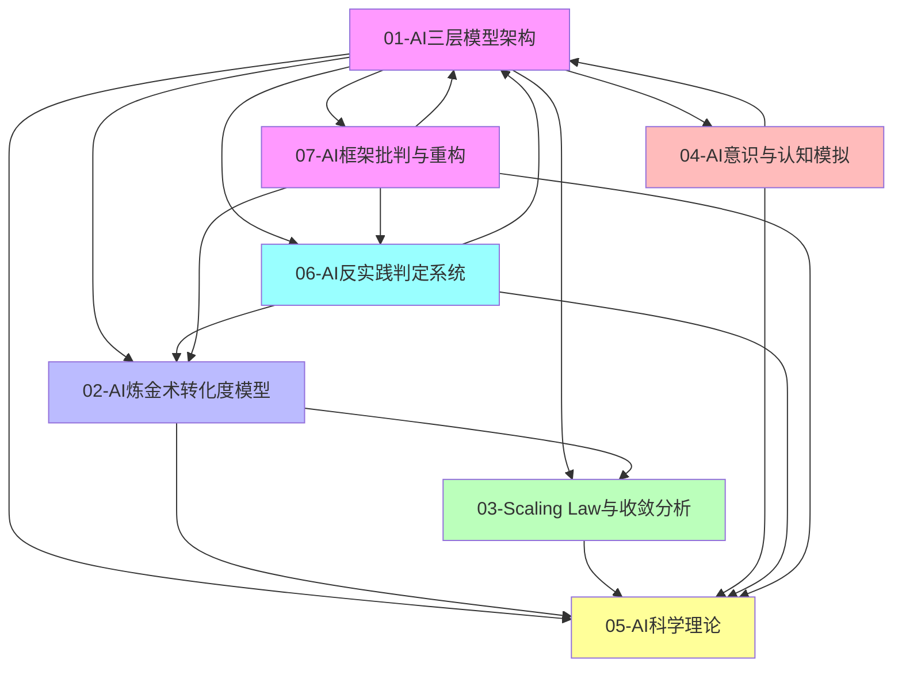

# Concepts 主题索引

本文档提供 concepts 目录下所有主题的快速索引和交叉引用。

---

## 一、主题快速索引

### 01-AI 三层模型架构

- **概述**：将 AI 系统解构为执行层（图灵计算）、控制层（形式语言）、数据层（数学概率）三层异质体
- **核心文档**：[README.md](01-AI三层模型架构/README.md)
- **关键概念**：图灵计算模型、形式语言模型、数学概率模型、层间交互、三层契约

### 02-AI 炼金术转化度模型

- **概述**：评估 AI 系统从"经验试错"（炼金术）向"精密科学"（化学）转化程度的框架
- **核心文档**：[README.md](02-AI炼金术转化度模型/README.md)
- **关键概念**：转化度评估、实践成熟度阶梯、炼金术陷阱、改进路线图

### 03-Scaling Law 与收敛分析

- **概述**：分析 Scaling Law 驱动的"大"与追求理论可控的"收敛"之间的张力
- **核心文档**：[README.md](03-Scaling Law 与收敛分析/README.md)
- **关键概念**：收敛模型分类、收敛层次分析、收敛驱动力、收敛时间表

### 04-AI 意识与认知模拟

- **概述**：探讨 AI 系统是否能够模拟人类意识，以及认知模拟的理论化改进
- **核心文档**：[README.md](04-AI意识与认知模拟/README.md)
- **关键概念**：意识本质问题、认知模拟理论化、非意识证据、功能模拟

### 05-AI 科学理论

- **概述**：探讨 AI 系统的理论化改进方法、确定性分析和工程科学范式
- **核心文档**：[README.md](05-AI科学理论/README.md)
- **关键概念**：理论化改进方法、确定性分析、工程科学范式、准理论框架

### 06-AI 反实践判定系统

- **概述**：构建逻辑可判定的"反实践"系统，通过"逻辑非"来机械识别 AI 工程中的"非规范"
- **核心文档**：[README.md](06-AI反实践判定系统/README.md)
- **关键概念**：逻辑可判定性、反实践判定框架、可判定性边界、机械判定器

### 07-AI 框架批判与重构

- **概述**：基于 2025 年前沿理论，对传统 AI 三层模型框架进行彻底的批判性分析，揭示其方法论漏洞、技术架构盲区、数学模型谬误、形式语言幻觉和整合性悖论，并提出从"三层-炼金术"到"统一-涌现"的重构框架
- **核心文档**：[README.md](07-AI框架批判与重构/README.md)
- **关键概念**：方法论批判、技术架构批判、数学模型批判、形式语言批判、整合性批判、神经算子理论

---

## 二、主题关系图谱

**主题依赖关系**：

- **01-AI 三层模型架构** 是基础框架，其他主题都建立在此之上
- **02-AI 炼金术转化度模型** 评估三层模型的成熟度
- **03-Scaling Law 与收敛分析** 分析三层模型的演进趋势
- **04-AI 意识与认知模拟** 探讨三层模型的本质问题
- **05-AI 科学理论** 整合所有主题的理论基础
- **06-AI 反实践判定系统** 提供三层模型的工程判定框架
- **07-AI 框架批判与重构** 批判三层模型框架，提出统一架构替代方案

---

## 三、概念交叉引用

### 执行层相关概念

- **01.1-执行层图灵计算模型** → 02.2.3-理论指导层（执行层优化）
- **01.1-执行层图灵计算模型** → 03.2.2-架构层收敛（Transformer 统治）
- **01.1-执行层图灵计算模型** → 05.2.1-架构层面确定性

### 控制层相关概念

- **01.2-控制层形式语言模型** → 02.3.1-Prompt 巫术
- **01.2-控制层形式语言模型** → 04.1.2-意向性（Intentionality）问题
- **01.2-控制层形式语言模型** → 05.1.1-推断时间计算增强

### 数据层相关概念

- **01.3-数据层数学概率模型** → 02.3.2-奖励黑客
- **01.3-数据层数学概率模型** → 03.1.2-L3: 准收敛（RLHF 对齐）
- **01.3-数据层数学概率模型** → 05.1.2-强化学习范式

### 层间交互相关概念

- **01.4-层间交互与冲突** → 02.1.1-五维度评估体系
- **01.4-层间交互与冲突** → 03.3.4-反收敛力量
- **01.4-层间交互与冲突** → 05.3.1-经验-试错-局部抽象循环

### 炼金术转化度相关概念

- **02.1-炼金术 → 化学转化度评估** → 01.4.3-三层契约设计模式
- **02.2-实践成熟度阶梯** → 03.1-收敛模型分类
- **02.3-炼金术陷阱** → 04.3-非意识证据
- **02.4-改进路线图** → 05.4-准理论框架

### 收敛分析相关概念

- **03.1-收敛模型分类** → 02.2-实践成熟度阶梯
- **03.2-收敛层次分析** → 01.1-执行层图灵计算模型
- **03.3-收敛驱动力** → 05.3-工程科学范式
- **03.4-收敛时间表** → 02.4-改进路线图

### 意识与认知模拟相关概念

- **04.1-意识本质问题** → 01.2-控制层形式语言模型
- **04.2-认知模拟理论化** → 05.1-理论化改进方法
- **04.3-非意识证据** → 02.3-炼金术陷阱
- **04.4-意识与功能模拟** → 05.2-确定性分析

### 科学理论相关概念

- **05.1-理论化改进方法** → 02.4-改进路线图
- **05.2-确定性分析** → 01.1-执行层图灵计算模型
- **05.3-工程科学范式** → 03.3-收敛驱动力
- **05.4-准理论框架** → 04.2-认知模拟理论化

---

## 四、主题导航

### 按主题浏览

1. [01-AI 三层模型架构](01-AI三层模型架构/README.md)

   - [01.1-执行层图灵计算模型](01-AI三层模型架构/README.md#二主题结构)
   - [01.2-控制层形式语言模型](01-AI三层模型架构/README.md#二主题结构)
   - [01.3-数据层数学概率模型](01-AI三层模型架构/README.md#二主题结构)
   - [01.4-层间交互与冲突](01-AI三层模型架构/README.md#二主题结构)

2. [02-AI 炼金术转化度模型](02-AI炼金术转化度模型/README.md)

   - [02.1-炼金术 → 化学转化度评估](02-AI炼金术转化度模型/README.md#二主题结构)
   - [02.2-实践成熟度阶梯](02-AI炼金术转化度模型/README.md#二主题结构)
   - [02.3-炼金术陷阱](02-AI炼金术转化度模型/README.md#二主题结构)
   - [02.4-改进路线图](02-AI炼金术转化度模型/README.md#二主题结构)

3. [03-Scaling Law 与收敛分析](03-Scaling Law 与收敛分析/README.md)

   - [03.1-收敛模型分类](03-Scaling Law 与收敛分析/README.md#二主题结构)
   - [03.2-收敛层次分析](03-Scaling Law 与收敛分析/README.md#二主题结构)
   - [03.3-收敛驱动力](03-Scaling Law 与收敛分析/README.md#二主题结构)
   - [03.4-收敛时间表](03-Scaling Law 与收敛分析/README.md#二主题结构)

4. [04-AI 意识与认知模拟](04-AI意识与认知模拟/README.md)

   - [04.1-意识本质问题](04-AI意识与认知模拟/README.md#二主题结构)
   - [04.2-认知模拟理论化](04-AI意识与认知模拟/README.md#二主题结构)
   - [04.3-非意识证据](04-AI意识与认知模拟/README.md#二主题结构)
   - [04.4-意识与功能模拟](04-AI意识与认知模拟/README.md#二主题结构)

5. [05-AI 科学理论](05-AI科学理论/README.md)

   - [05.1-理论化改进方法](05-AI科学理论/README.md#二主题结构)
   - [05.2-确定性分析](05-AI科学理论/README.md#二主题结构)
   - [05.3-工程科学范式](05-AI科学理论/README.md#二主题结构)
   - [05.4-准理论框架](05-AI科学理论/README.md#二主题结构)

6. [06-AI 反实践判定系统](06-AI反实践判定系统/README.md)

   - [06.1-逻辑可判定性基础](06-AI反实践判定系统/README.md#二主题结构)
   - [06.2-逻辑非判定框架](06-AI反实践判定系统/README.md#二主题结构)
   - [06.3-反实践知识图谱](06-AI反实践判定系统/README.md#二主题结构)
   - [06.4-机械反实践判定器](06-AI反实践判定系统/README.md#二主题结构)

7. [07-AI 框架批判与重构](07-AI框架批判与重构/README.md)
   - [07.1-方法论批判](07-AI框架批判与重构/README.md#二主题结构)
   - [07.2-技术架构批判](07-AI框架批判与重构/README.md#二主题结构)
   - [07.3-数学模型批判](07-AI框架批判与重构/README.md#二主题结构)
   - [07.4-形式语言批判](07-AI框架批判与重构/README.md#二主题结构)
   - [07.5-整合性批判](07-AI框架批判与重构/README.md#二主题结构)
   - [07.6-重构建议](07-AI框架批判与重构/README.md#二主题结构)
   - [07.7-自我批判与完整性补全](07-AI框架批判与重构/README.md#二主题结构)
   - [07.8-科学完备性对标](07-AI框架批判与重构/README.md#二主题结构)
   - [07.9-AI 创造子 AI 的可判定性分析](07-AI框架批判与重构/README.md#二主题结构)
   - [07.10-现象层重构：零公式叙事](07-AI框架批判与重构/README.md#二主题结构)
   - [07.11-AI 能否持续进步的可度量维度分析](07-AI框架批判与重构/README.md#二主题结构)

---

## 五、概念查找指南

### 按关键词查找

- **图灵计算** → [01.1-执行层图灵计算模型](01-AI三层模型架构/README.md)
- **形式语言** → [01.2-控制层形式语言模型](01-AI三层模型架构/README.md)
- **概率模型** → [01.3-数据层数学概率模型](01-AI三层模型架构/README.md)
- **炼金术** → [02-AI 炼金术转化度模型](02-AI炼金术转化度模型/README.md)
- **收敛** → [03-Scaling Law 与收敛分析](03-Scaling Law 与收敛分析/README.md)
- **意识** → [04-AI 意识与认知模拟](04-AI意识与认知模拟/README.md)
- **理论化** → [05-AI 科学理论](05-AI科学理论/README.md)
- **反实践** → [06-AI 反实践判定系统](06-AI反实践判定系统/README.md)
- **框架批判** → [07-AI 框架批判与重构](07-AI框架批判与重构/README.md)
- **神经算子** → [07-AI 框架批判与重构](07-AI框架批判与重构/README.md)
- **AI 持续进步** → [07.11-AI 能否持续进步的可度量维度分析](07-AI框架批判与重构/07.11-AI能否持续进步的可度量维度分析.md)
- **可度量维度** → [07.11-AI 能否持续进步的可度量维度分析](07-AI框架批判与重构/07.11-AI能否持续进步的可度量维度分析.md)

### 按问题查找

- **AI 系统如何分层？** → [01-AI 三层模型架构](01-AI三层模型架构/README.md)
- **如何评估 AI 系统的成熟度？** → [02-AI 炼金术转化度模型](02-AI炼金术转化度模型/README.md)
- **AI 技术何时会收敛？** → [03-Scaling Law 与收敛分析](03-Scaling Law 与收敛分析/README.md)
- **AI 是否有意识？** → [04-AI 意识与认知模拟](04-AI意识与认知模拟/README.md)
- **如何理论化改进 AI？** → [05-AI 科学理论](05-AI科学理论/README.md)
- **如何判定 AI 工程中的反实践？** → [06-AI 反实践判定系统](06-AI反实践判定系统/README.md)
- **三层模型框架有什么问题？** → [07-AI 框架批判与重构](07-AI框架批判与重构/README.md)
- **如何重构 AI 框架？** → [07-AI 框架批判与重构](07-AI框架批判与重构/README.md)
- **AI 能否持续进步？** → [07.11-AI 能否持续进步的可度量维度分析](07-AI框架批判与重构/07.11-AI能否持续进步的可度量维度分析.md)

---

## 六、更新日志

- **2025-01-XX**：初始索引创建
  - 创建五大主题索引
  - 建立主题关系图谱
  - 定义概念交叉引用
  - 提供主题导航指南
- **2025-01-XX**：索引更新
  - 添加 06-AI 反实践判定系统主题
  - 更新主题关系图谱
  - 扩展概念交叉引用
- **2025-01-XX**：批判性分析
  - 添加 07-AI 框架批判与重构主题
  - 基于 ai_reflect_view.md 创建批判性分析索引
  - 更新主题关系图谱
- **2025-01-XX**：框架扩展
  - 添加 07.7-自我批判与完整性补全
  - 添加 07.8-科学完备性对标
  - 添加 07.9-AI 创造子 AI 的可判定性分析
  - 添加 07.10-现象层重构：零公式叙事
  - 添加 07.11-AI 能否持续进步的可度量维度分析
  - 更新索引和导航

---

## 七、相关文档

- [Concepts 主题框架](README.md)
- [全局主题树形目录](../docs/0-总览与导航/0.1-全局主题树形目录.md)
- [交叉引用与本地跳转说明](../docs/0-总览与导航/0.2-交叉引用与本地跳转说明.md)
