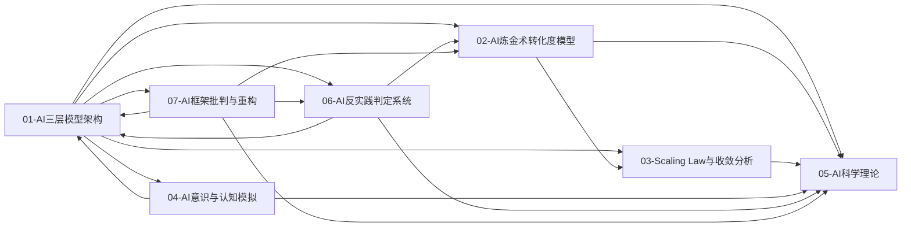

# Concepts 主题框架

本文档定义了 FormalAI 项目的核心概念体系，基于 view 目录的分析内容构建。

---

## 一、主题框架总览

### 主题分类体系

```mermaid
graph TD
    A[FormalAI 核心概念] --> B[01-AI三层模型架构]
    A --> C[02-AI炼金术转化度模型]
    A --> D[03-Scaling Law与收敛分析]
    A --> E[04-AI意识与认知模拟]
    A --> F[05-AI科学理论]
    A --> G[06-AI反实践判定系统]
    A --> H[07-AI框架批判与重构]

    B --> B1[执行层:图灵计算模型]
    B --> B2[控制层:形式语言模型]
    B --> B3[数据层:数学概率模型]
    B --> B4[层间交互与冲突]

    C --> C1[炼金术→化学转化度]
    C --> C2[实践成熟度阶梯]
    C --> C3[炼金术陷阱]
    C --> C4[改进路线图]

    D --> D1[收敛模型分类]
    D --> D2[收敛层次分析]
    D --> D3[收敛时间表]
    D --> D4[收敛驱动力]

    E --> E1[意识本质问题]
    E --> E2[认知模拟理论化]
    E --> E3[非意识证据]
    E --> E4[意识与功能模拟]

    F --> F1[理论化改进方法]
    F --> F2[确定性分析]
    F --> F3[工程科学范式]
    F --> F4[准理论框架]

    G --> G1[逻辑可判定性基础]
    G --> G2[逻辑非判定框架]
    G --> G3[反实践知识图谱]
    G --> G4[机械反实践判定器]

    H --> H1[方法论批判]
    H --> H2[技术架构批判]
    H --> H3[数学模型批判]
    H --> H4[形式语言批判]
    H --> H5[整合性批判]
    H --> H6[重构建议]
    H --> H7[自我批判与完整性补全]
    H --> H8[科学完备性对标]
    H --> H9[AI创造子AI分析]
    H --> H10[现象层重构]
    H --> H11[AI持续进步分析]
```

---

## 二、主题目录结构

### 01-AI 三层模型架构

- **01.1-执行层图灵计算模型**

  - 01.1.1-图灵机抽象与可计算性理论
  - 01.1.2-GPU 矩阵运算与 CUDA 优化
  - 01.1.3-执行层工程实践与工具链
  - 01.1.4-执行层瓶颈与优化策略

- **01.2-控制层形式语言模型**

  - 01.2.1-形式文法与 λ 演算
  - 01.2.2-Prompt 工程与 ReAct 循环
  - 01.2.3-控制层工具链与框架
  - 01.2.4-控制层约束与验证

- **01.3-数据层数学概率模型**

  - 01.3.1-概率论与微分几何基础
  - 01.3.2-Transformer 注意力机制
  - 01.3.3-概率采样与奖励塑形
  - 01.3.4-数据层训练与优化

- **01.4-层间交互与冲突**
  - 01.4.1-三层协同机制
  - 01.4.2-层间冲突与矛盾
  - 01.4.3-三层契约设计模式
  - 01.4.4-跨层优化策略

### 02-AI 炼金术转化度模型

- **02.1-炼金术 → 化学转化度评估**

  - 02.1.1-五维度评估体系
  - 02.1.2-转化度计算方法
  - 02.1.3-典型产品转化度分析
  - 02.1.4-转化度提升路径

- **02.2-实践成熟度阶梯**

  - 02.2.1-Level 1: 黑箱经验层
  - 02.2.2-Level 2: 模式提炼层
  - 02.2.3-Level 3: 理论指导层
  - 02.2.4-Level 4: 形式验证层
  - 02.2.5-Level 5: 精密科学层

- **02.3-炼金术陷阱**

  - 02.3.1-Prompt 巫术
  - 02.3.2-奖励黑客
  - 02.3.3-涌现失控
  - 02.3.4-基准过拟合
  - 02.3.5-自我改进死锁

- **02.4-改进路线图**
  - 02.4.1-阶段一: 经验固化
  - 02.4.2-阶段二: 自动化提炼
  - 02.4.3-阶段三: 理论驱动

### 03-Scaling Law 与收敛分析

- **03.1-收敛模型分类**

  - 03.1.1-L4: 完全收敛（工业标准）
  - 03.1.2-L3: 准收敛（事实垄断）
  - 03.1.3-L2: 收敛进行时（双寡头竞争）
  - 03.1.4-L1: 未收敛（百家争鸣）
  - 03.1.5-L0: 反向分化（场景撕裂）

- **03.2-收敛层次分析**

  - 03.2.1-数学层收敛
  - 03.2.2-架构层收敛
  - 03.2.3-能力层收敛
  - 03.2.4-应用层收敛
  - 03.2.5-硬件层收敛

- **03.3-收敛驱动力**

  - 03.3.1-技术收敛驱动力
  - 03.3.2-市场收敛驱动力
  - 03.3.3-标准收敛驱动力
  - 03.3.4-反收敛力量

- **03.4-收敛时间表**
  - 03.4.1-2025-2026 预测
  - 03.4.2-2026-2027 预测
  - 03.4.3-长期趋势分析

### 04-AI 意识与认知模拟

- **04.1-意识本质问题**

  - 04.1.1-主观体验（Qualia）问题
  - 04.1.2-意向性（Intentionality）问题
  - 04.1.3-自我模型（Self-Model）问题
  - 04.1.4-意识理论框架

- **04.2-认知模拟理论化**

  - 04.2.1-推断时间计算增强
  - 04.2.2-强化学习范式
  - 04.2.3-元认知与自我改进
  - 04.2.4-理论局限性分析

- **04.3-非意识证据**

  - 04.3.1-功能模拟 ≠ 现象等价
  - 04.3.2-AI 编程的非意识特征
  - 04.3.3-犯错方式差异
  - 04.3.4-元认知缺失

- **04.4-意识与功能模拟**
  - 04.4.1-表面相似性分析
  - 04.4.2-根本差异识别
  - 04.4.3-当前共识与争议
  - 04.4.4-前沿观点

### 05-AI 科学理论

- **05.1-理论化改进方法**

  - 05.1.1-推断时间计算增强
  - 05.1.2-强化学习范式
  - 05.1.3-元认知与自我改进
  - 05.1.4-混合方法策略

- **05.2-确定性分析**

  - 05.2.1-架构层面确定性
  - 05.2.2-训练过程确定性
  - 05.2.3-推理行为确定性
  - 05.2.4-能力涌现半可预测性

- **05.3-工程科学范式**

  - 05.3.1-经验-试错-局部抽象循环
  - 05.3.2-可改进性分析
  - 05.3.3-确定性改进限制
  - 05.3.4-理论价值评估

- **05.4-准理论框架**
  - 05.4.1-Scaling Law
  - 05.4.2-RLHF 理论
  - 05.4.3-CoT 理论
  - 05.4.4-理论边界与挑战

### 06-AI 反实践判定系统

- **06.1-逻辑可判定性基础**

  - 06.1.1-图灵停机问题到实践判别
  - 06.1.2-可判定性视角下的三层模型
  - 06.1.3-哥德尔边界与系统一致性
  - 06.1.4-判定算法复杂度分析

- **06.2-逻辑非判定框架**

  - 06.2.1-反实践的机械识别
  - 06.2.2-执行层反实践判定
  - 06.2.3-控制层反实践判定
  - 06.2.4-数据层反实践判定
  - 06.2.5-三层协同反实践判定

- **06.3-反实践知识图谱**

  - 06.3.1-反实践分类体系
  - 06.3.2-轻度反实践分析
  - 06.3.3-中度反实践分析
  - 06.3.4-严重反实践分析
  - 06.3.5-灾难性反实践分析

- **06.4-机械反实践判定器**
  - 06.4.1-判定引擎架构
  - 06.4.2-完全可判定区域实现
  - 06.4.3-半可判定区域实现
  - 06.4.4-不可判定区域处理
  - 06.4.5-工程决策规则

### 07-AI 框架批判与重构

- **07.1-方法论批判**

  - 07.1.1-三层模型的本体论暴政
  - 07.1.2-可判定性边界的逻辑错位
  - 07.1.3-炼金度隐喻的不可操作性
  - 07.1.4-意识与能力的二元谬误

- **07.2-技术架构批判**

  - 07.2.1-三层可分离的误判
  - 07.2.2-执行层确定性的错误假设
  - 07.2.3-随机性的价值误判
  - 07.2.4-时间维度的缺失

- **07.3-数学模型批判**

  - 07.3.1-AI 本质的数学误读
  - 07.3.2-从概率模型到动力系统
  - 07.3.3-Transformer 数学本质的重构
  - 07.3.4-LoRA 的规范场理论

- **07.4-形式语言批判**

  - 07.4.1-控制层的科学主义幻觉
  - 07.4.2-Prompt 的语用学本质
  - 07.4.3-安全协议的形式化局限
  - 07.4.4-价值对齐的不可判定性

- **07.5-整合性批判**

  - 07.5.1-三层模型已过时
  - 07.5.2-2025 统一架构：神经算子理论
  - 07.5.3-知识图谱：漏洞全景
  - 07.5.4-最新趋势暴露的盲区

- **07.6-重构建议**

  - 07.6.1-从三层到算子的重构路径
  - 07.6.2-神经算子涌现理论
  - 07.6.3-双视图架构设计
  - 07.6.4-渐进式迁移路线图

- **07.7-自我批判与完整性补全**

  - 07.7-自我批判与完整性补全

- **07.8-科学完备性对标**

  - 07.8-科学完备性对标

- **07.9-AI 创造子 AI 的可判定性分析**

  - 07.9-AI 创造子 AI 的可判定性分析

- **07.10-现象层重构：零公式叙事**

  - 07.10-现象层重构：零公式叙事

- **07.11-AI 能否持续进步的可度量维度分析**
  - 07.11-AI 能否持续进步的可度量维度分析

---

## 三、主题间关系

### 交叉引用关系

### 主题依赖关系

- **01-AI 三层模型架构** 是基础框架，其他主题都建立在此之上
- **02-AI 炼金术转化度模型** 评估三层模型的成熟度
- **03-Scaling Law 与收敛分析** 分析三层模型的演进趋势
- **04-AI 意识与认知模拟** 探讨三层模型的本质问题
- **05-AI 科学理论** 整合所有主题的理论基础
- **06-AI 反实践判定系统** 提供三层模型的工程判定框架
- **07-AI 框架批判与重构** 批判三层模型框架，提出统一架构替代方案

---

## 四、文档规范

### 序号体系

- **一级主题**：01, 02, 03, 04, 05, 06, 07
- **二级主题**：01.1, 01.2, 01.3, ...
- **三级主题**：01.1.1, 01.1.2, 01.1.3, ...
- **四级主题**：01.1.1.1, 01.1.1.2, ...

### 文档结构

每个主题文档应包含：

1. **标题**：主题名称
2. **概述**：主题核心内容
3. **理论基础**：相关理论框架
4. **实践分析**：工程实践案例
5. **知识图谱**：概念关系网络
6. **结论**：核心观点总结
7. **交叉引用**：相关主题链接

### 格式要求

- 使用简体中文
- 遵循 Markdown 格式规范
- 包含 Mermaid 图表
- 使用表格对比分析
- 提供代码示例（如适用）

---

## 五、更新日志

- **2025-01-XX**：初始框架创建
  - 定义五大主题分类
  - 建立目录结构
  - 创建主题索引
- **2025-01-XX**：框架扩展
  - 添加 06-AI 反实践判定系统主题
  - 更新主题关系图谱
  - 扩展目录结构
- **2025-01-XX**：批判性分析
  - 添加 07-AI 框架批判与重构主题
  - 基于 ai_reflect_view.md 创建批判性分析框架
  - 建立六个子主题结构
- **2025-01-XX**：框架扩展
  - 添加 07.7-自我批判与完整性补全
  - 添加 07.8-科学完备性对标
  - 添加 07.9-AI 创造子 AI 的可判定性分析
  - 添加 07.10-现象层重构：零公式叙事
  - 添加 07.11-AI 能否持续进步的可度量维度分析
  - 更新 07.5.3-知识图谱：漏洞全景
  - 更新 07.5.4-最新趋势暴露的盲区
  - 完善目录结构和交叉引用
- **2025-01-XX**：内容补全
  - 补全 02-AI 炼金术转化度模型缺失文件
    - 添加 02.2.2-Level 2: 模式提炼层
    - 添加 02.2.3-Level 3: 理论指导层
    - 添加 02.2.4-Level 4: 形式验证层
    - 添加 02.2.5-Level 5: 精密科学层
    - 添加 02.4.1-阶段一: 经验固化
    - 添加 02.4.2-阶段二: 自动化提炼
    - 添加 02.4.3-阶段三: 理论驱动
  - 补全 03-Scaling Law 与收敛分析缺失文件
    - 添加 03.1.1-L4: 完全收敛（工业标准）
    - 添加 03.1.2-L3: 准收敛（事实垄断）
    - 添加 03.1.3-L2: 收敛进行时（双寡头竞争）
    - 添加 03.1.4-L1: 未收敛（百家争鸣）
    - 添加 03.1.5-L0: 反向分化（场景撕裂）
  - 修复 05-AI 科学理论重复文件问题
    - 删除重复的 05.3.1-工程科学范式.md
  - 统一文档格式，完善交叉引用
- **2025-11-09**：内容对标与完备性分析
  - 完成 View 与 Concepts 文件夹内容对标分析
  - 生成 VIEW_CONCEPTS_ALIGNMENT_REPORT.md 对标分析报告
  - 检查 2025 年 11 月 9 日相关的内容信息
  - 评估内容相关性和充分完备性
  - 更新 README 更新日志，添加 2025-11-09 记录
  - 补充 ROI 优化决策矩阵到 01.4.4-跨层优化策略.md
  - 补充 DeepSeek-R1 和 Claude 3.5 详细案例到 01.4.4-跨层优化策略.md

---

## 六、相关文档

- [全局主题树形目录](../docs/0-总览与导航/0.1-全局主题树形目录.md)
- [交叉引用与本地跳转说明](../docs/0-总览与导航/0.2-交叉引用与本地跳转说明.md)
- [现有内容哲科批判分析](../docs/0-总览与导航/0.4-现有内容哲科批判分析.md)
