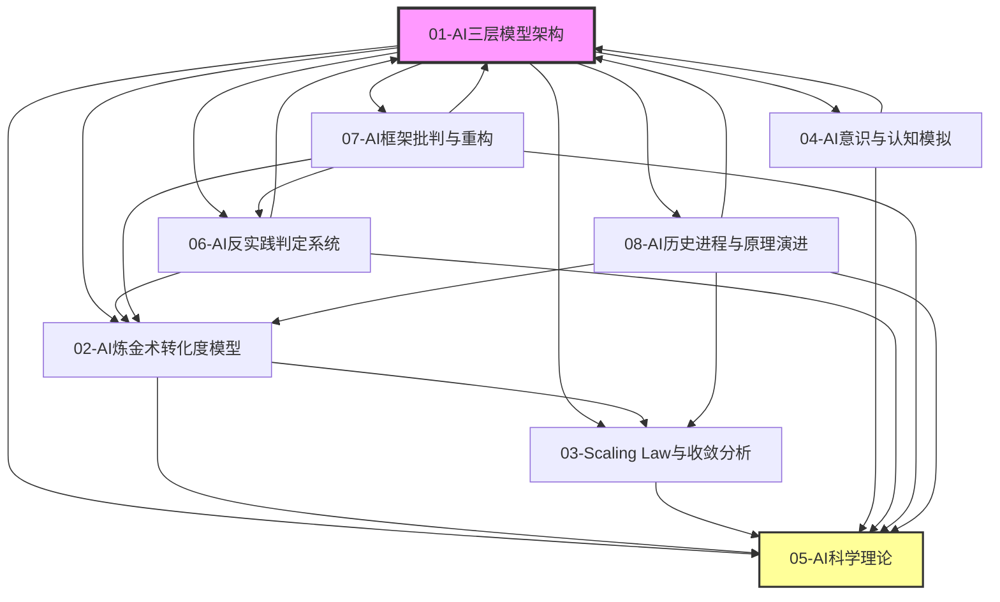
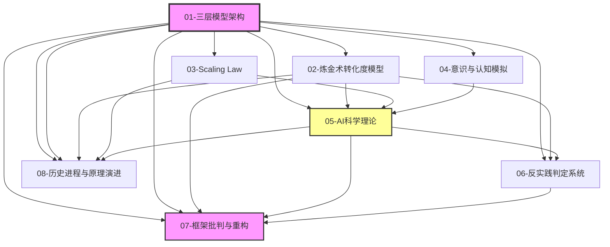

# Concepts模块主题关联图谱

**创建日期**：2025-01-XX
**版本**：v1.0.0
**状态**：已完成

---

## 📊 概述

本文档提供Concepts模块所有主题之间的详细关联关系图谱，包括依赖关系、交叉引用关系、概念映射关系等。

---

## 一、主题层级结构

### 1.1 一级主题（8个）

```mermaid
graph TD
    A[01-AI三层模型架构]
    B[02-AI炼金术转化度模型]
    C[03-Scaling Law与收敛分析]
    D[04-AI意识与认知模拟]
    E[05-AI科学理论]
    F[06-AI反实践判定系统]
    G[07-AI框架批判与重构]
    H[08-AI历史进程与原理演进]

    style A fill:#f9f,stroke:#333,stroke-width:3px
    style B fill:#bbf,stroke:#333,stroke-width:2px
    style C fill:#bfb,stroke:#333,stroke-width:2px
    style D fill:#fbb,stroke:#333,stroke-width:2px
    style E fill:#ff9,stroke:#333,stroke-width:2px
    style F fill:#9ff,stroke:#333,stroke-width:2px
    style G fill:#f9f,stroke:#333,stroke-width:2px
    style H fill:#9f9,stroke:#333,stroke-width:2px
```



### 1.2 主题依赖关系

| 主题 | 依赖主题 | 依赖类型 | 说明 |
|------|----------|----------|------|
| 01-三层模型架构 | - | 基础框架 | 所有其他主题的基础 |
| 02-炼金术转化度模型 | 01 | 评估框架 | 评估三层模型的成熟度 |
| 03-Scaling Law与收敛分析 | 01, 02 | 演进分析 | 分析三层模型的演进趋势 |
| 04-AI意识与认知模拟 | 01 | 本质探讨 | 探讨三层模型的本质问题 |
| 05-AI科学理论 | 01, 02, 03, 04 | 理论整合 | 整合所有主题的理论基础 |
| 06-AI反实践判定系统 | 01, 02, 05 | 工程判定 | 提供工程判定框架 |
| 07-AI框架批判与重构 | 01, 02, 05, 06 | 批判重构 | 批判三层模型，提出替代方案 |
| 08-AI历史进程与原理演进 | 01, 02, 03, 05 | 历史梳理 | 梳理AI发展的历史脉络 |

---

## 二、主题关联关系图谱

### 2.1 完整关联图谱



### 2.2 主题关联矩阵

| 主题 | 01 | 02 | 03 | 04 | 05 | 06 | 07 | 08 |
|------|----|----|----|----|----|----|----|----|
| 01-三层模型架构 | - | ✓ | ✓ | ✓ | ✓ | ✓ | ✓ | ✓ |
| 02-炼金术转化度模型 | ✓ | - | ✓ | - | ✓ | - | - | - |
| 03-Scaling Law | ✓ | ✓ | - | - | ✓ | - | - | ✓ |
| 04-意识与认知模拟 | ✓ | - | - | - | ✓ | - | - | - |
| 05-AI科学理论 | ✓ | ✓ | ✓ | ✓ | - | ✓ | ✓ | ✓ |
| 06-反实践判定系统 | ✓ | ✓ | - | - | ✓ | - | ✓ | - |
| 07-框架批判与重构 | ✓ | ✓ | - | - | ✓ | ✓ | - | - |
| 08-历史进程与原理演进 | ✓ | ✓ | ✓ | - | ✓ | - | - | - |

**说明**：✓ 表示存在关联关系

---

## 三、详细关联关系

### 3.1 01-三层模型架构 → 其他主题

#### 执行层相关关联

- **01.1-执行层图灵计算模型**
  - → 02.2.3-理论指导层（执行层优化）
  - → 03.2.2-架构层收敛（Transformer统治）
  - → 05.2.1-架构层面确定性
  - → 06.1.1-图灵停机问题到实践判别
  - → 07.2.2-执行层确定性的错误假设

#### 控制层相关关联

- **01.2-控制层形式语言模型**
  - → 02.3.1-Prompt巫术
  - → 04.1.2-意向性（Intentionality）问题
  - → 05.1.1-推断时间计算增强
  - → 06.2.1-逻辑非判定框架
  - → 07.4.1-控制层的科学主义幻觉

#### 数据层相关关联

- **01.3-数据层数学概率模型**
  - → 02.3.2-奖励黑客
  - → 03.1.2-L3: 准收敛（RLHF对齐）
  - → 05.1.2-强化学习范式
  - → 06.3.1-反实践知识图谱
  - → 07.3.2-从概率模型到动力系统

#### 层间交互相关关联

- **01.4-层间交互与冲突**
  - → 02.1.1-五维度评估体系
  - → 03.3.4-反收敛力量
  - → 05.3.1-经验-试错-局部抽象循环
  - → 06.4.1-机械反实践判定器
  - → 07.2.1-三层可分离的误判

### 3.2 02-炼金术转化度模型 → 其他主题

- **02.1-炼金术→化学转化度评估**
  - → 01.4.3-三层契约设计模式
  - → 03.1-收敛模型分类
  - → 05.4-准理论框架

- **02.2-实践成熟度阶梯**
  - → 01.1-执行层图灵计算模型
  - → 03.2-收敛层次分析
  - → 05.3-工程科学范式

- **02.3-炼金术陷阱**
  - → 01.2-控制层形式语言模型
  - → 04.3-非意识证据
  - → 06.3-反实践知识图谱

- **02.4-改进路线图**
  - → 01.4.4-跨层优化策略
  - → 03.4-收敛时间表
  - → 05.1-理论化改进方法

### 3.3 03-Scaling Law与收敛分析 → 其他主题

- **03.1-收敛模型分类**
  - → 01.1-执行层图灵计算模型
  - → 02.2-实践成熟度阶梯
  - → 05.4.1-Scaling Law

- **03.2-收敛层次分析**
  - → 01.2-控制层形式语言模型
  - → 02.1-炼金术→化学转化度评估
  - → 05.2-确定性分析

- **03.3-收敛驱动力**
  - → 01.4-层间交互与冲突
  - → 02.4-改进路线图
  - → 05.3-工程科学范式

- **03.4-收敛时间表**
  - → 01.3-数据层数学概率模型
  - → 02.3-炼金术陷阱
  - → 08.5-2023-2025工程化突破

### 3.4 04-AI意识与认知模拟 → 其他主题

- **04.1-意识本质问题**
  - → 01.2-控制层形式语言模型
  - → 05.2-确定性分析

- **04.2-认知模拟理论化**
  - → 01.1-执行层图灵计算模型
  - → 05.1-理论化改进方法

- **04.3-非意识证据**
  - → 01.3-数据层数学概率模型
  - → 02.3-炼金术陷阱
  - → 06.1-逻辑可判定性基础

- **04.4-意识与功能模拟**
  - → 01.4-层间交互与冲突
  - → 05.2-确定性分析

### 3.5 05-AI科学理论 → 其他主题

- **05.1-理论化改进方法**
  - → 01.2-控制层形式语言模型
  - → 02.4-改进路线图
  - → 04.2-认知模拟理论化

- **05.2-确定性分析**
  - → 01.1-执行层图灵计算模型
  - → 03.2-收敛层次分析
  - → 04.4-意识与功能模拟

- **05.3-工程科学范式**
  - → 01.4-层间交互与冲突
  - → 02.2-实践成熟度阶梯
  - → 03.3-收敛驱动力

- **05.4-准理论框架**
  - → 01.3-数据层数学概率模型
  - → 02.1-炼金术→化学转化度评估
  - → 03.1-收敛模型分类

### 3.6 06-AI反实践判定系统 → 其他主题

- **06.1-逻辑可判定性基础**
  - → 01.1-执行层图灵计算模型
  - → 04.3-非意识证据

- **06.2-逻辑非判定框架**
  - → 01.2-控制层形式语言模型
  - → 05.1-理论化改进方法

- **06.3-反实践知识图谱**
  - → 01.3-数据层数学概率模型
  - → 02.3-炼金术陷阱

- **06.4-机械反实践判定器**
  - → 01.4-层间交互与冲突
  - → 05.3-工程科学范式

### 3.7 07-AI框架批判与重构 → 其他主题

- **07.1-方法论批判**
  - → 01-三层模型架构（批判对象）
  - → 02-炼金术转化度模型（批判对象）
  - → 05-AI科学理论（理论基础）

- **07.2-技术架构批判**
  - → 01-三层模型架构（批判对象）
  - → 06-反实践判定系统（判定框架）

- **07.3-数学模型批判**
  - → 01.3-数据层数学概率模型（批判对象）
  - → 05.4-准理论框架（理论基础）

- **07.4-形式语言批判**
  - → 01.2-控制层形式语言模型（批判对象）
  - → 06.2-逻辑非判定框架（判定框架）

- **07.5-整合性批判**
  - → 01-三层模型架构（批判对象）
  - → 05-AI科学理论（理论基础）

### 3.8 08-AI历史进程与原理演进 → 其他主题

- **08.1-AI历史进程**
  - → 01-三层模型架构（历史演进）
  - → 02-炼金术转化度模型（历史演进）

- **08.2-原理演进**
  - → 01-三层模型架构（原理演进）
  - → 05-AI科学理论（理论演进）

- **08.3-核心机制**
  - → 01-三层模型架构（机制分析）
  - → 03-Scaling Law与收敛分析（机制分析）

- **08.4-涌现现象**
  - → 01-三层模型架构（涌现分析）
  - → 04-AI意识与认知模拟（涌现分析）

- **08.5-2023-2025工程化突破**
  - → 01-三层模型架构（工程突破）
  - → 03-Scaling Law与收敛分析（工程突破）

---

## 四、概念映射关系

### 4.1 执行层概念映射

| 执行层概念 | 映射到其他主题 | 映射关系 |
|-----------|---------------|----------|
| 图灵计算模型 | 02.2.3-理论指导层 | 优化目标 |
| GPU矩阵运算 | 03.2.2-架构层收敛 | 收敛基础 |
| 可计算性理论 | 06.1.1-图灵停机问题 | 判定基础 |
| 执行层确定性 | 05.2.1-架构层面确定性 | 确定性分析 |

### 4.2 控制层概念映射

| 控制层概念 | 映射到其他主题 | 映射关系 |
|-----------|---------------|----------|
| 形式文法 | 02.3.1-Prompt巫术 | 问题识别 |
| Prompt工程 | 05.1.1-推断时间计算增强 | 改进方法 |
| 形式语言模型 | 04.1.2-意向性问题 | 本质探讨 |
| 控制层约束 | 06.2.1-逻辑非判定框架 | 判定框架 |

### 4.3 数据层概念映射

| 数据层概念 | 映射到其他主题 | 映射关系 |
|-----------|---------------|----------|
| 概率模型 | 02.3.2-奖励黑客 | 问题识别 |
| Transformer | 03.1.2-L3准收敛 | 收敛分析 |
| RLHF | 05.1.2-强化学习范式 | 理论框架 |
| 概率采样 | 07.3.2-从概率模型到动力系统 | 理论重构 |

---

## 五、主题依赖图（DAG）



---

## 六、主题关联强度

### 6.1 强关联（直接依赖）

- **01 → 02, 03, 04, 05, 06, 07, 08**：所有主题都直接依赖三层模型架构
- **05 ← 01, 02, 03, 04**：AI科学理论整合多个主题
- **07 ← 01, 02, 05, 06**：框架批判与重构依赖多个主题

### 6.2 中关联（间接依赖）

- **02 → 03, 05**：炼金术转化度模型间接关联Scaling Law和科学理论
- **03 → 05**：Scaling Law间接关联科学理论
- **04 → 05**：意识与认知模拟间接关联科学理论

### 6.3 弱关联（概念映射）

- **06 ↔ 01, 02, 05**：反实践判定系统与多个主题有概念映射
- **08 ↔ 01, 02, 03, 05**：历史进程与多个主题有概念映射

---

## 七、主题导航路径

### 7.1 基础学习路径

```text
01-三层模型架构 → 02-炼金术转化度模型 → 03-Scaling Law → 05-AI科学理论
```

### 7.2 深入理解路径

```text
01-三层模型架构 → 04-意识与认知模拟 → 05-AI科学理论 → 07-框架批判与重构
```

### 7.3 工程实践路径

```text
01-三层模型架构 → 06-反实践判定系统 → 02-炼金术转化度模型 → 05-AI科学理论
```

### 7.4 历史演进路径

```text
08-历史进程与原理演进 → 01-三层模型架构 → 03-Scaling Law → 05-AI科学理论
```

---

## 八、主题关联统计

### 8.1 关联度排名

| 排名 | 主题 | 出度（引用其他主题） | 入度（被其他主题引用） | 总关联度 |
|------|------|---------------------|----------------------|----------|
| 1 | 01-三层模型架构 | 0 | 7 | 7 |
| 2 | 05-AI科学理论 | 4 | 6 | 10 |
| 3 | 07-框架批判与重构 | 4 | 0 | 4 |
| 4 | 02-炼金术转化度模型 | 2 | 3 | 5 |
| 5 | 03-Scaling Law | 2 | 2 | 4 |
| 6 | 06-反实践判定系统 | 3 | 1 | 4 |
| 7 | 08-历史进程与原理演进 | 4 | 0 | 4 |
| 8 | 04-意识与认知模拟 | 2 | 1 | 3 |

### 8.2 核心主题识别

- **核心基础主题**：01-三层模型架构（所有主题的基础）
- **核心整合主题**：05-AI科学理论（整合所有主题的理论基础）
- **核心批判主题**：07-框架批判与重构（批判和重构所有主题）

---

## 九、主题关联更新日志

- **2025-01-XX**：初始版本创建
  - 建立8个一级主题的关联关系
  - 识别主题依赖关系
  - 创建主题关联图谱

---

**最后更新**：2025-01-XX
**维护者**：FormalAI项目组
**版本**：v1.0.0
