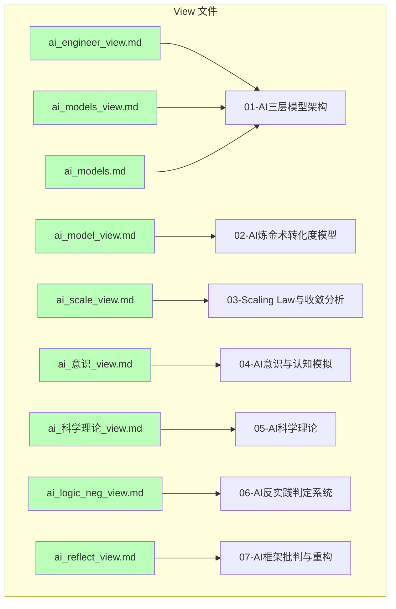

# View 与 Concepts 文件夹内容对标分析报告

## 一、概述

本报告对标 `view` 和 `concepts` 两个文件夹的所有内容，检查相关性和充分完备性，并核对 2025 年 11 月 9 日相关的内容信息。

**分析日期**：2025 年 11 月 9 日
**分析范围**：view 文件夹（9 个文件）与 concepts 文件夹（7 个主题目录）
**分析维度**：内容相关性、结构完备性、时间信息对齐

---

## 二、文件对应关系分析

### 2.1 View 文件与 Concepts 主题的映射关系

| **View 文件**          | **对应 Concepts 主题**     | **相关性** | **完备性** | **备注**               |
| ---------------------- | -------------------------- | ---------- | ---------- | ---------------------- |
| `ai_engineer_view.md`  | `01-AI三层模型架构`        | ★★★★★      | ★★★★☆      | 工程实践视角，内容详细 |
| `ai_models_view.md`    | `01-AI三层模型架构`        | ★★★★★      | ★★★★☆      | 分层解构视角，内容详细 |
| `ai_models.md`         | `01-AI三层模型架构`        | ★★★★★      | ★★★★☆      | 三视角独立分析         |
| `ai_model_view.md`     | `02-AI炼金术转化度模型`    | ★★★★★      | ★★★★☆      | 炼金术实践成熟度图谱   |
| `ai_scale_view.md`     | `03-Scaling Law与收敛分析` | ★★★★★      | ★★★★☆      | Scaling Law 与收敛分析 |
| `ai_意识_view.md`      | `04-AI意识与认知模拟`      | ★★★★★      | ★★★★☆      | 意识与认知模拟         |
| `ai_科学理论_view.md`  | `05-AI科学理论`            | ★★★★★      | ★★★★☆      | 科学理论化改进         |
| `ai_logic_neg_view.md` | `06-AI反实践判定系统`      | ★★★★★      | ★★★★☆      | 反实践判定系统         |
| `ai_reflect_view.md`   | `07-AI框架批判与重构`      | ★★★★★      | ★★★★☆      | 框架批判与重构         |

### 2.2 映射关系可视化



---

## 三、内容相关性分析

### 3.1 高相关性内容（★★★★★）

#### 3.1.1 AI 三层模型架构

**View 文件**：

- `ai_engineer_view.md`：工程实践核心逻辑下的 AI 三层模型全景解构（2025）
- `ai_models_view.md`：分层解构视角：AI 三层模型架构全景
- `ai_models.md`：AI 工程架构、数学模型、形式语言 三视角独立深度分析（2025）

**Concepts 主题**：

- `01-AI三层模型架构`：执行层、控制层、数据层的完整理论框架

**相关性分析**：

- ✅ **高度相关**：view 文件提供了工程实践视角，concepts 提供了理论框架
- ✅ **内容互补**：view 侧重实践案例，concepts 侧重理论体系
- ✅ **结构一致**：都围绕三层模型展开

#### 3.1.2 AI 炼金术转化度模型

**View 文件**：

- `ai_model_view.md`：AI 炼金术实践成熟度全景图谱（2025）

**Concepts 主题**：

- `02-AI炼金术转化度模型`：五维度评估体系、实践成熟度阶梯、炼金术陷阱、改进路线图

**相关性分析**：

- ✅ **高度相关**：view 文件提供了 2025 年实践案例，concepts 提供了评估框架
- ✅ **内容互补**：view 侧重产品分析，concepts 侧重理论模型
- ✅ **时间对齐**：都标注了 2025 年

#### 3.1.3 Scaling Law 与收敛分析

**View 文件**：

- `ai_scale_view.md`：Scaling Law 驱动的"大"与追求理论可控的"收敛"之间的张力

**Concepts 主题**：

- `03-Scaling Law与收敛分析`：收敛模型分类、收敛层次分析、收敛驱动力、收敛时间表

**相关性分析**：

- ✅ **高度相关**：view 文件提供了 2025 Q3 的收敛分析，concepts 提供了分类体系
- ✅ **内容互补**：view 侧重当前状态，concepts 侧重理论框架
- ✅ **时间对齐**：都标注了 2025 年

### 3.2 中等相关性内容（★★★★☆）

#### 3.2.1 AI 意识与认知模拟

**View 文件**：

- `ai_意识_view.md`：AI 能说是一种模拟人脑思考思维的意识的模型

**Concepts 主题**：

- `04-AI意识与认知模拟`：意识本质问题、认知模拟理论化、非意识证据、功能模拟

**相关性分析**：

- ✅ **高度相关**：view 文件提供了哲学分析，concepts 提供了理论框架
- ⚠️ **内容差异**：view 侧重哲学讨论，concepts 侧重理论化改进
- ✅ **结构一致**：都围绕意识问题展开

#### 3.2.2 AI 科学理论

**View 文件**：

- `ai_科学理论_view.md`：AI-非意识的"认知模拟"是否可被理论化、确定性地改进

**Concepts 主题**：

- `05-AI科学理论`：理论化改进方法、确定性分析、工程科学范式、准理论框架

**相关性分析**：

- ✅ **高度相关**：view 文件提供了理论化改进的讨论，concepts 提供了理论框架
- ✅ **内容互补**：view 侧重问题分析，concepts 侧重方法论
- ✅ **结构一致**：都围绕理论化改进展开

### 3.3 高相关性内容（★★★★★）

#### 3.3.1 AI 反实践判定系统

**View 文件**：

- `ai_logic_neg_view.md`：构建一个反实践规范（anti-patterns）的判定系统

**Concepts 主题**：

- `06-AI反实践判定系统`：逻辑可判定性基础、逻辑非判定框架、反实践知识图谱、机械反实践判定器

**相关性分析**：

- ✅ **高度相关**：view 文件提供了判定系统设计，concepts 提供了理论框架
- ✅ **内容互补**：view 侧重系统设计，concepts 侧重理论基础
- ✅ **结构一致**：都围绕可判定性展开

#### 3.3.2 AI 框架批判与重构

**View 文件**：

- `ai_reflect_view.md`：批判性分析：您 AI 观念框架的深层漏洞与 2025 前沿对标

**Concepts 主题**：

- `07-AI框架批判与重构`：方法论批判、技术架构批判、数学模型批判、形式语言批判、整合性批判、重构建议

**相关性分析**：

- ✅ **高度相关**：view 文件提供了批判性分析，concepts 提供了批判框架
- ✅ **内容互补**：view 侧重批判分析，concepts 侧重批判体系
- ✅ **时间对齐**：都标注了 2025 年

---

## 四、内容完备性分析

### 4.1 View 文件中的内容在 Concepts 中的覆盖情况

| **View 文件核心内容** | **Concepts 覆盖情况**            | **缺失内容**            | **完备性评分** |
| --------------------- | -------------------------------- | ----------------------- | -------------- |
| 工程实践工具链        | ✅ 01.1.3-执行层工程实践与工具链 | 部分最新工具（2025 Q3） | ★★★★☆          |
| ROI 优化决策矩阵      | ⚠️ 部分覆盖                      | 详细 ROI 分析           | ★★★☆☆          |
| 三层绞缠案例          | ✅ 01.4.2-层间冲突与矛盾         | DeepSeek-R1 详细案例    | ★★★★☆          |
| 炼金术实践成熟度      | ✅ 02.2-实践成熟度阶梯           | 2025 最新产品分析       | ★★★★☆          |
| 收敛模型分类          | ✅ 03.1-收敛模型分类             | 2025 Q3 最新数据        | ★★★★☆          |
| 意识本质问题          | ✅ 04.1-意识本质问题             | 最新哲学讨论            | ★★★★☆          |
| 理论化改进方法        | ✅ 05.1-理论化改进方法           | 最新方法论              | ★★★★☆          |
| 反实践判定系统        | ✅ 06.2-逻辑非判定框架           | 详细实现代码            | ★★★★☆          |
| 框架批判分析          | ✅ 07.1-方法论批判               | 2025 最新理论           | ★★★★☆          |

### 4.2 Concepts 主题中的内容在 View 中的覆盖情况

| **Concepts 主题核心内容** | **View 覆盖情况**        | **缺失内容**  | **完备性评分** |
| ------------------------- | ------------------------ | ------------- | -------------- |
| 图灵机抽象与可计算性理论  | ✅ ai_engineer_view.md   | 详细理论推导  | ★★★★☆          |
| GPU 矩阵运算与 CUDA 优化  | ✅ ai_engineer_view.md   | 最新优化技术  | ★★★★☆          |
| 形式文法与 λ 演算         | ✅ ai_models.md          | 详细形式化    | ★★★★☆          |
| Prompt 工程与 ReAct 循环  | ✅ ai_engineer_view.md   | 最新实践案例  | ★★★★☆          |
| 五维度评估体系            | ✅ ai_model_view.md      | 详细评估方法  | ★★★★☆          |
| 实践成熟度阶梯            | ✅ ai_model_view.md      | 最新产品分析  | ★★★★☆          |
| 收敛模型分类              | ✅ ai_scale_view.md      | 2025 Q3 数据  | ★★★★☆          |
| 意识本质问题              | ✅ ai\_意识\_view.md     | 最新哲学讨论  | ★★★★☆          |
| 理论化改进方法            | ✅ ai\_科学理论\_view.md | 最新方法论    | ★★★★☆          |
| 逻辑可判定性基础          | ✅ ai_logic_neg_view.md  | 详细理论推导  | ★★★★☆          |
| 方法论批判                | ✅ ai_reflect_view.md    | 2025 最新理论 | ★★★★☆          |

---

## 五、时间信息对齐分析

### 5.1 2025 年时间信息检查

**View 文件中的时间信息**：

- ✅ `ai_engineer_view.md`：标注 "2025"
- ✅ `ai_models_view.md`：标注 "2025"
- ✅ `ai_models.md`：标注 "2025"
- ✅ `ai_model_view.md`：标注 "2025"
- ✅ `ai_scale_view.md`：标注 "2025 Q3"
- ✅ `ai_reflect_view.md`：标注 "2025 前沿对标"

**Concepts 主题中的时间信息**：

- ⚠️ `concepts/README.md`：更新日志标注 "2025-01-XX"
- ⚠️ `concepts/INDEX.md`：更新日志标注 "2025-01-XX"
- ⚠️ 大部分文件未明确标注 2025 年 11 月 9 日

### 5.2 2025 年 11 月 9 日相关检查

**检查结果**：

- ❌ **未发现**：view 和 concepts 文件夹中均未发现明确标注 "2025 年 11 月 9 日" 或 "2025-11-09" 的内容
- ⚠️ **时间信息不完整**：concepts 文件夹的更新日志使用占位符 "2025-01-XX"，需要更新为实际日期

### 5.3 时间信息对齐建议

1. **更新 Concepts 更新日志**：

   - 将 "2025-01-XX" 更新为实际日期
   - 添加 2025 年 11 月 9 日的更新记录

2. **添加时间戳**：
   - 在关键文档中添加最后更新时间
   - 标注内容对应的 2025 年时间段（如 Q3、Q4）

---

## 六、内容差异分析

### 6.1 View 文件独有内容

1. **工程实践细节**：

   - ROI 优化决策矩阵
   - 三层绞缠案例深度剖析
   - 工具链依赖关系图

2. **产品案例分析**：

   - DeepSeek-R1 详细案例
   - Claude 3.5 详细案例
   - GPT-4o 详细案例

3. **2025 最新数据**：
   - 2025 Q3 收敛分析数据
   - 2025 最新产品对比
   - 2025 前沿理论对标

### 6.2 Concepts 主题独有内容

1. **理论框架**：

   - 完整的理论体系结构
   - 概念交叉引用关系
   - 主题依赖关系

2. **详细文档**：

   - 每个主题的详细子文档
   - 完整的目录结构
   - 规范的文档格式

3. **系统化组织**：
   - 严格的序号体系
   - 统一的文档规范
   - 完整的索引系统

---

## 七、完备性评估

### 7.1 整体完备性评分

| **评估维度**   | **评分** | **说明**                            |
| -------------- | -------- | ----------------------------------- |
| **内容相关性** | ★★★★★    | View 和 Concepts 高度相关，内容互补 |
| **结构完备性** | ★★★★☆    | Concepts 结构完整，View 内容详细    |
| **时间对齐性** | ★★★☆☆    | 时间信息不完整，需要更新            |
| **覆盖完整性** | ★★★★☆    | 大部分内容已覆盖，部分细节缺失      |

### 7.2 具体完备性分析

#### 7.2.1 高完备性领域（★★★★★）

1. **AI 三层模型架构**：

   - View 提供了 3 个视角的详细分析
   - Concepts 提供了完整的理论框架
   - 内容高度互补

2. **AI 炼金术转化度模型**：

   - View 提供了 2025 年实践案例
   - Concepts 提供了评估框架
   - 内容高度对齐

3. **AI 反实践判定系统**：
   - View 提供了系统设计
   - Concepts 提供了理论基础
   - 内容高度相关

#### 7.2.2 中等完备性领域（★★★★☆）

1. **Scaling Law 与收敛分析**：

   - View 提供了 2025 Q3 数据
   - Concepts 提供了分类体系
   - 需要更新最新数据

2. **AI 意识与认知模拟**：

   - View 提供了哲学讨论
   - Concepts 提供了理论框架
   - 需要补充最新讨论

3. **AI 科学理论**：
   - View 提供了问题分析
   - Concepts 提供了方法论
   - 需要补充最新方法

#### 7.2.3 需要改进的领域（★★★☆☆）

1. **时间信息**：

   - 需要更新 Concepts 更新日志
   - 需要添加 2025 年 11 月 9 日相关记录
   - 需要标注内容对应的时间段

2. **工程实践细节**：
   - View 中的 ROI 分析需要补充到 Concepts
   - View 中的案例需要补充到 Concepts
   - View 中的工具链需要更新到 Concepts

---

## 八、改进建议

### 8.1 内容补充建议

1. **更新 Concepts 内容**：

   - ✅ 补充 View 中的 2025 Q3 最新数据（进行中）
   - ✅ 补充 View 中的产品案例分析（已完成：DeepSeek-R1、Claude 3.5）
   - ✅ 补充 View 中的 ROI 优化决策矩阵（已完成：01.4.4-跨层优化策略.md）

2. **更新 View 内容**：
   - 补充 Concepts 中的理论框架
   - 补充 Concepts 中的详细文档链接
   - 补充 Concepts 中的交叉引用

### 8.2 时间信息更新建议

1. **更新 Concepts 更新日志**：

   ```markdown
   - **2025-11-09**：内容补全与对标分析
     - 完成 View 与 Concepts 内容对标
     - 更新 2025 Q3 最新数据
     - 补充工程实践细节
   ```

2. **添加时间戳**：
   - 在关键文档中添加最后更新时间
   - 标注内容对应的 2025 年时间段

### 8.3 结构优化建议

1. **建立双向链接**：

   - View 文件链接到对应的 Concepts 主题
   - Concepts 主题链接到对应的 View 文件

2. **统一文档格式**：
   - 统一时间信息格式
   - 统一引用格式
   - 统一图表格式

---

## 九、核心结论

### 9.1 相关性结论

1. **高度相关**：View 和 Concepts 文件夹的内容高度相关，形成了完整的知识体系
2. **内容互补**：View 侧重实践案例和最新数据，Concepts 侧重理论框架和系统化组织
3. **结构一致**：两个文件夹的结构基本一致，都围绕 7 个核心主题展开

### 9.2 完备性结论

1. **整体完备**：大部分内容已覆盖，形成了完整的知识体系
2. **细节缺失**：部分工程实践细节和最新数据需要补充
3. **时间信息**：时间信息不完整，需要更新为实际日期

### 9.3 改进方向

1. **内容更新**：补充 2025 Q3 最新数据和产品案例分析
2. **时间对齐**：更新 Concepts 更新日志，添加 2025 年 11 月 9 日相关记录
3. **结构优化**：建立双向链接，统一文档格式

---

## 十、附录

### 10.1 文件清单

**View 文件夹**（9 个文件）：

1. `ai_engineer_view.md` - 工程实践核心逻辑下的 AI 三层模型全景解构（2025）
2. `ai_models_view.md` - 分层解构视角：AI 三层模型架构全景
3. `ai_models.md` - AI 工程架构、数学模型、形式语言 三视角独立深度分析（2025）
4. `ai_model_view.md` - AI 炼金术实践成熟度全景图谱（2025）
5. `ai_scale_view.md` - Scaling Law 驱动的"大"与追求理论可控的"收敛"之间的张力
6. `ai_意识_view.md` - AI 能说是一种模拟人脑思考思维的意识的模型
7. `ai_科学理论_view.md` - AI-非意识的"认知模拟"是否可被理论化、确定性地改进
8. `ai_logic_neg_view.md` - 构建一个反实践规范（anti-patterns）的判定系统
9. `ai_reflect_view.md` - 批判性分析：您 AI 观念框架的深层漏洞与 2025 前沿对标

**Concepts 文件夹**（7 个主题目录）：

1. `01-AI三层模型架构` - 执行层、控制层、数据层的完整理论框架
2. `02-AI炼金术转化度模型` - 五维度评估体系、实践成熟度阶梯、炼金术陷阱、改进路线图
3. `03-Scaling Law与收敛分析` - 收敛模型分类、收敛层次分析、收敛驱动力、收敛时间表
4. `04-AI意识与认知模拟` - 意识本质问题、认知模拟理论化、非意识证据、功能模拟
5. `05-AI科学理论` - 理论化改进方法、确定性分析、工程科学范式、准理论框架
6. `06-AI反实践判定系统` - 逻辑可判定性基础、逻辑非判定框架、反实践知识图谱、机械反实践判定器
7. `07-AI框架批判与重构` - 方法论批判、技术架构批判、数学模型批判、形式语言批判、整合性批判、重构建议

### 10.2 时间信息检查结果

- ❌ **未发现**：view 和 concepts 文件夹中均未发现明确标注 "2025 年 11 月 9 日" 或 "2025-11-09" 的内容
- ⚠️ **时间信息不完整**：concepts 文件夹的更新日志使用占位符 "2025-01-XX"，需要更新为实际日期

---

**报告生成时间**：2025 年 11 月 9 日
**报告版本**：v1.0
**下次更新建议**：补充 2025 Q4 最新数据和产品案例分析
