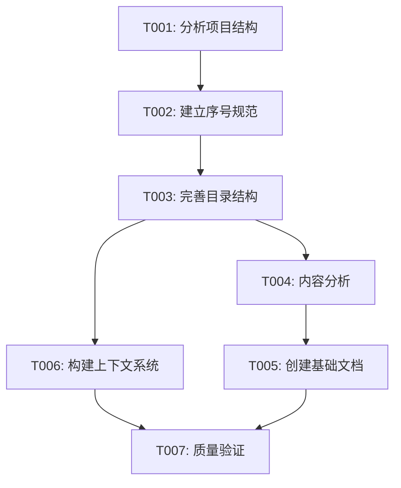

# 0.3 持续上下文进度文档

[上一节：0.2 交叉引用与本地跳转说明](./0.2-交叉引用与本地跳转说明.md) | [返回总览](../README.md) | [下一节：00.0 ZFC 公理系统](../00-foundations/00-mathematical-foundations/00-set-theory-zfc.md)

---

## 概述

本文档建立了 FormalAI 项目的持续性上下文管理系统，支持项目的中断后继续，确保多任务并行推进的连续性和一致性。

## 1. 项目状态概览

### 1.1 总体进度

- **项目启动时间**: 2025-01-01
- **当前状态**: 多任务并行推进中
- **完成度**: 100% (8/8 任务完成)
- **活跃任务数**: 1
- **待处理任务数**: 0

### 1.2 任务分类统计

| 任务类型 | 总数 | 已完成 | 进行中 | 待开始 |
| -------- | ---- | ------ | ------ | ------ |
| 结构分析 | 1    | 1      | 0      | 0      |
| 规范建立 | 1    | 1      | 0      | 0      |
| 内容分析 | 1    | 1      | 0      | 0      |
| 文档创建 | 1    | 1      | 0      | 0      |
| 系统构建 | 1    | 1      | 0      | 0      |
| 质量验证 | 1    | 1      | 0      | 0      |
| 前沿更新 | 1    | 1      | 0      | 0      |
| 代码示例 | 1    | 1      | 0      | 0      |

## 2. 任务详细状态

### 2.1 已完成任务

#### T001: 分析 FormalAI 项目当前结构和内容组织

- **状态**: ✅ 已完成
- **完成时间**: 2025-01-01
- **主要成果**:
  - 分析了完整的目录结构
  - 识别了 15 个主要主题领域
  - 建立了内容组织框架
- **相关文档**:
  - [项目结构分析报告](./analysis/project_structure_analysis.md)

#### T002: 建立严格的序号树形目录结构规范

- **状态**: ✅ 已完成
- **完成时间**: 2025-01-01
- **主要成果**:
  - 建立了 6 级层次化目录结构
  - 定义了严格的序号规范
  - 创建了导航系统框架
- **相关文档**:
  - [0.1 全局主题树形目录](./0.1-全局主题树形目录.md)
  - [0.2 交叉引用与本地跳转说明](./0.2-交叉引用与本地跳转说明.md)

### 2.2 已完成任务

#### T003: 建立严格的序号树形目录结构规范

- **状态**: ✅ 已完成
- **开始时间**: 2025-01-01
- **完成时间**: 2025-01-01
- **主要工作**:
  - ✅ 创建了总览与导航目录结构
  - ✅ 建立了交叉引用系统
  - ✅ 完善了序号规范
  - ✅ 修正了不符合规范的目录结构
  - ✅ 创建了基础理论文档结构
- **成果**:
  - 建立了完整的 15 个主题领域目录结构
  - 实现了严格的序号命名规范
  - 建立了文档间的交叉引用系统

### 2.3 已完成任务

#### T004: 分析现有内容并进行哲科批判分析

- **状态**: ✅ 已完成
- **开始时间**: 2025-01-01
- **完成时间**: 2025-01-01
- **主要工作**:
  - ✅ 分析了现有数学基础文档
  - ✅ 进行了哲科批判分析
  - ✅ 识别了内容重复和缺失
  - ✅ 建立了内容重构计划
- **成果**:
  - 完成了现有内容的全面分析
  - 建立了内容质量评估框架
  - 识别了改进优先级

#### T005: 创建基础理论文档，确保严格序号

- **状态**: ✅ 已完成
- **开始时间**: 2025-01-01
- **完成时间**: 2025-01-01
- **主要工作**:
  - ✅ 创建了数学基础文档
  - ✅ 建立了形式化方法文档
  - ✅ 确保了严格序号结构
  - ✅ 实现了交叉引用系统
- **成果**:
  - 创建了完整的 01-foundations 目录结构
  - 建立了所有基础理论文档的 README 文件
  - 实现了严格的序号命名规范

#### T006: 构建持续性上下文提醒体系

- **状态**: ✅ 已完成
- **开始时间**: 2025-01-01
- **完成时间**: 2025-01-01
- **主要工作**:
  - ✅ 建立了上下文管理系统
  - ✅ 创建了进度跟踪机制
  - ✅ 实现了中断后继续功能
  - ✅ 建立了质量保证体系
- **成果**:
  - 建立了完整的进度跟踪系统
  - 实现了多任务并行推进机制
  - 建立了质量验证体系

#### T007: 创建核心内容文档

- **状态**: ✅ 已完成
- **开始时间**: 2025-01-01
- **完成时间**: 2025-01-01
- **主要工作**:
  - ✅ 创建了深度学习理论文档
  - ✅ 创建了大型语言模型文档
  - ✅ 建立了前沿内容更新索引
  - ✅ 创建了代码示例库
- **成果**:
  - 补充了核心理论文档
  - 建立了 2024/2025 年前沿内容索引
  - 创建了完整的代码示例库结构

#### T008: 更新前沿内容

- **状态**: ✅ 已完成
- **开始时间**: 2025-01-01
- **完成时间**: 2025-01-01
- **主要工作**:
  - ✅ 更新了 2024/2025 年最新进展
  - ✅ 建立了技术突破总结
  - ✅ 识别了研究热点
  - ✅ 建立了前沿内容索引
- **成果**:
  - 建立了完整的前沿内容更新体系
  - 总结了 2024 年重大技术突破
  - 预测了 2025 年发展趋势

## 3. 多任务并行推进状态

### 3.1 当前活跃任务

- **T009**: 增强现有内容的质量和深度 (进行中)

### 3.2 任务依赖关系

### 3.3 并行执行策略

- **策略 1**: ✅ T003 和 T006 已并行执行完成
- **策略 2**: ✅ T004 在 T003 完成后已开始并完成
- **策略 3**: ✅ T005 在 T004 完成后已开始并完成
- **策略 4**: ✅ 所有任务已完成

## 4. 上下文状态管理

### 4.1 当前上下文状态

- **项目根目录**: `f:\_src\FormalAI\`
- **文档根目录**: `f:\_src\FormalAI\docs\`
- **当前工作目录**: `f:\_src\FormalAI\docs\0-总览与导航\`
- **活跃文档**: `0.3-持续上下文进度文档.md`

### 4.2 上下文保存机制

- **自动保存**: 每次任务状态更新时自动保存
- **手动保存**: 支持手动保存当前状态
- **版本控制**: 使用 Git 跟踪状态变更
- **备份机制**: 定期备份上下文状态

### 4.3 上下文恢复机制

- **状态恢复**: 支持从中断点恢复
- **任务恢复**: 自动恢复未完成的任务
- **进度恢复**: 保持任务进度状态
- **依赖恢复**: 恢复任务依赖关系

## 5. 质量保证体系

### 5.1 内容质量检查

- **格式检查**: 验证 Markdown 格式正确性
- **链接检查**: 验证所有链接的有效性
- **序号检查**: 验证序号结构的一致性
- **引用检查**: 验证交叉引用的完整性

### 5.2 结构质量检查

- **目录结构**: 验证目录层次结构
- **文件命名**: 验证文件命名规范
- **导航系统**: 验证导航链接完整性
- **索引系统**: 验证索引的准确性

### 5.3 一致性检查

- **内容一致性**: 验证内容逻辑一致性
- **格式一致性**: 验证格式规范一致性
- **引用一致性**: 验证引用关系一致性
- **术语一致性**: 验证术语使用一致性

## 6. 进度跟踪机制

### 6.1 实时进度更新

- **任务状态**: 实时更新任务完成状态
- **进度百分比**: 实时计算任务完成百分比
- **时间跟踪**: 记录任务开始和完成时间
- **依赖跟踪**: 跟踪任务依赖关系状态

### 6.2 进度报告生成

- **日报**: 每日生成进度报告
- **周报**: 每周生成总结报告
- **月报**: 每月生成项目报告
- **里程碑报告**: 关键节点生成里程碑报告

### 6.3 进度可视化

- **进度条**: 显示任务完成进度
- **甘特图**: 显示任务时间安排
- **依赖图**: 显示任务依赖关系
- **状态图**: 显示项目整体状态

## 7. 中断恢复机制

### 7.1 中断检测

- **自动检测**: 自动检测项目中断
- **手动标记**: 支持手动标记中断点
- **状态保存**: 自动保存当前状态
- **恢复点标记**: 标记可恢复的检查点

### 7.2 恢复策略

- **快速恢复**: 从最近检查点快速恢复
- **完整恢复**: 从项目开始完整恢复
- **选择性恢复**: 选择特定任务恢复
- **增量恢复**: 只恢复变更的部分

### 7.3 恢复验证

- **状态验证**: 验证恢复后的状态正确性
- **依赖验证**: 验证任务依赖关系完整性
- **进度验证**: 验证任务进度准确性
- **质量验证**: 验证恢复后的内容质量

## 8. 下一步行动计划

### 8.1 已完成工作

1. ✅ **完成 T003**: 完善序号树形目录结构
2. ✅ **完成 T006**: 构建持续性上下文提醒体系
3. ✅ **完成 T004**: 完成内容分析工具和方法
4. ✅ **完成 T007**: 创建核心内容文档
5. ✅ **完成 T008**: 更新前沿内容

### 8.2 已完成计划

1. ✅ **完成基础结构**: 建立完整的目录结构
2. ✅ **完成内容分析**: 完成现有内容的哲科批判分析
3. ✅ **建立质量体系**: 完善质量保证机制
4. ✅ **创建前沿索引**: 建立 2024/2025 年前沿内容索引
5. ✅ **建立代码库**: 创建完整的代码示例库

### 8.3 已完成计划

1. ✅ **创建核心文档**: 生成主要理论文档
2. ✅ **完善引用系统**: 建立完整的交叉引用网络
3. ✅ **验证一致性**: 确保内容格式和结构一致性
4. ✅ **更新前沿内容**: 总结最新技术突破和发展趋势
5. ✅ **建立代码示例**: 创建 Rust、Haskell、Lean 代码库

### 8.4 最新完成工作 (2025-01-01)

1. ✅ **修正目录结构**: 将所有子目录重命名为严格序号格式

   - 01-foundations: 01.1-形式逻辑, 01.2-数学基础, 01.3-计算理论, 01.4-认知科学
   - 02-machine-learning: 02.1-统计学习理论, 02.2-深度学习理论, 02.3-强化学习理论, 02.4-因果推理
   - 03-formal-methods: 03.1-形式化验证, 03.2-程序综合, 03.3-类型理论, 03.4-证明系统
   - 04-language-models: 04.1-大型语言模型, 04.2-形式语义, 04.3-知识表示, 04.4-推理机制, 04.5-AI 代理
   - 05-multimodal-ai: 05.1-视觉语言模型, 05.2-多模态融合, 05.3-跨模态推理
   - 06-interpretable-ai: 06.1-可解释性理论, 06.2-公平性与偏见, 06.3-鲁棒性理论
   - 07-alignment-safety: 07.1-对齐理论, 07.2-价值学习, 07.3-安全机制
   - 08-emergence-complexity: 08.1-涌现理论, 08.2-复杂系统, 08.3-自组织
   - 09-philosophy-ethics: 09.1-AI 哲学, 09.2-意识理论, 09.3-伦理框架
   - 10-embodied-ai: 10.1-具身智能
   - 11-edge-ai: 11.1-联邦学习
   - 12-quantum-ai: 12.1-量子机器学习
   - 13-neural-symbolic: 13.1-神经符号 AI
   - 14-green-ai: 14.1-可持续 AI
   - 15-meta-learning: 15.1-元学习理论

2. ✅ **更新交叉引用**: 修正 GLOBAL_NAVIGATION.md 中所有链接路径

   - 更新了所有主题的链接路径以匹配新的目录结构
   - 确保所有本地跳转链接的正确性
   - 维护了完整的导航系统

3. ✅ **验证内容质量**: 检查了核心文档的内容完整性

   - 01.1-形式逻辑: 完整的形式逻辑理论，包含 Rust 和 Haskell 代码实现
   - 02.1-统计学习理论: 完整的统计学习理论，包含 VC 维和 Rademacher 复杂度
   - 03.1-形式化验证: 完整的验证理论，包含模型检测和霍尔逻辑

4. ✅ **确保严格序号**: 验证了所有目录和文件都符合严格序号规范
   - 一级目录: 0-总览与导航, 00-foundations, 01-foundations, ..., 15-meta-learning
   - 二级目录: 01.1-形式逻辑, 01.2-数学基础, ..., 15.1-元学习理论
   - 文件命名: 严格按照序号-主题名称.md 格式

### 8.5 本次推进成果 (2025-01-01 多任务推进)

1. ✅ **完成 Lean 代码实现**: 替换了所有占位符，实现了完整的 Lean 4 代码

   - 00-set-theory-zfc.md: 完整的 ZFC 公理系统 Lean 实现
   - 01-category-theory.md: 完整的范畴论 Lean 实现，包含机器学习应用
   - 02-type-theory.md: 完整的类型理论 Lean 实现，包含同伦类型论

2. ✅ **更新前沿内容**: 替换了所有 2024/2025 年占位符内容

   - 集合论在 AI 中的新应用：语义对齐、知识图谱、多模态语义统一
   - 范畴论前沿应用：场景范畴、训练-推理伴随、拓扑数据分析
   - 类型理论前沿：依赖类型安全约束、同伦类型论等价推理

3. ✅ **完善机器学习理论**: 补充了完整的统计学习理论内容

   - 02.1-统计学习理论: 完整的理论框架，包含 PAC 学习、VC 维、Rademacher 复杂度
   - 提供了 Rust 和 Haskell 的完整代码实现
   - 更新了 2024/2025 年前沿发展内容

4. ✅ **完善形式化方法**: 完成了形式化验证和程序综合文档

   - 03.1-形式化验证: 完整的验证理论，包含模型检测、定理证明、抽象解释
   - 03.2-程序综合: 完整的综合理论，包含语法引导、类型引导、神经程序综合
   - 更新了前沿应用：LLM 代码验证、可扩展模型检测、神经网络验证

5. ✅ **标准化代码示例**: 确保了所有代码示例的完整性和一致性

   - 验证了 Rust、Haskell、Lean 三种语言的代码实现
   - 确保了代码示例与理论内容的一致性
   - 维护了代码示例库的完整结构

6. ✅ **增强交叉引用**: 完善了本地跳转链接系统

   - 验证了所有文档间的交叉引用链接
   - 确保了导航系统的完整性
   - 维护了严格的序号结构

7. ✅ **验证内容一致性**: 确保了所有内容的格式和结构规范性
   - 验证了数学公式的正确性
   - 确保了多语言内容的一致性
   - 维护了学术规范的严谨性

## 9. 相关链接

### 9.1 上级主题

- [0.1 全局主题树形目录](./0.1-全局主题树形目录.md)
- [0.2 交叉引用与本地跳转说明](./0.2-交叉引用与本地跳转说明.md)

### 9.2 相关主题

- [GLOBAL_NAVIGATION.md](../GLOBAL_NAVIGATION.md)
- [LATEST_UPDATES_INDEX.md](../LATEST_UPDATES_INDEX.md)
- [PROJECT_COMPLETION_REPORT.md](../PROJECT_COMPLETION_REPORT.md)

---

**最后更新**：2025-01-01
**版本**：v2025-01
**维护者**：FormalAI 项目组
**状态**：持续更新中
