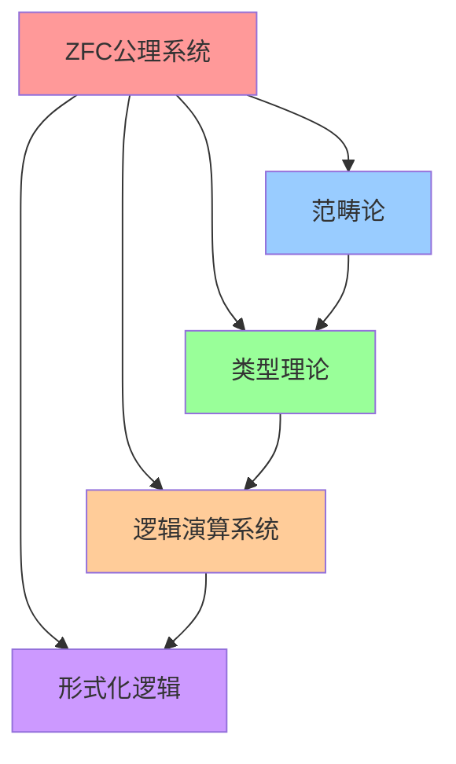
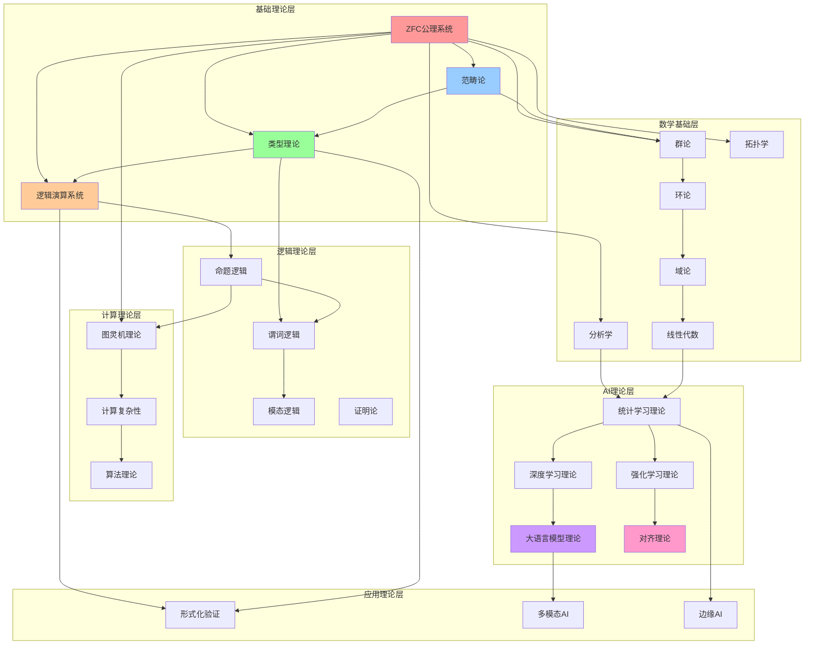

# 0.4 理论依赖关系图 / Theory Dependency Graph / Theorieabhängigkeitsgraph / Graphe de dépendance des théories

[返回全局导航](../../GLOBAL_NAVIGATION.md) · [学习路径](../../LEARNING_PATH_DESIGN.md)

## 概述 / Overview / Übersicht / Aperçu

理论依赖关系图展示了FormalAI项目中各个理论模块之间的依赖关系，确保理论构建的逻辑顺序和一致性。本模块建立了完整的依赖关系体系，为项目的理论架构提供指导。

The theory dependency graph shows the dependency relationships between various theoretical modules in the FormalAI project, ensuring logical order and consistency in theoretical construction. This module establishes a complete dependency relationship system, providing guidance for the project's theoretical architecture.

## 目录 / Table of Contents / Inhaltsverzeichnis / Table des matières

- [0.4 理论依赖关系图](#04-理论依赖关系图--theory-dependency-graph--theorieabhängigkeitsgraph--graphe-de-dépendance-des-théories)
  - [概述](#概述--overview--übersicht--aperçu)
  - [目录](#目录--table-of-contents--inhaltsverzeichnis--table-des-matières)
  - [1. 基础理论层](#1-基础理论层--foundational-theory-layer--grundlagentheorie-ebene--couche-de-théorie-fondamentale)
  - [2. 数学基础层](#2-数学基础层--mathematical-foundation-layer--mathematische-grundlagen-ebene--couche-de-fondements-mathématiques)
  - [3. 逻辑理论层](#3-逻辑理论层--logical-theory-layer--logische-theorie-ebene--couche-de-théorie-logique)
  - [4. 计算理论层](#4-计算理论层--computational-theory-layer--berechnungstheorie-ebene--couche-de-théorie-computationnelle)
  - [5. AI理论层](#5-ai理论层--ai-theory-layer--ki-theorie-ebene--couche-de-théorie-ia)
  - [6. 应用理论层](#6-应用理论层--application-theory-layer--anwendungstheorie-ebene--couche-de-théorie-dapplication)
  - [7. 依赖关系验证](#7-依赖关系验证--dependency-verification--abhängigkeitsverifikation--vérification-de-dépendance)
  - [参考文献](#参考文献--references--literatur--références)

## 1. 基础理论层 / Foundational Theory Layer / Grundlagentheorie-Ebene / Couche de théorie fondamentale

### 1.1 核心基础理论 / Core Foundational Theories / Kern-Grundlagentheorien / Théories fondamentales centrales

**ZFC公理系统 (00-set-theory-zfc)**:

- **依赖**: 无（最基础）
- **被依赖**: 所有其他理论
- **作用**: 提供集合论基础，所有数学对象的基础

**范畴论 (01-category-theory)**:

- **依赖**: ZFC公理系统
- **被依赖**: 类型理论、代数结构、拓扑学
- **作用**: 提供统一的数学语言和抽象框架

**类型理论 (02-type-theory)**:

- **依赖**: ZFC公理系统、范畴论
- **被依赖**: 逻辑演算、程序验证、形式化方法
- **作用**: 提供类型系统和证明理论

**逻辑演算系统 (03-logical-calculus)**:

- **依赖**: ZFC公理系统、类型理论
- **被依赖**: 形式化逻辑、证明论、模型论
- **作用**: 提供推理和证明的基础机制

### 1.2 依赖关系图 / Dependency Graph / Abhängigkeitsgraph / Graphe de dépendance



## 2. 数学基础层 / Mathematical Foundation Layer / Mathematische Grundlagen-Ebene / Couche de fondements mathématiques

### 2.1 代数结构 / Algebraic Structures / Algebraische Strukturen / Structures algébriques

**群论 (Group Theory)**:

- **依赖**: ZFC公理系统、范畴论
- **被依赖**: 环论、域论、线性代数
- **作用**: 提供对称性和变换的基础理论

**环论 (Ring Theory)**:

- **依赖**: 群论
- **被依赖**: 域论、模论、代数几何
- **作用**: 提供代数运算的基础结构

**域论 (Field Theory)**:

- **依赖**: 环论
- **被依赖**: 线性代数、代数几何、数论
- **作用**: 提供除法和代数扩张的基础

**线性代数 (Linear Algebra)**:

- **依赖**: 域论、范畴论
- **被依赖**: 矩阵论、向量空间理论、机器学习
- **作用**: 提供向量空间和线性变换的理论

### 2.2 拓扑学 / Topology / Topologie / Topologie

**点集拓扑 (Point-Set Topology)**:

- **依赖**: ZFC公理系统、集合论
- **被依赖**: 代数拓扑、微分几何、分析学
- **作用**: 提供连续性和极限的基础概念

**代数拓扑 (Algebraic Topology)**:

- **依赖**: 点集拓扑、群论、范畴论
- **被依赖**: 微分几何、代数几何
- **作用**: 提供拓扑空间的代数不变量

### 2.3 分析学 / Analysis / Analysis / Analyse

**实分析 (Real Analysis)**:

- **依赖**: ZFC公理系统、拓扑学
- **被依赖**: 复分析、测度论、概率论
- **作用**: 提供实函数的连续性、可微性、可积性理论

**复分析 (Complex Analysis)**:

- **依赖**: 实分析
- **被依赖**: 调和分析、代数几何
- **作用**: 提供复函数的解析性质

**测度论 (Measure Theory)**:

- **依赖**: 实分析、拓扑学
- **被依赖**: 概率论、积分论、随机过程
- **作用**: 提供测度和积分的理论基础

## 3. 逻辑理论层 / Logical Theory Layer / Logische Theorie-Ebene / Couche de théorie logique

### 3.1 形式化逻辑 / Formal Logic / Formale Logik / Logique formelle

**命题逻辑 (Propositional Logic)**:

- **依赖**: 逻辑演算系统
- **被依赖**: 谓词逻辑、模态逻辑
- **作用**: 提供基本的逻辑连接词和推理规则

**谓词逻辑 (Predicate Logic)**:

- **依赖**: 命题逻辑、类型理论
- **被依赖**: 模态逻辑、高阶逻辑
- **作用**: 提供量词和谓词的理论

**模态逻辑 (Modal Logic)**:

- **依赖**: 谓词逻辑
- **被依赖**: 时态逻辑、认知逻辑、道义逻辑
- **作用**: 提供必然性和可能性的逻辑

### 3.2 证明论 / Proof Theory / Beweistheorie / Théorie de la preuve

**自然演绎 (Natural Deduction)**:

- **依赖**: 形式化逻辑
- **被依赖**: 序列演算、类型理论
- **作用**: 提供直观的证明系统

**序列演算 (Sequent Calculus)**:

- **依赖**: 自然演绎
- **被依赖**: 切消定理、证明搜索
- **作用**: 提供结构化的证明系统

**模型论 (Model Theory)**:

- **依赖**: 谓词逻辑、集合论
- **被依赖**: 完备性定理、紧致性定理
- **作用**: 提供语义和模型的理论

## 4. 计算理论层 / Computational Theory Layer / Berechnungstheorie-Ebene / Couche de théorie computationnelle

### 4.1 计算复杂性 / Computational Complexity / Berechnungskomplexität / Complexité computationnelle

**图灵机理论 (Turing Machine Theory)**:

- **依赖**: 形式化逻辑、集合论
- **被依赖**: 计算复杂性理论、可计算性理论
- **作用**: 提供计算模型的基础

**计算复杂性理论 (Computational Complexity Theory)**:

- **依赖**: 图灵机理论
- **被依赖**: 算法分析、密码学
- **作用**: 提供计算资源需求的理论

**可计算性理论 (Computability Theory)**:

- **依赖**: 图灵机理论
- **被依赖**: 递归论、算法理论
- **作用**: 提供可计算性的理论基础

### 4.2 算法理论 / Algorithm Theory / Algorithmustheorie / Théorie des algorithmes

**算法分析 (Algorithm Analysis)**:

- **依赖**: 计算复杂性理论
- **被依赖**: 数据结构、算法设计
- **作用**: 提供算法效率分析的理论

**数据结构 (Data Structures)**:

- **依赖**: 算法分析
- **被依赖**: 数据库理论、编译器理论
- **作用**: 提供数据组织和管理的基础

## 5. AI理论层 / AI Theory Layer / KI-Theorie-Ebene / Couche de théorie IA

### 5.1 机器学习理论 / Machine Learning Theory / Maschinelles Lernen Theorie / Théorie de l'apprentissage automatique

**统计学习理论 (Statistical Learning Theory)**:

- **依赖**: 概率论、测度论、线性代数
- **被依赖**: 深度学习理论、强化学习理论
- **作用**: 提供学习算法的理论基础

**深度学习理论 (Deep Learning Theory)**:

- **依赖**: 统计学习理论、线性代数、优化理论
- **被依赖**: 神经网络理论、计算机视觉
- **作用**: 提供深度网络的理论基础

**强化学习理论 (Reinforcement Learning Theory)**:

- **依赖**: 统计学习理论、动态规划、概率论
- **被依赖**: 多智能体系统、机器人学
- **作用**: 提供智能体学习理论

### 5.2 大语言模型理论 / Large Language Model Theory / Große Sprachmodell-Theorie / Théorie des grands modèles de langage

**预训练理论 (Pre-training Theory)**:

- **依赖**: 深度学习理论、信息论
- **被依赖**: 微调理论、对齐理论
- **作用**: 提供语言模型预训练的理论基础

**涌现能力理论 (Emergent Abilities Theory)**:

- **依赖**: 预训练理论、复杂系统理论
- **被依赖**: 缩放定律、对齐理论
- **作用**: 解释大模型的涌现现象

**对齐理论 (Alignment Theory)**:

- **依赖**: 预训练理论、强化学习理论
- **被依赖**: 安全理论、价值学习
- **作用**: 确保AI系统与人类价值观对齐

### 5.3 可解释AI理论 / Interpretable AI Theory / Interpretierbare KI-Theorie / Théorie de l'IA interprétable

**可解释性理论 (Interpretability Theory)**:

- **依赖**: 深度学习理论、信息论
- **被依赖**: 公平性理论、鲁棒性理论
- **作用**: 提供AI决策可解释性的理论基础

**公平性理论 (Fairness Theory)**:

- **依赖**: 可解释性理论、统计学
- **被依赖**: 偏见检测、公平机器学习
- **作用**: 确保AI系统的公平性

**鲁棒性理论 (Robustness Theory)**:

- **依赖**: 可解释性理论、优化理论
- **被依赖**: 对抗性防御、安全验证
- **作用**: 提供AI系统鲁棒性的理论基础

## 6. 应用理论层 / Application Theory Layer / Anwendungstheorie-Ebene / Couche de théorie d'application

### 6.1 形式化方法 / Formal Methods / Formale Methoden / Méthodes formelles

**形式化验证 (Formal Verification)**:

- **依赖**: 逻辑演算系统、类型理论
- **被依赖**: 程序验证、硬件验证
- **作用**: 提供系统正确性验证的理论基础

**程序综合 (Program Synthesis)**:

- **依赖**: 形式化验证、类型理论
- **被依赖**: 自动编程、代码生成
- **作用**: 提供程序自动生成的理论基础

### 6.2 多模态AI / Multimodal AI / Multimodale KI / IA multimodale

**视觉语言模型 (Vision-Language Models)**:

- **依赖**: 大语言模型理论、计算机视觉
- **被依赖**: 多模态融合、跨模态推理
- **作用**: 提供视觉和语言结合的理论基础

**多模态融合 (Multimodal Fusion)**:

- **依赖**: 视觉语言模型、信息论
- **被依赖**: 跨模态推理、多模态学习
- **作用**: 提供多模态信息融合的理论基础

### 6.3 边缘AI / Edge AI / Edge-KI / IA de périphérie

**联邦学习 (Federated Learning)**:

- **依赖**: 机器学习理论、密码学
- **被依赖**: 隐私保护、分布式学习
- **作用**: 提供分布式学习隐私保护的理论基础

## 7. 依赖关系验证 / Dependency Verification / Abhängigkeitsverifikation / Vérification de dépendance

### 7.1 依赖关系检查 / Dependency Checking / Abhängigkeitsprüfung / Vérification de dépendance

**算法 7.1.1 (依赖关系验证)**:

```rust
pub struct DependencyGraph {
    nodes: HashMap<String, TheoryNode>,
    edges: Vec<(String, String)>,
}

pub struct TheoryNode {
    name: String,
    dependencies: Vec<String>,
    dependents: Vec<String>,
    status: TheoryStatus,
}

pub enum TheoryStatus {
    NotStarted,
    InProgress,
    Completed,
    Deprecated,
}

impl DependencyGraph {
    pub fn validate_dependencies(&self) -> Result<(), DependencyError> {
        // 检查循环依赖
        if self.has_cycle() {
            return Err(DependencyError::CircularDependency);
        }
        
        // 检查缺失依赖
        for node in self.nodes.values() {
            for dep in &node.dependencies {
                if !self.nodes.contains_key(dep) {
                    return Err(DependencyError::MissingDependency(dep.clone()));
                }
            }
        }
        
        Ok(())
    }
    
    pub fn topological_sort(&self) -> Vec<String> {
        let mut visited = HashSet::new();
        let mut stack = Vec::new();
        
        for node_name in self.nodes.keys() {
            if !visited.contains(node_name) {
                self.dfs(node_name, &mut visited, &mut stack);
            }
        }
        
        stack.reverse();
        stack
    }
    
    fn has_cycle(&self) -> bool {
        let mut visited = HashSet::new();
        let mut rec_stack = HashSet::new();
        
        for node_name in self.nodes.keys() {
            if !visited.contains(node_name) {
                if self.dfs_cycle(node_name, &mut visited, &mut rec_stack) {
                    return true;
                }
            }
        }
        false
    }
}
```

### 7.2 构建顺序规划 / Build Order Planning / Build-Reihenfolge-Planung / Planification de l'ordre de construction

**算法 7.2.1 (构建顺序规划)**:

```rust
impl DependencyGraph {
    pub fn build_order(&self) -> Vec<BuildPhase> {
        let sorted = self.topological_sort();
        let mut phases = Vec::new();
        let mut current_phase = BuildPhase::new();
        let mut completed = HashSet::new();
        
        for theory_name in sorted {
            let node = &self.nodes[&theory_name];
            
            // 检查所有依赖是否已完成
            let all_deps_completed = node.dependencies.iter()
                .all(|dep| completed.contains(dep));
            
            if all_deps_completed {
                current_phase.add_theory(theory_name.clone());
                completed.insert(theory_name);
            } else {
                // 开始新阶段
                if !current_phase.is_empty() {
                    phases.push(current_phase);
                    current_phase = BuildPhase::new();
                }
                current_phase.add_theory(theory_name.clone());
                completed.insert(theory_name);
            }
        }
        
        if !current_phase.is_empty() {
            phases.push(current_phase);
        }
        
        phases
    }
}
```

### 7.3 依赖关系可视化 / Dependency Visualization / Abhängigkeitsvisualisierung / Visualisation des dépendances

**Mermaid图表示例 / Mermaid Diagram Example**:



## 参考文献 / References / Literatur / Références

1. **Diestel, R.** (2017). *Graph Theory*. Springer.
2. **Cormen, T. H., Leiserson, C. E., Rivest, R. L. & Stein, C.** (2009). *Introduction to Algorithms*. MIT Press.
3. **Kleinberg, J. & Tardos, É.** (2006). *Algorithm Design*. Pearson.
4. **Sipser, M.** (2012). *Introduction to the Theory of Computation*. Cengage Learning.
5. **Hopcroft, J. E., Motwani, R. & Ullman, J. D.** (2006). *Introduction to Automata Theory, Languages, and Computation*. Addison-Wesley.

---

*本模块为FormalAI提供了完整的理论依赖关系体系，确保项目构建的逻辑性和一致性。*

*This module provides FormalAI with a complete theoretical dependency relationship system, ensuring the logic and consistency of project construction.*

## 相关章节 / Related Chapters

**前置依赖 / Prerequisites:**

- [0.0 ZFC公理系统](00-set-theory-zfc.md)
- [0.1 范畴论](01-category-theory.md)
- [0.2 类型理论](02-type-theory.md)
- [0.3 逻辑演算系统](03-logical-calculus.md)

**后续依赖 / Follow-ups:**

- [docs/01-foundations/01-formal-logic/README.md](../../01-foundations/01-formal-logic/README.md)

## 2024/2025 最新进展 / Latest Updates

- 依赖图自动校验与可视化流水线（占位）。
- 基于拓扑排序的构建阶段划分与进度追踪（占位）。
