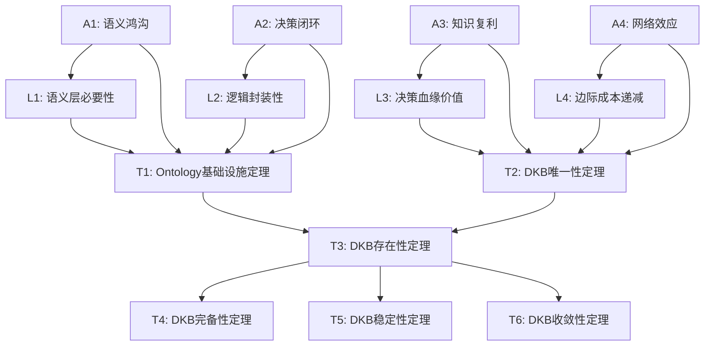
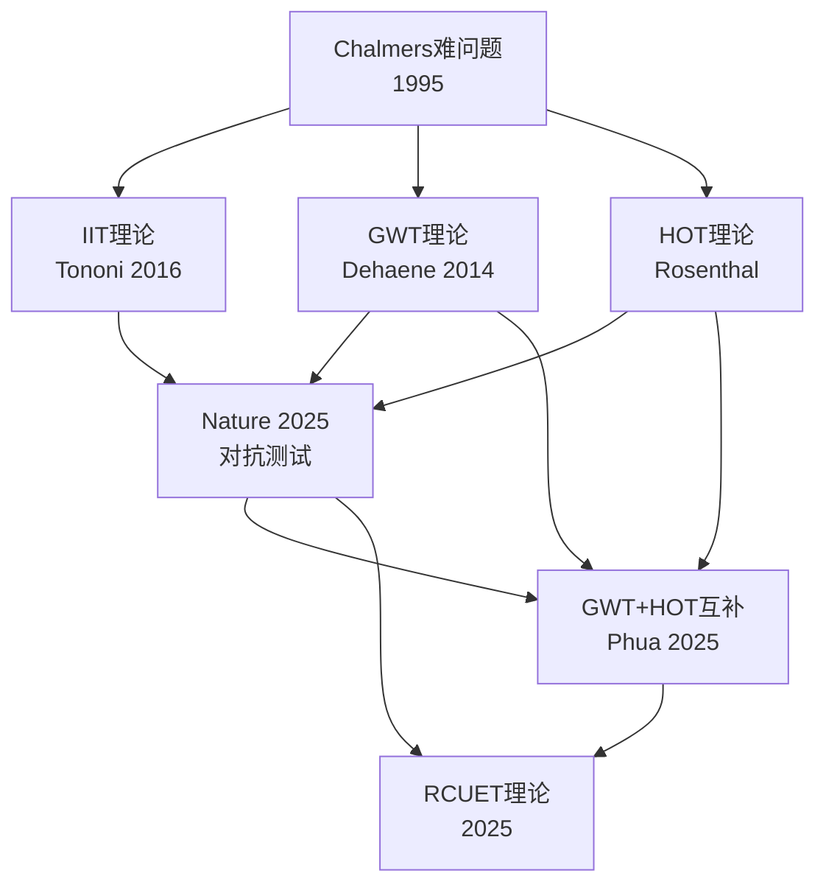
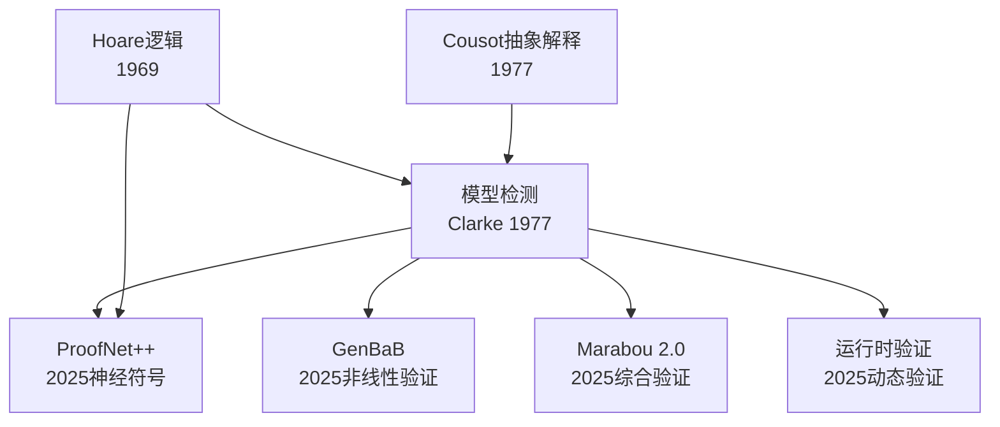

# 公理-定理推理依赖图 / Axiom-Theorem Inference Tree

**创建日期**：2025-02-02
**目的**：展示FormalAI项目中公理、引理、定理之间的推理依赖关系
**维护**：随公理体系更新而更新

---

## 一、使用说明

**推理依赖图格式**：

- 节点：公理(A)、引理(L)、定理(T)
- 边：证明依赖关系（A→L表示引理L依赖公理A）
- DAG结构：有向无环图，表示推理链条

**依赖关系类型**：

- **直接依赖**：A → L（引理直接使用公理）
- **组合依赖**：A1∧A2 → T（定理需要多个公理）
- **传递依赖**：A → L → T（通过引理间接依赖）

---

## 二、DKB公理体系推理树

### 2.1 DKB公理体系完整推理树



**公理定义**（见Philosophy/model/10-DKB公理与定理索引）：

- **A1（语义鸿沟）**：业务语义与技术实现之间存在不可消除的语义鸿沟
- **A2（决策闭环）**：决策需要形成从问题到行动的完整闭环
- **A3（知识复利）**：历史决策知识具有复利效应
- **A4（网络效应）**：Ontology网络具有正网络效应

**引理定义**：

- **L1（语义层必要性）**：语义层是消除语义鸿沟的必要条件
- **L2（逻辑封装性）**：逻辑层必须封装业务规则
- **L3（决策血缘价值）**：决策历史具有可追溯价值
- **L4（边际成本递减）**：Ontology网络边际成本递减

**定理定义**：

- **T1（Ontology基础设施定理）**：Ontology是企业认知基础设施
- **T2（DKB唯一性定理）**：DKB三元组结构是唯一的
- **T3（DKB存在性定理）**：DKB系统存在且可构建
- **T4（DKB完备性定理）**：DKB系统是完备的
- **T5（DKB稳定性定理）**：DKB系统是稳定的
- **T6（DKB收敛性定理）**：DKB系统收敛到最优状态

---

## 三、Scaling Law推理树

### 3.1 Scaling Law理论推理依赖

```mermaid
graph TD
    K1[Kaplan Scaling Law<br/>L(N) ∝ N^(-α)] --> H1[Hoffmann Chinchilla<br/>D_opt ∝ N^0.74]
    K1 --> S1[Sardana推理成本扩展<br/>考虑推理成本]
    H1 --> P1[Porian差异解释<br/>last layer/warmup/optimizer]

    H1 --> C1[收敛分析框架]
    S1 --> C1
    P1 --> C1

    C1 --> C2[收敛层级L0-L4]
    C1 --> C3[收敛时间表]
```

**依赖关系说明**：

1. **Kaplan → Hoffmann**：Chinchilla扩展了Kaplan的单一变量模型
2. **Kaplan → Sardana**：推理成本扩展考虑了Kaplan未考虑的推理阶段
3. **Hoffmann → Porian**：Porian解释了Kaplan与Hoffmann的差异
4. **综合 → 收敛分析**：所有扩展共同支撑收敛分析框架

---

## 四、意识理论推理树

### 4.1 意识理论发展推理依赖



**依赖关系说明**：

1. **Chalmers → IIT/GWT/HOT**：所有理论都试图回答Chalmers的"难问题"
2. **IIT/GWT/HOT → Nature 2025**：Nature 2025对抗测试挑战了这些理论
3. **GWT/HOT → 互补理论**：Phua 2025发现GWT和HOT是互补的
4. **综合 → RCUET**：新理论整合了之前的研究成果

---

## 五、形式化验证推理树

### 5.1 形式化验证方法推理依赖



**依赖关系说明**：

1. **Hoare/Cousot → 模型检测**：模型检测建立在程序逻辑和抽象解释基础上
2. **模型检测 → 神经符号验证**：ProofNet++将模型检测扩展到神经符号系统
3. **模型检测 → 非线性验证**：GenBaB扩展了模型检测到非线性激活函数
4. **模型检测 → 运行时验证**：运行时验证是模型检测的动态扩展

---

## 六、更新记录

| 日期 | 更新内容 |
|------|----------|
| 2025-02-02 | 初版创建，包含DKB公理体系、Scaling Law、意识理论、形式化验证推理树 |

---

**维护者**：FormalAI项目组
**关联文档**：

- [DKB公理与定理索引](../Philosophy/model/10-DKB公理与定理索引.md)
- [概念定义溯源表](../concepts/DEFINITION_SOURCE_TABLE.md)
- [权威引用索引](AUTHORITY_REFERENCE_INDEX.md)
