# Docs模块思维导图索引

**创建日期：2025-01-10  
**最后更新**：2025-11-10  
**维护者**：FormalAI项目组  
**文档版本**：v1.0  
**状态**：🔄 持续更新中

---

## 📋 执行摘要

本文档提供Docs模块关键主题的思维导图索引，包括：

1. **基础理论层思维导图**（数学基础、形式逻辑、计算理论）
2. **方法层思维导图**（机器学习、形式化方法）
3. **应用层思维导图**（语言模型、多模态AI、可解释AI）
4. **前沿层思维导图**（AGI、认知架构、神经符号AI）

---

## 一、思维导图总览

### 1.1 思维导图分类体系

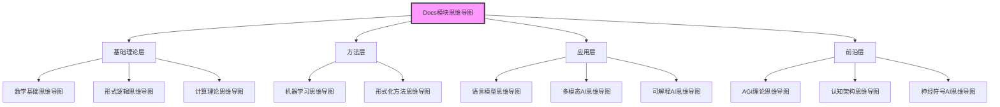

---

## 二、基础理论层思维导图

### 2.1 数学基础思维导图

**主题**：数学基础理论体系

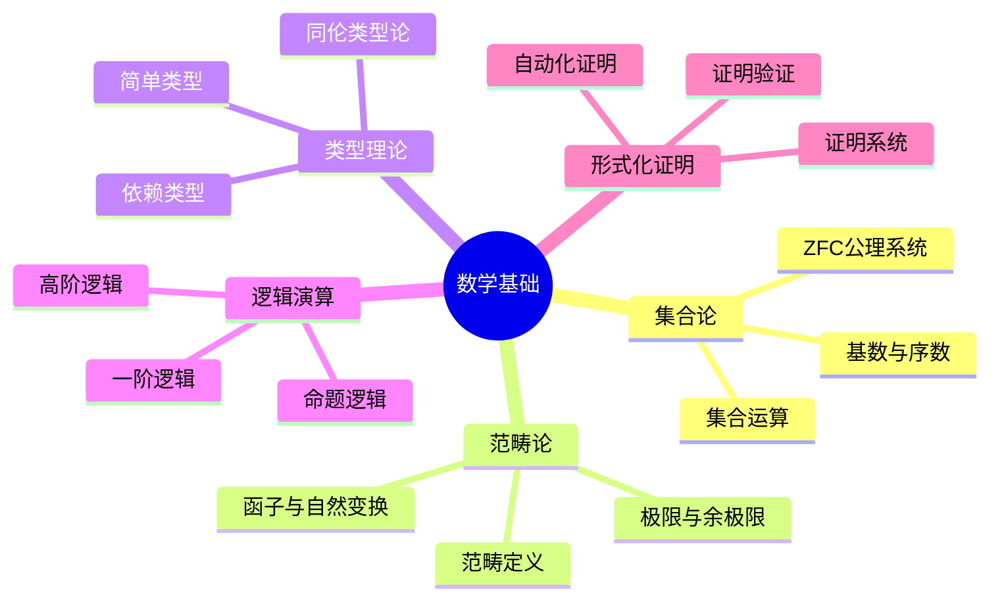

**关联文档**：
- [00.0 ZFC公理系统](./00-foundations/00-mathematical-foundations/00-set-theory-zfc.md)
- [00.1 范畴论](./00-foundations/00-mathematical-foundations/01-category-theory.md)
- [00.2 类型理论](./00-foundations/00-mathematical-foundations/02-type-theory.md)
- [00.3 逻辑演算系统](./00-foundations/00-mathematical-foundations/03-logical-calculus.md)
- [00.5 形式化证明](./00-foundations/00-mathematical-foundations/05-formal-proofs.md)

### 2.2 形式逻辑思维导图

**主题**：形式逻辑理论体系

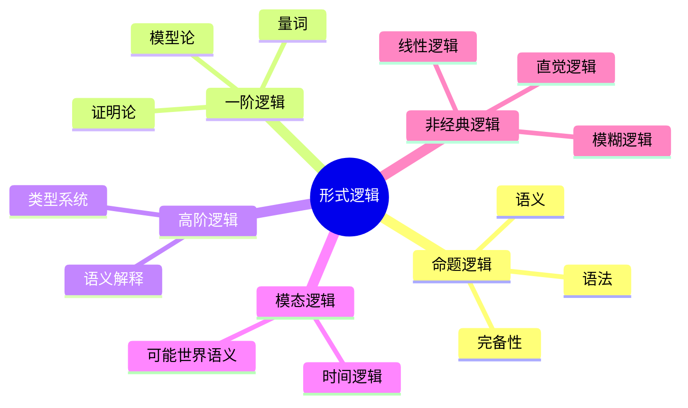

**关联文档**：
- [01.1 形式逻辑](./01-foundations/01.1-形式逻辑/README.md)
- [01.1.1 命题逻辑](./01-foundations/01.1-形式逻辑/01.1.1-命题逻辑.md)

### 2.3 计算理论思维导图

**主题**：计算理论体系

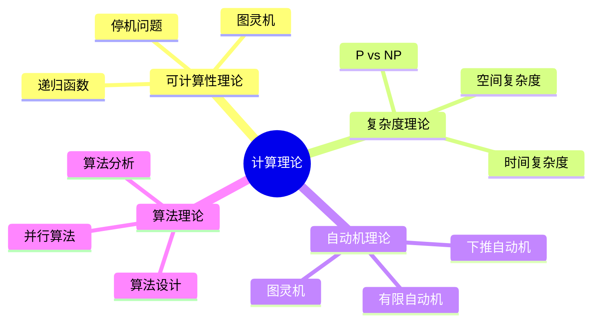

**关联文档**：
- [01.3 计算理论](./01-foundations/01.3-计算理论/README.md)

---

## 三、方法层思维导图

### 3.1 机器学习思维导图

**主题**：机器学习理论体系

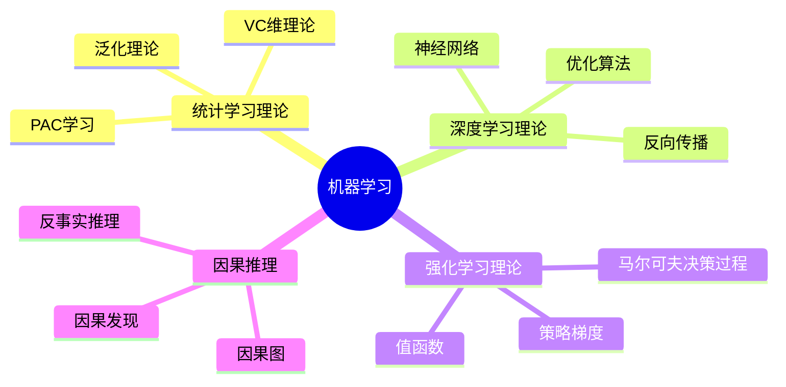

**关联文档**：
- [02.1 统计学习理论](./02-machine-learning/02.1-统计学习理论/README.md)
- [02.2 深度学习理论](./02-machine-learning/02.2-深度学习理论/README.md)
- [02.3 强化学习理论](./02-machine-learning/02.3-强化学习理论/README.md)
- [02.4 因果推理](./02-machine-learning/02.4-因果推理/README.md)

### 3.2 形式化方法思维导图

**主题**：形式化方法体系

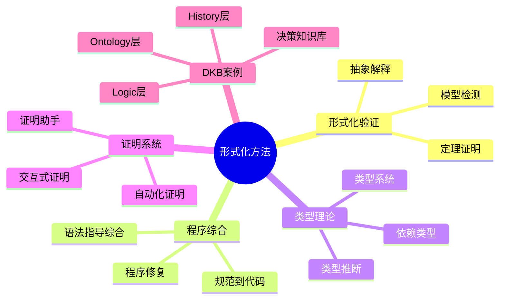

**关联文档**：
- [03.1 形式化验证](./03-formal-methods/03.1-形式化验证/README.md)
- [03.2 程序综合](./03-formal-methods/03.2-程序综合/README.md)
- [03.3 类型理论](./03-formal-methods/03.3-类型理论/README.md)
- [03.4 证明系统](./03-formal-methods/03.4-证明系统/README.md)
- [03.5 DKB案例研究](./03-formal-methods/03.5-DKB案例研究.md)

---

## 四、应用层思维导图

### 4.1 语言模型思维导图

**主题**：语言模型理论体系

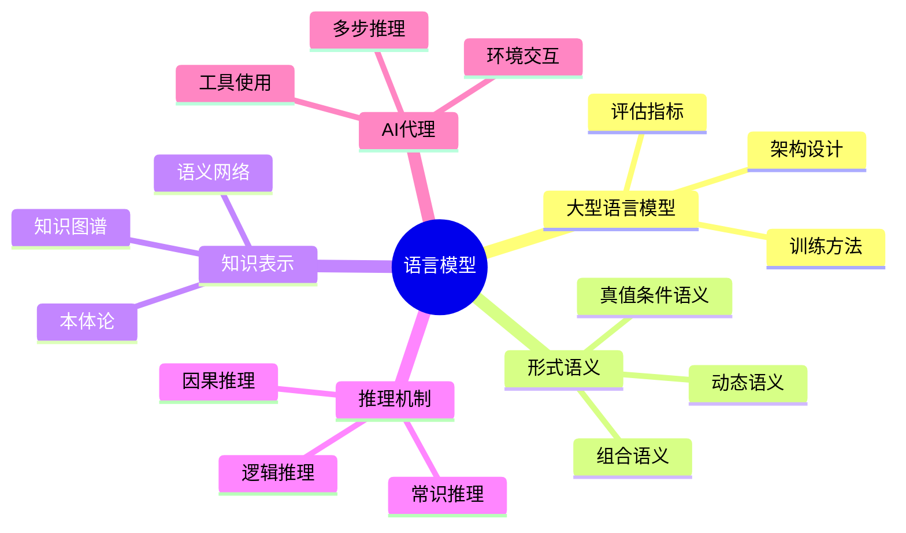

**关联文档**：
- [04.1 大型语言模型](./04-language-models/04.1-大型语言模型/README.md)
- [04.2 形式语义](./04-language-models/04.2-形式语义/README.md)
- [04.3 知识表示](./04-language-models/04.3-知识表示/README.md)
- [04.4 推理机制](./04-language-models/04.4-推理机制/README.md)
- [04.5 AI代理](./04-language-models/04.5-AI代理/README.md)

### 4.2 多模态AI思维导图

**主题**：多模态AI理论体系

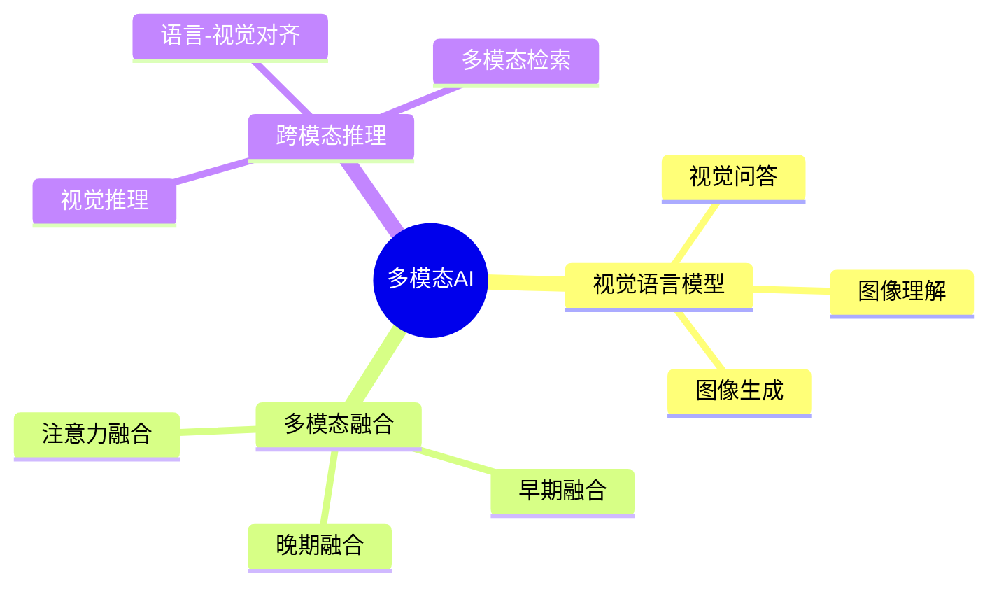

**关联文档**：
- [05.1 视觉语言模型](./05-multimodal-ai/05.1-视觉语言模型/README.md)
- [05.2 多模态融合](./05-multimodal-ai/05.2-多模态融合/README.md)
- [05.3 跨模态推理](./05-multimodal-ai/05.3-跨模态推理/README.md)

### 4.3 可解释AI思维导图

**主题**：可解释AI理论体系

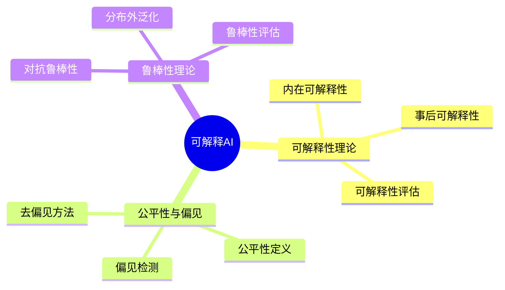

**关联文档**：
- [06.1 可解释性理论](./06-interpretable-ai/06.1-可解释性理论/README.md)
- [06.2 公平性与偏见](./06-interpretable-ai/06.2-公平性与偏见/README.md)
- [06.3 鲁棒性理论](./06-interpretable-ai/06.3-鲁棒性理论/README.md)

---

## 五、前沿层思维导图

### 5.1 AGI理论思维导图

**主题**：通用人工智能理论体系

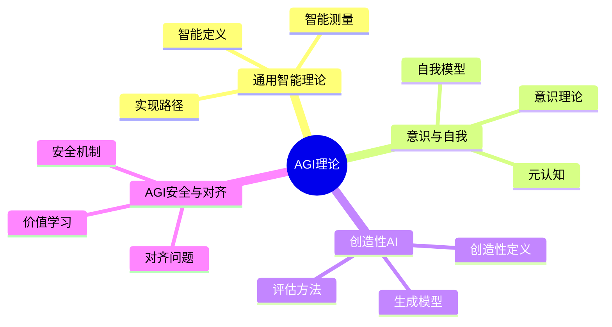

**关联文档**：
- [16.1 通用智能理论](./16-agi-theory/16.1-通用智能理论/README.md)
- [16.2 意识与自我](./16-agi-theory/16.2-意识与自我/README.md)
- [16.3 创造性AI](./16-agi-theory/16.3-创造性AI/README.md)
- [16.4 AGI安全与对齐](./16-agi-theory/16.4-AGI安全与对齐/README.md)

### 5.2 认知架构思维导图

**主题**：认知架构理论体系

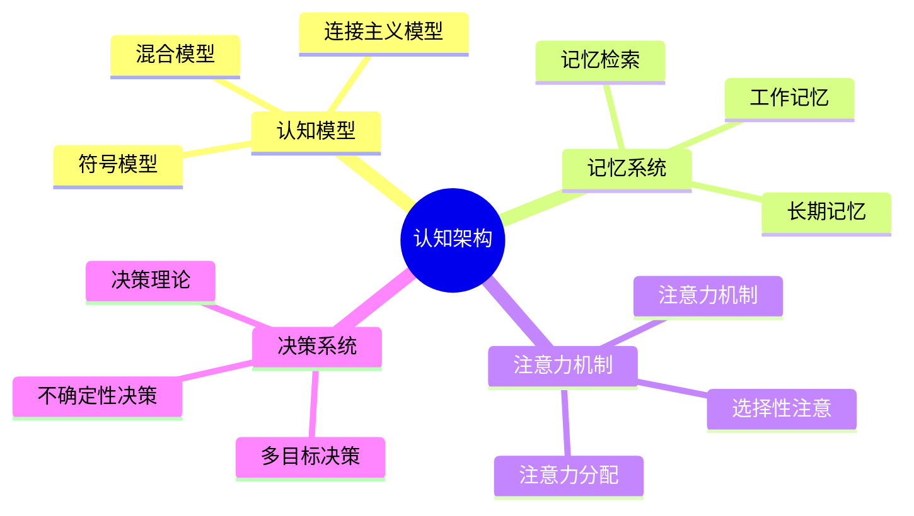

**关联文档**：
- [18.1 认知模型](./18-cognitive-architecture/18.1-认知模型/README.md)
- [18.2 记忆系统](./18-cognitive-architecture/18.2-记忆系统/README.md)
- [18.3 注意力机制](./18-cognitive-architecture/18.3-注意力机制/README.md)
- [18.4 决策系统](./18-cognitive-architecture/18.4-决策系统/README.md)

### 5.3 神经符号AI思维导图

**主题**：神经符号AI理论体系

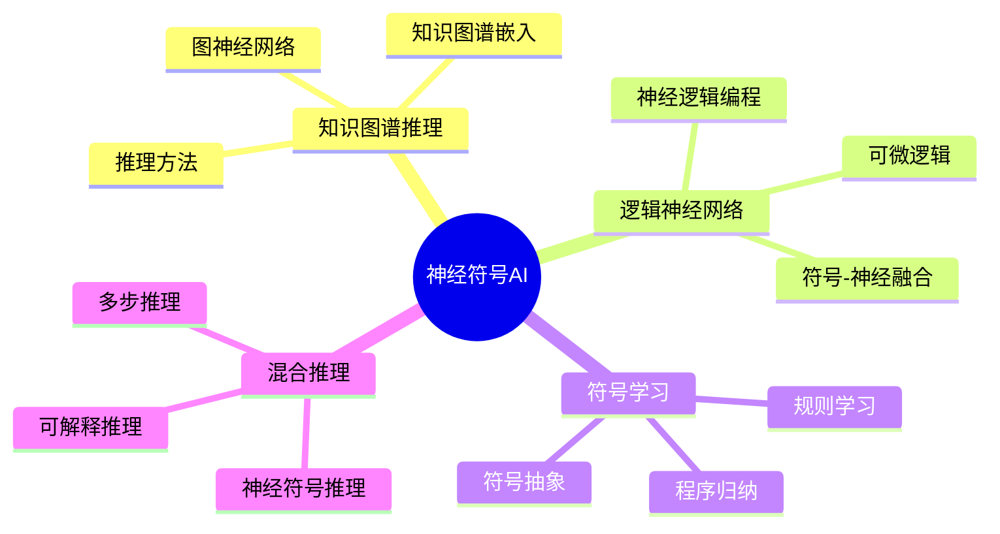

**关联文档**：
- [19.1 知识图谱推理](./19-neuro-symbolic-advanced/19.1-知识图谱推理/README.md)
- [19.2 逻辑神经网络](./19-neuro-symbolic-advanced/19.2-逻辑神经网络/README.md)
- [19.3 符号学习](./19-neuro-symbolic-advanced/19.3-符号学习/README.md)
- [19.4 混合推理](./19-neuro-symbolic-advanced/19.4-混合推理/README.md)

---

## 六、跨模块思维导图

### 6.1 Docs模块整体架构思维导图

**主题**：Docs模块整体知识体系

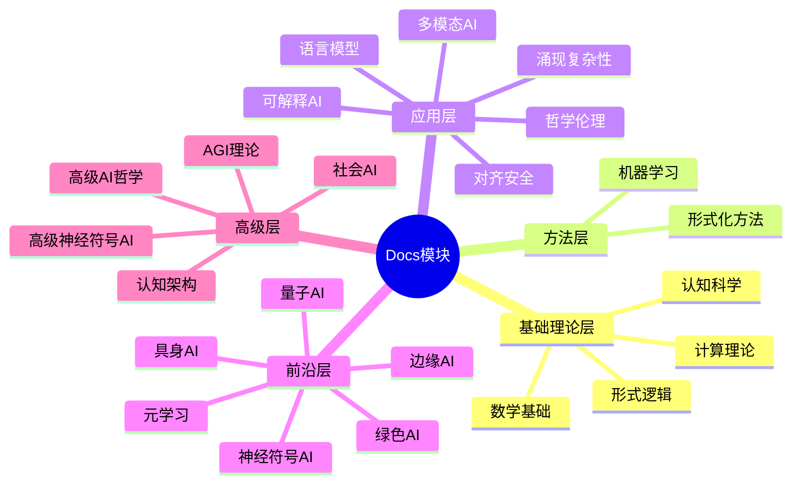

**关联文档**：
- [全局主题树形目录](./0-总览与导航/0.1-全局主题树形目录.md)
- [主题层级结构](./THEME_HIERARCHY_STRUCTURE.md)
- [主题语义结构](./THEME_SEMANTIC_STRUCTURE.md)

---

## 七、使用指南

### 7.1 按主题查找

- **数学基础** → 思维导图2.1
- **形式逻辑** → 思维导图2.2
- **计算理论** → 思维导图2.3
- **机器学习** → 思维导图3.1
- **形式化方法** → 思维导图3.2
- **语言模型** → 思维导图4.1
- **多模态AI** → 思维导图4.2
- **可解释AI** → 思维导图4.3
- **AGI理论** → 思维导图5.1
- **认知架构** → 思维导图5.2
- **神经符号AI** → 思维导图5.3

### 7.2 按应用场景

- **理论研究** → 思维导图2.1, 2.2, 2.3
- **方法学习** → 思维导图3.1, 3.2
- **应用开发** → 思维导图4.1, 4.2, 4.3
- **前沿探索** → 思维导图5.1, 5.2, 5.3
- **整体概览** → 思维导图6.1

---

## 八、参考文档

### 8.1 内部参考文档

- [PROJECT_THINKING_REPRESENTATIONS.md](../PROJECT_THINKING_REPRESENTATIONS.md) - 项目思维表征方式索引
- [Philosophy/model/02-思维导图总览.md](../Philosophy/model/02-思维导图总览.md) - Philosophy模块思维导图
- [concepts/CONCEPTS_COMPARISON_MATRIX.md](../concepts/CONCEPTS_COMPARISON_MATRIX.md) - Concepts模块对比矩阵

### 8.2 项目计划文档

- [PROJECT_COMPREHENSIVE_PLAN.md](../PROJECT_COMPREHENSIVE_PLAN.md) - 项目全面计划
- [PROJECT_CONCEPT_SYSTEM.md](../PROJECT_CONCEPT_SYSTEM.md) - 项目概念体系

---

**最后更新**：2025-11-10  
**维护者**：FormalAI项目组  
**文档版本**：v1.0（初始版本 - 创建Docs模块思维导图索引）
