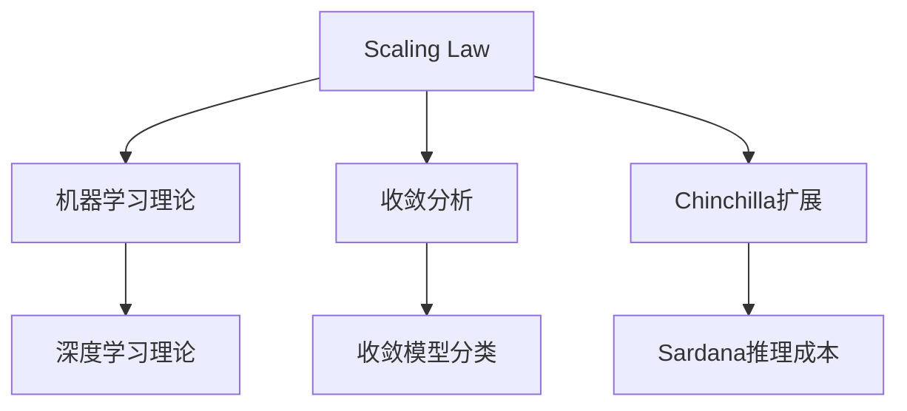
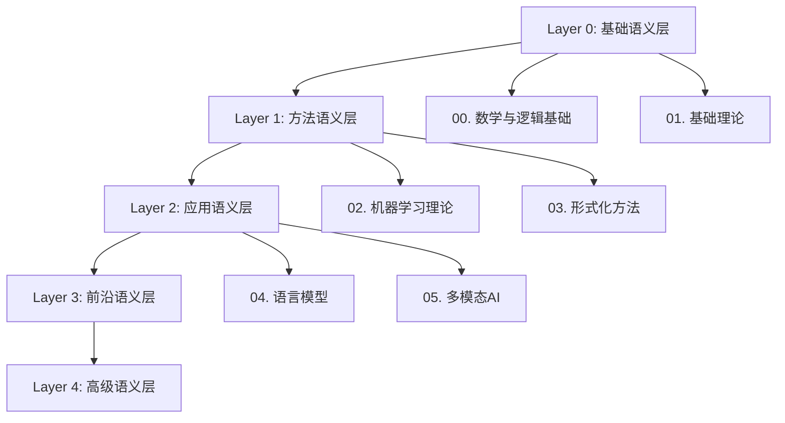
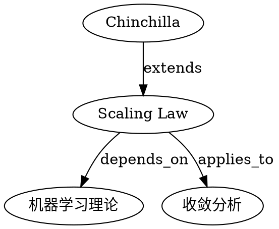

# 项目知识图谱构建 / Knowledge Graph Construction

**创建日期**：2025-02-02
**目的**：构建FormalAI项目的知识图谱，实现概念关系可视化、主题依赖关系图、跨模块映射增强
**理论基础**：知识图谱理论、图论、语义网络
**维护**：随项目内容更新同步维护

---

## 一、执行摘要

### 1.1 知识图谱结构

**三层知识图谱架构**：

```
Layer 1: 概念层（Concept Layer）
  - 节点：核心概念（如Scaling Law、意识、DKB等）
  - 边：概念关系（依赖、等价、扩展等）

Layer 2: 主题层（Topic Layer）
  - 节点：主题模块（如docs/03-formal-methods、concepts/03-Scaling Law等）
  - 边：主题依赖关系（前置依赖、后续应用等）

Layer 3: 模块层（Module Layer）
  - 节点：模块（docs、concepts、Philosophy）
  - 边：模块映射关系（概念映射、主题映射等）
```

### 1.2 知识图谱用途

1. **概念关系可视化**：可视化概念间的依赖、等价、扩展关系
2. **主题依赖关系图**：展示主题间的依赖关系和层次结构
3. **跨模块映射增强**：增强docs↔concepts↔Philosophy的映射关系
4. **学习路径优化**：基于知识图谱优化学习路径
5. **内容完整性检查**：基于知识图谱检查缺失链接

---

## 二、概念关系可视化

### 2.1 核心概念关系图

**概念节点分类**：

| 概念类型 | 示例 | 数量 |
|---------|------|------|
| **基础概念** | ZFC、范畴论、类型理论 | ~20 |
| **方法概念** | 形式化验证、Scaling Law | ~30 |
| **应用概念** | 大语言模型、多模态AI | ~40 |
| **高级概念** | AGI、意识、DKB | ~20 |

**关系类型**：

| 关系类型 | 说明 | 示例 |
|---------|------|------|
| **依赖关系** | A依赖B | Scaling Law → 机器学习理论 |
| **等价关系** | A等价B | DKB ↔ Ontology架构 |
| **扩展关系** | A扩展B | Chinchilla扩展 → Scaling Law |
| **应用关系** | A应用于B | 形式化验证 → 反实践判定 |

### 2.2 概念关系图实现

**使用工具**：

- **Cytoscape.js**：Web端可视化
- **Neo4j**：图数据库存储
- **Graphviz**：静态图生成

**可视化格式**：



---

## 三、主题依赖关系图

### 3.1 主题层次结构

**五层主题结构**（见 [docs/THEME_HIERARCHY_STRUCTURE.md](THEME_HIERARCHY_STRUCTURE.md)）：

```
Layer 0: 基础语义层
  - 00. 数学与逻辑基础
  - 01. 基础理论

Layer 1: 方法语义层
  - 02. 机器学习理论
  - 03. 形式化方法

Layer 2: 应用语义层
  - 04-09. 应用理论（6个主题）

Layer 3: 前沿语义层
  - 10-15. 前沿领域（6个主题）

Layer 4: 高级语义层
  - 16-20. 高级理论（5个主题）
```

### 3.2 主题依赖关系图

**依赖关系类型**：

| 依赖类型 | 说明 | 示例 |
|---------|------|------|
| **直接依赖** | A直接依赖B | 04-语言模型 → 02-机器学习理论 |
| **间接依赖** | A通过C依赖B | 04-语言模型 → 01-基础理论（通过02） |
| **可选依赖** | A可选依赖B | 05-多模态AI → 04-语言模型 |

**依赖关系图实现**：



---

## 四、跨模块映射增强

### 4.1 docs ↔ concepts映射

**映射关系表**（见 [PROJECT_CROSS_MODULE_MAPPING.md](../PROJECT_CROSS_MODULE_MAPPING.md)）：

| docs主题 | concepts概念 | 映射类型 | 映射强度 |
|---------|------------|---------|---------|
| 03-形式化验证 | 06-反实践判定系统 | 应用 | ★★★★☆ |
| 04-语言模型 | 01-三层模型架构（数据层） | 等价 | ★★★★★ |
| 09-意识理论 | 04-AI意识与认知模拟 | 等价 | ★★★★★ |
| 02-机器学习理论 | 03-Scaling Law | 应用 | ★★★★☆ |

### 4.2 Philosophy ↔ concepts映射

**映射关系表**：

| Philosophy概念 | concepts概念 | 映射类型 | 映射强度 |
|--------------|------------|---------|---------|
| Ontology | 07-AI框架批判（Ontology视角） | 等价 | ★★★★★ |
| DKB | 01-三层模型架构（架构对比） | 对比 | ★★★★☆ |
| ARI指数 | 03-Scaling Law（收敛分析） | 应用 | ★★★☆☆ |

### 4.3 docs ↔ Philosophy映射

**映射关系表**：

| docs主题 | Philosophy视角 | 映射类型 | 映射强度 |
|---------|--------------|---------|---------|
| 03-形式化方法 | view02（形式化证明层） | 等价 | ★★★★★ |
| 09-哲学与伦理 | view03（哲学转译层） | 等价 | ★★★★★ |
| 18-认知架构 | view05（全景论证层） | 应用 | ★★★★☆ |

---

## 五、知识图谱实现方案

### 5.1 数据模型设计

**概念节点模型**：

```json
{
  "id": "concept_001",
  "name": "Scaling Law",
  "type": "method_concept",
  "definition": "L(N) = a·N^-α + b",
  "authority_source": "Kaplan 2020, Hoffmann 2022",
  "module": "concepts/03-Scaling Law",
  "properties": {
    "formality": "high",
    "verifiability": "high"
  }
}
```

**关系边模型**：

```json
{
  "source": "concept_001",
  "target": "concept_002",
  "type": "depends_on",
  "strength": 0.9,
  "description": "Scaling Law依赖机器学习理论"
}
```

### 5.2 可视化实现

**Web可视化**（使用Cytoscape.js）：

```javascript
// 知识图谱可视化示例
const cy = cytoscape({
  container: document.getElementById('knowledge-graph'),
  elements: [
    { data: { id: 'scaling-law', label: 'Scaling Law' } },
    { data: { id: 'ml-theory', label: '机器学习理论' } },
    { data: { source: 'scaling-law', target: 'ml-theory', label: 'depends_on' } }
  ],
  style: [
    {
      selector: 'node',
      style: {
        'label': 'data(label)',
        'width': 100,
        'height': 100
      }
    }
  ]
});
```

**静态图生成**（使用Graphviz）：



---

## 六、知识图谱应用场景

### 6.1 学习路径优化

**基于知识图谱的学习路径**：

1. **识别前置依赖**：通过知识图谱识别概念的前置依赖
2. **优化学习顺序**：按照依赖关系优化学习顺序
3. **识别知识缺口**：识别缺失的前置知识

### 6.2 内容完整性检查

**基于知识图谱的完整性检查**：

1. **检查概念定义**：检查所有概念节点是否有定义
2. **检查概念关系**：检查所有关系边是否有说明
3. **检查跨模块映射**：检查跨模块映射是否完整

### 6.3 概念检索与导航

**基于知识图谱的检索**：

1. **概念检索**：通过概念名称检索相关概念
2. **关系导航**：通过关系边导航到相关概念
3. **模块导航**：通过模块映射导航到相关模块

---

## 七、参考文档

### 7.1 知识图谱理论

- [docs/AUTHORITY_REFERENCE_INDEX.md](AUTHORITY_REFERENCE_INDEX.md) §2.1：知识图谱与Ontology
- Stanford CS520: Knowledge Graphs [KG-01]
- W3C OWL 2 / RDF 1.1 [W3C-01, W3C-02]

### 7.2 项目文档

- [PROJECT_CROSS_MODULE_MAPPING.md](../PROJECT_CROSS_MODULE_MAPPING.md)：跨模块映射文档
- [docs/THEME_HIERARCHY_STRUCTURE.md](THEME_HIERARCHY_STRUCTURE.md)：主题层次结构
- [PROJECT_CONCEPT_SYSTEM.md](../PROJECT_CONCEPT_SYSTEM.md)：项目概念体系

---

**创建日期**：2025-02-02
**维护者**：FormalAI项目组
**下次更新**：随项目内容更新同步维护
