# AI/ML软件架构与系统模式 Comprehensive Analysis

> **版本**: 1.0
> **日期**: 2024年
> **深度对标**: CMU、Berkeley软件工程课程

---

## 目录

- [AI/ML软件架构与系统模式 Comprehensive Analysis](#aiml软件架构与系统模式-comprehensive-analysis)
  - [目录](#目录)
  - [1. 宏观架构模式](#1-宏观架构模式)
    - [1.1 微服务架构在ML系统中的应用](#11-微服务架构在ml系统中的应用)
      - [问题定义](#问题定义)
      - [解决方案](#解决方案)
      - [核心组件](#核心组件)
      - [优缺点分析](#优缺点分析)
      - [适用场景](#适用场景)
    - [1.2 事件驱动架构与流处理](#12-事件驱动架构与流处理)
      - [问题定义](#问题定义-1)
      - [解决方案](#解决方案-1)
      - [架构模式详解](#架构模式详解)
      - [优缺点分析](#优缺点分析-1)
      - [适用场景](#适用场景-1)
    - [1.3 Lambda架构 (批流分离)](#13-lambda架构-批流分离)
      - [问题定义](#问题定义-2)
      - [解决方案](#解决方案-2)
      - [三层职责详解](#三层职责详解)
      - [数据流示例](#数据流示例)
      - [优缺点分析](#优缺点分析-2)
      - [适用场景](#适用场景-2)
    - [1.4 Kappa架构 (纯流式)](#14-kappa架构-纯流式)
      - [问题定义](#问题定义-3)
      - [解决方案](#解决方案-3)
      - [核心思想](#核心思想)
      - [Lambda vs Kappa 对比](#lambda-vs-kappa-对比)
      - [优缺点分析](#优缺点分析-3)
      - [适用场景](#适用场景-3)
    - [1.5 分层架构 (数据层/特征层/模型层/服务层)](#15-分层架构-数据层特征层模型层服务层)
      - [问题定义](#问题定义-4)
      - [解决方案](#解决方案-4)
      - [各层详细说明](#各层详细说明)
      - [层间通信原则](#层间通信原则)
      - [优缺点分析](#优缺点分析-4)
  - [2. ML-Specific架构模式](#2-ml-specific架构模式)
    - [2.1 特征存储架构 (Feature Store)](#21-特征存储架构-feature-store)
      - [问题定义](#问题定义-5)
      - [解决方案](#解决方案-5)
      - [架构模式详解](#架构模式详解-1)
      - [特征存储类型对比](#特征存储类型对比)
      - [优缺点分析](#优缺点分析-5)
    - [2.2 模型服务架构](#22-模型服务架构)
      - [2.2.1 在线推理 (同步/异步)](#221-在线推理-同步异步)
        - [同步推理架构](#同步推理架构)
        - [异步推理架构](#异步推理架构)
      - [2.2.2 批量推理架构](#222-批量推理架构)
      - [2.2.3 混合推理架构](#223-混合推理架构)
    - [2.3 A/B测试与影子模式](#23-ab测试与影子模式)
      - [A/B测试架构](#ab测试架构)
      - [影子模式架构](#影子模式架构)
    - [2.4 模型版本管理与金丝雀发布](#24-模型版本管理与金丝雀发布)
      - [模型版本管理架构](#模型版本管理架构)
      - [金丝雀发布架构](#金丝雀发布架构)
  - [3. 工业级实践案例](#3-工业级实践案例)
    - [3.1 Netflix推荐系统架构](#31-netflix推荐系统架构)
      - [架构概览](#架构概览)
      - [关键技术创新](#关键技术创新)
      - [技术栈](#技术栈)
    - [3.2 Uber机器学习平台 (Michelangelo)](#32-uber机器学习平台-michelangelo)
      - [架构演进](#架构演进)
      - [核心设计原则](#核心设计原则)
      - [关键组件](#关键组件)
    - [3.3 Airbnb机器学习平台 (Bighead)](#33-airbnb机器学习平台-bighead)
      - [架构概览](#架构概览-1)
      - [核心成就](#核心成就)
      - [技术特点](#技术特点)
    - [3.4 Spotify特征平台](#34-spotify特征平台)
      - [数据平台架构](#数据平台架构)
      - [关键设计](#关键设计)
    - [3.5 阿里巴巴PAI平台](#35-阿里巴巴pai平台)
      - [四层架构](#四层架构)
      - [核心产品](#核心产品)
      - [PAI-Rec推荐引擎](#pai-rec推荐引擎)
  - [4. 架构质量属性](#4-架构质量属性)
    - [4.1 可扩展性 (Scalability)](#41-可扩展性-scalability)
      - [水平扩展 vs 垂直扩展](#水平扩展-vs-垂直扩展)
      - [ML系统扩展策略](#ml系统扩展策略)
    - [4.2 可用性与容错](#42-可用性与容错)
      - [可用性等级](#可用性等级)
      - [容错架构模式](#容错架构模式)
    - [4.3 延迟与吞吐量优化](#43-延迟与吞吐量优化)
      - [延迟优化策略](#延迟优化策略)
      - [模型推理优化](#模型推理优化)
    - [4.4 数据一致性保证](#44-数据一致性保证)
      - [一致性模型](#一致性模型)
      - [ML系统一致性挑战](#ml系统一致性挑战)
    - [4.5 安全性与隐私保护](#45-安全性与隐私保护)
      - [ML安全威胁](#ml安全威胁)
      - [隐私保护技术](#隐私保护技术)
  - [5. 架构决策树与选型指南](#5-架构决策树与选型指南)
    - [5.1 架构决策树](#51-架构决策树)
    - [5.2 技术选型矩阵](#52-技术选型矩阵)
      - [流处理引擎选型](#流处理引擎选型)
      - [模型服务框架选型](#模型服务框架选型)
      - [特征存储选型](#特征存储选型)
    - [5.3 架构演进路径](#53-架构演进路径)
  - [6. 反模式与陷阱](#6-反模式与陷阱)
    - [6.1 常见架构反模式](#61-常见架构反模式)
      - [反模式1: 大泥球 (Big Ball of Mud)](#反模式1-大泥球-big-ball-of-mud)
      - [反模式2: 分布式单体](#反模式2-分布式单体)
      - [反模式3: 训练-服务偏差](#反模式3-训练-服务偏差)
    - [6.2 性能陷阱](#62-性能陷阱)
    - [6.3 可靠性陷阱](#63-可靠性陷阱)
    - [6.4 最佳实践清单](#64-最佳实践清单)
  - [附录: 参考资源](#附录-参考资源)
    - [学术论文](#学术论文)
    - [工业实践](#工业实践)
    - [开源项目](#开源项目)

---

## 1. 宏观架构模式

### 1.1 微服务架构在ML系统中的应用

#### 问题定义

传统单体ML系统面临以下挑战：

- **模型耦合**: 多个模型共享同一代码库，升级困难
- **技术栈锁定**: 无法针对不同模型选择最优技术栈
- **扩展瓶颈**: 某些模型需要GPU，其他只需CPU，无法独立扩展
- **团队自治受限**: 数据科学家与工程师工作流冲突

#### 解决方案

将ML系统分解为独立部署的微服务：

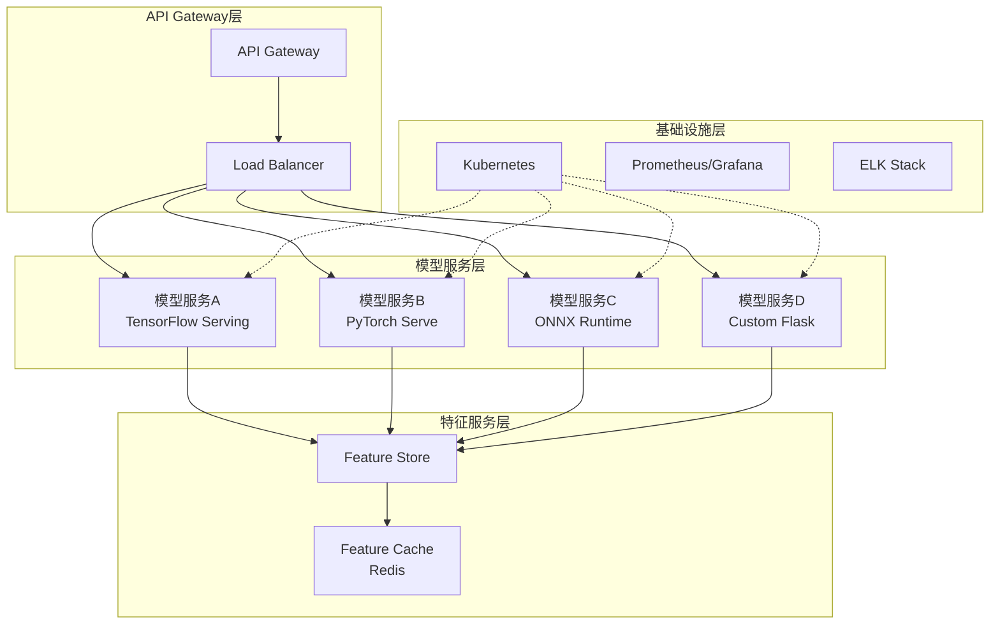

#### 核心组件

| 组件 | 职责 | 技术选型 |
|------|------|----------|
| 模型服务 | 提供模型推理API | TensorFlow Serving, TorchServe, Triton |
| 特征服务 | 特征存储与检索 | Feast, Tecton, Redis |
| 网关层 | 路由、限流、认证 | Kong, Ambassador, Istio |
| 编排层 | 容器编排与调度 | Kubernetes, Docker Swarm |

#### 优缺点分析

**优点**:

- ✅ **独立部署**: 单个模型更新不影响其他服务
- ✅ **技术异构**: 不同模型可使用最优框架
- ✅ **弹性扩展**: 按模型负载独立扩缩容
- ✅ **故障隔离**: 单点故障不会级联

**缺点**:

- ❌ **运维复杂度**: 服务数量增加带来管理负担
- ❌ **网络延迟**: 服务间通信引入额外延迟
- ❌ **数据一致性**: 分布式事务处理复杂
- ❌ **测试难度**: 端到端测试场景复杂

#### 适用场景

- 大型组织，多团队并行开发
- 模型迭代频繁，需要独立发布
- 不同模型有不同资源需求(CPU/GPU/内存)
- 需要多语言/多框架支持

---

### 1.2 事件驱动架构与流处理

#### 问题定义

传统请求-响应模式在ML场景下的局限：

- **实时性不足**: 批处理无法满足实时推荐需求
- **耦合度高**: 生产者和消费者直接依赖
- **可扩展性差**: 峰值流量处理能力有限
- **数据丢失风险**: 系统故障导致数据丢失

#### 解决方案

采用事件驱动架构，通过消息队列解耦系统组件：

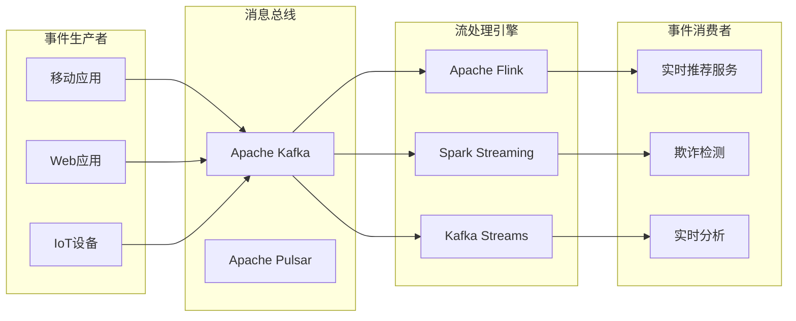

#### 架构模式详解

**1. 事件溯源模式 (Event Sourcing)**

```
┌─────────────────┐     ┌──────────────┐     ┌─────────────────┐
│   事件存储      │────▶│  投影构建器   │────▶│   读取模型      │
│ (Event Store)   │     │  (Projector) │     │  (Read Model)   │
└─────────────────┘     └──────────────┘     └─────────────────┘
         │                                            │
         │         ┌──────────────┐                 │
         └────────▶│   命令处理   │◀────────────────┘
                   │   (Command)  │
                   └──────────────┘
```

**2. CQRS模式 (Command Query Responsibility Segregation)**

| 维度 | 命令端 (Write) | 查询端 (Read) |
|------|----------------|---------------|
| 职责 | 处理写操作，更新模型 | 处理读操作，返回视图 |
| 优化目标 | 数据一致性 | 查询性能 |
| 存储 | 关系型数据库 | 缓存/搜索引擎 |
| 一致性 | 强一致性 | 最终一致性 |

#### 优缺点分析

**优点**:

- ✅ **高可扩展性**: 独立扩展生产者和消费者
- ✅ **松耦合**: 组件间通过事件通信
- ✅ **高可用性**: 消息队列提供缓冲能力
- ✅ **实时处理**: 毫秒级延迟的事件处理

**缺点**:

- ❌ **复杂性高**: 需要理解事件驱动编程模型
- ❌ **调试困难**: 异步流程追踪困难
- ❌ **顺序保证**: 全局顺序保证实现复杂
- ❌ **数据一致性**: 最终一致性需要业务适配

#### 适用场景

- 实时推荐系统
- 欺诈检测与风控
- IoT数据处理
- 用户行为分析

---

### 1.3 Lambda架构 (批流分离)

#### 问题定义

大数据处理需要同时满足：

- **准确性**: 需要完整历史数据的精确计算
- **实时性**: 需要低延迟的近似结果
- **容错性**: 系统故障后能快速恢复

#### 解决方案

Lambda架构通过三层结构解决上述问题：

```mermaid
graph TB
    subgraph "数据源"
        DS[原始数据流]
    end

    subgraph "批处理层 (Batch Layer)"
        BS[批量存储<br/>HDFS/S3]
        BM[批处理作业<br/>Spark/Hadoop]
        BV[批处理视图<br/>预计算结果]
    end

    subgraph "速度层 (Speed Layer)"
        SM[流处理<br/>Flink/Storm]
        RV[实时视图<br/>增量结果]
    end

    subgraph "服务层 (Serving Layer)")
        MERGE[视图合并]
        QUERY[查询接口]
    end

    DS --> BS
    DS --> SM
    BS --> BM
    BM --> BV
    SM --> RV
    BV --> MERGE
    RV --> MERGE
    MERGE --> QUERY
```

#### 三层职责详解

| 层级 | 职责 | 技术栈 | 延迟 |
|------|------|--------|------|
| **批处理层** | 存储完整数据集，计算精确视图 | Hadoop, Spark, Hive | 小时/天级 |
| **速度层** | 处理实时增量数据，提供近似视图 | Flink, Kafka Streams, Storm | 毫秒/秒级 |
| **服务层** | 合并批处理视图和实时视图，提供查询接口 | HBase, Cassandra, Druid | 毫秒级 |

#### 数据流示例

```
原始数据 ──────────────────────────────────────────────▶
    │                              │
    ▼                              ▼
┌──────────┐                 ┌──────────┐
│ 批处理层  │                 │ 速度层   │
│ (全量)   │                 │ (增量)   │
└────┬─────┘                 └────┬─────┘
     │                            │
     ▼                            ▼
┌──────────┐                 ┌──────────┐
│ 批处理视图 │                 │ 实时视图  │
│ (精确)   │                 │ (近似)   │
└────┬─────┘                 └────┬─────┘
     │                            │
     └──────────┬─────────────────┘
                ▼
          ┌──────────┐
          │ 服务层   │
          │ (合并)   │
          └────┬─────┘
               ▼
          ┌──────────┐
          │ 查询结果  │
          └──────────┘
```

#### 优缺点分析

**优点**:

- ✅ **容错性强**: 批处理层可重新计算任意历史视图
- ✅ **准确性高**: 批处理提供精确结果
- ✅ **实时性好**: 速度层提供低延迟近似结果
- ✅ **可扩展性**: 各层可独立扩展

**缺点**:

- ❌ **代码重复**: 批处理和流处理逻辑需要维护两份
- ❌ **运维复杂**: 需要维护两套处理系统
- ❌ **合并复杂**: 批处理视图和实时视图合并逻辑复杂
- ❌ **延迟不一致**: 批处理结果和实时结果可能存在差异

#### 适用场景

- 需要同时满足高准确性和低延迟的场景
- 历史数据需要重新计算的业务
- 数据仓库和实时分析结合的场景

---

### 1.4 Kappa架构 (纯流式)

#### 问题定义

Lambda架构的维护成本高，需要：

- 维护两套代码（批处理和流处理）
- 保证两套逻辑的一致性
- 处理批流合并的复杂性

#### 解决方案

Kappa架构通过纯流式处理简化架构：

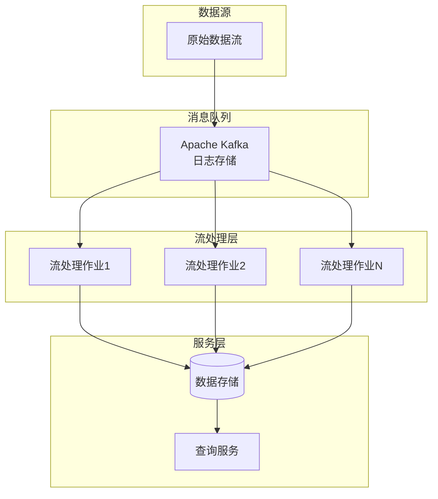

#### 核心思想

**"一切皆为流"** - 批处理是流处理的特例（有限流）

```
┌─────────────────────────────────────────────────────────┐
│                    Kappa 架构核心                        │
├─────────────────────────────────────────────────────────┤
│  1. 使用不可变日志作为唯一数据源                          │
│  2. 所有处理都通过流处理引擎完成                          │
│  3. 需要重新处理时，重新消费日志                          │
│  4. 通过重放实现批处理效果                               │
└─────────────────────────────────────────────────────────┘
```

#### Lambda vs Kappa 对比

| 维度 | Lambda架构 | Kappa架构 |
|------|------------|-----------|
| **代码维护** | 两套代码（批+流） | 一套代码（纯流） |
| **系统复杂度** | 高（多个系统） | 低（单一系统） |
| **重处理能力** | 批处理层天然支持 | 通过日志重放支持 |
| **实时性** | 速度层提供 | 流处理提供 |
| **准确性** | 批处理保证 | 依赖流处理语义 |
| **适用场景** | 复杂分析，需要精确结果 | 实时处理为主 |

#### 优缺点分析

**优点**:

- ✅ **代码统一**: 只需维护一套处理逻辑
- ✅ **架构简化**: 减少系统组件数量
- ✅ **开发效率**: 降低开发和维护成本
- ✅ **一致性**: 避免批流逻辑不一致问题

**缺点**:

- ❌ **重处理成本高**: 大规模数据重放耗时
- ❌ **流处理限制**: 某些复杂分析流处理难以实现
- ❌ **存储成本**: 需要长期保留日志数据
- ❌ **成熟度**: 流处理生态系统相对较新

#### 适用场景

- 以实时处理为主的场景
- 需要快速迭代的业务
- 团队流处理技术能力强
- 可以接受最终一致性

---

### 1.5 分层架构 (数据层/特征层/模型层/服务层)

#### 问题定义

ML系统复杂度随规模增长，需要：

- 清晰的职责边界
- 可独立演化的组件
- 团队并行开发能力
- 技术栈选择的灵活性

#### 解决方案

采用四层分层架构：

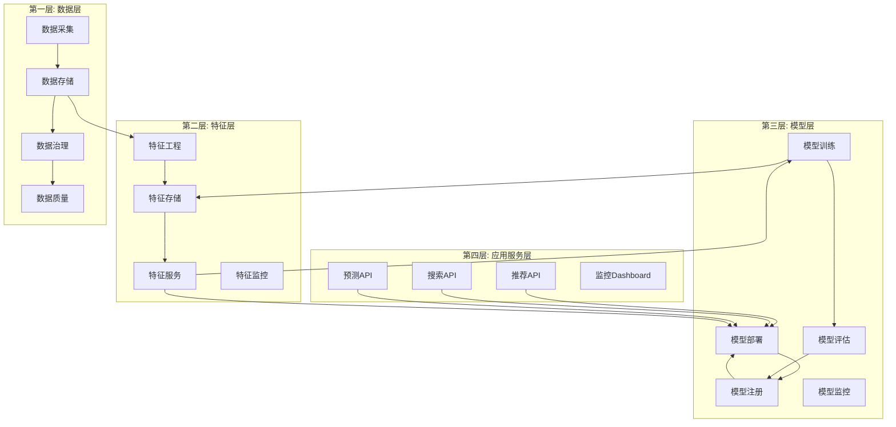

#### 各层详细说明

**第一层: 数据层 (Data Layer)**

| 组件 | 功能 | 技术选型 |
|------|------|----------|
| 数据采集 | 多源数据接入 | Kafka, Flume, Logstash |
| 数据存储 | 原始数据持久化 | HDFS, S3, Delta Lake |
| 数据治理 | 元数据管理、血缘追踪 | Apache Atlas, DataHub |
| 数据质量 | 数据校验、异常检测 | Great Expectations, Deequ |

**第二层: 特征层 (Feature Layer)**

| 组件 | 功能 | 技术选型 |
|------|------|----------|
| 特征工程 | 特征计算与转换 | Spark, Pandas, Feast |
| 特征存储 | 在线/离线特征统一管理 | Feast, Tecton, Redis |
| 特征服务 | 低延迟特征检索 | gRPC, REST API |
| 特征监控 | 特征漂移检测 | Evidently, WhyLabs |

**第三层: 模型层 (Model Layer)**

| 组件 | 功能 | 技术选型 |
|------|------|----------|
| 模型训练 | 分布式模型训练 | Kubeflow, MLflow, Ray |
| 模型评估 | 离线/在线评估 | MLflow, Weights & Biases |
| 模型注册 | 模型版本管理 | MLflow Model Registry |
| 模型部署 | 模型服务化 | Seldon, KServe, Triton |
| 模型监控 | 性能监控、漂移检测 | Evidently, Arize |

**第四层: 应用服务层 (Application Layer)**

| 组件 | 功能 | 技术选型 |
|------|------|----------|
| API网关 | 统一入口、认证、限流 | Kong, Ambassador |
| 业务服务 | 业务逻辑编排 | Flask, FastAPI, Spring |
| 监控系统 | 全链路监控 | Prometheus, Grafana |
| 实验平台 | A/B测试、流量分配 | Split, LaunchDarkly |

#### 层间通信原则

```
┌─────────────────────────────────────────────────────────────┐
│                    分层架构通信原则                          │
├─────────────────────────────────────────────────────────────┤
│  1. 上层可以调用下层，下层不能调用上层                        │
│  2. 同层组件可以相互调用                                      │
│  3. 通过定义良好的接口进行通信                                │
│  4. 避免跨层直接访问                                          │
│  5. 每层可以有自己的数据模型                                  │
└─────────────────────────────────────────────────────────────┘
```

#### 优缺点分析

**优点**:

- ✅ **职责清晰**: 每层有明确的职责边界
- ✅ **可测试性**: 每层可独立测试
- ✅ **可替换性**: 每层技术栈可独立演进
- ✅ **团队协作**: 不同团队可并行开发

**缺点**:

- ❌ **性能开销**: 层间转换带来额外开销
- ❌ **过度设计**: 简单场景可能过于复杂
- ❌ **学习成本**: 需要理解各层职责

---

## 2. ML-Specific架构模式

### 2.1 特征存储架构 (Feature Store)

#### 问题定义

特征工程中的核心挑战：

- **训练-服务偏差**: 在线和离线特征计算逻辑不一致
- **特征重复**: 不同团队重复开发相同特征
- **特征发现**: 难以发现和复用已有特征
- **特征一致性**: 在线/离线特征值不一致导致模型性能下降

#### 解决方案

特征存储作为中心化特征管理平台：

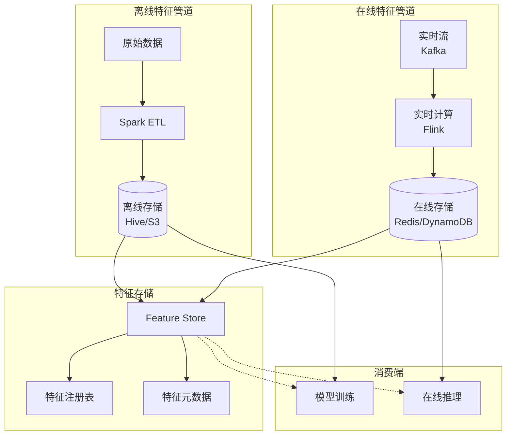

#### 架构模式详解

**1. 在线-离线一致性保证**

```
┌─────────────────────────────────────────────────────────────┐
│                 特征一致性保证机制                           │
├─────────────────────────────────────────────────────────────┤
│                                                              │
│   离线计算 ◄─────────────────────────────────► 在线计算      │
│      │                                          │           │
│      │    ┌─────────────────────────────┐      │           │
│      └───►│      共享特征定义            │◄─────┘           │
│           │  (Feature Definition DSL)   │                   │
│           └─────────────────────────────┘                   │
│                          │                                  │
│                          ▼                                  │
│           ┌─────────────────────────────┐                   │
│           │      统一计算引擎            │                   │
│           │   (Spark/Flink 共享逻辑)     │                   │
│           └─────────────────────────────┘                   │
│                                                              │
└─────────────────────────────────────────────────────────────┘
```

**2. 特征存储核心组件**

| 组件 | 功能 | 典型实现 |
|------|------|----------|
| **特征注册表** | 特征元数据管理 | Feast Registry, Tecton |
| **离线存储** | 批量特征存储 | Hive, BigQuery, Snowflake |
| **在线存储** | 低延迟特征服务 | Redis, DynamoDB, Cassandra |
| **特征计算** | 特征转换逻辑 | Spark, Flink, Pandas |
| **特征监控** | 漂移检测、质量监控 | Great Expectations |

#### 特征存储类型对比

| 类型 | 存储介质 | 延迟 | 一致性 | 适用场景 |
|------|----------|------|--------|----------|
| **在线特征** | Redis/DynamoDB | <10ms | 最终一致 | 实时推理 |
| **离线特征** | Hive/S3 | 秒/分钟级 | 强一致 | 模型训练 |
| **流特征** | Kafka + State Store | <100ms | 事件时间 | 实时特征工程 |

#### 优缺点分析

**优点**:

- ✅ **一致性保证**: 在线/离线特征计算逻辑统一
- ✅ **特征复用**: 避免重复开发，提高ROI
- ✅ **特征发现**: 中心化特征目录便于发现
- ✅ **治理增强**: 特征血缘追踪、权限管理

**缺点**:

- ❌ **引入复杂度**: 需要额外的基础设施
- ❌ **迁移成本**: 现有特征迁移工作量大
- ❌ **性能挑战**: 大规模特征服务性能调优复杂

---

### 2.2 模型服务架构

#### 2.2.1 在线推理 (同步/异步)

##### 同步推理架构

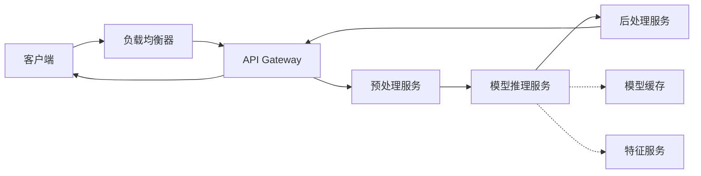

**同步推理特点**:

- 请求-响应模式，客户端等待结果
- 延迟敏感，通常要求<100ms
- 适用于实时推荐、欺诈检测

##### 异步推理架构

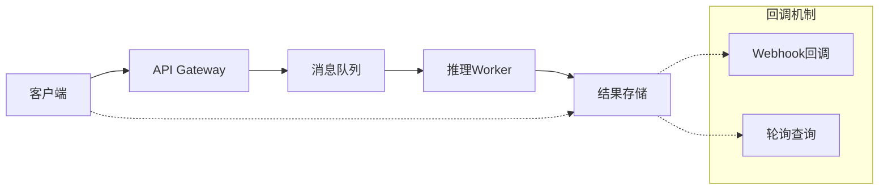

**异步推理特点**:

- 请求提交后立即返回，结果异步获取
- 适用于耗时推理任务
- 支持批量处理，提高吞吐量

#### 2.2.2 批量推理架构

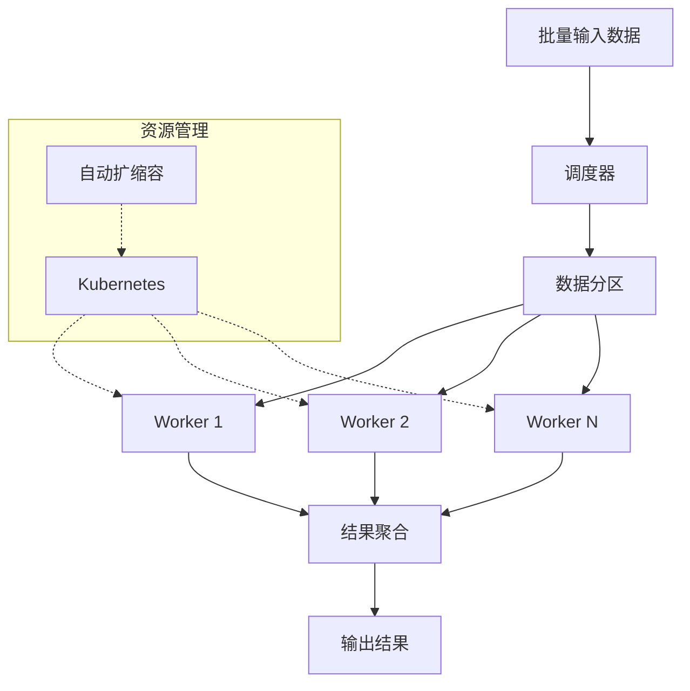

**批量推理特点**:

- 高吞吐量，低单位成本
- 延迟不敏感，可接受分钟/小时级
- 适用于离线预测、报表生成

#### 2.2.3 混合推理架构

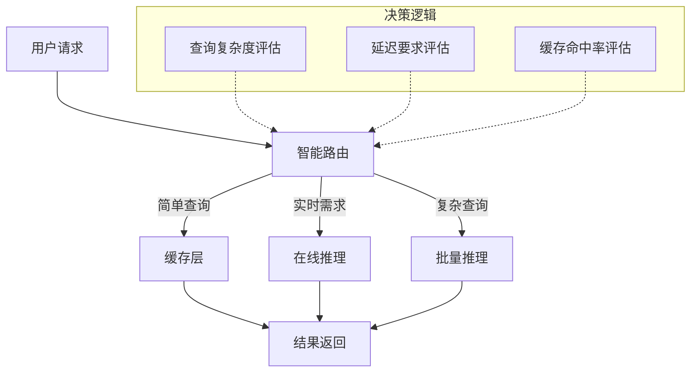

**混合推理决策矩阵**:

| 场景 | 推理模式 | 延迟要求 | 示例 |
|------|----------|----------|------|
| 热门内容推荐 | 缓存 | <1ms | 首页推荐 |
| 个性化推荐 | 在线推理 | <50ms | 猜你喜欢 |
| 深度分析 | 批量推理 | 分钟级 | 用户画像更新 |
| 复杂查询 | 混合 | 可变 | 多维度分析 |

---

### 2.3 A/B测试与影子模式

#### A/B测试架构

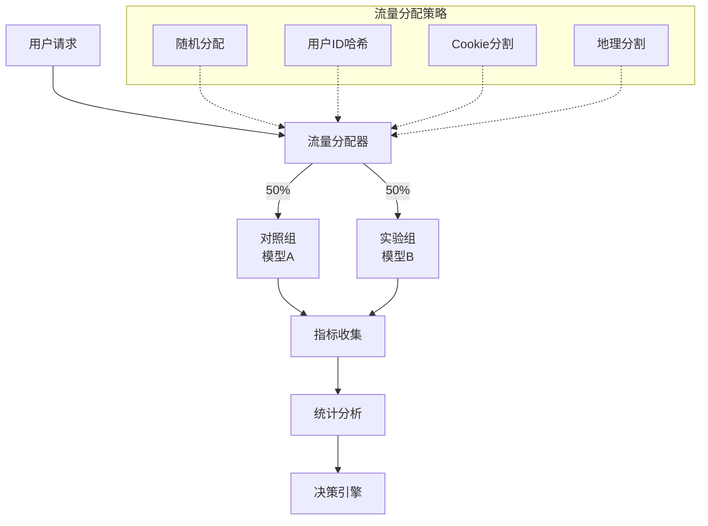

**A/B测试核心组件**:

| 组件 | 功能 | 关键指标 |
|------|------|----------|
| 流量分配器 | 按策略分配用户到不同组 | 样本量、分组均衡性 |
| 指标收集 | 收集业务和技术指标 | CTR、转化率、延迟 |
| 统计分析 | 显著性检验、置信区间 | p-value、效应量 |
| 决策引擎 | 自动决策推广或回滚 | 预设阈值 |

#### 影子模式架构

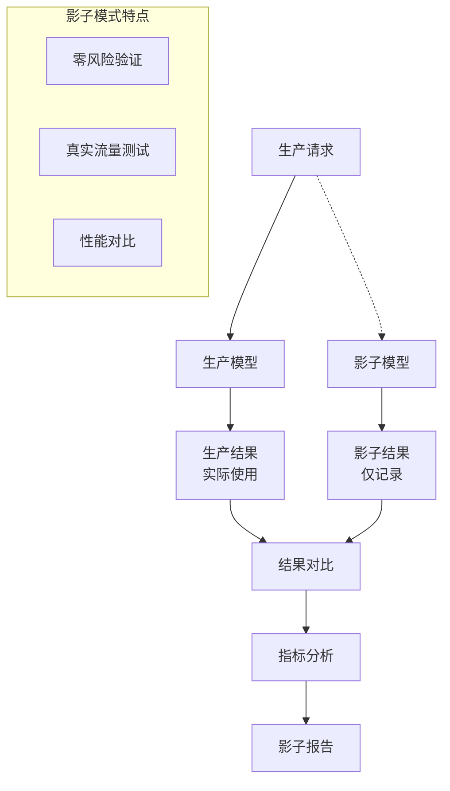

**影子模式 vs A/B测试**:

| 维度 | 影子模式 | A/B测试 |
|------|----------|---------|
| **风险** | 零风险（结果不使用） | 低风险（部分用户使用） |
| **流量** | 100%镜像 | 按比例分配 |
| **指标** | 技术指标为主 | 业务指标为主 |
| **周期** | 短（验证正确性） | 长（验证业务效果） |
| **适用阶段** | 上线前验证 | 上线后效果评估 |

---

### 2.4 模型版本管理与金丝雀发布

#### 模型版本管理架构

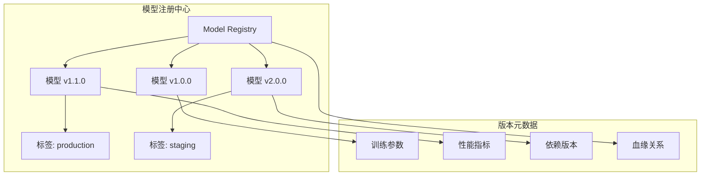

**模型版本管理最佳实践**:

| 实践 | 说明 | 工具 |
|------|------|------|
| 语义化版本 | MAJOR.MINOR.PATCH | MLflow, DVC |
| 标签管理 | production/staging/latest | MLflow |
| 元数据记录 | 完整记录训练信息 | Weights & Biases |
| 血缘追踪 | 数据→特征→模型→服务 | OpenLineage |

#### 金丝雀发布架构

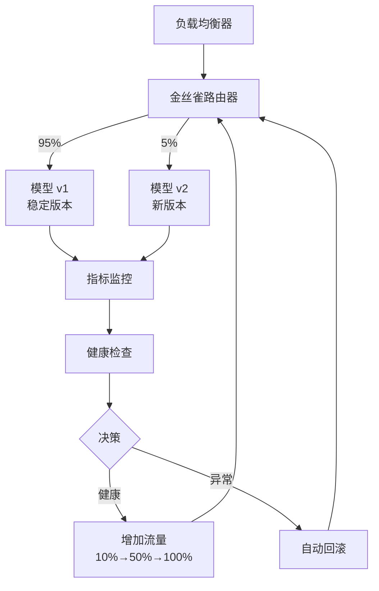

**金丝雀发布策略**:

| 阶段 | 流量比例 | 持续时间 | 检查点 |
|------|----------|----------|--------|
| 初始 | 1% | 15分钟 | 错误率、延迟 |
| 扩展 | 5% | 30分钟 | 业务指标 |
| 验证 | 25% | 1小时 | 核心KPI |
| 全量 | 100% | - | 持续监控 |

---

## 3. 工业级实践案例

### 3.1 Netflix推荐系统架构

#### 架构概览

Netflix服务超过3亿用户，80%的观看来自推荐系统：

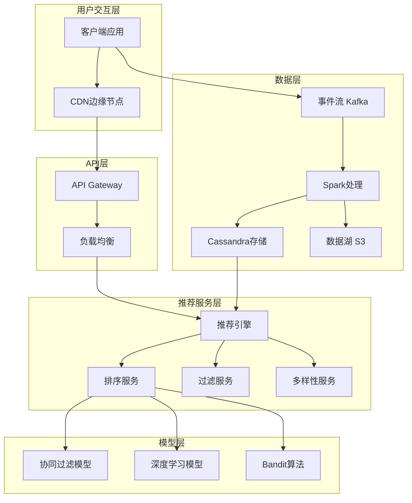

#### 关键技术创新

**1. 基础模型方法 (Foundation Model)**

Netflix 2024年转向统一基础模型架构：

```
┌─────────────────────────────────────────────────────────────┐
│              Netflix 基础模型架构                            │
├─────────────────────────────────────────────────────────────┤
│                                                              │
│   传统架构:                    基础模型架构:                  │
│   ┌─────┐ ┌─────┐ ┌─────┐     ┌─────────────────────┐      │
│   │模型A│ │模型B│ │模型C│     │    统一基础模型      │      │
│   │继续 │ │今日 │ │为你 │     │  (处理所有推荐任务)  │      │
│   │观看 │ │热门 │ │推荐 │     │                     │      │
│   └─────┘ └─────┘ └─────┘     └─────────────────────┘      │
│      │        │       │                │                    │
│      └────────┴───────┘                │                    │
│              维护成本高              统一维护                 │
│                                                              │
│   关键创新:                                                  │
│   - 类似LLM的tokenization策略                                │
│   - 处理数千亿用户交互                                        │
│   - 稀疏注意力机制优化                                        │
│   - 增量训练支持冷启动                                        │
│                                                              │
└─────────────────────────────────────────────────────────────┘
```

**2. 个性化 artwork 生成**

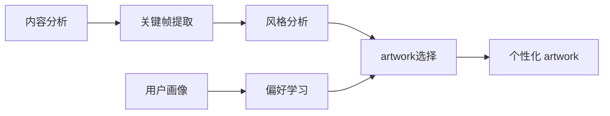

#### 技术栈

| 层级 | 技术选型 | 说明 |
|------|----------|------|
| 流处理 | Apache Kafka + Flink | 实时事件处理 |
| 批处理 | Apache Spark | 大规模数据计算 |
| 存储 | Cassandra + S3 + EVCache | 多级存储策略 |
| 机器学习 | TensorFlow + PyTorch | 模型训练与推理 |
| 服务框架 | Spring Boot + gRPC | 微服务架构 |
| 容器编排 | Titus (自研) | Netflix自研容器平台 |

---

### 3.2 Uber机器学习平台 (Michelangelo)

#### 架构演进

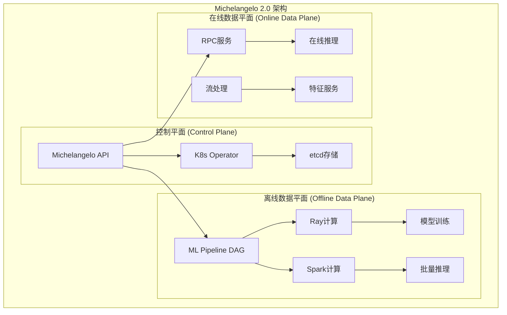

#### 核心设计原则

| 原则 | 说明 | 实现 |
|------|------|------|
| **插件化架构** | 支持组件插拔 | 核心+扩展组件分离 |
| **API优先** | 代码驱动为主 | K8s API风格 |
| **分层服务** | 项目分级管理 | 高影响项目优先支持 |
| **最佳实践内置** | 安全部署、自动重训练 | 平台级能力 |

#### 关键组件

**1. 特征平台**

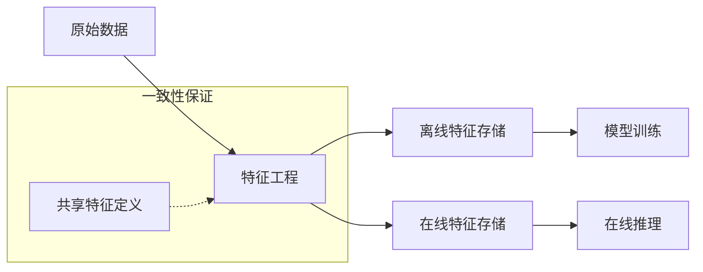

**2. 模型服务 (FastAPI-based)**

```
┌─────────────────────────────────────────────────────────────┐
│              Uber Michelangelo 模型服务                      │
├─────────────────────────────────────────────────────────────┤
│                                                              │
│   FastAPI 优势:                                              │
│   ┌─────────────────────────────────────────────────────┐   │
│   │  ✅ 异步支持: 高吞吐实时预测 (ETA、定价)             │   │
│   │  ✅ Pydantic验证: 输入数据准确性保证                 │   │
│   │  ✅ 轻量级: 高效资源利用                             │   │
│   │  ✅ 微服务友好: 独立部署、独立扩展                   │   │
│   └─────────────────────────────────────────────────────┘   │
│                                                              │
│   应用场景:                                                  │
│   - ETA预测: 到达时间估计                                    │
│   - 动态定价: 实时价格计算                                   │
│   - 司机匹配: 最优司机推荐                                   │
│   - 欺诈检测: 实时风控                                       │
│                                                              │
└─────────────────────────────────────────────────────────────┘
```

---

### 3.3 Airbnb机器学习平台 (Bighead)

#### 架构概览

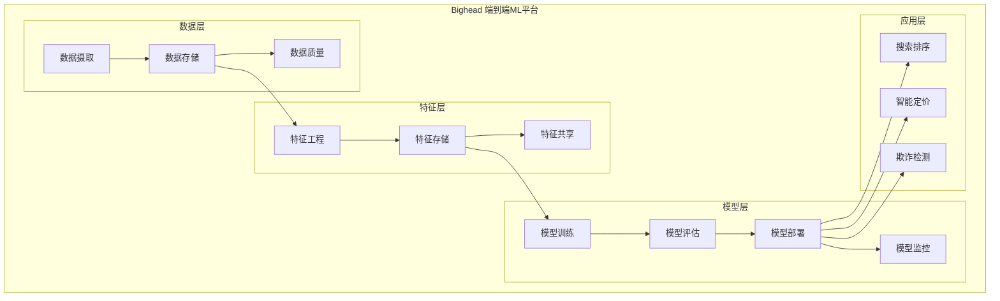

#### 核心成就

| 指标 | 改进前 | 改进后 | 提升 |
|------|--------|--------|------|
| 模型开发周期 | 数月 | 数天 | ~90% |
| 模型部署时间 | 周级 | 小时级 | ~95% |
| 模型复用率 | 低 | 高 | 显著提升 |

#### 技术特点

- **Python + Spark**: 统一技术栈
- **模块化设计**: 可按需使用组件
- **标准化流程**: 统一的生产路径
- **可复现性**: 实验环境标准化

---

### 3.4 Spotify特征平台

#### 数据平台架构

```mermaid
graph TB
    subgraph "Spotify 数据平台"
        subgraph "数据摄取"
            EVENTS[事件流<br/>1.4万亿数据点/天]
            BATCH[批量数据]
        end

        subgraph "处理层"
            BEAM[Apache Beam]
            SCIO[Scio (Scala)]
            FLYTE[Flyte工作流]
        end

        subgraph "存储层"
            GCS[Google Cloud Storage]
            BIGTABLE[Bigtable]
            PUBSUB[Pub/Sub]
        end

        subgraph "服务层"
            BACKSTAGE[Backstage门户]
            K8S_OPERATOR[K8s Operator]
        end
    end

    EVENTS --> BEAM
    BATCH --> BEAM
    BEAM --> SCIO
    SCIO --> GCS
    SCIO --> BIGTABLE
    SCIO --> PUBSUB
    GCS --> BACKSTAGE
    BIGTABLE --> BACKSTAGE
    K8S_OPERATOR -.-> BEAM
```

#### 关键设计

**1. 数据即代码**

```
┌─────────────────────────────────────────────────────────────┐
│                 Spotify 数据即代码实践                       │
├─────────────────────────────────────────────────────────────┤
│                                                              │
│   特点:                                                      │
│   - 管道和端点定义为代码                                     │
│   - 配置与源代码同仓库管理                                   │
│   - K8s Operator自动部署                                     │
│   - 团队拥有完整生命周期                                     │
│                                                              │
│   优势:                                                      │
│   ✅ 版本控制: Git管理所有变更                               │
│   ✅ 代码审查: 变更需Review                                 │
│   ✅ 可测试性: CI/CD集成测试                                 │
│   ✅ 可追溯性: 完整变更历史                                  │
│                                                              │
└─────────────────────────────────────────────────────────────┘
```

**2. Backstage 开发者门户**

| 功能 | 说明 |
|------|------|
| 统一界面 | 单一入口管理所有数据资源 |
| 成本分析 | 管道运行成本可视化 |
| 质量保证 | 数据质量监控集成 |
| 文档中心 | 数据目录和文档 |

---

### 3.5 阿里巴巴PAI平台

#### 四层架构

```mermaid
graph TB
    subgraph "PAI 四层架构"
        subgraph "基础设施层"
            CPU[CPU/GPU资源]
            RDMA[RDMA网络]
            ACK[容器服务ACK]
            MAXCOMPUTE[MaxCompute]
            FLINK[Flink]
        end

        subgraph "平台工具层"
            FRAMEWORK[AI框架<br/>TF/PyTorch/Megatron]
            OPT[加速工具<br/>DatasetAcc/TorchAcc]
            TOOLS[端到端工具<br/>iTAG/DSW/DLC/EAS]
        end

        subgraph "应用层"
            REC[推荐系统]
            NLP[NLP应用]
            CV[计算机视觉]
            SCIENTIFIC[科学计算]
        end

        subgraph "行业解决方案"
            RETAIL[新零售]
            FINANCE[金融]
            HEALTH[医疗]
            MANUFACTURE[制造]
        end
    end

    CPU --> FRAMEWORK
    RDMA --> FRAMEWORK
    ACK --> TOOLS
    MAXCOMPUTE --> TOOLS
    FLINK --> TOOLS
    FRAMEWORK --> REC
    OPT --> REC
    TOOLS --> REC
    REC --> RETAIL
    REC --> FINANCE
```

#### 核心产品

| 产品 | 功能 | 适用用户 |
|------|------|----------|
| **PAI-Studio** | 可视化建模，拖拽式开发 | 中级算法工程师 |
| **PAI-DSW** | Notebook开发环境 | 高级算法工程师 |
| **PAI-DLC** | 分布式训练 | 深度学习工程师 |
| **PAI-EAS** | 模型在线服务 | 所有用户 |
| **PAI-Rec** | 推荐引擎框架 | 推荐系统开发者 |

#### PAI-Rec推荐引擎

```mermaid
graph LR
    REQUEST[推荐请求] --> ENGINE[PAI-Rec引擎]
    ENGINE --> RETRIEVE[召回阶段]
    ENGINE --> FILTER[过滤阶段]
    ENGINE --> RANK[排序阶段]
    ENGINE --> REORDER[重排阶段]

    RETRIEVE --> FEATURE[特征获取]
    FEATURE --> EAS[PAI-EAS推理]
    EAS --> RESULT[推荐结果]

    subgraph "内置能力"
        AB[A/B测试]
        FS[FeatureStore]
        CACHE[结果缓存]
    end

    AB -.-> ENGINE
    FS -.-> FEATURE
    CACHE -.-> RESULT
```

---

## 4. 架构质量属性

### 4.1 可扩展性 (Scalability)

#### 水平扩展 vs 垂直扩展

```mermaid
graph TB
    subgraph "垂直扩展 (Scale Up)"
        V1[单节点] --> V2[更强CPU]
        V1 --> V3[更多内存]
        V1 --> V4[更快磁盘]
        V2 --> V5[单节点增强]
        V3 --> V5
        V4 --> V5
    end

    subgraph "水平扩展 (Scale Out)"
        H1[节点1] --> CLUSTER[集群]
        H2[节点2] --> CLUSTER
        H3[节点3] --> CLUSTER
        H4[节点N] --> CLUSTER
        CLUSTER --> LB[负载均衡]
    end
```

**对比分析**:

| 维度 | 垂直扩展 | 水平扩展 |
|------|----------|----------|
| **成本** | 硬件成本高 | 可逐步增加节点 |
| **上限** | 有物理上限 | 理论上无上限 |
| **复杂度** | 低 | 高（分布式协调） |
| **可用性** | 单点故障 | 故障容忍 |
| **适用场景** | 小规模、强一致性需求 | 大规模、高可用需求 |

#### ML系统扩展策略

**1. 数据并行**

```
┌─────────────────────────────────────────────────────────────┐
│                    数据并行训练                              │
├─────────────────────────────────────────────────────────────┤
│                                                              │
│   输入数据                    模型副本                       │
│   ┌─────────┐                ┌─────────┐                     │
│   │ Batch 1 │───────────────▶│ 模型A   │                     │
│   ├─────────┤                ├─────────┤                     │
│   │ Batch 2 │───────────────▶│ 模型B   │                     │
│   ├─────────┤                ├─────────┤                     │
│   │ Batch 3 │───────────────▶│ 模型C   │                     │
│   ├─────────┤                ├─────────┤                     │
│   │ Batch N │───────────────▶│ 模型N   │                     │
│   └─────────┘                └────┬────┘                     │
│                                    │                         │
│                                    ▼                         │
│                              ┌─────────┐                     │
│                              │梯度聚合 │                     │
│                              │AllReduce│                     │
│                              └────┬────┘                     │
│                                    │                         │
│                                    ▼                         │
│                              ┌─────────┐                     │
│                              │更新模型 │                     │
│                              └─────────┘                     │
│                                                              │
└─────────────────────────────────────────────────────────────┘
```

**2. 模型并行**

```
┌─────────────────────────────────────────────────────────────┐
│                    模型并行训练                              │
├─────────────────────────────────────────────────────────────┤
│                                                              │
│   大模型分割到多个设备:                                       │
│                                                              │
│   ┌─────────┐    ┌─────────┐    ┌─────────┐                 │
│   │ 层1-3   │───▶│ 层4-6   │───▶│ 层7-10  │                 │
│   │ GPU 0   │    │ GPU 1   │    │ GPU 2   │                 │
│   └─────────┘    └─────────┘    └─────────┘                 │
│        ▲                                       │             │
│        │                                       │             │
│        └───────────────────────────────────────┘             │
│                      反向传播                                │
│                                                              │
│   适用场景: 模型太大无法放入单卡                               │
│                                                              │
└─────────────────────────────────────────────────────────────┘
```

### 4.2 可用性与容错

#### 可用性等级

| 可用性 | 年停机时间 | 适用场景 |
|--------|------------|----------|
| 99% (2个9) | 3.65天 | 内部工具 |
| 99.9% (3个9) | 8.76小时 | 一般业务 |
| 99.99% (4个9) | 52.6分钟 | 核心系统 |
| 99.999% (5个9) | 5.26分钟 | 金融交易 |

#### 容错架构模式

**1. 熔断器模式 (Circuit Breaker)**

```mermaid
graph LR
    CLIENT[客户端] --> CB{熔断器}
    CB -->|关闭| SERVICE[正常服务]
    CB -->|打开| FALLBACK[降级服务]

    SERVICE -->|失败计数| CB

    subgraph "状态转换"
        CLOSED[关闭: 正常转发]
        OPEN[打开: 快速失败]
        HALF[半开: 试探恢复]
    end

    CLOSED -.->|失败阈值| OPEN
    OPEN -.->|超时| HALF
    HALF -.->|成功| CLOSED
    HALF -.->|失败| OPEN
```

**2. 重试与退避策略**

```python
# 指数退避示例
import time
import random

def exponential_backoff(attempt, base_delay=1, max_delay=60):
    """指数退避 + 抖动"""
    delay = min(base_delay * (2 ** attempt), max_delay)
    jitter = random.uniform(0, delay * 0.1)
    return delay + jitter

# 重试策略
retry_policy = {
    "max_attempts": 5,
    "backoff_strategy": "exponential",
    "retryable_errors": [TimeoutError, ConnectionError],
    "non_retryable_errors": [ValidationError, AuthenticationError]
}
```

### 4.3 延迟与吞吐量优化

#### 延迟优化策略

| 策略 | 技术 | 效果 |
|------|------|------|
| **缓存** | Redis, Memcached | 减少DB访问 |
| **CDN** | CloudFront, CloudFlare | 边缘加速 |
| **异步化** | 消息队列 | 削峰填谷 |
| **批处理** | 批量推理 | 提高吞吐 |
| **模型优化** | 量化、剪枝 | 减少计算 |
| **硬件加速** | GPU/TPU/FPGA | 并行计算 |

#### 模型推理优化

```mermaid
graph TB
    MODEL[原始模型] --> OPTIMIZE[模型优化]

    OPTIMIZE --> QUANT[量化<br/>FP32→INT8]
    OPTIMIZE --> PRUNE[剪枝<br/>移除冗余]
    OPTIMIZE --> DISTILL[蒸馏<br/>小模型学习]
    OPTIMIZE --> COMPILE[编译优化<br/>TensorRT/ONNX]

    QUANT --> OPT_MODEL[优化模型]
    PRUNE --> OPT_MODEL
    DISTILL --> OPT_MODEL
    COMPILE --> OPT_MODEL

    OPT_MODEL --> DEPLOY[部署]

    subgraph "性能提升"
        LATENCY[延迟降低 2-10x]
        THROUGHPUT[吞吐提升 2-5x]
        MEMORY[内存减少 50-75%]
    end

    DEPLOY -.-> LATENCY
    DEPLOY -.-> THROUGHPUT
    DEPLOY -.-> MEMORY
```

### 4.4 数据一致性保证

#### 一致性模型

| 模型 | 说明 | 适用场景 |
|------|------|----------|
| **强一致性** | 读写立即可见 | 金融交易 |
| **顺序一致性** | 操作按程序顺序执行 | 分布式锁 |
| **因果一致性** | 因果相关的操作有序 | 社交网络 |
| **最终一致性** | 最终达到一致状态 | 推荐系统 |

#### ML系统一致性挑战

```
┌─────────────────────────────────────────────────────────────┐
│              ML系统数据一致性挑战                            │
├─────────────────────────────────────────────────────────────┤
│                                                              │
│   1. 训练-服务一致性                                         │
│      ┌─────────────┐         ┌─────────────┐                │
│      │ 训练时特征  │   ≠?    │ 服务时特征  │                │
│      │ (离线计算)  │         │ (在线计算)  │                │
│      └─────────────┘         └─────────────┘                │
│                                                              │
│      解决方案: 特征存储统一计算逻辑                           │
│                                                              │
│   2. 模型版本一致性                                          │
│      ┌─────────────┐         ┌─────────────┐                │
│      │ 模型版本A   │   ≠?    │ 模型版本B   │                │
│      │ (节点1)    │         │ (节点2)    │                │
│      └─────────────┘         └─────────────┘                │
│                                                              │
│      解决方案: 模型注册中心 + 滚动更新                        │
│                                                              │
│   3. 特征时效一致性                                          │
│      ┌─────────────┐         ┌─────────────┐                │
│      │ 特征时间戳  │   ≠?    │ 模型期望    │                │
│      │ (实际)     │         │ (训练时)   │                │
│      └─────────────┘         └─────────────┘                │
│                                                              │
│      解决方案: 特征元数据 + 点-in-time正确性                  │
│                                                              │
└─────────────────────────────────────────────────────────────┘
```

### 4.5 安全性与隐私保护

#### ML安全威胁

| 威胁类型 | 说明 | 防护措施 |
|----------|------|----------|
| **模型窃取** | 通过API查询复制模型 | 查询限制、输出扰动 |
| **对抗攻击** | 输入扰动导致错误预测 | 对抗训练、输入验证 |
| **数据投毒** | 污染训练数据 | 数据清洗、异常检测 |
| **成员推断** | 推断数据是否在训练集中 | 差分隐私、正则化 |

#### 隐私保护技术

```mermaid
graph TB
    subgraph "隐私保护技术栈"
        DP[差分隐私<br/>Differential Privacy]
        FL[联邦学习<br/>Federated Learning]
        HE[同态加密<br/>Homomorphic Encryption]
        MPC[安全多方计算<br/>MPC]
    end

    subgraph "应用场景"
        DP_APP[数据发布<br/>统计查询]
        FL_APP[跨设备学习<br/>跨机构协作]
        HE_APP[云端推理<br/>加密计算]
        MPC_APP[联合建模<br/>隐私求交]
    end

    DP --> DP_APP
    FL --> FL_APP
    HE --> HE_APP
    MPC --> MPC_APP
```

**差分隐私示例**:

```python
import numpy as np

def add_laplace_noise(data, epsilon, sensitivity=1.0):
    """
    拉普拉斯机制实现差分隐私

    Args:
        data: 原始数据
        epsilon: 隐私预算 (越小隐私保护越强)
        sensitivity: 查询敏感度
    """
    scale = sensitivity / epsilon
    noise = np.random.laplace(0, scale, len(data))
    return data + noise

# 使用示例
epsilon = 1.0  # 隐私预算
private_data = add_laplace_noise(sensitive_data, epsilon)
```

---

## 5. 架构决策树与选型指南

### 5.1 架构决策树

```
┌─────────────────────────────────────────────────────────────────┐
│                    ML系统架构决策树                              │
├─────────────────────────────────────────────────────────────────┤
│                                                                  │
│  1. 数据规模?                                                    │
│     ├── TB级以下 ──▶ 单机/小集群即可                             │
│     └── PB级以上 ──▶ 分布式架构                                  │
│                      ├── 批处理为主 ──▶ Hadoop/Spark            │
│                      └── 实时性要求高 ──▶ Kafka + Flink         │
│                                                                  │
│  2. 延迟要求?                                                    │
│     ├── <10ms ──▶ 边缘计算 + 模型优化                           │
│     ├── <100ms ──▶ 在线推理 + 缓存                              │
│     ├── <1s ──▶ 异步处理可接受                                  │
│     └── 分钟级+ ──▶ 批量处理                                    │
│                                                                  │
│  3. 模型复杂度?                                                  │
│     ├── 简单模型 (LR/GBDT) ──▶ CPU推理即可                      │
│     ├── 深度学习 (CNN/RNN) ──▶ GPU推理                          │
│     └── 大模型 (LLM) ──▶ 多GPU/TPU + 模型并行                   │
│                                                                  │
│  4. 团队规模?                                                    │
│     ├── <10人 ──▶ 全托管ML平台 (SageMaker/Vertex AI)            │
│     ├── 10-50人 ──▶ 开源方案 (Kubeflow + MLflow)                │
│     └── 50+人 ──▶ 自研平台 (参考Michelangelo)                   │
│                                                                  │
│  5. 一致性要求?                                                  │
│     ├── 强一致性 ──▶ 分布式事务 + 同步复制                      │
│     └── 最终一致性 ──▶ 异步复制 + 事件溯源                      │
│                                                                  │
└─────────────────────────────────────────────────────────────────┘
```

### 5.2 技术选型矩阵

#### 流处理引擎选型

| 引擎 | 延迟 | 吞吐 | 一致性 | 易用性 | 适用场景 |
|------|------|------|--------|--------|----------|
| **Flink** | 毫秒级 | 高 | Exactly-Once | 中 | 复杂事件处理 |
| **Kafka Streams** | 毫秒级 | 中 | Exactly-Once | 高 | Kafka生态 |
| **Spark Streaming** | 秒级 | 高 | Exactly-Once | 高 | 批流统一 |
| **Storm** | 毫秒级 | 中 | At-Least-Once | 中 | 纯实时 |

#### 模型服务框架选型

| 框架 | 框架支持 | 性能 | 特性 | 适用场景 |
|------|----------|------|------|----------|
| **TensorFlow Serving** | TF Only | 高 | 版本管理、批处理 | TF模型 |
| **TorchServe** | PyTorch | 高 | 多模型、A/B测试 | PyTorch模型 |
| **Triton** | 多框架 | 很高 | GPU优化、动态批处理 | 异构模型 |
| **Seldon** | 多框架 | 中 | 高级部署、可解释性 | 企业级 |
| **KServe** | 多框架 | 高 | K8s原生、Serverless | K8s环境 |

#### 特征存储选型

| 方案 | 开源 | 在线延迟 | 离线集成 | 企业支持 | 适用场景 |
|------|------|----------|----------|----------|----------|
| **Feast** | 是 | <10ms | 好 | 社区 | 中小型 |
| **Tecton** | 否 | <5ms | 很好 | 商业 | 大型 |
| **Hopsworks** | 是 | <10ms | 好 | 商业 | 研究型 |
| **自研** | - | 可调 | 完全可控 | 内部 | 超大型 |

### 5.3 架构演进路径

```mermaid
graph LR
    subgraph "架构演进阶段"
        STAGE1[阶段1: 单体架构]
        STAGE2[阶段2: 服务拆分]
        STAGE3[阶段3: 平台化]
        STAGE4[阶段4: 智能化]
    end

    STAGE1 -->|模型增多| STAGE2
    STAGE2 -->|规模扩大| STAGE3
    STAGE3 -->|成熟度提升| STAGE4

    subgraph "阶段1特征"
        S1_1[单模型服务]
        S1_2[手动部署]
        S1_3[简单监控]
    end

    subgraph "阶段2特征"
        S2_1[多模型服务]
        S2_2[CI/CD自动化]
        S2_3[特征复用]
    end

    subgraph "阶段3特征"
        S3_1[特征平台]
        S3_2[模型注册中心]
        S3_3[自动扩缩容]
    end

    subgraph "阶段4特征"
        S4_1[AutoML集成]
        S4_2[智能监控]
        S4_3[自适应推理]
    end

    STAGE1 -.-> S1_1
    STAGE2 -.-> S2_1
    STAGE3 -.-> S3_1
    STAGE4 -.-> S4_1
```

---

## 6. 反模式与陷阱

### 6.1 常见架构反模式

#### 反模式1: 大泥球 (Big Ball of Mud)

```
┌─────────────────────────────────────────────────────────────┐
│ ❌ 反模式: 大泥球架构                                        │
├─────────────────────────────────────────────────────────────┤
│                                                              │
│   症状:                                                      │
│   - 所有代码在一个仓库                                       │
│   - 模型、服务、数据逻辑混杂                                 │
│   - 没有清晰的模块边界                                       │
│   - 修改一处影响全局                                         │
│                                                              │
│   后果:                                                      │
│   - 部署困难，回滚风险高                                     │
│   - 团队协作效率低                                           │
│   - 技术债务累积                                             │
│                                                              │
│   解决方案: 分层架构 + 微服务                                │
│                                                              │
└─────────────────────────────────────────────────────────────┘
```

#### 反模式2: 分布式单体

```
┌─────────────────────────────────────────────────────────────┐
│ ❌ 反模式: 分布式单体                                        │
├─────────────────────────────────────────────────────────────┤
│                                                              │
│   症状:                                                      │
│   - 服务拆分但高度耦合                                       │
│   - 必须同时部署多个服务                                     │
│   - 共享数据库                                               │
│   - 循环依赖                                                 │
│                                                              │
│   后果:                                                      │
│   - 失去微服务优势                                           │
│   - 运维复杂度增加                                           │
│   - 故障级联                                                 │
│                                                              │
│   解决方案:                                                  │
│   - 服务间通过API通信                                        │
│   - 每个服务独立数据库                                       │
│   - 避免同步调用链                                           │
│                                                              │
└─────────────────────────────────────────────────────────────┘
```

#### 反模式3: 训练-服务偏差

```
┌─────────────────────────────────────────────────────────────┐
│ ❌ 反模式: 训练-服务偏差 (Training-Serving Skew)             │
├─────────────────────────────────────────────────────────────┤
│                                                              │
│   症状:                                                      │
│   - 离线评估指标好，线上效果差                               │
│   - 特征计算逻辑不一致                                       │
│   - 训练数据与服务数据分布不同                               │
│                                                              │
│   后果:                                                      │
│   - 模型上线后性能下降                                       │
│   - 难以排查问题                                             │
│   - 用户信任度下降                                           │
│                                                              │
│   解决方案:                                                  │
│   - 使用特征存储保证一致性                                   │
│   - 共享特征定义和计算逻辑                                   │
│   - 建立训练-服务一致性监控                                  │
│                                                              │
└─────────────────────────────────────────────────────────────┘
```

### 6.2 性能陷阱

| 陷阱 | 描述 | 解决方案 |
|------|------|----------|
| **N+1查询** | 循环中逐个查询数据库 | 批量查询、缓存 |
| **序列化瓶颈** | 大数据对象序列化耗时 | 使用高效格式(Protobuf) |
| **内存泄漏** | 长期运行服务内存增长 | 定期重启、内存分析 |
| **热点Key** | 某些Key访问过于集中 | 本地缓存、Key分片 |
| **模型加载慢** | 大模型启动时间长 | 预加载、模型缓存 |

### 6.3 可靠性陷阱

```mermaid
graph TB
    subgraph "可靠性陷阱"
        T1[无超时设置]
        T2[无重试策略]
        T3[无熔断保护]
        T4[无降级方案]
        T5[单点依赖]
    end

    subgraph "后果"
        C1[级联故障]
        C2[雪崩效应]
        C3[服务不可用]
    end

    T1 --> C1
    T2 --> C1
    T3 --> C2
    T4 --> C2
    T5 --> C3
```

### 6.4 最佳实践清单

```
┌─────────────────────────────────────────────────────────────────┐
│                    ML系统架构最佳实践清单                        │
├─────────────────────────────────────────────────────────────────┤
│                                                                  │
│  □ 数据层                                                        │
│    □ 数据湖存储原始数据                                          │
│    □ 数据质量监控和告警                                          │
│    □ 数据血缘追踪                                                │
│    □ 敏感数据脱敏                                                │
│                                                                  │
│  □ 特征层                                                        │
│    □ 特征存储保证在线/离线一致性                                 │
│    □ 特征版本管理                                                │
│    □ 特征漂移监控                                                │
│    □ 特征文档和发现机制                                          │
│                                                                  │
│  □ 模型层                                                        │
│    □ 模型版本注册                                                │
│    □ 模型性能监控                                                │
│    □ 模型A/B测试                                                 │
│    □ 模型可解释性                                                │
│                                                                  │
│  □ 服务层                                                        │
│    □ 服务熔断和降级                                              │
│    □ 自动扩缩容                                                  │
│    □ 健康检查和探针                                              │
│    □ 金丝雀发布                                                  │
│                                                                  │
│  □ 监控层                                                        │
│    □ 全链路追踪                                                  │
│    □ 业务指标监控                                                │
│    □ 技术指标监控                                                │
│    □ 告警和On-call                                               │
│                                                                  │
└─────────────────────────────────────────────────────────────────┘
```

---

## 附录: 参考资源

### 学术论文

1. **"Hidden Technical Debt in Machine Learning Systems"** - Google, NIPS 2015
2. **"ML Systems Design: A Software Engineering Perspective"** - Stanford
3. **"Challenges in Deploying Machine Learning: A Survey of Case Studies"** - ACM 2021

### 工业实践

1. **Netflix Tech Blog** - <https://netflixtechblog.com/>
2. **Uber Engineering Blog** - <https://www.uber.com/blog/engineering/>
3. **Airbnb Engineering** - <https://medium.com/airbnb-engineering>
4. **Spotify Engineering** - <https://engineering.atspotify.com/>

### 开源项目

1. **Kubeflow** - <https://www.kubeflow.org/>
2. **MLflow** - <https://mlflow.org/>
3. **Feast** - <https://feast.dev/>
4. **Seldon Core** - <https://www.seldon.io/>

---

*文档结束*
