# AI/ML 建模与设计思维表征图谱

> 本文件包含AI/ML领域的多种思维表征方式，用于系统化理解和决策支持

---

## 目录

- [AI/ML 建模与设计思维表征图谱](#aiml-建模与设计思维表征图谱)
  - [目录](#目录)
  - [1. 全局思维导图](#1-全局思维导图)
    - [1.1 AI/ML 完整知识体系思维导图](#11-aiml-完整知识体系思维导图)
    - [1.2 MLOps 流程思维导图](#12-mlops-流程思维导图)
  - [2. 多维概念对比矩阵](#2-多维概念对比矩阵)
    - [2.1 深度学习框架对比矩阵](#21-深度学习框架对比矩阵)
    - [2.2 ML模型选型矩阵](#22-ml模型选型矩阵)
    - [2.3 架构模式对比矩阵](#23-架构模式对比矩阵)
    - [2.4 部署方案对比矩阵](#24-部署方案对比矩阵)
  - [3. 决策树图](#3-决策树图)
    - [3.1 技术栈选型决策树](#31-技术栈选型决策树)
    - [3.2 模型选择决策树](#32-模型选择决策树)
    - [3.3 架构模式选择决策树](#33-架构模式选择决策树)
    - [3.4 部署策略决策树](#34-部署策略决策树)
  - [4. 推理归纳证明决策树](#4-推理归纳证明决策树)
    - [4.1 从问题到解决方案的推理链](#41-从问题到解决方案的推理链)
    - [4.2 架构决策论证过程](#42-架构决策论证过程)
    - [4.3 模型选择的逻辑推导](#43-模型选择的逻辑推导)
  - [5. 概念关系图](#5-概念关系图)
    - [5.1 AI/ML核心概念依赖关系图](#51-aiml核心概念依赖关系图)
    - [5.2 ML系统数据流与组件交互图](#52-ml系统数据流与组件交互图)
    - [5.3 模型生命周期流程图](#53-模型生命周期流程图)
    - [5.4 技术栈生态系统关系图](#54-技术栈生态系统关系图)
  - [附录: 图表使用指南](#附录-图表使用指南)
    - [图表类型速查表](#图表类型速查表)
    - [如何选择合适的图表](#如何选择合适的图表)
    - [图表最佳实践](#图表最佳实践)

---

## 1. 全局思维导图

### 1.1 AI/ML 完整知识体系思维导图

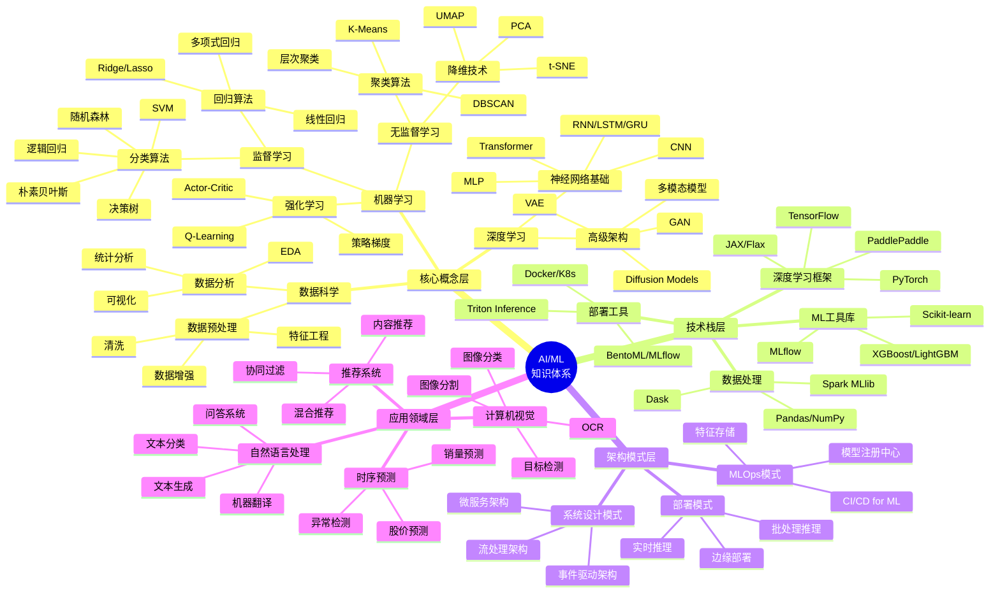

**图表说明**: 本思维导图展示了AI/ML知识体系的完整结构，从核心概念到实际应用，帮助学习者建立系统化的知识框架。

**使用场景**:

- 学习路径规划
- 知识体系梳理
- 技术选型参考
- 团队培训大纲

---

### 1.2 MLOps 流程思维导图

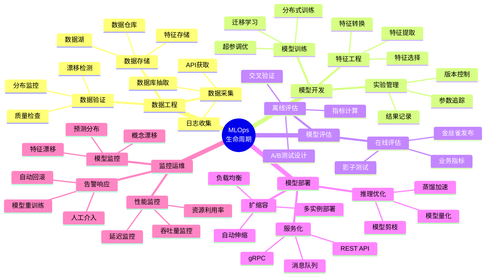

**图表说明**: MLOps流程思维导图展示了机器学习模型从数据到部署的完整生命周期管理。

**使用场景**:

- MLOps平台建设
- 流程标准化
- 团队协作规范
- 运维监控设计

---

## 2. 多维概念对比矩阵

### 2.1 深度学习框架对比矩阵

```mermaid
flowchart TB
    subgraph 框架对比["🔧 深度学习框架对比"]
        direction TB

        subgraph 维度["评估维度"]
            D1[学习曲线]
            D2[生态系统]
            D3[生产部署]
            D4[研究友好度]
            D5[性能]
            D6[社区支持]
        end

        subgraph PyTorch["PyTorch"]
            P1["✅ 简洁直观<br/>动态图易调试"]
            P2["✅ 丰富<br/>HuggingFace等"]
            P3["⚠️ 中等<br/>TorchServe/TorchScript"]
            P4["✅ 极佳<br/>研究首选"]
            P5["✅ 优秀<br/>GPU优化好"]
            P6["✅ 活跃<br/>学术圈主流"]
        end

        subgraph TensorFlow["TensorFlow"]
            T1["⚠️ 陡峭<br/>概念较多"]
            T2["✅ 最丰富<br/>TF Hub/Extended"]
            T3["✅ 最佳<br/>TF Serving/TFX"]
            T4["⚠️ 中等<br/>2.x改进后变好"]
            T5["✅ 优秀<br/>TPU支持好"]
            T6["✅ 活跃<br/>工业界主流"]
        end

        subgraph JAX["JAX"]
            J1["⚠️ 较陡<br/>函数式编程"]
            J2["⚠️ 增长中<br/>生态相对小"]
            J3["⚠️ 早期<br/>需自定义"]
            J4["✅ 优秀<br/>Google Research用"]
            J5["✅ 最佳<br/>XLA编译优化"]
            J6["⚠️ 增长中<br/>研究圈流行"]
        end

        D1 --> P1 & T1 & J1
        D2 --> P2 & T2 & J2
        D3 --> P3 & T3 & J3
        D4 --> P4 & T4 & J4
        D5 --> P5 & T5 & J5
        D6 --> P6 & T6 & J6
    end
```

**对比总结表**:

| 维度 | PyTorch | TensorFlow | JAX |
|------|---------|------------|-----|
| **推荐场景** | 研究/原型 | 生产/大规模 | 高性能研究 |
| **上手难度** | ⭐⭐ | ⭐⭐⭐⭐ | ⭐⭐⭐⭐ |
| **部署便利** | ⭐⭐⭐ | ⭐⭐⭐⭐⭐ | ⭐⭐ |
| **性能表现** | ⭐⭐⭐⭐ | ⭐⭐⭐⭐ | ⭐⭐⭐⭐⭐ |
| **生态成熟度** | ⭐⭐⭐⭐⭐ | ⭐⭐⭐⭐⭐ | ⭐⭐⭐ |

**图表说明**: 从六个维度对比三大主流深度学习框架的特点和适用场景。

**使用场景**:

- 技术选型决策
- 团队培训规划
- 项目框架选择
- 技能发展路径

---

### 2.2 ML模型选型矩阵

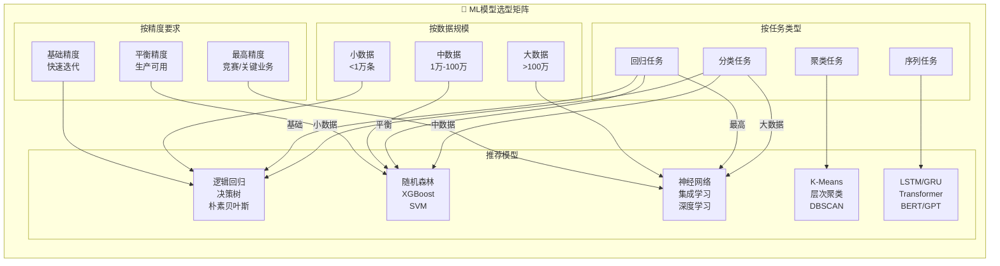

**模型选型速查表**:

| 场景 | 推荐算法 | 备选方案 | 关键考量 |
|------|----------|----------|----------|
| 快速原型 | 逻辑回归/决策树 | 随机森林 | 可解释性、训练速度 |
| 生产环境 | XGBoost/LightGBM | CatBoost | 精度、效率平衡 |
| 复杂模式 | 深度学习 | 集成学习 | 数据量、计算资源 |
| 文本NLP | BERT/RoBERTa | GPT系列 | 任务类型、推理成本 |
| 图像CV | ResNet/EfficientNet | Vision Transformer | 精度、推理速度 |
| 时序预测 | LSTM/Transformer | Prophet | 序列长度、季节性 |

**图表说明**: 根据任务类型、数据规模和精度要求三个维度，提供模型选型建议。

**使用场景**:

- 项目启动选型
- 模型迭代决策
- 性能优化方向
- 资源规划参考

---

### 2.3 架构模式对比矩阵

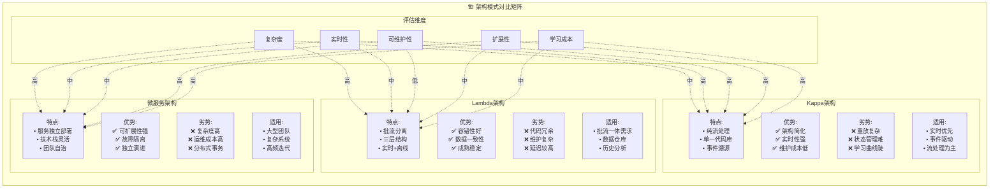

**架构选型决策表**:

| 考量因素 | 微服务 | Lambda | Kappa |
|----------|--------|--------|-------|
| **系统复杂度** | 高 | 中 | 中 |
| **实时性要求** | 中 | 中 | 高 |
| **数据一致性** | 挑战大 | 好 | 需设计 |
| **运维成本** | 高 | 中 | 低 |
| **团队规模** | 大团队 | 不限 | 小团队 |
| **技术成熟度** | 成熟 | 成熟 | 较新 |

**图表说明**: 对比三种主流架构模式的特点、优劣势和适用场景。

**使用场景**:

- 系统架构设计
- 技术方案评审
- 架构演进规划
- 团队技术选型

---

### 2.4 部署方案对比矩阵

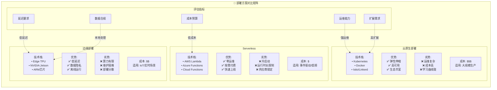

**部署方案决策矩阵**:

| 场景 | 推荐方案 | 关键考量 |
|------|----------|----------|
| 大规模在线服务 | 云原生(K8s) | 弹性、高可用 |
| IoT/边缘计算 | 边缘部署 | 延迟、隐私 |
| 事件驱动/低频 | Serverless | 成本、快速上线 |
| 混合场景 | 云+边缘 | 灵活调度 |
| 开发测试 | Serverless | 成本、便捷 |

**图表说明**: 对比三种主要部署方案的技术特点、优劣势和成本模型。

**使用场景**:

- 部署方案选型
- 成本预算规划
- 基础设施设计
- 运维策略制定

---


## 3. 决策树图

### 3.1 技术栈选型决策树

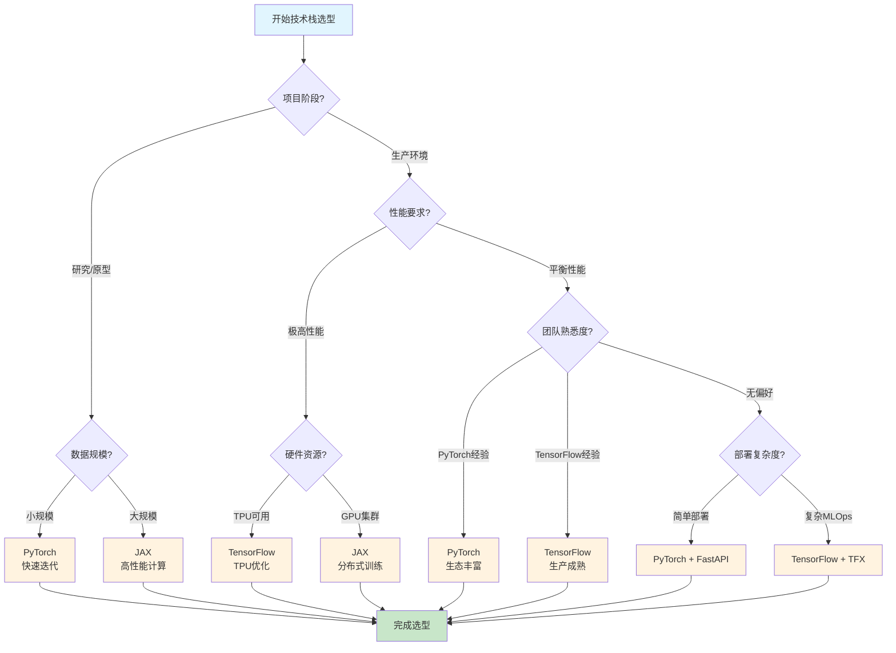

**决策路径说明**:

| 路径 | 场景 | 推荐方案 |
|------|------|----------|
| A→B→C→E | 研究原型+小规模数据 | PyTorch |
| A→B→C→F | 研究原型+大规模数据 | JAX |
| A→B→D→G→I | 生产+极高性能+TPU | TensorFlow |
| A→B→D→G→J | 生产+极高性能+GPU | JAX |
| A→B→D→H→K | 生产+平衡性能+PyTorch经验 | PyTorch |
| A→B→D→H→L | 生产+平衡性能+TF经验 | TensorFlow |

**图表说明**: 根据项目阶段、数据规模、性能要求和团队经验，指导技术栈选型决策。

**使用场景**:

- 新项目技术选型
- 框架迁移决策
- 团队技能规划
- 技术债务评估

---

### 3.2 模型选择决策树

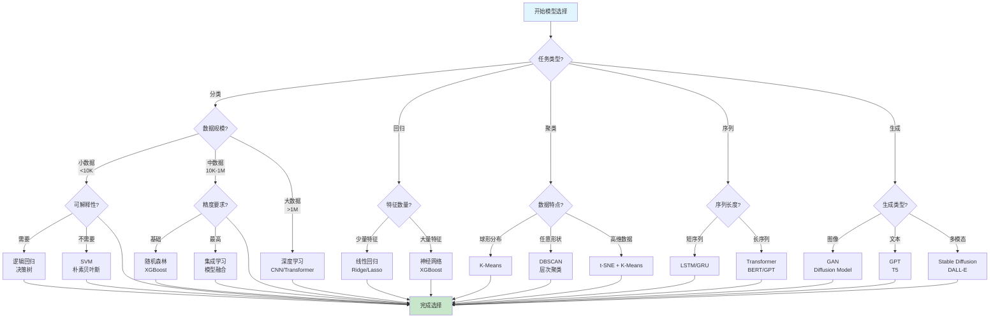

**模型选择速查**:

| 任务 | 数据规模 | 推荐模型 | 备选模型 |
|------|----------|----------|----------|
| 分类 | 小数据 | 逻辑回归、决策树 | SVM、朴素贝叶斯 |
| 分类 | 中数据 | 随机森林、XGBoost | LightGBM、CatBoost |
| 分类 | 大数据 | CNN、Transformer | ResNet、BERT |
| 回归 | 少量特征 | 线性回归、Ridge | Lasso、ElasticNet |
| 回归 | 大量特征 | XGBoost、神经网络 | LightGBM、MLP |
| 聚类 | 球形 | K-Means | Mini-Batch K-Means |
| 聚类 | 任意形状 | DBSCAN、HDBSCAN | 层次聚类 |
| 序列 | 短序列 | LSTM、GRU | BiLSTM |
| 序列 | 长序列 | Transformer、BERT | GPT、T5 |

**图表说明**: 根据任务类型和数据特点，提供系统化的模型选择决策路径。

**使用场景**:

- 项目启动选型
- 模型迭代优化
- 算法竞赛准备
- 教学案例设计

---

### 3.3 架构模式选择决策树

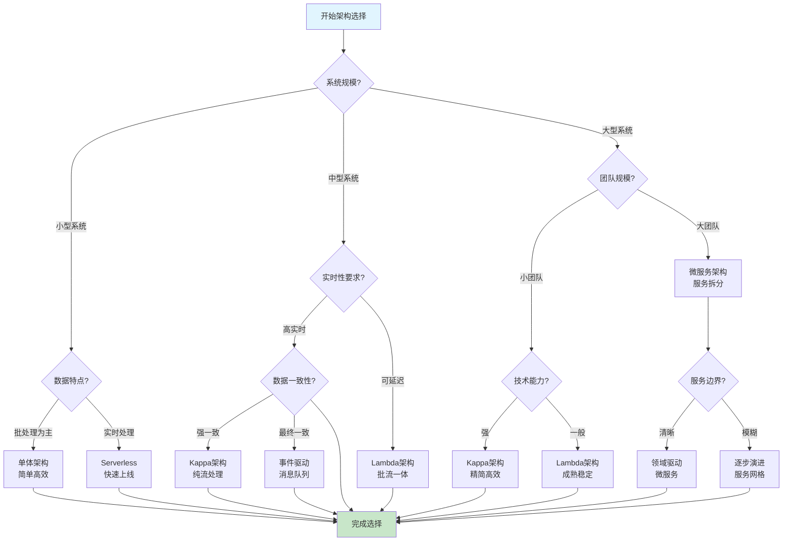

**架构选型指南**:

| 系统规模 | 关键考量 | 推荐架构 | 适用场景 |
|----------|----------|----------|----------|
| 小型 | 快速上线 | 单体/Serverless | MVP、原型验证 |
| 中型 | 批流平衡 | Lambda | 数据仓库、报表系统 |
| 中型 | 实时优先 | Kappa | 实时监控、推荐系统 |
| 大型 | 团队协同 | 微服务 | 电商平台、社交网络 |
| 大型 | 事件驱动 | EDA | 物联网、金融交易 |

**图表说明**: 根据系统规模、实时性要求和团队能力，指导架构模式选择。

**使用场景**:

- 系统架构设计
- 技术方案评审
- 架构演进规划
- 技术债务评估

---

### 3.4 部署策略决策树

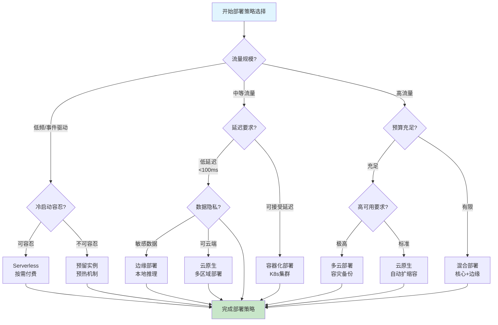

**部署策略矩阵**:

| 流量特征 | 延迟要求 | 预算 | 推荐策略 | 技术栈 |
|----------|----------|------|----------|--------|
| 低频 | 可容忍 | 低 | Serverless | Lambda/Functions |
| 低频 | 严格 | 中 | 预留实例 | EC2 + 自动伸缩 |
| 中等 | 标准 | 中 | 容器化 | K8s + Docker |
| 中等 | 严格 | 高 | 边缘+云 | K8s + Edge |
| 高流量 | 标准 | 高 | 云原生 | K8s + Istio |
| 高流量 | 严格 | 极高 | 多云 | 多区域 + CDN |

**图表说明**: 根据流量规模、延迟要求和预算约束，制定最优部署策略。

**使用场景**:

- 部署方案设计
- 成本优化决策
- 容量规划
- 灾备策略制定

---


## 4. 推理归纳证明决策树

### 4.1 从问题到解决方案的推理链

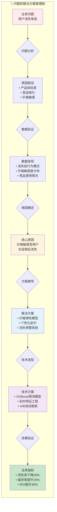

**推理过程说明**:

| 阶段 | 输入 | 分析方法 | 输出 |
|------|------|----------|------|
| **问题识别** | 业务指标异常 | 趋势分析、对比分析 | 明确问题定义 |
| **原因假设** | 业务知识+经验 | 头脑风暴、鱼骨图 | 可能原因列表 |
| **数据验证** | 用户行为数据 | 相关性分析、假设检验 | 验证假设 |
| **根因确定** | 验证结果 | 归因分析 | 核心原因 |
| **方案推导** | 根因+约束条件 | 方案设计、可行性分析 | 解决方案 |
| **技术选型** | 方案需求 | 技术评估、POC | 技术方案 |
| **效果验证** | 实施方案 | A/B测试、指标监控 | 业务价值 |

**图表说明**: 展示从业务问题到技术方案的完整推理链条，确保决策有据可依。

**使用场景**:

- 问题分析方法论
- 方案评审论证
- 决策过程记录
- 经验沉淀复用

---

### 4.2 架构决策论证过程

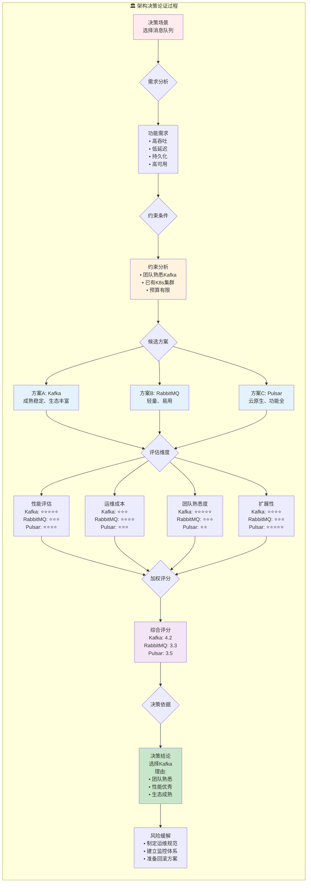

**决策论证框架**:

| 步骤 | 活动 | 产出 | 关键问题 |
|------|------|------|----------|
| **需求分析** | 收集功能/非功能需求 | 需求清单 | 系统要解决什么问题？ |
| **约束识别** | 识别技术/业务约束 | 约束条件 | 有哪些限制条件？ |
| **方案枚举** | 列出可行方案 | 候选方案集 | 有哪些选择？ |
| **维度定义** | 确定评估维度 | 评估矩阵 | 如何比较？ |
| **方案评估** | 定量/定性评估 | 评分结果 | 各方案表现如何？ |
| **决策制定** | 综合决策 | 决策结论 | 最佳选择是什么？ |
| **风险缓解** | 识别并应对风险 | 风险预案 | 如何应对风险？ |

**图表说明**: 展示架构决策的完整论证过程，确保决策透明、可追溯。

**使用场景**:

- 架构评审会议
- 技术选型文档
- 决策记录留存
- 团队知识共享

---

### 4.3 模型选择的逻辑推导

```mermaid
flowchart TD
    subgraph 模型推导["🤖 模型选择逻辑推导"]
        direction TB

        M1[业务目标<br/>预测用户购买意向] --> C1{约束条件}

        C1 --> C2[数据约束<br/>• 10万条记录<br/>• 50个特征<br/>• 类别不平衡<br/>• 有标签数据]
        C2 --> C3[业务约束<br/>• 推理延迟&lt;50ms<br/>• 可解释性要求<br/>• 快速迭代]
        C3 --> C4[资源约束<br/>• 4核8G服务器<br/>• 无GPU]

        C4 --> F1{筛选条件}

        F1 --> F2[排除深度学习<br/>❌ 数据量不足<br/>❌ 无GPU<br/>❌ 训练时间长]
        F1 --> F3[排除复杂集成<br/>❌ 推理延迟高<br/>❌ 可解释性差]
        F1 --> F4[保留候选<br/>✅ 逻辑回归<br/>✅ 决策树<br/>✅ 随机森林<br/>✅ XGBoost]

        F2 --> E1{评估实验}
        F3 --> E1
        F4 --> E1

        E1 --> E2[实验设计<br/>• 5折交叉验证<br/>• 时间序列分割<br/>• 关注F1/AUC]
        E2 --> E3[实验结果<br/>• 逻辑回归: AUC=0.72<br/>• 决策树: AUC=0.75<br/>• 随机森林: AUC=0.81<br/>• XGBoost: AUC=0.84]

        E3 --> V1{综合评估}

        V1 --> V2[精度对比<br/>XGBoost > 随机森林 > 决策树 > 逻辑回归]
        V1 --> V3[延迟对比<br/>逻辑回归(5ms) > 决策树(10ms) > XGBoost(25ms)]
        V1 --> V4[可解释性<br/>决策树 > 逻辑回归 > XGBoost > 随机森林]
        V1 --> V5[迭代效率<br/>XGBoost ≈ 逻辑回归 > 决策树]

        V2 --> D1{最终决策}
        V3 --> D1
        V4 --> D1
        V5 --> D1

        D1 --> D2[选择XGBoost<br/>理由:<br/>• 精度最高<br/>• 延迟可接受<br/>• 特征重要性可解释<br/>• 迭代效率高]

        D2 --> D3[优化策略<br/>• 模型量化<br/>• 特征筛选<br/>• 缓存热点预测]

        style M1 fill:#ffebee
        style C4 fill:#fff3e0
        style F4 fill:#e3f2fd
        style E3 fill:#f3e5f5
        style D2 fill:#c8e6c9
    end
```

**模型选择决策表**:

| 评估维度 | 权重 | 逻辑回归 | 决策树 | 随机森林 | XGBoost |
|----------|------|----------|--------|----------|---------|
| 预测精度 | 30% | 3 | 4 | 4.5 | 5 |
| 推理延迟 | 25% | 5 | 4.5 | 3 | 4 |
| 可解释性 | 20% | 4 | 5 | 3 | 4 |
| 迭代效率 | 15% | 4 | 3 | 3.5 | 4.5 |
| 资源消耗 | 10% | 5 | 4.5 | 3 | 3.5 |
| **加权总分** | 100% | **3.95** | **4.18** | **3.73** | **4.43** |

**图表说明**: 展示模型选择的完整逻辑推导过程，从约束条件到最终决策。

**使用场景**:

- 模型选型文档
- 实验报告
- 技术评审
- 最佳实践沉淀

---


## 5. 概念关系图

### 5.1 AI/ML核心概念依赖关系图

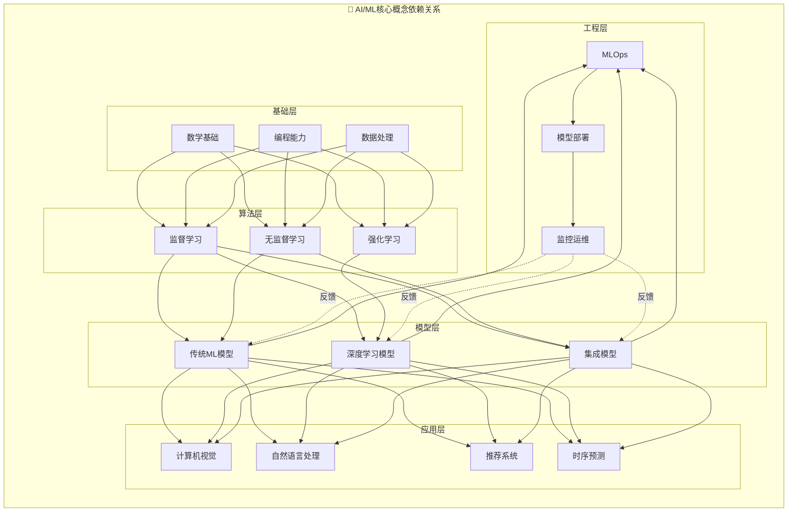

**依赖关系说明**:

| 层级 | 核心概念 | 前置依赖 | 后续影响 |
|------|----------|----------|----------|
| **基础层** | 数学/编程/数据 | 无 | 所有算法 |
| **算法层** | 监督/无监督/强化 | 基础层 | 模型选择 |
| **模型层** | ML/DL/集成 | 算法层 | 应用场景 |
| **应用层** | CV/NLP/推荐 | 模型层 | 工程实现 |
| **工程层** | MLOps/部署 | 应用层 | 模型迭代 |

**图表说明**: 展示AI/ML领域核心概念之间的依赖关系和学习路径。

**使用场景**:

- 学习路径规划
- 知识体系梳理
- 课程设计
- 技能评估

---

### 5.2 ML系统数据流与组件交互图

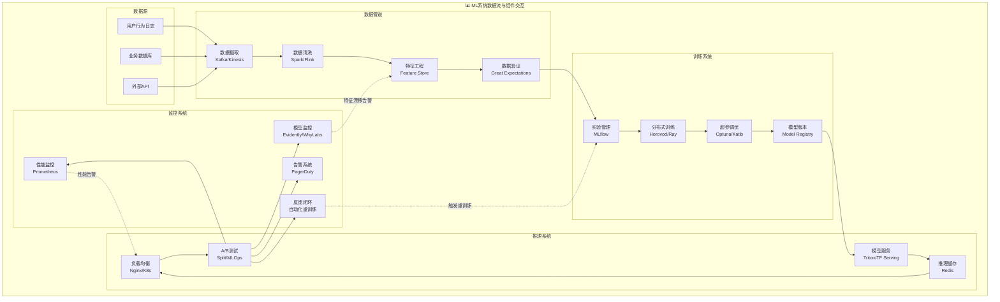

**组件交互说明**:

| 组件 | 输入 | 处理 | 输出 | 下游组件 |
|------|------|------|------|----------|
| **数据摄取** | 原始数据 | 实时/批量采集 | 原始数据流 | 数据清洗 |
| **数据清洗** | 原始数据 | 去重/补全/校验 | 清洗数据 | 特征工程 |
| **特征工程** | 清洗数据 | 特征提取/转换 | 特征向量 | 数据验证 |
| **模型训练** | 特征数据 | 训练/验证/调优 | 模型文件 | 模型服务 |
| **模型服务** | 推理请求 | 模型推理 | 预测结果 | 监控系统 |
| **监控系统** | 预测结果 | 指标计算/分析 | 监控告警 | 反馈闭环 |

**图表说明**: 展示ML系统各组件之间的数据流动和交互关系。

**使用场景**:

- 系统设计
- 组件选型
- 故障排查
- 性能优化

---

### 5.3 模型生命周期流程图

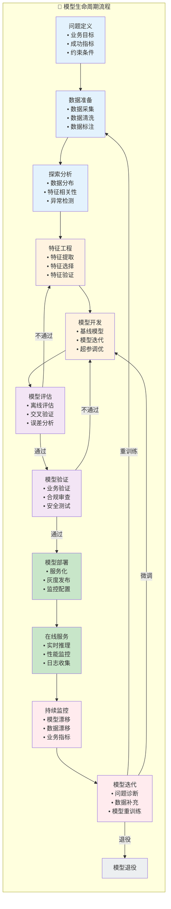

**生命周期各阶段说明**:

| 阶段 | 关键活动 | 产出物 | 决策点 |
|------|----------|--------|--------|
| **问题定义** | 需求分析、指标设计 | PRD文档 | 项目启动 |
| **数据准备** | 数据采集、清洗、标注 | 数据集 | 数据质量评估 |
| **探索分析** | EDA、统计分析 | 分析报告 | 数据理解 |
| **特征工程** | 特征提取、选择 | 特征集 | 特征质量评估 |
| **模型开发** | 算法选择、训练 | 候选模型 | 模型对比 |
| **模型评估** | 离线测试、验证 | 评估报告 | 模型通过 |
| **模型验证** | 业务验证、合规 | 验证报告 | 生产准入 |
| **模型部署** | 服务化、发布 | 在线服务 | 上线确认 |
| **在线服务** | 推理服务、监控 | 服务指标 | 正常运行 |
| **持续监控** | 漂移检测、告警 | 监控报告 | 异常处理 |
| **模型迭代** | 诊断、重训练 | 新版本 | 迭代决策 |

**图表说明**: 展示模型从定义到退役的完整生命周期管理流程。

**使用场景**:

- MLOps流程设计
- 项目管理
- 质量管控
- 团队协作

---

### 5.4 技术栈生态系统关系图

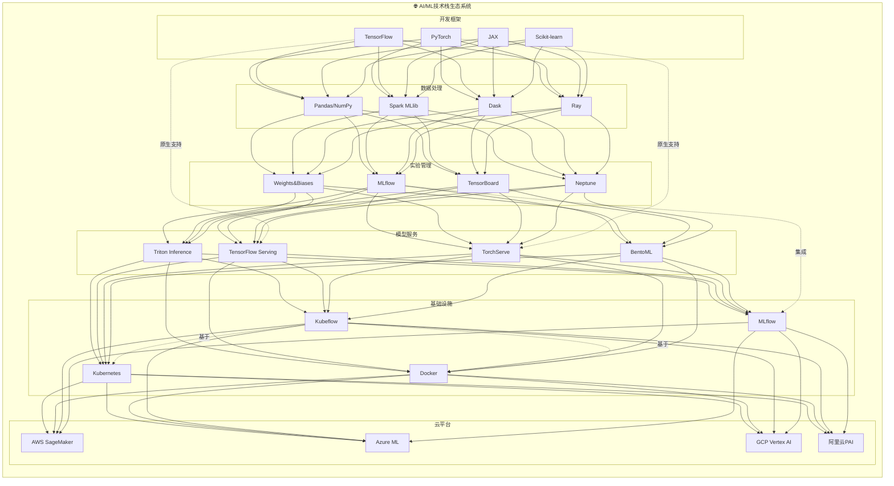

**生态系统关系说明**:

| 层级 | 核心工具 | 上游依赖 | 下游消费 |
|------|----------|----------|----------|
| **开发框架** | PyTorch/TF/JAX | 无 | 数据处理 |
| **数据处理** | Pandas/Spark | 开发框架 | 实验管理 |
| **实验管理** | MLflow/W&B | 数据处理 | 模型服务 |
| **模型服务** | Triton/TFX | 实验管理 | 基础设施 |
| **基础设施** | K8s/Kubeflow | 模型服务 | 云平台 |
| **云平台** | AWS/Azure/GCP | 基础设施 | 最终用户 |

**图表说明**: 展示AI/ML技术栈各组件之间的生态关系和依赖层次。

**使用场景**:

- 技术栈规划
- 工具选型
- 迁移评估
- 团队培训

---

## 附录: 图表使用指南

### 图表类型速查表

| 图表类型 | 适用场景 | 信息密度 | 决策支持 |
|----------|----------|----------|----------|
| **思维导图** | 知识梳理、学习规划 | 高 | 中 |
| **对比矩阵** | 技术选型、方案对比 | 高 | 高 |
| **决策树** | 流程引导、条件判断 | 中 | 高 |
| **推理链** | 论证过程、决策记录 | 中 | 高 |
| **关系图** | 系统理解、架构设计 | 高 | 中 |

### 如何选择合适的图表

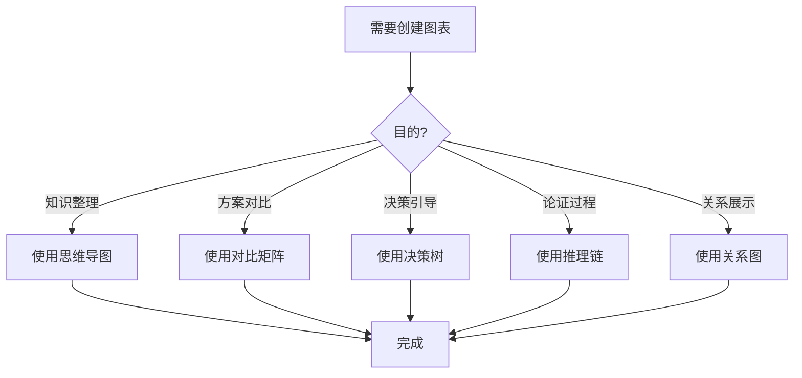

### 图表最佳实践

1. **保持简洁**: 单图信息密度适中，避免过度复杂
2. **层次分明**: 使用颜色、大小区分重要程度
3. **标注清晰**: 关键节点添加说明文字
4. **逻辑连贯**: 确保流程和关系的逻辑正确
5. **版本管理**: 图表随项目演进更新

---

*文档生成时间: 2024年*
*适用对象: AI/ML工程师、架构师、技术决策者*
