# AI/ML 知识体系可视化表征

> 本文档系统性地呈现人工智能与机器学习的知识体系，包含思维导图、对比矩阵、决策树和概念关系图等多种可视化形式。

---

## 目录

- [AI/ML 知识体系可视化表征](#aiml-知识体系可视化表征)
  - [目录](#目录)
  - [1. AI/ML知识全景思维导图](#1-aiml知识全景思维导图)
    - [1.1 完整知识体系概览](#11-完整知识体系概览)
    - [1.2 深度学习专项知识图谱](#12-深度学习专项知识图谱)
  - [2. 多维概念对比矩阵](#2-多维概念对比矩阵)
    - [2.1 主流深度学习框架对比](#21-主流深度学习框架对比)
    - [2.2 监督学习算法对比](#22-监督学习算法对比)
    - [2.3 生成模型对比](#23-生成模型对比)
    - [2.4 优化器对比](#24-优化器对比)
    - [2.5 大语言模型对比](#25-大语言模型对比)
  - [3. 决策树图](#3-决策树图)
    - [3.1 模型选择决策树](#31-模型选择决策树)
    - [3.2 技术栈选型决策树](#32-技术栈选型决策树)
    - [3.3 部署架构决策树](#33-部署架构决策树)
  - [4. 推理归纳证明决策树](#4-推理归纳证明决策树)
    - [4.1 机器学习问题求解思维流程](#41-机器学习问题求解思维流程)
    - [4.2 模型诊断决策树](#42-模型诊断决策树)
    - [4.3 超参数调优决策流程](#43-超参数调优决策流程)
  - [5. 概念关系图](#5-概念关系图)
    - [5.1 核心概念依赖关系图](#51-核心概念依赖关系图)
    - [5.2 先修知识图谱](#52-先修知识图谱)
    - [5.3 算法演进时间线](#53-算法演进时间线)
  - [附录：快速参考卡片](#附录快速参考卡片)
    - [A. 损失函数速查表](#a-损失函数速查表)
    - [B. 激活函数选择指南](#b-激活函数选择指南)
    - [C. 评估指标选择](#c-评估指标选择)

---

## 1. AI/ML知识全景思维导图

### 1.1 完整知识体系概览

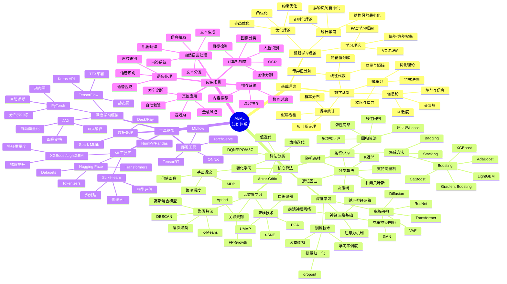

### 1.2 深度学习专项知识图谱

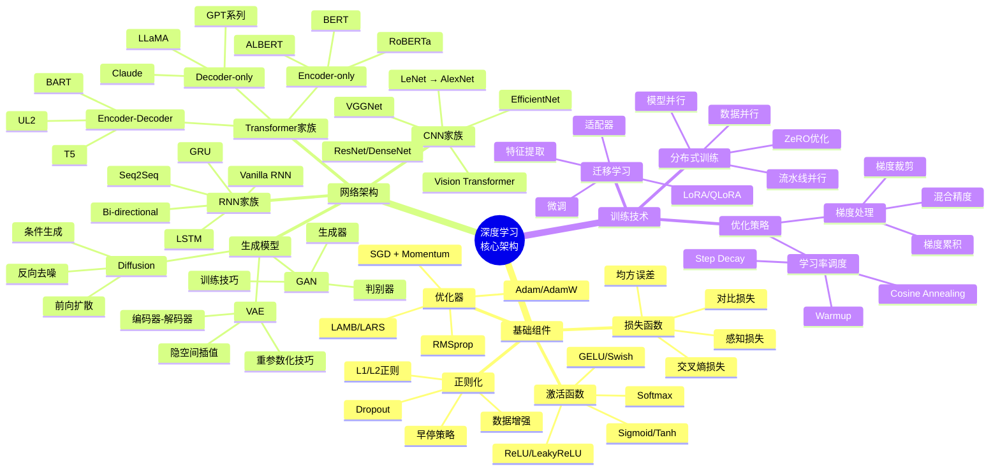

---

## 2. 多维概念对比矩阵

### 2.1 主流深度学习框架对比

| 维度 | PyTorch | TensorFlow | JAX |
|------|---------|------------|-----|
| **开发公司** | Meta (Facebook) | Google | Google |
| **发布年份** | 2016 | 2015 | 2018 |
| **计算图类型** | 动态图 (Eager) | 静态图 (Graph) | 函数变换 (Functional) |
| **调试体验** | ⭐⭐⭐⭐⭐ 优秀 | ⭐⭐⭐ 良好 | ⭐⭐⭐⭐ 良好 |
| **生产部署** | ⭐⭐⭐⭐ 良好 | ⭐⭐⭐⭐⭐ 优秀 | ⭐⭐⭐ 一般 |
| **研究友好度** | ⭐⭐⭐⭐⭐ 极高 | ⭐⭐⭐⭐ 高 | ⭐⭐⭐⭐⭐ 极高 |
| **生态系统** | 丰富 (torchvision等) | 最丰富 (Keras/TFX) | 快速增长 |
| **GPU支持** | CUDA原生 | CUDA/XLA | XLA优化 |
| **TPU支持** | 有限 | 原生支持 | 原生支持 |
| **分布式训练** | DDP/FSDP | Strategy API | pmap/pjit |
| **代码风格** | Pythonic直观 | 配置化 | 函数式编程 |
| **典型应用** | 研究/原型 | 生产/大规模 | 科研/高性能计算 |
| **学习曲线** | 平缓 | 较陡 | 中等 |
| **社区活跃度** | 极高 | 高 | 快速增长 |

### 2.2 监督学习算法对比

| 算法 | 适用场景 | 优点 | 缺点 | 时间复杂度 | 空间复杂度 | 可解释性 |
|------|----------|------|------|------------|------------|----------|
| **逻辑回归** | 二分类、概率预测 | 简单快速、可解释性强 | 只能处理线性问题 | O(nd) | O(d) | ⭐⭐⭐⭐⭐ |
| **SVM** | 高维数据、小样本 | 泛化能力强、核技巧灵活 | 大数据集慢、调参复杂 | O(n²d)~O(n³d) | O(n²)~O(n³) | ⭐⭐⭐ |
| **决策树** | 混合类型数据 | 直观可解释、无需归一化 | 易过拟合、不稳定 | O(nd log n) | O(n) | ⭐⭐⭐⭐⭐ |
| **随机森林** | 通用分类回归 | 准确率高、抗过拟合 | 训练慢、黑盒 | O(k·n·d·log n) | O(k·n) | ⭐⭐⭐ |
| **XGBoost** | 竞赛/表格数据 | 速度快、准确率高 | 调参复杂、易过拟合 | O(k·n·d) | O(n) | ⭐⭐⭐ |
| **KNN** | 小数据集、推荐 | 简单无训练、适应性强 | 预测慢、维度灾难 | O(1)训练/O(nd)预测 | O(nd) | ⭐⭐⭐⭐ |
| **朴素贝叶斯** | 文本分类、垃圾邮件 | 极快、小数据友好 | 特征独立性假设 | O(nd) | O(d) | ⭐⭐⭐⭐ |

> n=样本数, d=特征数, k=树数量/迭代次数

### 2.3 生成模型对比

| 维度 | VAE (变分自编码器) | GAN (生成对抗网络) | Diffusion (扩散模型) |
|------|-------------------|-------------------|---------------------|
| **核心思想** | 概率编码解码 | 对抗博弈 | 逐步去噪 |
| **训练稳定性** | ⭐⭐⭐⭐⭐ 稳定 | ⭐⭐ 不稳定 | ⭐⭐⭐⭐ 较稳定 |
| **生成质量** | ⭐⭐⭐ 中等 | ⭐⭐⭐⭐⭐ 高 | ⭐⭐⭐⭐⭐ 最高 |
| **训练速度** | ⭐⭐⭐⭐⭐ 快 | ⭐⭐⭐⭐ 较快 | ⭐⭐ 慢 |
| **推理速度** | ⭐⭐⭐⭐⭐ 快 | ⭐⭐⭐⭐⭐ 快 | ⭐⭐ 慢 |
| **模式覆盖** | ⭐⭐⭐⭐ 较好 | ⭐⭐ 易模式坍塌 | ⭐⭐⭐⭐⭐ 全面 |
| **隐空间** | 连续可解释 | 无显式隐空间 | 无显式隐空间 |
| **条件生成** | ⭐⭐⭐⭐ 容易 | ⭐⭐⭐⭐ 容易 | ⭐⭐⭐⭐⭐ 容易 |
| **数学基础** | 变分推断 | 博弈论 | 随机过程 |
| **代表模型** | β-VAE, VQ-VAE | StyleGAN, BigGAN | Stable Diffusion, DALL-E |
| **主要应用** | 降维、异常检测 | 图像生成、风格迁移 | 高质量图像/视频生成 |
| **训练技巧** | KL权重调度 | WGAN-GP, Spectral Norm | DDIM加速、Classifier Guidance |

### 2.4 优化器对比

| 优化器 | 更新公式特点 | 内存需求 | 收敛速度 | 泛化能力 | 超参数敏感度 | 最佳适用场景 |
|--------|-------------|----------|----------|----------|-------------|-------------|
| **SGD** | θ = θ - η·∇L | 低 (1x) | 慢 | ⭐⭐⭐⭐⭐ 最优 | 中等 | 大规模训练、追求泛化 |
| **Momentum** | 累加速度向量 | 低 (2x) | 中等 | ⭐⭐⭐⭐⭐ 最优 | 中等 | 非凸优化、逃离局部最优 |
| **AdaGrad** | 自适应学习率 | 高 (d+1)x | 快(初期) | ⭐⭐⭐ 一般 | 低 | 稀疏梯度、NLP |
| **RMSprop** | 指数移动平均梯度 | 中 (2x) | 快 | ⭐⭐⭐⭐ 良好 | 中等 | RNN、非平稳目标 |
| **Adam** | Momentum + RMSprop | 中 (3x) | ⭐⭐⭐⭐⭐ 最快 | ⭐⭐⭐ 一般 | 低 | 默认选择、快速收敛 |
| **AdamW** | Adam + 解耦权重衰减 | 中 (3x) | 快 | ⭐⭐⭐⭐ 良好 | 低 | Transformer、大模型训练 |
| **LAMB** | 分层自适应+动量 | 高 (3x) | 快 | ⭐⭐⭐⭐ 良好 | 低 | 超大batch训练 |
| **LARS** | 层级自适应学习率 | 低 (2x) | 中等 | ⭐⭐⭐⭐ 良好 | 中等 | 对比学习、自监督 |

**优化器选择建议：**

- 小模型/快速实验 → Adam/AdamW
- 大模型/生产部署 → AdamW + 学习率调度
- 追求最优泛化 → SGD + Momentum + 充分训练
- 超大batch → LAMB/LARS
- 计算机视觉 → SGD + Momentum (经典)
- NLP/Transformer → AdamW

### 2.5 大语言模型对比

| 特性 | GPT-4/GPT-4o | LLaMA 3 | Claude 3 | Gemini |
|------|-------------|---------|----------|--------|
| **开发公司** | OpenAI | Meta | Anthropic | Google |
| **模型规模** | 未公开 (~1.8T MoE) | 8B/70B/405B | 未公开 | 1.5B-1.5T |
| **架构类型** | Decoder-only | Decoder-only | Decoder-only | MoE |
| **上下文长度** | 128K (4o: 1M) | 128K | 200K | 1M+ |
| **多模态** | ✅ 图像/语音/视频 | ❌ 纯文本 | ✅ 图像 | ✅ 图像/视频/音频 |
| **开源** | ❌ API only | ✅ 开源权重 | ❌ API only | 部分开源(Gemma) |
| **训练数据** | 未公开 | 15T tokens | 未公开 | 多模态数据 |
| **安全性** | ⭐⭐⭐⭐ 良好 | ⭐⭐⭐ 依赖微调 | ⭐⭐⭐⭐⭐ 最高 | ⭐⭐⭐⭐ 良好 |
| **推理成本** | 高 | 可控(自托管) | 高 | 中等 |
| **推理速度** | 中等 | 快(小模型) | 中等 | 快 |
| **代码能力** | ⭐⭐⭐⭐⭐ 最强 | ⭐⭐⭐⭐ 强 | ⭐⭐⭐⭐⭐ 强 | ⭐⭐⭐⭐ 强 |
| **长文本处理** | ⭐⭐⭐⭐ 良好 | ⭐⭐⭐⭐ 良好 | ⭐⭐⭐⭐⭐ 最强 | ⭐⭐⭐⭐⭐ 最强 |
| **数学推理** | ⭐⭐⭐⭐⭐ 最强 | ⭐⭐⭐⭐ 强 | ⭐⭐⭐⭐⭐ 强 | ⭐⭐⭐⭐⭐ 强 |
| **API可用性** | ⭐⭐⭐⭐⭐ 全球 | 自托管 | ⭐⭐⭐ 受限地区 | ⭐⭐⭐⭐⭐ 全球 |

---

## 3. 决策树图

### 3.1 模型选择决策树

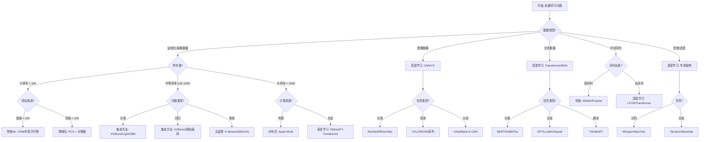

### 3.2 技术栈选型决策树

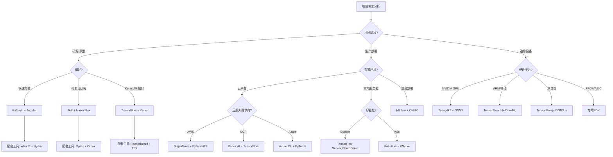

### 3.3 部署架构决策树

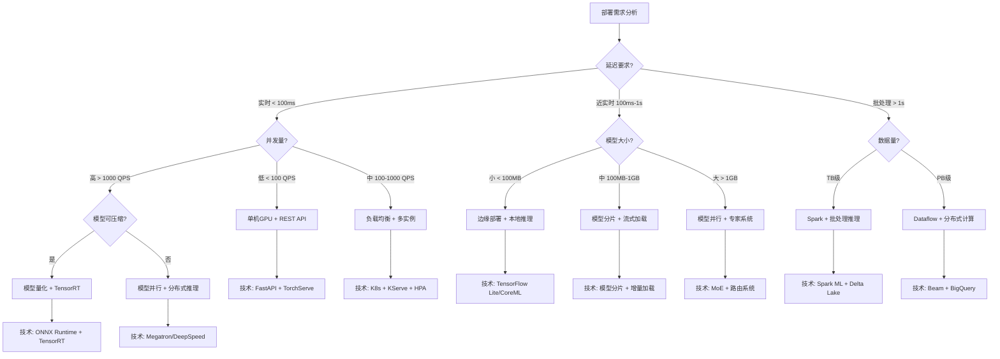

---

## 4. 推理归纳证明决策树

### 4.1 机器学习问题求解思维流程

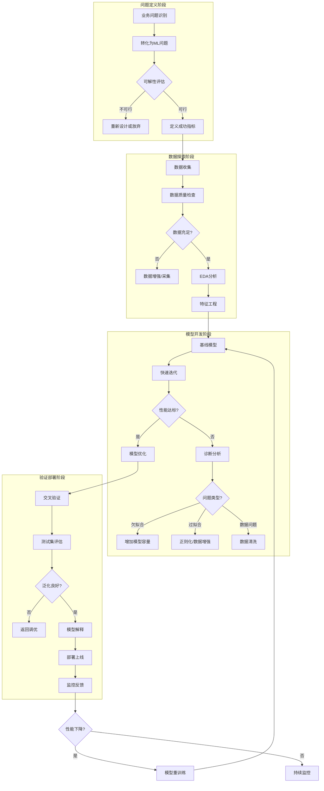

### 4.2 模型诊断决策树

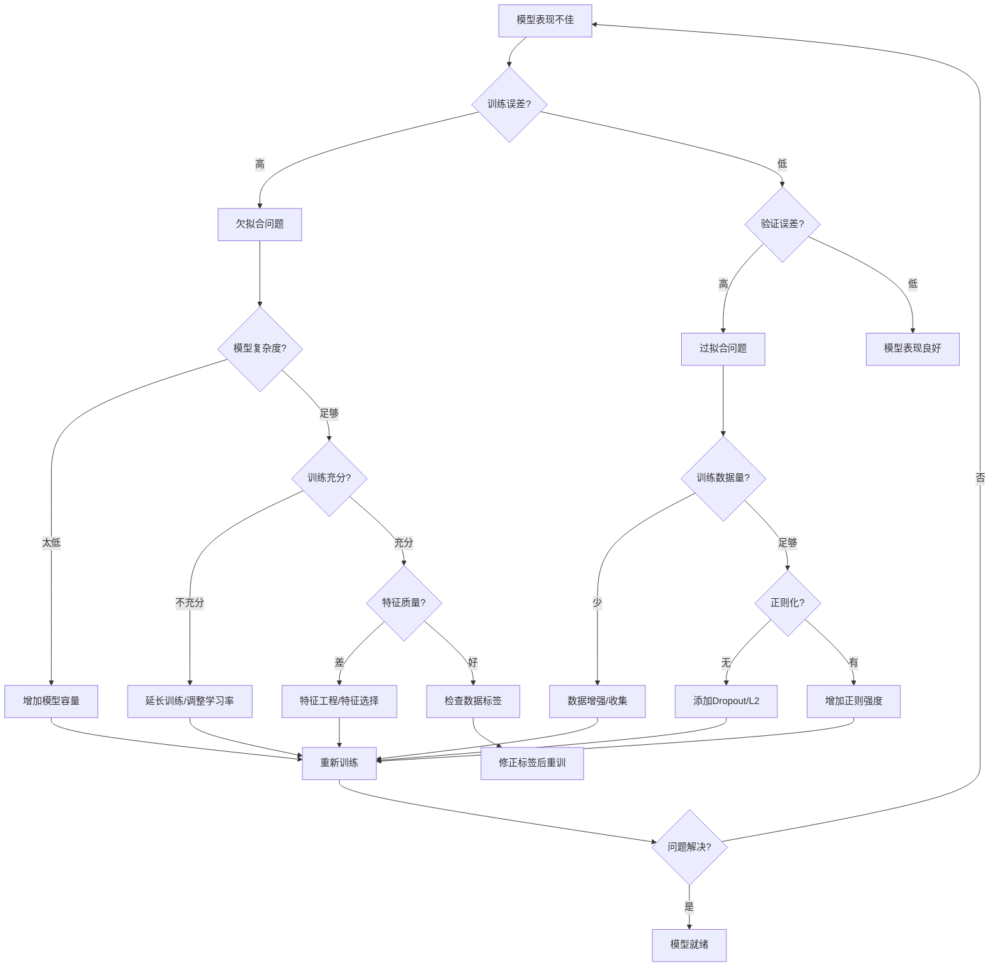

### 4.3 超参数调优决策流程

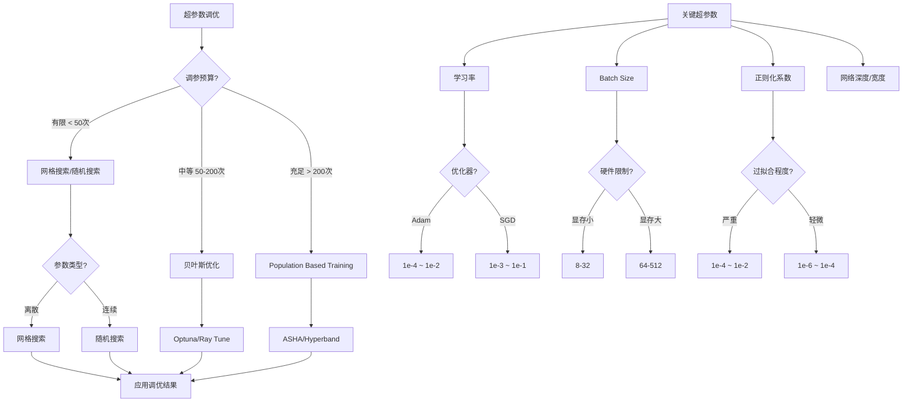

---

## 5. 概念关系图

### 5.1 核心概念依赖关系图

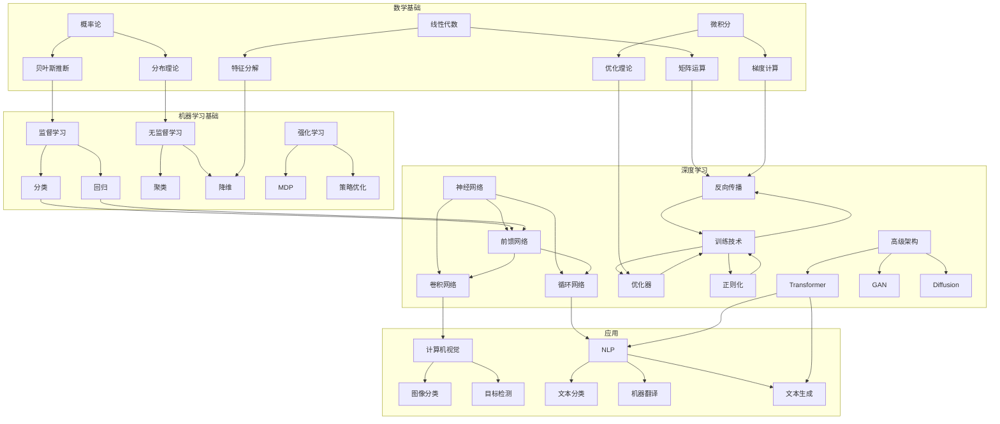

### 5.2 先修知识图谱

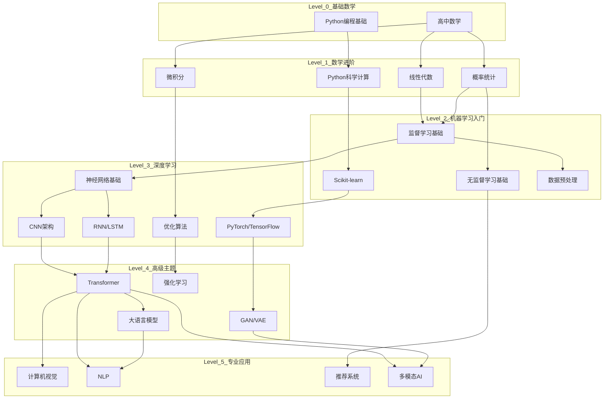

### 5.3 算法演进时间线

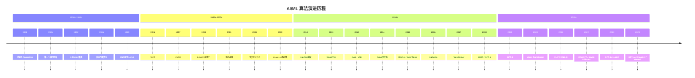

---

## 附录：快速参考卡片

### A. 损失函数速查表

| 问题类型 | 推荐损失函数 | 公式 |
|---------|-------------|------|
| 二分类 | Binary Cross Entropy | -[y·log(p) + (1-y)·log(1-p)] |
| 多分类 | Categorical Cross Entropy | -Σ y_i·log(p_i) |
| 回归 | MSE | (y - ŷ)² |
| 回归(异常值鲁棒) | MAE | \|y - ŷ\| |
| 排序 | Hinge Loss | max(0, 1 - y·ŷ) |

### B. 激活函数选择指南

| 场景 | 推荐激活函数 | 原因 |
|-----|-------------|------|
| 隐藏层默认 | ReLU | 计算快、缓解梯度消失 |
| 深层网络 | GELU/Swish | 平滑、性能更好 |
| 输出层(分类) | Softmax | 概率归一化 |
| 输出层(回归) | Linear | 无约束输出 |
| RNN/LSTM | Tanh | 输出范围控制 |

### C. 评估指标选择

| 问题类型 | 平衡数据 | 不平衡数据 |
|---------|---------|-----------|
| 二分类 | Accuracy / F1 | Precision-Recall AUC |
| 多分类 | Macro F1 | Weighted F1 |
| 回归 | RMSE / MAE | MAPE / R² |
| 排序 | NDCG / MAP | MRR |

---

*文档版本: 1.0 | 最后更新: 2024年*
*本知识图谱持续更新，建议结合实践项目深化理解*
