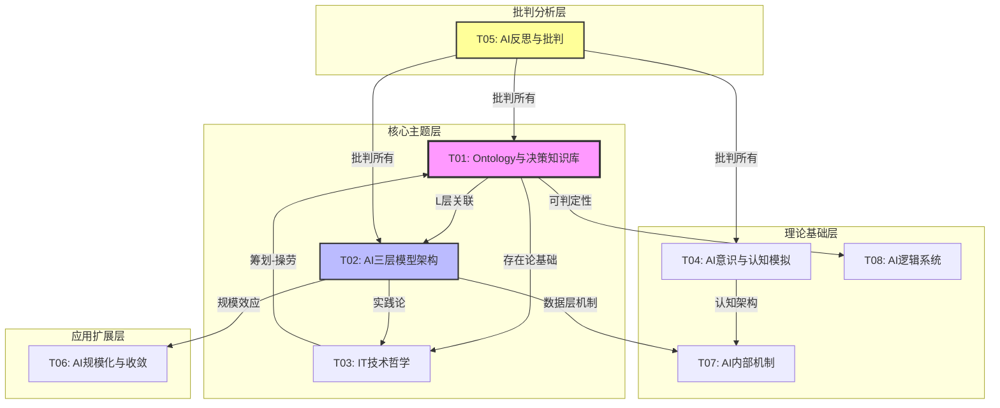
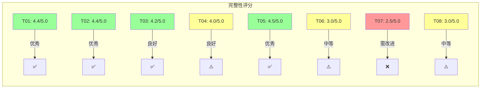

# View 文件夹主题导航总览（2025）

**快速导航**：本文档提供 view 文件夹中所有主题的快速导航和主题关系可视化。

**创建日期**：2025年1月15日

---

## 目录

- [一、主题快速导航](#一主题快速导航)
- [二、主题关系图谱](#二主题关系图谱)
- [三、主题内容矩阵](#三主题内容矩阵)
- [四、阅读路径推荐](#四阅读路径推荐)
- [五、主题完整性仪表盘](#五主题完整性仪表盘)

---

## 一、主题快速导航

### 1.1 按主题代码导航

| 主题代码 | 主题名称 | 文件数量 | 核心文档 | 难度等级 |
|---------|---------|---------|---------|---------|
| [T01](#t01-ontology与决策知识库) | Ontology与决策知识库 | 3 | T01_Ontology_商业论证.md, T01_DKB_形式化证明.md | ⭐⭐⭐⭐ |
| [T02](#t02-ai三层模型架构) | AI三层模型架构 | 5 | T02_三层架构_全景分析.md | ⭐⭐⭐ |
| [T03](#t03-it技术哲学) | IT技术哲学 | 2 | T03_IT技术哲学_范式革命.md, T03_IT技术哲学_工程实践.md | ⭐⭐⭐ |
| [T04](#t04-ai意识与认知模拟) | AI意识与认知模拟 | 2 | T04_AI意识_理论分析.md | ⭐⭐⭐⭐ |
| [T05](#t05-ai反思与批判) | AI反思与批判 | 1 | T05_AI反思_批判分析.md | ⭐⭐⭐⭐⭐ |
| [T06](#t06-ai规模化与收敛) | AI规模化与收敛 | 1 | T06_AI规模化_收敛分析.md | ⭐⭐⭐ |
| [T07](#t07-ai内部机制) | AI内部机制 | 1 | T07_AI内部机制_机制分析.md | ⭐⭐⭐ |
| [T08](#t08-ai逻辑系统) | AI逻辑系统 | 1 | T08_AI逻辑系统_逻辑分析.md | ⭐⭐⭐⭐ |

### 1.2 按应用场景导航

| 应用场景 | 推荐主题 | 起始文档 | 预计阅读时间 |
|---------|---------|---------|------------|
| **企业Ontology实施** | T01 | T01_Ontology_商业论证.md | 2-3小时 |
| **AI架构设计** | T02 | T02_三层架构_全景分析.md | 3-4小时 |
| **技术哲学研究** | T03 | T03_IT技术哲学_范式革命.md | 2-3小时 |
| **意识理论研究** | T04 | T04_AI意识_理论分析.md | 2-3小时 |
| **框架批判分析** | T05 | T05_AI反思_批判分析.md | 3-4小时 |
| **规模化研究** | T06 | T06_AI规模化_收敛分析.md | 1-2小时 |
| **机制深度分析** | T07 | T07_AI内部机制_机制分析.md | 1-2小时 |
| **逻辑系统设计** | T08 | T08_AI逻辑系统_逻辑分析.md | 2-3小时 |

---

## 二、主题关系图谱

### 2.1 主题依赖关系图



### 2.2 主题关联强度矩阵

| 主题 | T01 | T02 | T03 | T04 | T05 | T06 | T07 | T08 |
|------|-----|-----|-----|-----|-----|-----|-----|-----|
| **T01** | - | 🔗🔗强 | 🔗中 | - | ⚠️批判 | - | - | 🔗中 |
| **T02** | 🔗🔗强 | - | 🔗中 | 🔗弱 | ⚠️批判 | 🔗中 | 🔗中 | 🔗弱 |
| **T03** | 🔗中 | 🔗中 | - | - | - | - | - | - |
| **T04** | - | 🔗弱 | - | - | ⚠️批判 | - | 🔗中 | - |
| **T05** | ⚠️批判 | ⚠️批判 | - | ⚠️批判 | - | - | - | ⚠️批判 |
| **T06** | - | 🔗中 | - | - | - | - | - | - |
| **T07** | - | 🔗中 | - | 🔗中 | - | - | - | - |
| **T08** | 🔗中 | 🔗弱 | - | - | ⚠️批判 | - | - | - |

**图例**：

- 🔗🔗 = 强关联（相互依赖）
- 🔗 = 中关联（相互引用）
- 🔗弱 = 弱关联（间接联系）
- ⚠️ = 冲突/批判关系

---

## 三、主题内容矩阵

### 3.1 主题覆盖度矩阵

| 维度 | T01 | T02 | T03 | T04 | T05 | T06 | T07 | T08 |
|------|-----|-----|-----|-----|-----|-----|-----|-----|
| **理论基础** | ✅ | ✅ | ✅ | ✅ | ✅ | ⚠️ | ⚠️ | ⚠️ |
| **形式化定义** | ✅ | ✅ | ✅ | ✅ | ⚠️ | ⚠️ | ❌ | ⚠️ |
| **实证案例** | ✅ | ✅ | ✅ | ⚠️ | ⚠️ | ❌ | ❌ | ❌ |
| **工程实践** | ✅ | ✅ | ✅ | ❌ | ❌ | ⚠️ | ❌ | ❌ |
| **前沿研究** | ✅ | ✅ | ⚠️ | ✅ | ✅ | ⚠️ | ❌ | ❌ |
| **批判分析** | ⚠️ | ⚠️ | ❌ | ⚠️ | ✅ | ❌ | ❌ | ❌ |

**图例**：

- ✅ = 完整（≥80%）
- ⚠️ = 部分（40-80%）
- ❌ = 缺失（<40%）

### 3.2 内容类型分布

| 内容类型 | T01 | T02 | T03 | T04 | T05 | T06 | T07 | T08 |
|---------|-----|-----|-----|-----|-----|-----|-----|-----|
| **商业论证** | ✅ | ⚠️ | ⚠️ | - | - | - | - | - |
| **形式化证明** | ✅ | ⚠️ | ⚠️ | ⚠️ | - | - | - | ⚠️ |
| **架构设计** | ⚠️ | ✅ | - | - | - | - | - | - |
| **工程实践** | ✅ | ✅ | ⚠️ | - | - | ⚠️ | - | - |
| **哲学分析** | ⚠️ | ⚠️ | ✅ | ⚠️ | ⚠️ | - | - | - |
| **理论批判** | - | - | - | - | ✅ | - | - | - |

---

## 四、阅读路径推荐

### 4.1 初学者路径（新手友好）

**路径1：从商业应用到技术深度**

```
1. T01_Ontology_商业论证.md (Ontology商业论证)
   ↓ 理解Ontology的商业价值
2. T02_三层架构_全景分析.md (三层架构基础)
   ↓ 理解AI系统架构
3. T03_IT技术哲学_范式革命.md (IT技术哲学入门)
   ↓ 理解技术哲学基础
4. T04_AI意识_理论分析.md (意识研究入门)
   ↓ 理解AI意识边界
```

**预计时间**：8-10小时

### 4.2 研究者路径（理论研究）

**路径2：从形式化证明到批判分析**

```
1. VIEW_主题梳理与索引_2025.md (建立整体认知)
   ↓ 了解所有主题
2. T01_DKB_形式化证明.md (DKB形式化证明)
   ↓ 理解形式化方法
3. T02_三层架构_全景分析.md (三层架构理论)
   ↓ 理解架构理论基础
4. T05_AI反思_批判分析.md (批判性分析)
   ↓ 理解框架局限性
```

**预计时间**：12-15小时

### 4.3 实践者路径（工程应用）

**路径3：从工程实践到架构设计**

```
1. T02_三层架构_工程实践.md (工程实践核心)
   ↓ 理解工程实践方法
2. T01_Ontology_商业论证.md §5 (Ontology实施路径)
   ↓ 理解实施方法论
3. T02_三层架构_全景分析.md §3 (工具链实践)
   ↓ 理解工具链使用
4. VIEW_主题目录_2025.md (主题详细目录)
   ↓ 查找具体技术细节
```

**预计时间**：10-12小时

### 4.4 专家路径（深度批判）

**路径4：从批判分析到理论重构**

```
1. T05_AI反思_批判分析.md (框架漏洞批判)
   ↓ 理解现有框架问题
2. T01_DKB_形式化证明.md (形式化证明方法)
   ↓ 理解正确证明方法
3. T03_IT技术哲学_范式革命.md (技术哲学深度)
   ↓ 理解哲学基础
4. T04_AI意识_理论分析.md (意识理论前沿)
   ↓ 理解前沿理论
```

**预计时间**：15-20小时

---

## 五、主题完整性仪表盘

### 5.1 主题完整性评分



### 5.2 主题优先级建议

#### 🔴 高优先级（立即补充）

1. **T07: AI内部机制**
   - ❌ 缺少理论基础
   - ❌ 缺少形式化定义
   - ❌ 缺少实证案例
   - **建议**：补充认知架构分析、注意力机制工作机制

2. **T06: AI规模化与收敛**
   - ⚠️ 缺少实证案例
   - ⚠️ 缺少工程实践
   - **建议**：补充大规模模型案例、规模效应实证

#### 🟡 中优先级（近期补充）

1. **T08: AI逻辑系统**
   - ⚠️ 缺少实证案例
   - ⚠️ 缺少工程实践
   - **建议**：补充逻辑系统实现案例

2. **T04: AI意识**
   - ⚠️ 缺少GNWT理论详细对比
   - ⚠️ 缺少工程实践
   - **建议**：补充意识测试方法、GNWT vs IIT对比

#### 🟢 低优先级（可延后）

1. **T05: AI反思**
   - ⚠️ 缺少对批判的回应
   - **建议**：创建回应文档

---

## 六、主题快速查找表

### 6.1 关键词索引

| 关键词 | 相关主题 | 相关文档 | 章节位置 |
|--------|---------|---------|---------|
| **Ontology** | T01 | T01_Ontology_商业论证.md, T01_DKB_形式化证明.md | §二 |
| **DKB三元组** | T01 | T01_DKB_形式化证明.md | §一 |
| **三层模型** | T02 | T02_三层架构_全景分析.md | §一 |
| **执行层** | T02 | T02_三层架构_全景分析.md | §二.1 |
| **控制层** | T02 | T02_三层架构_全景分析.md | §二.2 |
| **数据层** | T02 | T02_三层架构_全景分析.md | §二.3 |
| **海德格尔** | T03 | T03_IT技术哲学_范式革命.md | §一 |
| **实践智慧** | T03 | T03_IT技术哲学_范式革命.md | §二 |
| **意识** | T04 | T04_AI意识_理论分析.md | §一 |
| **Qualia** | T04 | T04_AI意识_理论分析.md | §一 |
| **Scaling Law** | T06 | T06_AI规模化_收敛分析.md | §一 |
| **形式化证明** | T01, T02 | T01_DKB_形式化证明.md | §四 |

### 6.2 问题索引

| 问题 | 相关主题 | 相关文档 | 答案位置 |
|------|---------|---------|---------|
| **什么是DKB？** | T01 | T01_Ontology_商业论证.md | §二 |
| **为什么需要Ontology？** | T01 | T01_Ontology_商业论证.md | §一 |
| **三层模型是什么？** | T02 | T02_三层架构_全景分析.md | §一 |
| **意识如何定义？** | T04 | T04_AI意识_理论分析.md | §一 |
| **AI能否具有意识？** | T04 | T04_AI意识_理论分析.md | §结论 |
| **三层模型的冲突是什么？** | T02 | T02_三层架构_全景分析.md | §四 |
| **技术哲学的核心是什么？** | T03 | T03_IT技术哲学_范式革命.md | §一 |

---

## 七、主题更新状态

### 7.1 最近更新

| 主题 | 最后更新 | 更新内容 | 更新文档 |
|------|---------|---------|---------|
| T01 | 2025-01-15 | 新增形式化证明章节 | T01_DKB_形式化证明.md |
| T02 | 2025-01-15 | 新增2025年最新突破 | T02_三层架构_全景分析.md |
| T05 | 2025-01-15 | 新增2025前沿理论对标 | T05_AI反思_批判分析.md |

### 7.2 待更新主题

| 主题 | 计划更新 | 更新内容 | 优先级 |
|------|---------|---------|-------|
| T06 | 2025-02-15 | 补充实证案例 | 🔴高 |
| T07 | 2025-02-15 | 补充理论基础 | 🔴高 |
| T08 | 2025-03-15 | 补充工程实践 | 🟡中 |
| T04 | 2025-03-15 | 补充GNWT对比 | 🟡中 |

---

## 八、主题使用统计建议

### 8.1 推荐使用频率

| 主题 | 使用频率 | 推荐场景 |
|------|---------|---------|
| T01 | ⭐⭐⭐⭐⭐ | 企业AI应用、Ontology实施 |
| T02 | ⭐⭐⭐⭐⭐ | AI架构设计、工程实践 |
| T03 | ⭐⭐⭐⭐ | 技术哲学研究、理论理解 |
| T04 | ⭐⭐⭐ | 意识理论研究、前沿探索 |
| T05 | ⭐⭐⭐⭐ | 框架批判、理论反思 |
| T06 | ⭐⭐⭐ | 规模化研究、性能优化 |
| T07 | ⭐⭐ | 机制深度分析、调试 |
| T08 | ⭐⭐⭐ | 逻辑系统设计、可判定性 |

### 8.2 主题组合使用

| 使用场景 | 推荐主题组合 | 文档组合 |
|---------|------------|---------|
| **企业Ontology实施** | T01 + T03 | T01_Ontology_商业论证.md + T03_IT技术哲学_范式革命.md |
| **AI架构设计与工程** | T02 + T06 | T02_三层架构_全景分析.md + T06_AI规模化_收敛分析.md |
| **理论研究** | T03 + T04 | T03_IT技术哲学_范式革命.md + T04_AI意识_理论分析.md |
| **批判性研究** | T05 + T01/T02 | T05_AI反思_批判分析.md + T01_DKB_形式化证明.md |
| **全面理解** | 所有主题 | VIEW_主题梳理与索引_2025.md |

---

## 九、附录

### 9.1 相关文档链接

- **主题梳理与索引**：VIEW_主题梳理与索引_2025.md
- **主题详细目录**：VIEW_主题目录_2025.md
- **使用指南**：VIEW_使用指南_2025.md
- **主题导航总览**：VIEW_主题导航总览_2025.md（本文档）

### 9.2 主题代码速查

| 代码 | 主题 | 英文缩写 |
|------|------|---------|
| T01 | Ontology与决策知识库 | Ontology/DKB |
| T02 | AI三层模型架构 | 3-Layer AI |
| T03 | IT技术哲学 | IT Philosophy |
| T04 | AI意识与认知模拟 | AI Consciousness |
| T05 | AI反思与批判 | AI Critique |
| T06 | AI规模化与收敛 | AI Scaling |
| T07 | AI内部机制 | AI Mechanisms |
| T08 | AI逻辑系统 | AI Logic |

---

**文档版本**：1.0

**创建日期**：2025-01-15

**最后更新**：2025-01-15

**维护责任人**：待指定
