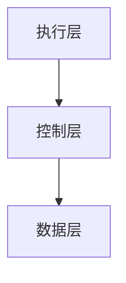

# View 文件夹文档模板标准（2025）

**创建日期**：2025年1月15日

**目的**：定义view文件夹中所有文档的标准模板，确保文档结构的一致性、规范性和可维护性。

---

## 一、文档类型分类

### 1.1 主题内容文档模板

#### 标准结构模板

```markdown
# [文档标题]

**核心论点**：[一句话核心论点，50-100字]

**创建日期**：YYYY-MM-DD

**最后更新**：YYYY-MM-DD

---

## 一、概述

[主题描述，150-200字，包括：
- 核心概念定义
- 主要内容范围
- 文档结构说明]

---

## 二、目录

[自动生成的目录链接]

---

## 三、[核心内容章节1]

### 3.1 [子章节1]

[内容]

### 3.2 [子章节2]

[内容]

---

## 四、[核心内容章节2]

[内容]

---

## 五、[核心内容章节N]

[内容]

---

## 六、结论

[主题总结，包括：
- 核心观点回顾
- 主要发现
- 未来展望]

---

## 参考文献

[IEEE格式引用]

---

**文档版本**：X.Y.Z

**创建日期**：YYYY-MM-DD

**最后更新**：YYYY-MM-DD

**维护责任人**：[姓名/团队]
```

#### 章节要求

| 章节类型 | 必需性 | 说明 |
|---------|--------|------|
| **标题** | ✅ 必需 | 文档标题 |
| **核心论点** | ✅ 必需 | 一句话核心论点 |
| **概述** | ✅ 必需 | 主题描述和文档结构说明 |
| **目录** | ✅ 必需 | 自动生成的目录 |
| **核心内容章节** | ✅ 必需 | 根据文档类型确定（3-10个章节） |
| **结论** | ✅ 必需 | 主题总结 |
| **参考文献** | ✅ 必需 | IEEE格式 |
| **元数据** | ✅ 必需 | 版本、日期、责任人 |

---

### 1.2 索引管理文档模板

#### 标准结构模板

```markdown
# [文档标题]（2025）

**创建日期**：YYYY-MM-DD

**最后更新**：YYYY-MM-DD

**目的**：[文档目的，50-100字]

---

## 目录

- [一、[章节1](#一章节1)]
- [二、[章节2](#二章节2)]
- ...

---

## 一、[章节1]

[内容]

---

## 二、[章节2]

[内容]

---

## 总结

[总结内容]

---

**文档版本**：X.Y.Z

**创建日期**：YYYY-MM-DD

**最后更新**：YYYY-MM-DD

**维护责任人**：[姓名/团队]
```

#### 章节要求

| 章节类型 | 必需性 | 说明 |
|---------|--------|------|
| **标题** | ✅ 必需 | 包含年份标识 |
| **目的** | ✅ 必需 | 文档目的说明 |
| **目录** | ✅ 必需 | 手动或自动生成 |
| **核心章节** | ✅ 必需 | 根据文档功能确定（3-15个章节） |
| **总结** | ✅ 可选 | 根据文档需要 |
| **元数据** | ✅ 必需 | 版本、日期、责任人 |

---

## 二、文档元数据规范

### 2.1 文档标题规范

#### 主题文档标题

**格式**：`[核心主题名称]`

**示例**：
- ✅ `分层解构视角：AI 三层模型架构全景`
- ✅ `Ontology成为新基础设施：决策知识库竞争的全维度论证分析`

**要求**：
- 清晰描述文档核心内容
- 包含核心关键词
- 长度不超过100字符

#### 索引文档标题

**格式**：`VIEW_[功能描述]_2025.md`

**示例**：
- ✅ `VIEW_主题导航总览_2025.md`
- ✅ `VIEW_关键词与概念索引_2025.md`

**要求**：
- 包含`VIEW_`前缀
- 包含功能描述
- 包含年份标识`_2025`
- 使用下划线分隔

### 2.2 文档元数据规范

#### 必需元数据

| 元数据项 | 格式 | 示例 | 位置 |
|---------|------|------|------|
| **创建日期** | YYYY-MM-DD | 2025-01-15 | 文档开头 |
| **最后更新** | YYYY-MM-DD | 2025-01-15 | 文档开头 |
| **文档版本** | X.Y.Z | 1.0.0 | 文档末尾 |
| **维护责任人** | [姓名/团队] | 待指定 | 文档末尾 |

#### 可选元数据

| 元数据项 | 格式 | 示例 | 位置 |
|---------|------|------|------|
| **核心论点** | 文本 | [一句话核心论点] | 文档开头（主题文档） |
| **目的** | 文本 | [文档目的说明] | 文档开头（索引文档） |
| **更新周期** | 文本 | 每月 | 文档末尾 |

---

## 三、内容章节规范

### 3.1 章节编号规范

#### 中文编号（推荐）

```markdown
## 一、[一级章节]

### 1.1 [二级章节]

#### 1.1.1 [三级章节]
```

#### 阿拉伯数字编号（可选）

```markdown
## 1. [一级章节]

### 1.1 [二级章节]

#### 1.1.1 [三级章节]
```

**要求**：
- 同一文档内编号方式保持一致
- 主题文档推荐使用中文编号
- 索引文档可使用阿拉伯数字编号

### 3.2 章节内容要求

#### 概述章节（必需）

**内容要求**：
- 主题描述（150-200字）
- 核心概念定义
- 主要内容范围
- 文档结构说明

**示例**：
```markdown
## 一、概述

这是一个极具洞察力的分层解构视角。现代 AI 确实可视为三层模型的共生体：
**执行层**是计算模型，**控制层**是形式语言模型，**数据层**是数学概率模型。
三者之间存在深刻的协同与张力，以下是系统性分析。
```

#### 目录章节（必需）

**内容要求**：
- 自动生成或手动创建
- 包含所有主要章节链接
- 层次清晰

**示例**：
```markdown
## 二、目录

- [一、概述](#一概述)
- [二、目录](#二目录)
- [三、理论基础](#三理论基础)
- ...
```

#### 核心内容章节（必需）

**内容要求**：
- 根据文档类型确定章节结构
- 每个章节应有清晰的子章节
- 章节之间使用`---`分隔

---

## 四、引用格式规范

### 4.1 文档内引用

#### 文件引用格式

```markdown
[链接文本](./文件路径.md#章节锚点)
```

**示例**：
```markdown
详细内容请参考：[T02_三层架构_全景分析.md](./T02_三层架构_全景分析.md) §一
```

#### 章节引用格式

```markdown
§X.XX - [章节名称](#章节锚点)
```

**示例**：
```markdown
参见：[VIEW_主题目录_2025.md](./VIEW_主题目录_2025.md) §主题创建模板
```

### 4.2 外部引用格式

#### IEEE格式（推荐）

```bibtex
@article{author2025title,
  title={Article Title},
  author={Author Name},
  journal={Journal Name},
  year={2025},
  volume={X},
  pages={XX-XX}
}
```

#### 行内引用格式

```markdown
根据Palantir官方文档（2025）[1]...

[1] Palantir Technologies. "Ontology as Infrastructure." 2025.
```

---

## 五、表格和图表规范

### 5.1 表格格式规范

#### 标准表格格式

```markdown
| 列1 | 列2 | 列3 |
|-----|-----|-----|
| 值1 | 值2 | 值3 |
```

**要求**：
- 列分隔符前后必须有空格
- 表头与内容行之间使用分隔行
- 使用对齐标记（如需要）

#### 表格标题规范

```markdown
**表 X：[表格标题]**

| 列1 | 列2 |
|-----|-----|
| 值1 | 值2 |
```

### 5.2 图表格式规范

#### 图表标题规范

```markdown
**图 X：[图表标题]**

[Mermaid图表代码或描述]
```

**示例**：
```markdown
**图 1：三层模型架构图**


```

---

## 六、数学公式规范

### 6.1 LaTeX格式（推荐）

#### 行内公式

```markdown
$公式内容$
```

**示例**：
```markdown
注意力机制公式：$Attention(Q, K, V) = softmax(\frac{QK^T}{\sqrt{d_k}})V$
```

#### 独立公式

```markdown
$$
公式内容
$$
```

**示例**：
```markdown
$$
Attention(Q, K, V) = softmax(\frac{QK^T}{\sqrt{d_k}})V
$$
```

### 6.2 公式编号规范

```markdown
$$
公式内容
\tag{1}
$$
```

---

## 七、文档质量标准

### 7.1 内容质量标准

| 评估维度 | 权重 | 评分标准 |
|---------|------|---------|
| **完整性** | 25% | 主题覆盖全面，章节完整 |
| **准确性** | 25% | 理论引用准确，数据可追溯 |
| **前沿性** | 20% | 包含2025年最新研究成果 |
| **形式化** | 15% | 关键概念有形式化定义 |
| **实用性** | 15% | 包含工程实践和案例研究 |

### 7.2 格式质量标准

| 评估维度 | 权重 | 评分标准 |
|---------|------|---------|
| **结构一致性** | 30% | 遵循模板标准 |
| **元数据完整性** | 20% | 包含所有必需元数据 |
| **引用规范性** | 20% | 引用格式统一 |
| **表格图表规范** | 15% | 表格图表格式正确 |
| **数学公式规范** | 15% | 公式格式正确 |

---

## 八、文档模板检查清单

### 8.1 主题文档检查清单

#### 文档开头

- [ ] 文档标题符合规范
- [ ] 包含核心论点（主题文档）
- [ ] 包含创建日期和最后更新日期
- [ ] 概述章节完整（150-200字）

#### 文档结构

- [ ] 包含目录章节
- [ ] 章节编号统一（中文或数字）
- [ ] 章节之间使用`---`分隔
- [ ] 包含结论章节

#### 文档末尾

- [ ] 包含参考文献章节
- [ ] 包含文档版本号
- [ ] 包含创建日期和最后更新日期
- [ ] 包含维护责任人

### 8.2 索引文档检查清单

#### 文档开头

- [ ] 文档标题符合`VIEW_*_2025.md`格式
- [ ] 包含目的说明
- [ ] 包含创建日期和最后更新日期
- [ ] 包含目录章节

#### 文档结构

- [ ] 章节结构清晰
- [ ] 章节编号统一
- [ ] 包含必要的总结章节（如需要）

#### 文档末尾

- [ ] 包含文档版本号
- [ ] 包含创建日期和最后更新日期
- [ ] 包含维护责任人

---

## 九、模板使用指南

### 9.1 创建新文档流程

1. **选择模板**：根据文档类型选择主题文档或索引文档模板
2. **填充内容**：按照模板结构填充内容
3. **检查格式**：使用检查清单验证格式
4. **质量检查**：运行质量评估
5. **提交审核**：提交审核后发布

### 9.2 更新现有文档流程

1. **检查模板**：确认文档符合模板标准
2. **更新内容**：按照模板结构更新内容
3. **更新元数据**：更新最后更新日期和版本号
4. **格式检查**：使用检查清单验证格式
5. **更新CHANGELOG**：在CHANGELOG中记录更新

---

## 十、模板示例

### 10.1 主题文档完整示例

见：[VIEW_主题目录_2025.md](./VIEW_主题目录_2025.md) §主题创建模板

### 10.2 索引文档完整示例

参考：[VIEW_主题导航总览_2025.md](./VIEW_主题导航总览_2025.md)

---

**文档版本**：1.0

**创建日期**：2025-01-15

**最后更新**：2025-01-15

**维护责任人**：待指定
