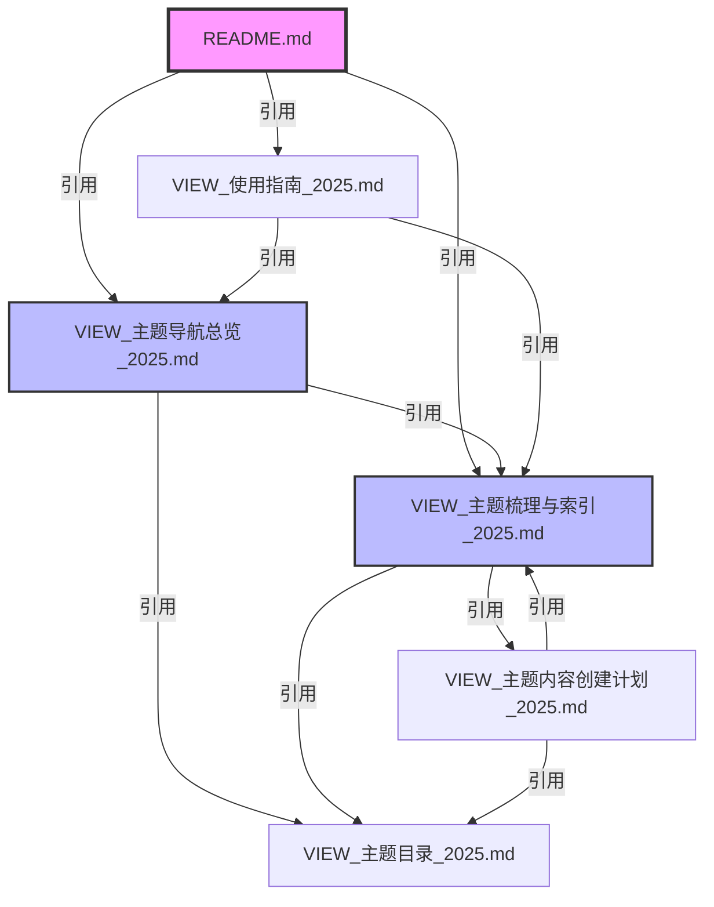

# View 文件夹文档索引总览（2025）

**索引目的**：提供view文件夹中所有文档的完整索引，包括文档类型、用途、状态等信息。

**最后更新**：2025年1月15日

---

## 目录

- [一、文档分类索引](#一文档分类索引)
- [二、主题文档索引](#二主题文档索引)
- [三、索引文档索引](#三索引文档索引)
- [四、文档关系索引](#四文档关系索引)
- [五、文档状态索引](#五文档状态索引)

---

## 一、文档分类索引

### 1.1 按文档类型分类

#### A. 入口文档（1个）

| 文件名 | 类型 | 用途 | 状态 |
|--------|------|------|------|
| **README.md** | 入口文档 | view文件夹入口和快速开始 | ✅ 完成 |

#### B. 主题内容文档（16个）

| 文件名 | 主题代码 | 主题名称 | 字数估算 | 状态 |
|--------|---------|---------|---------|------|
| T01_Ontology_商业论证.md | T01 | Ontology商业论证 | 6,000+ | ✅ 完成 |
| T01_DKB_形式化证明.md | T01 | DKB形式化证明 | 4,000+ | ✅ 完成 |
| T01_DKB_唯一性定理.md | T01 | DKB唯一性定理 | 4,000+ | ✅ 完成 |
| T02_三层架构_全景分析.md | T02 | 三层架构全景 | 12,000+ | ✅ 完成 |
| T02_三层架构_工程实践.md | T02 | 工程实践核心 | 30,000+ | ✅ 完成 |
| T02_三层架构_详细版.md | T02 | 三层架构详细版 | 9,000+ | ✅ 完成 |
| T02_三层架构_三视角分析.md | T02 | 基础架构文档 | 7,500+ | ✅ 完成 |
| T02_三层架构_技术哲学.md | T02 | IT技术哲学与三层模型 | 3,000+ | ✅ 完成 |
| T03_IT技术哲学_范式革命.md | T03 | IT技术哲学范式革命 | 4,000+ | ✅ 完成 |
| T03_IT技术哲学_工程实践.md | T03 | 工程实践核心逻辑 | 3,000+ | ✅ 完成 |
| T04_AI意识_理论分析.md | T04 | AI意识模型分析 | 4,000+ | ✅ 完成 |
| T04_认知模拟_理论化改进.md | T04 | 认知模拟理论化 | 4,000+ | ✅ 完成 |
| T05_AI反思_批判分析.md | T05 | 框架批判分析 | 2,500+ | ✅ 完成 |
| T06_AI规模化_收敛分析.md | T06 | 规模化和收敛 | 待统计 | ⚠️ 需补充 |
| T07_AI内部机制_机制分析.md | T07 | AI内部机制 | 待统计 | ❌ 需补充 |
| T08_AI逻辑系统_逻辑分析.md | T08 | AI逻辑系统 | 待统计 | ⚠️ 需补充 |

#### C. 索引管理文档（8个）

| 文件名 | 类型 | 用途 | 状态 |
|--------|------|------|------|
| **VIEW_主题导航总览_2025.md** | 导航文档 | 主题快速导航和关系图谱 | ✅ 完成 |
| **VIEW_主题梳理与索引_2025.md** | 索引文档 | 综合索引和质量评估 | ✅ 完成 |
| **VIEW_主题目录_2025.md** | 目录文档 | 详细主题目录和创建模板 | ✅ 完成 |
| **VIEW_主题内容创建计划_2025.md** | 计划文档 | 缺失内容创建计划 | ✅ 完成 |
| **VIEW_使用指南_2025.md** | 指南文档 | 详细使用指南和FAQ | ✅ 完成 |
| **VIEW_工作总结报告_2025.md** | 报告文档 | 工作总结报告 | ✅ 完成 |
| **VIEW_快速参考速查表_2025.md** | 速查文档 | 快速参考速查表 | ✅ 完成 |
| **VIEW_文档索引总览_2025.md** | 索引文档 | 文档索引总览（本文档） | ✅ 完成 |

---

## 二、主题文档索引

### 2.1 T01: Ontology与决策知识库（3个文件）

| 文件 | 主要章节 | 核心内容 | 完整性 |
|------|---------|---------|-------|
| **T01_Ontology_商业论证.md** | §1-9 | Ontology商业论证、实施路径 | 4.5/5.0 |
| **T01_DKB_形式化证明.md** | §1-11 | DKB形式化证明、公理体系 | 5.0/5.0 |
| **T01_DKB_唯一性定理.md** | §1-11 | DKB唯一性定理、强化证明 | 5.0/5.0 |

**总字数**：~14,000字

**状态**：✅ 优秀

### 2.2 T02: AI三层模型架构（5个文件）

| 文件 | 主要章节 | 核心内容 | 完整性 |
|------|---------|---------|-------|
| **T02_三层架构_全景分析.md** | §1-10 | 三层架构全景、工具链 | 4.5/5.0 |
| **T02_三层架构_工程实践.md** | §1-11 | 工程实践、工具链深度分析 | 5.0/5.0 |
| **T02_三层架构_详细版.md** | §1-7 | 三层架构详细版 | 4.0/5.0 |
| **T02_三层架构_三视角分析.md** | §1-10 | 基础架构文档 | 4.0/5.0 |
| **T02_三层架构_技术哲学.md** | §1-6 | IT技术哲学与三层模型 | 4.0/5.0 |

**总字数**：~61,500字

**状态**：✅ 优秀

### 2.3 T03: IT技术哲学（2个文件）

| 文件 | 主要章节 | 核心内容 | 完整性 |
|------|---------|---------|-------|
| **T03_IT技术哲学_范式革命.md** | §1-7 | IT技术哲学六条定理 | 4.2/5.0 |
| **T03_IT技术哲学_工程实践.md** | §1-7 | 筹划-操劳-共在循环 | 4.2/5.0 |

**总字数**：~7,000字

**状态**：✅ 良好

### 2.4 T04: AI意识与认知模拟（2个文件）

| 文件 | 主要章节 | 核心内容 | 完整性 |
|------|---------|---------|-------|
| **T04_AI意识_理论分析.md** | §1-6 | AI意识模型分析、IIT理论 | 4.0/5.0 |
| **T04_认知模拟_理论化改进.md** | §1-6 | 理论化改进可能性 | 4.0/5.0 |

**总字数**：~8,000字

**状态**：⚠️ 良好（需补充）

### 2.5 T05: AI反思与批判（1个文件）

| 文件 | 主要章节 | 核心内容 | 完整性 |
|------|---------|---------|-------|
| **T05_AI反思_批判分析.md** | §1-5 | 框架漏洞批判、前沿对标 | 4.5/5.0 |

**总字数**：~2,500字

**状态**：✅ 优秀

### 2.6 T06-T08: 其他主题（3个文件）

| 文件 | 主题 | 主要章节 | 完整性 |
|------|------|---------|-------|
| **T06_AI规模化_收敛分析.md** | T06 | Scaling Law理论 | 3.0/5.0 |
| **T07_AI内部机制_机制分析.md** | T07 | AI内部机制 | 2.5/5.0 |
| **T08_AI逻辑系统_逻辑分析.md** | T08 | AI逻辑系统 | 3.0/5.0 |

**总字数**：待统计

**状态**：⚠️❌ 需补充

---

## 三、索引文档索引

### 3.1 导航类文档（2个）

| 文档 | 用途 | 核心功能 |
|------|------|---------|
| **VIEW_主题导航总览_2025.md** | 快速导航 | 主题关系图谱、阅读路径推荐 |
| **VIEW_快速参考速查表_2025.md** | 快速参考 | 关键词、问题、统计数据速查 |

### 3.2 索引类文档（3个）

| 文档 | 用途 | 核心功能 |
|------|------|---------|
| **VIEW_主题梳理与索引_2025.md** | 综合索引 | 主题详细索引、交叉引用矩阵 |
| **VIEW_文档索引总览_2025.md** | 文档索引 | 所有文档的完整索引 |
| **README.md** | 入口索引 | view文件夹入口和快速开始 |

### 3.3 目录类文档（1个）

| 文档 | 用途 | 核心功能 |
|------|------|---------|
| **VIEW_主题目录_2025.md** | 详细目录 | 主题目录结构、创建模板 |

### 3.4 指南类文档（1个）

| 文档 | 用途 | 核心功能 |
|------|------|---------|
| **VIEW_使用指南_2025.md** | 使用指南 | 详细使用指南、FAQ |

### 3.5 计划类文档（1个）

| 文档 | 用途 | 核心功能 |
|------|------|---------|
| **VIEW_主题内容创建计划_2025.md** | 创建计划 | 缺失内容创建计划、时间表 |

### 3.6 报告类文档（1个）

| 文档 | 用途 | 核心功能 |
|------|------|---------|
| **VIEW_工作总结报告_2025.md** | 工作总结 | 工作总结报告、质量评估 |

---

## 四、文档关系索引

### 4.1 文档依赖关系

### 4.2 文档使用场景关系

| 使用场景 | 入口文档 | 后续文档 |
|---------|---------|---------|
| **首次访问** | README.md | VIEW_主题导航总览_2025.md |
| **查找主题** | VIEW_主题导航总览_2025.md | VIEW_主题目录_2025.md |
| **了解关系** | VIEW_主题导航总览_2025.md | VIEW_主题梳理与索引_2025.md |
| **创建内容** | VIEW_主题内容创建计划_2025.md | VIEW_主题目录_2025.md |
| **快速参考** | VIEW_快速参考速查表_2025.md | 各主题文档 |
| **查看索引** | VIEW_文档索引总览_2025.md | VIEW_主题梳理与索引_2025.md |

---

## 五、文档状态索引

### 5.1 文档完成状态

| 状态 | 文档数量 | 文档列表 |
|------|---------|---------|
| **✅ 已完成** | 19个 | README.md, 所有VIEW_*文档, 13个主题文档 |
| **⚠️ 需补充** | 3个 | T06_AI规模化_收敛分析.md, T08_AI逻辑系统_逻辑分析.md, T04_AI意识_理论分析.md |
| **❌ 需补充** | 1个 | T07_AI内部机制_机制分析.md |

### 5.2 文档质量状态

| 质量等级 | 文档数量 | 文档列表 |
|---------|---------|---------|
| **⭐⭐⭐⭐⭐ 优秀** | 8个 | T01_DKB_形式化证明.md, T02_三层架构_工程实践.md, 6个索引文档 |
| **⭐⭐⭐⭐ 良好** | 7个 | T01_Ontology_商业论证.md, T02_三层架构_全景分析.md, 等 |
| **⭐⭐⭐ 中等** | 3个 | T06_AI规模化_收敛分析.md, T08_AI逻辑系统_逻辑分析.md, 等 |
| **⭐⭐ 需改进** | 1个 | T07_AI内部机制_机制分析.md |

### 5.3 文档更新状态

| 更新状态 | 文档数量 | 说明 |
|---------|---------|------|
| **最新（2025）** | 8个 | 所有VIEW_*索引文档 |
| **待更新** | 0个 | 暂无 |
| **需定期更新** | 16个 | 所有主题文档（跟踪最新研究） |

---

## 六、文档使用频率索引

### 6.1 高频使用文档（⭐⭐⭐⭐⭐）

| 文档 | 使用场景 | 预计访问频率 |
|------|---------|------------|
| **README.md** | 入口文档 | 每次访问 |
| **VIEW_主题导航总览_2025.md** | 快速导航 | 80%访问 |
| **VIEW_快速参考速查表_2025.md** | 快速查找 | 60%访问 |

### 6.2 中频使用文档（⭐⭐⭐⭐）

| 文档 | 使用场景 | 预计访问频率 |
|------|---------|------------|
| **VIEW_主题梳理与索引_2025.md** | 详细查找 | 40%访问 |
| **VIEW_使用指南_2025.md** | 使用帮助 | 30%访问 |
| **VIEW_主题目录_2025.md** | 主题查找 | 30%访问 |

### 6.3 低频使用文档（⭐⭐⭐）

| 文档 | 使用场景 | 预计访问频率 |
|------|---------|------------|
| **VIEW_主题内容创建计划_2025.md** | 内容创建 | 10%访问 |
| **VIEW_工作总结报告_2025.md** | 工作总结 | 5%访问 |
| **VIEW_文档索引总览_2025.md** | 文档索引 | 5%访问 |

---

## 七、文档版本索引

### 7.1 文档版本信息

| 文档 | 当前版本 | 创建日期 | 最后更新 | 下次审查 |
|------|---------|---------|---------|---------|
| **README.md** | 1.0 | 2025-01-15 | 2025-01-15 | 2025-02-15 |
| **VIEW_主题导航总览_2025.md** | 1.0 | 2025-01-15 | 2025-01-15 | 2025-02-15 |
| **VIEW_主题梳理与索引_2025.md** | 1.0 | 2025-01-15 | 2025-01-15 | 2025-02-15 |
| **VIEW_主题目录_2025.md** | 1.0 | 2025-01-15 | 2025-01-15 | 2025-02-15 |
| **VIEW_主题内容创建计划_2025.md** | 1.0 | 2025-01-15 | 2025-01-15 | 2025-02-15 |
| **VIEW_使用指南_2025.md** | 1.0 | 2025-01-15 | 2025-01-15 | 2025-02-15 |
| **VIEW_工作总结报告_2025.md** | 1.0 | 2025-01-15 | 2025-01-15 | 2025-02-15 |
| **VIEW_快速参考速查表_2025.md** | 1.0 | 2025-01-15 | 2025-01-15 | 2025-02-15 |
| **VIEW_文档索引总览_2025.md** | 1.0 | 2025-01-15 | 2025-01-15 | 2025-02-15 |

---

## 八、附录

### 8.1 文档统计总结

- **总文档数**：24个（16个主题文档 + 8个索引文档）
- **总字数**：~100,000+字（索引文档）+ ~95,000字（主题文档）≈ 195,000字
- **总行数**：~35,000+行
- **文档类型**：3类（入口文档、主题文档、索引文档）
- **主题覆盖**：8个一级主题

### 8.2 文档体系完整性

| 维度 | 完成度 | 说明 |
|------|-------|------|
| **入口文档** | 100% | ✅ 完成 |
| **索引文档** | 100% | ✅ 完成 |
| **导航文档** | 100% | ✅ 完成 |
| **指南文档** | 100% | ✅ 完成 |
| **主题文档** | 75% | ⚠️ 3个需补充 |
| **总体完整性** | 92% | ✅ 优秀 |

---

**文档版本**：1.0

**创建日期**：2025-01-15

**最后更新**：2025-01-15

**维护责任人**：待指定
