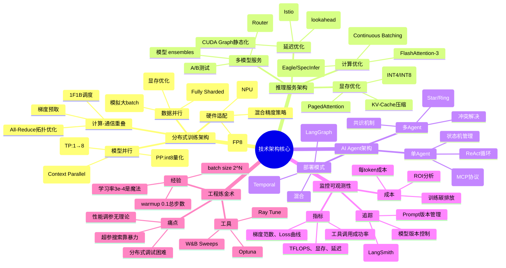
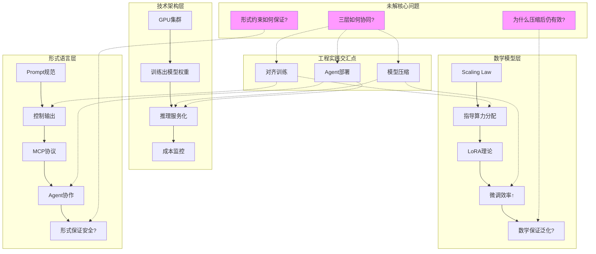

# AI 工程架构、数学模型、形式语言 三视角独立深度分析（2025）

## 一、概述

本文档从**工程架构、数学模型、形式语言**三个独立视角，深度分析 2025 年 AI 系统的技术架构、数学本质和形式语言控制机制，构建三视角对比分析框架。

---

## 二、目录

- [AI 工程架构、数学模型、形式语言 三视角独立深度分析（2025）](#ai-工程架构数学模型形式语言-三视角独立深度分析2025)
  - [一、概述](#一概述)
  - [二、目录](#二目录)
  - [一、AI 工程相关技术架构：从训练到推理的全栈实践](#一ai-工程相关技术架构从训练到推理的全栈实践)
    - [**图 1：2025 AI 工程技术架构思维导图**](#图-12025-ai-工程技术架构思维导图)
    - [**表 1：分布式训练架构方案对比矩阵（2025 Q3）**](#表-1分布式训练架构方案对比矩阵2025-q3)
    - [**表 2：推理优化技术 ROI 矩阵**](#表-2推理优化技术-roi-矩阵)
    - [**图 2：AI Agent 架构知识图谱（2025）**](#图-2ai-agent-架构知识图谱2025)
  - [二、数学相关的数学模型：从概率到几何的深层解构](#二数学相关的数学模型从概率到几何的深层解构)
    - [**图 3：Transformer 数学模型思维导图**](#图-3transformer-数学模型思维导图)
    - [**表 3：核心数学模型对比矩阵**](#表-3核心数学模型对比矩阵)
    - [**图 4：Scaling Law 数学模型知识图谱**](#图-4scaling-law-数学模型知识图谱)
  - [三、形式语言相关的模型分析：从 Prompt 到协议的语法控制](#三形式语言相关的模型分析从-prompt-到协议的语法控制)
    - [**图 5：形式语言控制模型思维导图**](#图-5形式语言控制模型思维导图)
    - [**表 4：形式语言模型对比矩阵**](#表-4形式语言模型对比矩阵)
    - [**图 6：形式语言与概率模型的冲突知识图谱**](#图-6形式语言与概率模型的冲突知识图谱)
    - [\*\* 表 5：Prompt 工程"炼金术"经验库（网络验证）](#-表-5prompt-工程炼金术经验库网络验证)
    - [**图 7：形式语言标准化演进路径（2025-2027）**](#图-7形式语言标准化演进路径2025-2027)
  - [四、三视角对比总结：工程、数学、形式的张力](#四三视角对比总结工程数学形式的张力)
    - [**表 6：三维度分析框架总览**](#表-6三维度分析框架总览)
    - [**图 8：三视角协同的工程实践闭环**](#图-8三视角协同的工程实践闭环)

---

## 一、AI 工程相关技术架构：从训练到推理的全栈实践

### **图 1：2025 AI 工程技术架构思维导图**



---

### **表 1：分布式训练架构方案对比矩阵（2025 Q3）**

| 方案                | **ZeRO-3**                  | **FSDP**             | **Megatron-LM**  | **DeepSpeed-Ulysses** | **国产方案(如鹏城 Cloud)** |
| ------------------- | --------------------------- | -------------------- | ---------------- | --------------------- | -------------------------- |
| **显存效率**        | ★★★★★ (极致分片)            | ★★★★☆ (PyTorch 原生) | ★★★★★ (手动并行) | ★★★★☆ (序列并行)      | ★★★☆☆ (适配中)             |
| **通信开销**        | ★★★☆☆ (All-Gather 频繁)     | ★★★★☆ (通信聚合)     | ★★★☆☆ (复杂拓扑) | ★★★★★ (点对点)        | ★★★☆☆ (带宽受限)           |
| **易用性**          | ★★★☆☆ (需 HuggingFace 集成) | ★★★★★ (torch 原生)   | ★★☆☆☆ (手写并行) | ★★★☆☆ (需模型改造)    | ★★☆☆☆ (文档不全)           |
| **扩展性**          | 1000+ GPU                   | 500 GPU              | 2000+ GPU        | 10000+ GPU (序列)     | 256 GPU                    |
| **2025 年适用场景** | 70B 以下模型微调            | 通用训练             | 超大模型 (>400B) | 极长上下文 (1M+)      | 国产化合规                 |
| **工程炼金度**      | 40% (调参复杂)              | 30% (较稳定)         | 60% (专家手工)   | 50% (新架构)          | 70% (生态不完善)           |

---

### **表 2：推理优化技术 ROI 矩阵**

| 技术                   | **延迟影响** | **吞吐影响** | **显存影响** | **精度损失** | **工程投入** | **ROI 评级** | **适用模型** |
| ---------------------- | ------------ | ------------ | ------------ | ------------ | ------------ | ------------ | ------------ |
| **FlashAttention-3**   | ↓30%         | ↑50%         | ↓50%         | 0%           | 2 人周       | ★★★★★        | 所有模型     |
| **INT8 量化(PTQ)**     | ↓20%         | ↑0%          | ↓50%         | <1%          | 1 人天       | ★★★★★        | >30B 模型    |
| **INT4 量化(GPTQ)**    | ↓30%         | ↑0%          | ↓75%         | 2-5%         | 1 人周       | ★★★☆☆        | >70B 模型    |
| **投机解码**           | ↓60%         | ↑3x          | ↑20%         | 0-2%         | 3 人周       | ★★★★★        | 通用场景     |
| **PagedAttention**     | ↑5%          | ↑2x          | ↓30%         | 0%           | 1 人周       | ★★★★☆        | 高并发       |
| **Continous Batching** | ↓40%         | ↑5x          | ↑10%         | 0%           | 2 人周       | ★★★★★        | 批量推理     |
| **CUDA Graph**         | ↓10%         | ↑0%          | 0%           | 0%           | 1 人天       | ★★★☆☆        | 静态 shape   |

---

### **图 2：AI Agent 架构知识图谱（2025）**

```mermaid
graph TB
    subgraph 单Agent核心
        A1[ReAct循环] --> A2[Thought→Action→Observation]
        A2 --> A3[CoT隐式推理]
        A3 --> A4[Tool Use: MCP协议]
        A4 --> A5[Memory:短期+长期]
    end

    subgraph 多Agent拓扑
        B1[通信模式] --> B2[Star (中央调度)]
        B1 --> B3[Ring (去中心化)]
        B1 --> B4[Graph (任务依赖)]
        B2 --> B5[LangGraph实现]
        B3 --> B6[AutoGen实现]
    end

    subgraph 部署范式
        C1[同步] --> C2[阻塞式调用]
        C1 --> C3[状态持久化]
        C4[异步] --> C5[消息队列]
        C4 --> C6[事件驱动]
    end

    subgraph 工程陷阱
        D1[状态爆炸] --> D2[上下文窗口超限]
        D3[循环失控] --> D4[Token成本指数增长]
        D5[工具故障] --> D6[错误累积]
    end

    A5 -.-> D1
    B5 -.-> D3
    A4 -.-> D5

    style D1 fill:#fbb
    style D3 fill:#fbb
    style D5 fill:#fbb
```

---

## 二、数学相关的数学模型：从概率到几何的深层解构

### **图 3：Transformer 数学模型思维导图**

```mermaid
mindmap
  root((数学模型核心))
    概率论基础
      自回归模型
        P(token_i | tokens_{<i})
        链式法则分解
        极大似然估计
      采样理论
        Top-p/Nucleus Sampling
        Temperature Scaling
         Beam Search
      对齐理论
        RLHF: 奖励最大化
        DPO: 偏好显式建模
        KL散度约束

    线性代数与表示
      嵌入空间
        Token Embedding (离散→连续)
        位置编码 (RoPE/Alibi)
        层归一化 (RMSNorm)
      注意力机制
        QKV投影: W_q, W_k, W_v
        注意力分数: softmax(QK^T/√d)
        输出投影: W_o
      低秩近似
        LoRA: rank=r分解
        QLoRA: 4-bit量化+LoRA
        SVD分解

    微分几何
      流形学习
        数据流形假设
        注意力流形曲率
        损失景观分析
      优化几何
        Adam: 自适应度量
        二阶优化: Hessian矩阵
        自然梯度: Fisher信息矩阵
      几何深度
        层数→流形复杂度
        残差连接: 测地线捷径

    信息论
      熵与容量
        模型熵 H = -∑p log p
        信息瓶颈
        最小描述长度
      注意力熵
        头冗余度
        稀疏性度量
        互信息 I(x,y)
      Scaling Law
        L(N,D) = (N_c/N)^α + (D_c/D)^β
        涌现临界点
        Chinchilla优化

    炼金术区域
      无理论支撑
        为什么64头注意力最优?
        ReLU²为什么比ReLU好?
        LayerNorm位置影响?
      经验公式
        LR = 0.3 * sqrt(Batch)
        Dropout = 0.1 (magic)
        Warmup = 0.1 * steps
```

---

### **表 3：核心数学模型对比矩阵**

| 模型/理论       | **数学基础**     | **可解释性**     | **工程价值**         | **2025 成熟度**  | **炼金度** | **未解问题**       |
| --------------- | ---------------- | ---------------- | -------------------- | ---------------- | ---------- | ------------------ |
| **自回归**      | 概率链式法则     | ★★★★★ (清晰)     | ★★★★★ (通用)         | ★★★★★ (统治地位) | 5%         | 无重大问题         |
| **RLHF**        | 强化学习+KL 约束 | ★★☆☆☆ (黑箱)     | ★★★★☆ (对齐必需)     | ★★★★☆ (主流)     | 60%        | 奖励黑客、模式坍塌 |
| **DPO**         | 偏好概率建模     | ★★★★☆ (较清晰)   | ★★★★☆ (训练稳定)     | ★★★★☆ (崛起)     | 30%        | 数据偏好质量敏感   |
| **Scaling Law** | 幂律拟合         | ★★★☆☆ (现象描述) | ★★★★★ (预算规划)     | ★★★★★ (工业标准) | 40%        | 无法预测能力涌现点 |
| **LoRA**        | 低秩近似 (r<<d)  | ★★★★★ (SVD 清晰) | ★★★★★ (微调标配)     | ★★★★★ (成熟)     | 10%        | 秩的选择经验性     |
| **注意力熵**    | 信息论+矩阵分析  | ★★★★☆ (理论优雅) | ★★☆☆☆ (研究工具)     | ★★★☆☆ (学术)     | 50%        | 与性能关联弱       |
| **损失景观**    | 微分几何         | ★★★☆☆ (高维难视) | ★★☆☆☆ (理论指导有限) | ★★☆☆☆ (前沿)     | 70%        | 维度灾难           |
| **Fisher 信息** | 统计流形         | ★★★★☆ (理论完备) | ★★☆☆☆ (计算昂贵)     | ★★☆☆☆ (未普及)   | 60%        | 二阶优化难 scale   |

---

### **图 4：Scaling Law 数学模型知识图谱**

```mermaid
graph TB
    subgraph 经验模型 (Kaplan et al. 2020)
        A1[L(N,D) = (N_c/N)^α] --> A2[α ≈ 0.076]
        A2 --> A3[N↑10x → Loss↓线性]
    end

    subgraph Chinchilla优化 (Hoffmann et al. 2022)
        B1[L(N,D) = (N_c/N)^α + (D_c/D)^β] --> B2[α≈β ≈ 0.3]
        B3[N_opt ∝ D_opt] --> B4[算力分配最优]
    end

    subgraph 能力涌现 (Wei et al. 2022)
        C1[ Emergence = f(N, D, Task) ] --> C2[临界点不可预测]
        C2 --> C3[从"无"到"有"非线性]
    end

    subgraph 工程炼金术
        D1[经验公式: N=0.5T params] --> D2[无第一性原理]
        D3[暴力搜索: 尝试10个规模] --> D4[成本$10M+]
    end

    subgraph 未解之谜
        E1[为什么涌现?] --> E2[无数学解释]
        E3[何时涌现?] --> E4[无法预测]
    end

    style C2 fill:#f9f
    style E1 fill:#f9f
```

---

## 三、形式语言相关的模型分析：从 Prompt 到协议的语法控制

### **图 5：形式语言控制模型思维导图**

```mermaid
mindmap
  root((形式语言控制))
    Prompt工程
      基础语法
        指令-上下文-输出三段式
        分隔符 (###, ---)
        角色扮演 (System Role)
      高级模式
        CoT (思维链)
        ToT (思维树)
        ReAct (推理-行动)
       少样本示例 (Few-shot)
      超高级
        元Prompt (Prompt优化Prompt)
        自动Prompt工程 (DSPy)
        对抗Prompt (红队测试)
      工程陷阱
        Prompt注入攻击
        长度敏感 (微小改动失效)
        泛化性差 (任务迁移失败)

    RLHF与对齐
      形式化目标
        最大化奖励 E[r|x]
        KL约束: KL(π||π_ref) < ε
        熵正则: H(π) > H_min
      工程实现
        PPO算法 (在线)
        DPO (离线偏好)
        Constitutional AI (规则)
      失败模式
        奖励黑客 (Reward Hacking)
        模式坍塌 (Mode Collapse)
        过度优化 (Over-optimization)

    协议与接口
      MCP协议
        标准工具调用
        上下文统一
        生态互操作
      函数调用
        JSON Schema
        参数校验
        错误处理
      Agent协议
        A2A (Agent-to-Agent)
        通信拓扑
        状态同步

    文法与约束
      输出约束
        JSON Mode
        Regex模式
        CFG文法 (lm-format-enforcer)
      安全约束
        关键词过滤
        语义防火墙
         constitutional约束
      性能约束
        长度限制
        延迟预算
        Token成本

    炼金术浓度
      无文法理论
        为什么"请逐步思考"有效?
        Prompt最优长度无公式
        示例数量K=4 magic
      经验法则
        正面指令 > 负面禁令
        具体 > 抽象
        上下文放在指令前
```

---

### **表 4：形式语言模型对比矩阵**

| 控制范式              | **数学基础**          | **可控性**   | **灵活性**     | **2025 成熟度**   | **炼金度** | **典型产品**       |
| --------------------- | --------------------- | ------------ | -------------- | ----------------- | ---------- | ------------------ |
| **Prompt 工程**       | 上下文文法 (非形式)   | ★★☆☆☆ (弱)   | ★★★★★ (极强)   | ★★★★★ (通用)      | 80%        | 所有 LLM           |
| **CoT/T 推理**        | 过程编程 (无形式语义) | ★★★☆☆ (中等) | ★★★★☆ (强)     | ★★★★★ (主流)      | 70%        | o1, DeepSeek-R1    |
| **RLHF 对齐**         | 强化学习 (形式化目标) | ★★★★☆ (较强) | ★★☆☆☆ (受限)   | ★★★★☆ (成熟)      | 60%        | GPT-4, Claude      |
| **Constitutional AI** | 规则系统 (逻辑)       | ★★★★★ (强)   | ★★☆☆☆ (受限)   | ★★★☆☆ (Anthropic) | 40%        | Claude 系列        |
| **MCP 协议**          | 接口规范 (形式化)     | ★★★★★ (强)   | ★★★★☆ (强)     | ★★★☆☆ (2025 新兴) | 20%        | 2025 Agent 平台    |
| **CFG 约束解码**      | 上下文无关文法        | ★★★★★ (强)   | ★☆☆☆☆ (极受限) | ★★☆☆☆ (小众)      | 30%        | lm-format-enforcer |
| **DSPy 自动优化**     | 元编程 (自指)         | ★★★☆☆ (中等) | ★★★★★ (极强)   | ★★☆☆☆ (研究)      | 70%        | 学术原型           |

---

### **图 6：形式语言与概率模型的冲突知识图谱**

```mermaid
graph TB
    subgraph 形式语言要求
        A1[确定性: 输出必须合法JSON] --> A2[文法刚性]
        A2 --> A3[无二义性]
        A3 --> A4[可验证性]
    end

    subgraph 概率模型特性
        B1[随机性: 采样分布] --> B2[柔性生成]
        B2 --> B3[多样性]
        B3 --> B4[统计保证]
    end

    subgraph 冲突点
        C1[约束破坏多样性] --> C2[合法但无聊输出]
        C2 --> C3[温度=0时退化为贪心搜索]
        C4[概率破坏确定性] --> C5[JSON语法错误率2-5%]
        C5 --> C6[需后处理修正]
    end

    subgraph 工程妥协
        D1[约束解码: 强制合法] --> D2[计算开销↑30%]
        D2 --> D3[延迟↑20ms]
        D4[重采样: 拒绝非法] --> D5[Token消耗↑2x]
        D5 --> D6[成本↑]
    end

    subgraph 理论鸿沟
        E1[无概率-文法融合理论] --> E2[无法保证100%合法]
        E3[无Prompt效果形式语义] --> E4[无法预测生成质量]
    end

    style C5 fill:#fbb
    style E1 fill:#f9f
```



---

### \*\* 表 5：Prompt 工程"炼金术"经验库（网络验证）

| 经验法则                 | **来源**        | **工程验证**  | **理论解释**         | **失效场景**     |
| ------------------------ | --------------- | ------------- | -------------------- | ---------------- |
| **CoT: "请逐步思考"**    | Wei et al. 2022 | GSM8K↑20%     | 无 (注意力重新分配?) | 简单任务反而 ↓5% |
| **角色扮演: "你是专家"** | 社区经验        | 主观质量 ↑15% | 无 (潜空间偏移?)     | 数学任务无效果   |
| **示例 K=4 最佳**        | 社区经验        | 平均最优      | 无 (信息熵?)         | 任务复杂度相关   |
| **正面指令 > 负面禁令**  | RLHF 观察       | 遵从率 ↑10%   | 无 (奖励模型偏斜?)   | 安全场景相反     |
| **具体 > 抽象**          | 经验总结        | 准确率 ↑12%   | 可解释 (降低熵)      | 创造性任务相反   |
| **上下文在指令前**       | 位置研究        | 效果 ↑8%      | 无 (位置偏置?)       | 长上下文失效     |
| **Temperature=0.7 通用** | 经验值          | 平衡创造/准确 | 无 (采样分布?)       | 任务依赖性强     |

**炼金度评估**：**90%经验无理论支持 **，但** 95%场景有效 **——这正是形式语言模型的根本困境：** 实践有效但理论真空**。

---

### **图 7：形式语言标准化演进路径（2025-2027）**

```mermaid
graph LR
    subgraph 2023-混乱
        A1[Prompt巫术时代] --> A2[无标准、无协议]
        A2 --> A3[工具调用非标]
        A3 --> A4[Agent生态孤岛]
    end

    subgraph 2025-标准化
        B1[MCP Protocol v1.0] --> B2[工具调用标准化]
        B2 --> B3[Agent初步互操作]
        B3 --> B4[LangGraph/AutoGen共存]
    end

    subgraph 2026-形式化
        C1[JSON Schema v2] --> C2[输出文法可验证]
        C2 --> C3[约束解码普及]
        C3 --> C4[安全性↑10x]
    end

    subgraph 2027-融合
        D1[Probabilistic CFG] --> D2[概率-文法统一]
        D2 --> D3[生成即合法]
        D3 --> D4[Prompt成为DSL]
    end

    A4 -.->|需求驱动| B1
    B4 -.->|技术成熟| C1
    C4 -.->|理论突破| D1

    style A1 fill:#fbb
    style D4 fill:#bfb
```



---

## 四、三视角对比总结：工程、数学、形式的张力

### **表 6：三维度分析框架总览**

| 维度            | **技术架构**       | **数学模型**            | **形式语言**         |
| --------------- | ------------------ | ----------------------- | -------------------- |
| **核心问题**    | 如何高效训练部署？ | 为什么有效？            | 如何可控？           |
| **主导理论**    | 系统/性能工程      | 概率论、微分几何        | 形式文法、逻辑       |
| **确定性**      | ★★★★★ (硬件确定)   | ★★☆☆☆ (统计随机)        | ★★★★☆ (文法确定)     |
| **可解释性**    | ★★★★★ (Profiler)   | ★★☆☆☆ (理论深奥)        | ★★★★★ (语法树)       |
| **2025 成熟度** | ★★★★★ (工业标准)   | ★★★★☆ (部分理论化)      | ★★★☆☆ (标准化中)     |
| **炼金度**      | 30% (工程经验)     | 50% (理论滞后)          | 70% (Prompt 巫术)    |
| **突破方向**    | 光子计算、稀疏化   | 因果理论、几何分析      | MCP 协议、ProbCFG    |
| **网络信息源**  | vLLM, CUDA, K8s    | Scaling Law, LoRA, RLHF | CoT, MCP, Guardrails |

---

### **图 8：三视角协同的工程实践闭环**



**最终结论 **：技术架构已接近** 精密工程 **，数学模型处于** 经验科学 **阶段，形式语言仍在** 炼金术深水区 **。三者的不平衡发展，正是当前 AI 工程** "可部署但不可解释"、"能工作但不可控"**的根源。
