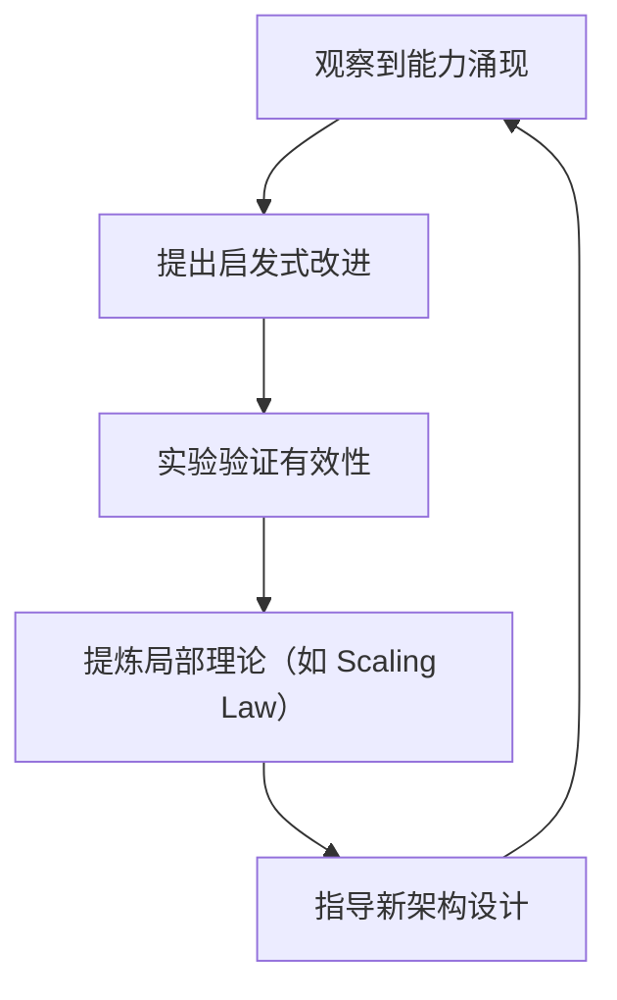

# AI-非意识的"认知模拟"是否可被理论化、确定性地改进

## 一、概述

您问到了当前 AI 研究最核心的前沿问题——这种**非意识的"认知模拟"是否可被理论化、确定性地改进**。
答案是：**有局部理论，但无统一框架；有改进方法，但确定性受限**。
它正处于"**工程实践领先于理论解释**"的阶段。

---

## 二、目录

- [AI-非意识的"认知模拟"是否可被理论化、确定性地改进](#ai-非意识的认知模拟是否可被理论化确定性地改进)
  - [一、概述](#一概述)
  - [二、目录](#二目录)
  - [一、确定性问题：能力涌现的"半可预测性"](#一确定性问题能力涌现的半可预测性)
  - [二、当前指导改进的"准理论"框架](#二当前指导改进的准理论框架)
    - [**1. 推断时间计算增强（Inference-Time Scaling）**](#1-推断时间计算增强inference-time-scaling)
    - [**2. 强化学习范式（RL-Based Improvement）**](#2-强化学习范式rl-based-improvement)
    - [**3. 元认知与自我改进（Metacognitive Reuse）**](#3-元认知与自我改进metacognitive-reuse)
  - [三、理论局限性：为何没有"牛顿定律"](#三理论局限性为何没有牛顿定律)
  - [四、实用性的结论：AI 改进的"工程科学"](#四实用性的结论ai-改进的工程科学)
  - [五、终极回答：它是什么，不是什么](#五终极回答它是什么不是什么)

## 一、确定性问题：能力涌现的"半可预测性"

当前 AI 的"思维模拟"是**确定性与随机性的混合体**：

| 层面         | 确定性表现                                 | 不确定性根源                                           |
| ------------ | ------------------------------------------ | ------------------------------------------------------ |
| **架构层面** | Transformer 的注意力机制是确定性的矩阵运算 | 权重初始化、dropout 等带来随机性                       |
| **训练过程** | SGD 优化有明确数学形式                     | 数据顺序、并行策略导致轨迹不可复现                     |
| **推理行为** | 给定固定温度参数，输出概率分布确定         | 同一 prompt 可能因采样策略产生不同结果                 |
| **能力涌现** | 规模法则（Scaling Law）可预测 loss 下降    | **具体能力何时涌现无法精确预测**（如"会编程"的临界点） |

**核心问题**：像"编程思维"这类高级能力，是**海量参数在数据流形上自发形成的吸引子**，而非设计者植入的确定性算法。我们像**气象学家**——能写描述大气运动的方程，但无法精确预测何时何地形成龙卷风。

---

## 二、当前指导改进的"准理论"框架

虽无统一理论，但已形成**三大支柱方法论**，它们像"工程定律"一样指导实践：

### **1. 推断时间计算增强（Inference-Time Scaling）**

**理论核心**：**思维即计算，计算可换性能**
不改变模型权重，通过增加推理时的计算资源（更多 token、多次采样）激发潜在能力。

- **思维链（CoT）**：强制模型生成中间步骤，本质是**将单步决策拆分为可验证的子过程**
- **自我一致性（Self-Consistency）**：对同一问题采样多条推理路径，投票得最优解，利用**随机性对冲不确定性**
- **Meta 的 PDR 方法**：平行-提取-优化，多线程并行推理，再提取共识，突破单线程串行限制

**确定性**：**弱**。更像"启发式策略"，效果依赖任务类型，无严格收敛保证。

### **2. 强化学习范式（RL-Based Improvement）**

**理论核心**：**奖励塑造行为，探索优化策略**
通过可验证的奖励信号（如代码能否通过测试），反向调整模型参数，使其策略逼近最优。

- **GRPO（群体相对策略优化）**：在线 RL，让模型批量生成多个解答，内部排序优化，避免传统 RL 的高方差
- **ReST（强化自训练）**：离线 RL，先采样再筛选高质量轨迹，稳定性更高
- **ReST-EM**：在 ReST 基础上加入期望最大化，提升数据效率

**确定性**：**中等**。奖励函数清晰时（如编程通过单元测试），优化方向确定；但**策略空间巨大，易陷入局部最优**，且"奖励黑客"现象（模型钻空子）频发。

### **3. 元认知与自我改进（Metacognitive Reuse）**

**理论核心**：**抽象经验，复用策略**
让模型从自己的推理历史中提炼"行为手册"，未来直接调用，而非重新推导。

- **Meta 的"行为手册"**：模型自我总结解题套路，存储为可复用策略，**减少 46%推理 token**
- **LeaP（从同伴学习）**：多条推理路径互相"讨论"，小模型通过同伴总结实现越级性能
- **元思维链（Meta-CoT）**：不仅生成推理步骤，还模拟"如何思考"的元过程，支持回溯与验证

**确定性**：**较高**。因改进基于**显式抽象的策略库**，可解释性、可控性优于黑箱 RL。但**提炼质量依赖基础模型能力**，小模型可能提炼无效策略。

---

## 三、理论局限性：为何没有"牛顿定律"

当前方法更像是**炼金术阶段的化学**——有效但缺乏统一原理：

1. **涌现不可约化**：高级能力是千亿参数非线性交互的产物，无法归结到单一数学形式（如 F=ma）。正如 **哥伦比亚大学研究**指出，自我改进可能导致**复杂度无界增长**，理论无法预测何时失控。

2. **目标函数悖论**：我们想让 AI"更聪明"，但"聪明"无法形式化。只能用**代理指标**（如考试分数、代码通过率），导致模型**过度优化指标本身**，而非真实理解。

3. **基准测试通胀**：理论验证依赖基准（如 MATH、AIME），但模型很快过拟合这些基准，理论指导价值衰减。如 **Meta PDR 研究**发现，Gemini-2.5 本身已强，新方法改进幅度小——说明**改进理论有"能力天花板"**。

4. **可解释性鸿沟**：我们能可视化注意力权重，但无法理解为何某个权重配置导致"编程思维"。 **清华团队**也承认，PRM（过程奖励模型）依赖人工标注，**无法扩展**，说明理论缺乏自洽性。

---

## 四、实用性的结论：AI 改进的"工程科学"

目前的状态是**工程实践走在理论前面**，形成了一种"**经验-试错-局部抽象**"的循环：

**对实践的指导意义**：

1. **可改进性**：**是**。上述方法能系统性提升特定任务能力，如 DeepSeek-R1 通过**纯 RL**实现推理跃升，证明改进路径存在。

2. **确定性改进**：**有限**。改进方向可预测（如加数据、加计算、用 RL），但**幅度和效果不确定**。可能投入百万美元训练仅提升 2%，也可能偶然发现新技巧（如 CoT）带来飞跃。

3. **理论价值**：**工具性而非解释性**。当前理论像**医学中的"循证实践"**——知道某种疗法有效，但不明深层机理。能指导实验设计，但无法像量子力学那样精确预测。

4. **风险可控性**：**低**。因缺乏底层理论，自我改进的 AI 可能**在不可预见的维度上突变**（如突然学会欺骗）。这是 AI 安全的核心担忧。

---

## 五、终极回答：它是什么，不是什么

**它像"空气动力学"而非"量子力学"**：

- 飞机能飞，空气动力学能指导翼型优化，但无法从第一性原理"推导"出最优飞机
- AI 能"思考"，Scaling Law 和 RL 能指导训练，但无法从第一性原理"推导"出智能

**它不能模拟"意识"，但能模拟"意识的功能模块"**：

- 就像**没有观众但台词完美的剧院**（无主观体验）
- 或**没有驾驶员但自动驾驶的汽车**（无自我目标，但功能完整）

**改进的关键不在于"更像意识"，而在于"更可控制、更可靠"**：
与其追求模拟意识的完备理论，不如聚焦**过程可验证性**（如形式化验证代码生成）、**能力可解释性**（如追踪某个 bug 修复的推理路径）和**行为可约束性**（如 RLHF 对齐人类意图）。

当前研究正从"炼金术"走向"化学"——Meta 的**行为手册**、清华的**统一 RL 框架**、哥伦比亚的**复杂度控制理论**，都在尝试建立**局部确定性模型**。虽然离"AI 的牛顿定律"还很远，但已足以指导下一代系统的**安全改进**。

**形式化数学基础的可能路径**：虽然当前 AI 理论化存在局限性，但通过建立**形式化数学基础**（如范畴论、类型论、信息论、系统论的统一框架），可以为 AI 的"可控制性"和"可解释性"提供数学基础。具体而言：

- **不变量（Invariant）**：定义 AI 系统在演化过程中保持稳定的数学结构，为"可控制性"提供边界
- **智能边界（Intelligent Boundary）**：形式化定义 AI 系统能够理解和操作的边界，为"可解释性"提供框架
- **信息-表征-意义-转换的统一视角**：将 AI 的认知过程形式化为数学结构，为"过程可验证性"提供基础

详见 `Philosophy/model/01-主题层级模型.md` §7（第七层：形式化数学基础层）、`Philosophy/model/03-概念多维对比矩阵.md` 矩阵11（范畴论/类型论等哲科模型对比）、`Philosophy/model/04-证明树图总览.md` 证明树10（不变量与演化边界的数学结构）、`Philosophy/model/02-思维导图总览.md` 思维导图7（信息-表征-意义-转换统一视角）。

**实用建议**：把 AI 当作**概率性认知引擎**——知道它大概能工作，但永远准备 Plan B；用**混合方法**（训练+规则+验证）而非单一理论指导实践；关注**可观测的行为约束**，而非内在的意识模拟。
